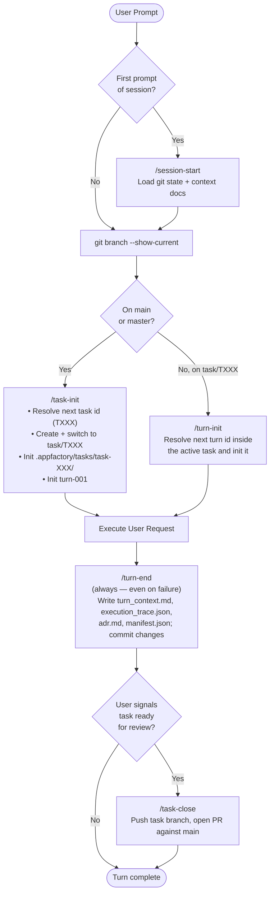

# coding-agents-config

Agentic pipeline configuration for Claude Code (and Codex). Enforces a task/turn-based workflow with provenance tracking, branch protection, and governance rules, plus a library of AppFactory (`af-*`) skills for spec-driven application generation.

## Setup

### 1. Clone the repo

```sh
git clone <repo-url> ~/coding-agents-config
```

### 2. Create symlinks (automated)

Run the setup script — it creates all symlinks and backs up any existing files:

```sh
bash scripts/setup.sh
```

<details>
<summary>Manual symlink commands</summary>

```sh
# Claude Code (~/.claude/)
ln -s ~/coding-agents-config/skills    ~/.claude/skills
ln -s ~/coding-agents-config/agents    ~/.claude/agents
ln -s ~/coding-agents-config/hooks     ~/.claude/hooks
ln -s ~/coding-agents-config/scripts   ~/.claude/scripts
ln -s ~/coding-agents-config/CLAUDE.md ~/.claude/CLAUDE.md
ln -s ~/coding-agents-config/settings.json ~/.claude/settings.json
# rules/, context/, plugins/ are optional and only linked if present

# Codex (~/.codex/)
ln -s ~/coding-agents-config/agents    ~/.codex/agents
ln -s ~/coding-agents-config/AGENTS.md ~/.codex/AGENTS.md

# Repo-local ./.claude/ (so tools run from inside this repo also pick up CLAUDE.md)
ln -s ~/coding-agents-config/CLAUDE.md ~/coding-agents-config/.claude/CLAUDE.md
```

If any of these already exist, back them up first (`mv <target> <target>.bak`).
</details>

### 3. Verify

```sh
ls -la ~/.claude/skills        # should point to ~/coding-agents-config/skills
ls -la ~/.claude/agents        # should point to ~/coding-agents-config/agents
ls -la ~/.claude/hooks         # should point to ~/coding-agents-config/hooks
ls -la ~/.claude/CLAUDE.md     # should point to ~/coding-agents-config/CLAUDE.md
ls -la ~/.claude/settings.json # should point to ~/coding-agents-config/settings.json
ls -la ~/.codex/AGENTS.md      # should point to ~/coding-agents-config/AGENTS.md
```

## Structure

```
coding-agents-config/
├── CLAUDE.md            # Global instructions — task/turn protocol, branch rules
├── AGENTS.md            # Codex loader directive (reads ~/.claude/CLAUDE.md)
├── settings.json         # Claude Code settings (model, permissions, hooks, plugins)
├── hooks/
│   └── branch-guard.sh  # PreToolUse(Bash) hook — auto-creates a task branch off main/master
├── scripts/
│   ├── setup.sh          # Creates the symlinks described above
│   └── af-state.sh       # Shared helpers for reading/writing .appfactory/memory/state.yaml
├── agents/
│   └── agent-architecture-planner.md
├── skills/                # Slash-command skills (see Skills section below)
│   ├── .system/           # Meta-skills (skill-creator, skill-installer, plugin-creator, ...)
│   ├── .nestjs/            # NestJS/Prisma scaffolding skills (incl. nested prisma/ category)
│   ├── session-start/      # Load repo + pipeline context at session start
│   ├── task-init/          # Create task/TXXX branch + turn-001 artifacts
│   ├── turn-init/          # Create the next turn inside the active task
│   ├── turn-end/           # Finalize a turn (ADR, manifest, trace, commit)
│   ├── task-close/         # Push task branch and open a pull request
│   ├── af-*/               # AppFactory backend pipeline (PRD → DDD → DSL → plan → build)
│   ├── dsl-utils/, ui-utils/, unit-tests/, e2e-tests/  # Single-skill utility categories
│   └── eval-labeler/       # Label/compare model responses for coding tasks
├── docs/                   # Reference and migration/analysis documentation
├── .appfactory/            # Task/turn tracking, specs, prompts, memory
│   ├── tasks/               # task-XXX/ directories, each with turns/turn-XXX/
│   ├── specs/                # Specifications (PRD, DDD, DSL, plan) produced by af-* skills
│   ├── prompts/               # Saved prompt drafts
│   ├── memory/                 # state.yaml used by af-memory
│   ├── changelog.md
│   └── tasks_index.csv         # One row per task branch/status
├── archive/                 # Superseded skills/docs kept for reference
└── .github/                  # Issue templates and PR template
```

## Execution Flow

The agentic pipeline enforces a task/turn-based workflow for every coding prompt, as defined in `CLAUDE.md`:


```mermaid
flowchart TB
    START([User Prompt]) --> SS{First prompt<br/>of session?}
    SS -->|Yes| SESSION_START["/session-start<br/>Load git state + context docs"]
    SS -->|No| CHECK_BRANCH
    SESSION_START --> CHECK_BRANCH

    CHECK_BRANCH["git branch --show-current"] --> IS_MAIN{On main<br/>or master?}

    IS_MAIN -->|Yes| TASK_INIT["/task-init<br/>• Resolve next task id (TXXX)<br/>• Create + switch to task/TXXX<br/>• Init .appfactory/tasks/task-XXX/<br/>• Init turn-001"]
    IS_MAIN -->|No, on task/TXXX| TURN_INIT["/turn-init<br/>Resolve next turn id inside<br/>the active task and init it"]

    TASK_INIT --> EXEC
    TURN_INIT --> EXEC

    EXEC["Execute User Request"] --> TURN_END["/turn-end<br/>(always — even on failure)<br/>Write turn_context.md, execution_trace.json,<br/>adr.md, manifest.json; commit changes"]

    TURN_END --> READY{User signals<br/>task ready<br/>for review?}
    READY -->|Yes| TASK_CLOSE["/task-close<br/>Push task branch, open PR against main"]
    READY -->|No| DONE([Turn complete])
    TASK_CLOSE --> DONE
```

### Task/Turn Protocol Summary

| Phase | Trigger | Skill | Outputs |
|-------|---------|-------|---------|
| **Session Start** | First prompt of session | `session-start` | Git state + context docs loaded |
| **Task Init** | Current branch is `main`/`master` | `task-init` | `task/TXXX` branch, `task_context.md`, `task_status.json`, turn-001 |
| **Turn Init** | Current branch is `task/TXXX` | `turn-init` | Next `turns/turn-XXX/` directory + initial artifacts |
| **Execution** | Every prompt | — | Modified files |
| **Turn End** | Every prompt, always | `turn-end` | `turn_context.md`, `execution_trace.json`, `adr.md`, `manifest.json`, commit |
| **Task Close** | User signals task is review-ready | `task-close` | Push branch, open PR, `pull_request.md`, `task_summary.md` |

Every task requires `task_context.md`, `task_status.json`, `task_summary.md`, `pull_request.md` under `.appfactory/tasks/task-XXX/`. Every turn requires `turn_context.md`, `execution_trace.json`, `adr.md`, `manifest.json` under `.appfactory/tasks/task-XXX/turns/turn-XXX/`. New tasks get a row in `.appfactory/tasks_index.csv`.

## Skills

Skills live under `skills/`, one directory per skill with a `SKILL.md`. Categories that group a single related skill (`dsl-utils/`, `ui-utils/`, `unit-tests/`, `e2e-tests/`) hold that skill in a nested directory.

### Task/Turn Lifecycle

| Skill | Description |
|-------|-------------|
| `session-start` | Load repository state and core pipeline context at the start of a session |
| `task-init` | Initialize a new task branch and create task + turn-001 artifacts |
| `turn-init` | Initialize the next turn within the active task branch |
| `turn-end` | Finalize the active turn after execution (ADR, manifest, commit) |
| `task-close` | Finalize the active task branch, push it, and open a PR against main |
| `branch-guard` | Manual fallback: create a turn-scoped branch if still on main/master |

### AppFactory Backend Pipeline (`af-*`)

| Skill | Description |
|-------|-------------|
| `af-orchestrator` | Orchestrates the App Factory software development lifecycle |
| `af-project-init` | Exports required env vars and initializes an AppFactory project |
| `af-memory` | CRUD operations on `.appfactory/memory/state.yaml` pipeline state |
| `af-app-check` | Audits an application for production readiness (security, DB, deployment, code quality) |
| `af-be-prd-build` | Builds a business-facing backend PRD from an intake worksheet |
| `af-be-ddd-build` | Generates a backend DDD document from an approved PRD |
| `af-be-ddd-analysis` | Audits a generated DDD spec for quality, completeness, and PRD alignment |
| `af-be-ddd-refactor` | Applies `af-be-ddd-analysis` findings back into the DDD spec |
| `af-be-ddd-orchestrator` | Orchestrates the DDD build → analyze → refactor → test loop |
| `af-be-ddd-dsl` | Generates the backend DSL YAML from the DDD document |
| `af-be-ddd-tests` | Generates Gherkin/BDD feature files from the DDD and PRD |
| `af-be-plan` | Generates a backend execution plan from the DSL and a tech-stack profile |
| `af-be-implementation` | Copies the selected tech-stack implementation and generates domain code from the plan + BDD specs |

### NestJS / Prisma Scaffolding (`skills/.nestjs/`)

| Skill | Description |
|-------|-------------|
| `app-from-dsl` | Orchestrates full-stack generation from app-dsl YAML specs |
| `field-mapper-generator` | Generates field mapper/converter code between UI, API, and persistence layers |
| `nestjs-crud-resource` | Generates a NestJS CRUD module (controller, service, DTOs) from a DSL backend spec |
| `nestjs-prisma-resource` | Generates a full NestJS + Prisma CRUD resource from an input schema |
| `nestjs-customer-crud-scaffold` | Scaffolds a NestJS customer CRUD app via a non-interactive Nest CLI wrapper |
| `nestjs-observability` | Adds structured logging, correlation IDs, and Prisma query logging to a NestJS backend |
| `prisma/prisma-guidelines` | Prisma ORM development guidelines and constraints |
| `prisma/prisma-persistence` | Generates Prisma schema and migrations from a DSL persistence model |

### DSL / UI / Test Utilities

| Skill | Description |
|-------|-------------|
| `dsl-utils/dsl-model-interpreter` | Parses and validates app-dsl YAML specs before code generation |
| `ui-utils/ui-implementation-language` | Declarative YAML language for UI pages, layouts, widgets, and forms |
| `unit-tests/test-implementation-sync` | Keeps generated unit tests synchronized with actual service/DTO implementations |
| `e2e-tests/http-test-artifacts` | Generates `.http` request files for REST endpoint testing |

### Evaluation

| Skill | Description |
|-------|-------------|
| `eval-labeler` | Processes `Eval.md` files to score and compare two model responses (A vs B) |

### Meta-Skills (`skills/.system/`)

| Skill | Description |
|-------|-------------|
| `skill-creator` | Guide for creating and updating skills |
| `skill-installer` | Install skills from a curated list or a GitHub repo path |
| `plugin-creator` | Scaffold plugin directories, manifests, and marketplace entries |
| `imagegen` | Generate or edit raster images (photos, illustrations, sprites, mockups) |
| `openai-docs` | Look up official OpenAI docs/model guidance with citations |

## Templates

There is no single top-level `templates/` directory — each skill that emits structured artifacts ships its own templates alongside its `SKILL.md`, for example:

| Template | Location |
|----------|----------|
| `task_context.md`, `turn_context.md` | `skills/task-init/templates/` |
| `turn_context.md` | `skills/turn-init/templates/` |
| PRD / DDD / DSL / plan / BDD templates | `skills/af-be-prd-build/templates/`, `skills/af-be-ddd-build/templates/`, `skills/af-be-ddd-dsl/templates/`, `skills/af-be-plan/templates/`, `skills/af-be-ddd-tests/templates/`, `skills/af-project-init/templates/`, `skills/af-be-implementation/templates/` |
| Observability template | `skills/.nestjs/nestjs-observability/templates/` |

`adr.md`, `pull_request.md`, and `manifest.json` formats are defined inline in the `turn-end` and `task-close` skills rather than as standalone template files.

## Hooks

| Hook | Trigger | Purpose |
|------|---------|---------|
| `branch-guard.sh` | `PreToolUse` on `Bash` (see `settings.json`) | If the current branch is `main`/`master`, auto-creates and switches to the next `task/TXXX` branch before the tool runs |

## Adding a new skill

Each skill lives in its own directory under `skills/` (or a category subdirectory) with a `SKILL.md` file:

```
skills/my-skill/
└── SKILL.md
```

The `.system/skill-creator` meta-skill can guide you through creating one — invoke it from Claude Code.

## Syncing across machines

Since this is a standard git repo, pull on any machine to stay current:

```sh
cd ~/coding-agents-config && git pull
```

The symlinks mean changes are picked up immediately — no reinstall needed.
