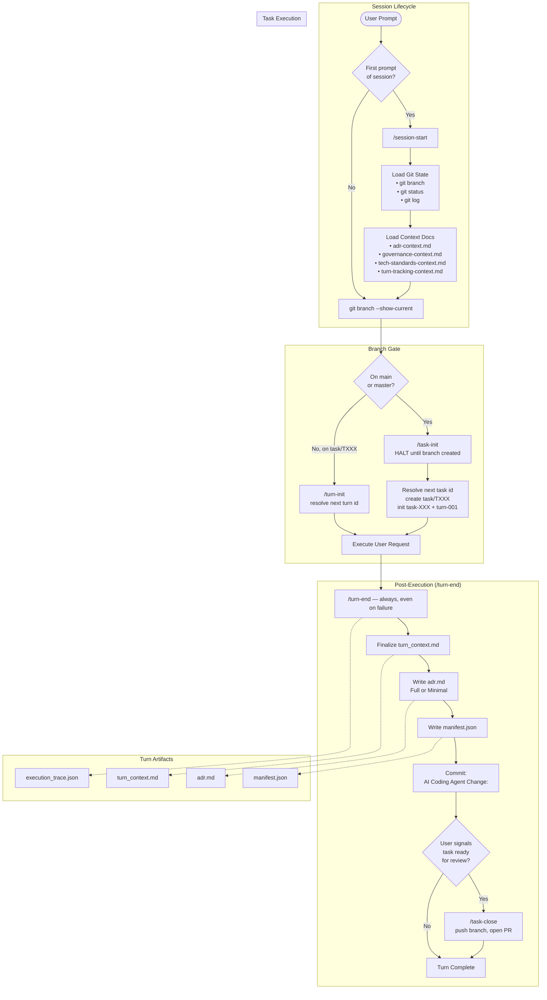

# coding-agents-config

Agentic pipeline configuration for Claude Code and Codex. Enforces a turn-based workflow with provenance tracking, branch protection, and governance rules, plus a library of AppFactory application-generation skills.

## Setup

### 1. Clone the repo

```sh
git clone <repo-url> ~/coding-agents-config
```

### 2. Create symlinks (automated)

Run the setup script — it creates all symlinks and backs up any existing files:

```sh
bash scripts/setup.sh
```

<details>
<summary>Manual symlink commands</summary>

```sh
# ~/.claude/
ln -s ~/coding-agents-config/skills       ~/.claude/skills
ln -s ~/coding-agents-config/agents       ~/.claude/agents
ln -s ~/coding-agents-config/hooks        ~/.claude/hooks
ln -s ~/coding-agents-config/scripts      ~/.claude/scripts
ln -s ~/coding-agents-config/CLAUDE.md    ~/.claude/CLAUDE.md
ln -s ~/coding-agents-config/settings.json ~/.claude/settings.json

# ~/.codex/
ln -s ~/coding-agents-config/agents    ~/.codex/agents
ln -s ~/coding-agents-config/AGENTS.md ~/.codex/AGENTS.md
```

If any of these already exist, back them up first (`mv <target> <target>.bak`).

`scripts/setup.sh` also links `rules`, `context`, and `plugins` into `~/.claude/` for forward compatibility — those directories don't exist in this repo yet, so skip them in a manual setup.
</details>

### 3. Verify

```sh
ls -la ~/.claude/skills        # should point to ~/coding-agents-config/skills
ls -la ~/.claude/CLAUDE.md     # should point to ~/coding-agents-config/CLAUDE.md
ls -la ~/.claude/settings.json # should point to ~/coding-agents-config/settings.json
ls -la ~/.codex/AGENTS.md      # should point to ~/coding-agents-config/AGENTS.md
```

## Structure

```
coding-agents-config/
├── CLAUDE.md              # Global instructions — turn protocol, branch rules (loaded by Claude Code)
├── AGENTS.md              # Points Codex at CLAUDE.md
├── settings.json          # Claude Code settings (model, permissions, hooks)
├── package.json           # Node dependency (caveman templating) used by scripts
├── agents/                # Agent role definitions (e.g. agent-architecture-planner.md)
├── hooks/                 # Shell hooks triggered by Claude Code events
│   └── branch-guard.sh    # PreToolUse hook — auto-creates a task/TXXX branch off main/master
├── skills/                # Slash-command skills (37 total, see below)
│   ├── .system/           # Shared meta-skills (skill-creator, skill-installer, imagegen, ...)
│   ├── .nestjs/           # NestJS/Prisma/DSL code-generation skills
│   ├── session-start/     # Load repo state at session start
│   ├── task-init/         # Create a task branch + turn-001 artifacts
│   ├── turn-init/         # Create the next turn inside the active task
│   ├── turn-end/          # Finalize a turn (ADR, manifest, commit)
│   ├── task-close/        # Finalize a task and open its pull request
│   ├── branch-guard/      # Legacy branch-safety skill
│   ├── af-*/              # AppFactory backend generation pipeline (13 skills)
│   ├── dsl-utils/         # → dsl-model-interpreter
│   ├── e2e-tests/         # → http-test-artifacts
│   ├── ui-utils/          # → ui-implementation-language
│   ├── unit-tests/        # → test-implementation-sync
│   └── eval-labeler/      # Compare/label model responses in eval run directories
├── scripts/               # Automation scripts
│   ├── setup.sh           # Create the symlinks above
│   └── af-state.sh        # AppFactory pipeline state helpers
├── .appfactory/           # Task/turn tracking and specs (see Task and Turn Model)
│   ├── tasks/             # task-XXX/ folders with turns/turn-XXX/ artifacts
│   ├── specs/             # Specifications
│   ├── prompts/           # Prompt drafts and notes
│   ├── memory/            # Project memory
│   ├── changelog.md
│   └── tasks_index.csv    # Registry of all tasks and their status
├── .github/               # PR and issue templates
├── docs/                  # Reference documentation (AppFactory design, skill summary)
└── archive/               # Retired skill library and templates, kept for reference
    ├── templates/         # Legacy ADR / PR / commit-message templates
    └── ...                # Superseded skills (app-from-dsl, react-form-page, etc.)
```

## Execution Flow

The agentic pipeline enforces a strict turn-based workflow for all coding tasks, driven by `CLAUDE.md`:


```mermaid
flowchart TB
    subgraph SESSION["Session Lifecycle"]
        START([User Prompt]) --> SS{First prompt<br/>of session?}
        SS -->|Yes| SESSION_START["/session-start"]
        SS -->|No| BRANCH_CHECK
        SESSION_START --> LOAD_GIT["Load Git State<br/>• git branch<br/>• git status<br/>• git log"]
        LOAD_GIT --> LOAD_CTX["Load Context Docs<br/>• adr-context.md<br/>• governance-context.md<br/>• tech-standards-context.md<br/>• turn-tracking-context.md"]
        LOAD_CTX --> BRANCH_CHECK
    end

    subgraph BRANCH_GATE["Branch Gate"]
        BRANCH_CHECK["git branch --show-current"] --> IS_MAIN{On main<br/>or master?}
        IS_MAIN -->|Yes| TASK_INIT["/task-init<br/>HALT until branch created"]
        TASK_INIT --> RESOLVE_TASK["Resolve next task id<br/>create task/TXXX<br/>init task-XXX + turn-001"]
        IS_MAIN -->|No, on task/TXXX| TURN_INIT["/turn-init<br/>resolve next turn id"]
        RESOLVE_TASK --> EXEC
        TURN_INIT --> EXEC
    end

    subgraph EXECUTION["Task Execution"]
        EXEC["Execute User Request"]
    end

    subgraph POST_EXEC["Post-Execution (/turn-end)"]
        EXEC --> TURN_END["/turn-end — always, even on failure"]
        TURN_END --> WRITE_CTX["Finalize turn_context.md"]
        WRITE_CTX --> WRITE_ADR["Write adr.md<br/>Full or Minimal"]
        WRITE_ADR --> WRITE_MANIFEST["Write manifest.json"]
        WRITE_MANIFEST --> COMMIT["Commit:<br/>AI Coding Agent Change:"]
        COMMIT --> READY{User signals<br/>task ready<br/>for review?}
        READY -->|Yes| TASK_CLOSE["/task-close<br/>push branch, open PR"]
        READY -->|No| COMPLETE["Turn Complete"]
        TASK_CLOSE --> COMPLETE
    end

    subgraph ARTIFACTS["Turn Artifacts"]
        direction LR
        A1["turn_context.md"]
        A2["execution_trace.json"]
        A3["adr.md"]
        A4["manifest.json"]
    end

    WRITE_CTX -.-> A1
    TURN_END -.-> A2
    WRITE_ADR -.-> A3
    WRITE_MANIFEST -.-> A4
```

### Turn Protocol Summary

| Phase | Trigger | Steps | Outputs |
|-------|---------|-------|---------|
| **Session Start** | First prompt of session | Load git state → load context docs | Context loaded |
| **Task Init** | On `main`/`master` | Resolve task id → create `task/TXXX` → init task + turn-001 | `task_context.md`, `task_status.json`, `turn-001/*` |
| **Turn Init** | On `task/TXXX` | Resolve next turn id → create `turns/turn-XXX/` | `turn_context.md`, `execution_trace.json` |
| **Execution** | Every prompt | Execute the user's request | Modified files |
| **Turn End** | After every prompt, even on failure | Finalize context → write ADR → write manifest → commit | `adr.md`, `manifest.json`, commit |
| **Task Close** | User signals task ready for review | Finalize task artifacts → push branch → open PR | `task_summary.md`, `pull_request.md`, PR |

## Skills (37)

### Pipeline governance

| Skill | Description |
|-------|-------------|
| `session-start` | Load repository state and core pipeline context at session start |
| `task-init` | Initialize a new task branch and create task + turn-001 artifacts |
| `turn-init` | Initialize the next turn within the active task branch |
| `turn-end` | Finalize the active turn after execution, even on failure |
| `task-close` | Finalize the active task branch, push it, and open a pull request |
| `branch-guard` | Legacy skill; check current branch and create a turn-scoped branch if on main/master |

### AppFactory backend pipeline (`af-*`)

See `docs/skill-summary.md` for the full phase-by-phase reference.

| Skill | Description |
|-------|-------------|
| `af-orchestrator` | Orchestrate the App Factory software development lifecycle end to end |
| `af-project-init` | Orchestrate AppFactory project initialization (env vars + helper script) |
| `af-be-prd-build` | Build a business-facing backend PRD from an intake worksheet |
| `af-be-ddd-orchestrator` | Orchestrate the backend DDD workflow: build, analyze, refactor, test |
| `af-be-ddd-build` | Generate a human-readable backend DDD document from an approved PRD |
| `af-be-ddd-analysis` | Audit a DDD spec for quality, completeness, and PRD alignment |
| `af-be-ddd-refactor` | Refactor a DDD spec using `af-be-ddd-analysis` findings |
| `af-be-ddd-tests` | Generate Gherkin BDD feature files from DDD and PRD specs |
| `af-be-plan` | Generate a backend execution plan from a domain DSL and tech-stack profile |
| `af-be-ddd-dsl` | Generate a backend application DSL YAML from a DDD document |
| `af-be-implementation` | Generate backend domain code from the execution plan and BDD specs |
| `af-app-check` | Audit an application for production readiness (security, DB, deploy, quality) |
| `af-memory` | CRUD operations on `.appfactory/` pipeline state (`state.yaml`) |

### Code generation utilities

| Skill | Group dir | Description |
|-------|-----------|--------------|
| `dsl-model-interpreter` | `dsl-utils/` | Parse and validate app-dsl YAML specifications |
| `http-test-artifacts` | `e2e-tests/` | Generate `.http` request files for API endpoint testing |
| `ui-implementation-language` | `ui-utils/` | Declarative YAML language for UI pages, layouts, widgets, forms |
| `test-implementation-sync` | `unit-tests/` | Keep unit tests synchronized with service/DTO implementations |

### NestJS / Prisma code generation (`skills/.nestjs/`)

| Skill | Description |
|-------|-------------|
| `app-from-dsl` | Orchestrate full-stack generation from app-dsl YAML specifications |
| `field-mapper-generator` | Generate field mapper/converter utilities between UI, API, and persistence layers |
| `nestjs-crud-resource` | Generate a NestJS CRUD module (controller, service, DTOs) from a DSL backend spec |
| `nestjs-customer-crud-scaffold` | Scaffold a NestJS customer CRUD app via a non-interactive Nest CLI wrapper |
| `nestjs-observability` | Add structured logging, correlation IDs, and redaction to a NestJS + Prisma backend |
| `nestjs-prisma-resource` | Generate a complete schema-driven NestJS + Prisma CRUD resource |
| `prisma/prisma-guidelines` | Prisma ORM development guidelines and constraints |
| `prisma/prisma-persistence` | Generate Prisma schema and migrations from a DSL persistence model |

### Meta-skills (`skills/.system/`)

| Skill | Description |
|-------|-------------|
| `skill-creator` | Guide for creating or updating skills |
| `skill-installer` | Install curated skills from `openai/skills` or another repo |
| `plugin-creator` | Scaffold Codex plugin directories and marketplace entries |
| `imagegen` | Generate or edit raster images (photos, textures, sprites, mockups) |
| `openai-docs` | Look up OpenAI product/API docs with citations |

### Other

| Skill | Description |
|-------|-------------|
| `eval-labeler` | Label and compare model responses (Response A vs B) in eval run directories |

## Templates

Turn-lifecycle templates (`adr_template.md`, `pull_request_template.md`, `manifest.schema.json`, `metadata_header.txt`, `branch_naming.md`, `commit_message.md`, `tech-stack.template.md`) have been retired to `archive/templates/` along with the earlier skill library. `.appfactory/` artifacts are currently generated inline by the `task-init`/`turn-init`/`turn-end`/`task-close` skills rather than from that template directory.

## Hooks

| Hook | Trigger | Purpose |
|------|---------|---------|
| `branch-guard.sh` | PreToolUse (write/bash tools) | Auto-creates and switches to the next `task/TXXX` branch when invoked on `main`/`master` |

## Adding a new skill

Each skill lives in its own directory under `skills/` with a `SKILL.md` file:

```
skills/my-skill/
└── SKILL.md
```

The `.system/skill-creator` meta-skill can guide you through creating one — invoke it from Claude Code.

## Syncing across machines

Since this is a standard git repo, pull on any machine to stay current:

```sh
cd ~/coding-agents-config && git pull
```

The symlinks mean changes are picked up immediately — no reinstall needed.
