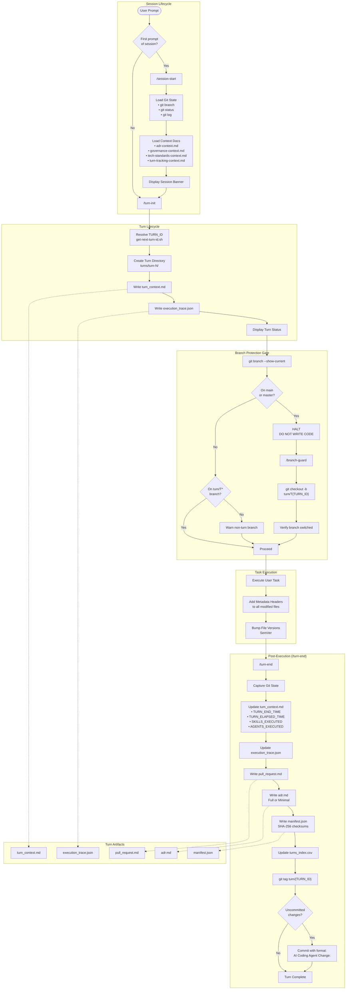

# coding-agents-config

Agentic pipeline configuration for Claude Code. Enforces turn-based workflow with provenance tracking, branch protection, and governance rules.

## Setup

### 1. Clone the repo

```sh
git clone <repo-url> ~/coding-agents-config
```

### 2. Create symlinks (automated)

Run the setup script — it creates all symlinks and backs up any existing files:

```sh
bash scripts/setup.sh
```

The script links into three locations:

- `~/.claude/` — `skills`, `agents`, `rules`, `hooks`, `context`, `scripts`, `plugins`, `CLAUDE.md`, `settings.json`
- `~/.codex/` — `agents`, `AGENTS.md`
- `./.claude/` (repo-local) — `CLAUDE.md`

<details>
<summary>Manual symlink commands</summary>

```sh
ln -s ~/coding-agents-config/skills ~/.claude/skills
ln -s ~/coding-agents-config/agents ~/.claude/agents
ln -s ~/coding-agents-config/hooks ~/.claude/hooks
ln -s ~/coding-agents-config/scripts ~/.claude/scripts
ln -s ~/coding-agents-config/CLAUDE.md ~/.claude/CLAUDE.md
ln -s ~/coding-agents-config/settings.json ~/.claude/settings.json
ln -s ~/coding-agents-config/agents ~/.codex/agents
ln -s ~/coding-agents-config/AGENTS.md ~/.codex/AGENTS.md
```

If any of these already exist, back them up first (`mv <target> <target>.bak`).
</details>

### 3. Verify

```sh
ls -la ~/.claude/skills        # should point to ~/coding-agents-config/skills
ls -la ~/.claude/agents        # should point to ~/coding-agents-config/agents
ls -la ~/.claude/hooks         # should point to ~/coding-agents-config/hooks
ls -la ~/.claude/CLAUDE.md     # should point to ~/coding-agents-config/CLAUDE.md
ls -la ~/.claude/settings.json # should point to ~/coding-agents-config/settings.json
```

## Structure

```
coding-agents-config/
├── CLAUDE.md           # Global instructions — turn protocol, branch rules
├── AGENTS.md           # Codex loader directive (reads ~/.claude/CLAUDE.md)
├── settings.json       # Claude Code settings (model, permissions, hooks)
├── package.json        # Marketplace plugin dependency (caveman)
├── agents/             # Subagent definitions
│   └── agent-architecture-planner.md
├── hooks/              # Shell hooks triggered by Claude Code events
│   └── branch-guard.sh # Auto-creates a task branch on main/master
├── skills/              # Slash-command skills, one directory per skill
│   ├── .system/         # Meta-skills (skill-creator, skill-installer, imagegen, ...)
│   ├── .nestjs/         # NestJS/Prisma code-generation skills
│   ├── session-start/   # Initialize session context
│   ├── turn-init/       # Create turn directory and artifacts
│   ├── turn-end/        # Finalize turn with PR, ADR, manifest
│   ├── task-init/       # Create a new task branch
│   ├── task-close/      # Push task branch and open a PR
│   ├── branch-guard/    # Create turn branch if on main
│   ├── af-*/            # AppFactory SDLC pipeline skills
│   ├── dsl-utils/       # DSL parsing skill
│   ├── e2e-tests/       # HTTP test artifact skill
│   ├── ui-utils/        # UI DSL skill
│   ├── unit-tests/      # Test/implementation sync skill
│   └── eval-labeler/    # Model response evaluation skill
│                        # (per-skill templates live under each skill's own templates/ dir)
├── scripts/             # Automation scripts
│   ├── setup.sh         # Creates all symlinks
│   └── af-state.sh      # AppFactory state.yaml helpers, sourced by af-* skills
├── .appfactory/         # Task/turn tracking and specs
│   ├── tasks/           # Task branches with turns
│   ├── tasks_index.csv  # Task registry
│   ├── specs/           # Specifications
│   ├── prompts/         # Prompt library
│   ├── memory/          # Project memory (state.yaml)
│   └── changelog.md     # Project changelog
├── docs/                # Reference documentation (migration notes, skill summary, plan)
├── .github/             # Issue/PR templates
└── archive/             # Retired skills, templates, and docs kept for reference
```

## Execution Flow

The agentic pipeline enforces a strict turn-based workflow for all coding tasks:


```mermaid
flowchart TB
    subgraph SESSION["Session Lifecycle"]
        START([User Prompt]) --> SS{First prompt<br/>of session?}
        SS -->|Yes| SESSION_START["/session-start"]
        SS -->|No| TURN_INIT

        SESSION_START --> LOAD_GIT["Load Git State<br/>• git branch<br/>• git status<br/>• git log"]
        LOAD_GIT --> LOAD_CTX["Load Context Docs<br/>• adr-context.md<br/>• governance-context.md<br/>• tech-standards-context.md<br/>• turn-tracking-context.md"]
        LOAD_CTX --> BANNER["Display Session Banner"]
        BANNER --> TURN_INIT
    end

    subgraph TURN["Turn Lifecycle"]
        TURN_INIT["/turn-init"] --> RESOLVE_ID["Resolve TURN_ID<br/>get-next-turn-id.sh"]
        RESOLVE_ID --> CREATE_DIR["Create Turn Directory<br/>turns/turn-N/"]
        CREATE_DIR --> WRITE_CTX["Write turn_context.md"]
        WRITE_CTX --> WRITE_TRACE["Write execution_trace.json"]
        WRITE_TRACE --> TURN_BANNER["Display Turn Status"]
    end

    subgraph BRANCH_GATE["Branch Protection Gate"]
        TURN_BANNER --> CHECK_BRANCH["git branch --show-current"]
        CHECK_BRANCH --> IS_MAIN{On main<br/>or master?}
        IS_MAIN -->|Yes| HALT["HALT<br/>DO NOT WRITE CODE"]
        HALT --> BRANCH_GUARD["/branch-guard"]
        BRANCH_GUARD --> CREATE_BRANCH["git checkout -b<br/>turn/T{TURN_ID}"]
        CREATE_BRANCH --> VERIFY["Verify branch switched"]
        IS_MAIN -->|No| IS_TURN{On turn/T*<br/>branch?}
        IS_TURN -->|Yes| PROCEED["Proceed"]
        IS_TURN -->|No| WARN["Warn non-turn branch"]
        WARN --> PROCEED
        VERIFY --> PROCEED
    end

    subgraph EXECUTION["Task Execution"]
        PROCEED --> EXEC["Execute User Task"]
        EXEC --> ADD_HEADERS["Add Metadata Headers<br/>to all modified files"]
        ADD_HEADERS --> BUMP_VERSION["Bump File Versions<br/>SemVer"]
    end

    subgraph POST_EXEC["Post-Execution (/turn-end)"]
        BUMP_VERSION --> TURN_END["/turn-end"]
        TURN_END --> CAPTURE_GIT["Capture Git State"]
        CAPTURE_GIT --> UPDATE_CTX["Update turn_context.md<br/>• TURN_END_TIME<br/>• TURN_ELAPSED_TIME<br/>• SKILLS_EXECUTED<br/>• AGENTS_EXECUTED"]
        UPDATE_CTX --> UPDATE_TRACE["Update execution_trace.json"]
        UPDATE_TRACE --> WRITE_PR["Write pull_request.md"]
        WRITE_PR --> WRITE_ADR["Write adr.md<br/>Full or Minimal"]
        WRITE_ADR --> WRITE_MANIFEST["Write manifest.json<br/>SHA-256 checksums"]
        WRITE_MANIFEST --> UPDATE_INDEX["Update turns_index.csv"]
        UPDATE_INDEX --> TAG["git tag turn/{TURN_ID}"]
        TAG --> CHECK_UNCOMMITTED{Uncommitted<br/>changes?}
        CHECK_UNCOMMITTED -->|Yes| COMMIT["Commit with format:<br/>AI Coding Agent Change:"]
        CHECK_UNCOMMITTED -->|No| COMPLETE
        COMMIT --> COMPLETE["Turn Complete"]
    end

    subgraph ARTIFACTS["Turn Artifacts"]
        direction LR
        A1["turn_context.md"]
        A2["execution_trace.json"]
        A3["pull_request.md"]
        A4["adr.md"]
        A5["manifest.json"]
    end

    WRITE_CTX -.-> A1
    WRITE_TRACE -.-> A2
    WRITE_PR -.-> A3
    WRITE_ADR -.-> A4
    WRITE_MANIFEST -.-> A5
```

### Turn Protocol Summary

| Phase | Steps | Outputs |
|-------|-------|---------|
| **Session Start** | Load git state → Load 4 context docs → Display banner | Context loaded |
| **Turn Init** | Resolve ID → Create dir → Write context + trace | `turn_context.md`, `execution_trace.json` |
| **Branch Gate** | Check branch → HALT if main → Create turn branch | Safe branch |
| **Execution** | Execute task → Add headers → Bump versions | Modified files |
| **Turn End** | Update context → Write PR → ADR → Manifest → Index → Tag | 5 artifacts complete |

## Skills (32)

| Category | Skill | Description |
|----------|-------|-------------|
| **Session** | `session-start` | Load repo state and core pipeline context at session start |
| **Task** | `task-init` | Initialize a new task branch and turn-001 artifacts |
| | `task-close` | Finalize the active task branch, push it, open a PR |
| **Turn** | `turn-init` | Initialize the next turn within the active task branch |
| | `turn-end` | Finalize the active turn after execution |
| | `branch-guard` | Create a turn branch if on main/master |
| **AppFactory pipeline** | `af-orchestrator` | Orchestrate the App Factory SDLC end to end |
| | `af-project-init` | Export env vars and initialize an AppFactory project |
| | `af-be-prd-build` | Build a business-facing backend PRD from a worksheet |
| | `af-be-ddd-orchestrator` | Orchestrate the DDD build → analyze → refactor → test loop |
| | `af-be-ddd-build` | Generate a backend DDD document from an approved PRD |
| | `af-be-ddd-analysis` | Audit a DDD document for quality, completeness, PRD alignment |
| | `af-be-ddd-refactor` | Patch a DDD document per `af-be-ddd-analysis` findings |
| | `af-be-ddd-tests` (`af-ddd-tests`) | Generate Gherkin BDD feature specs from DDD + PRD |
| | `af-be-ddd-dsl` | Generate a backend DSL YAML from a DDD document |
| | `af-be-plan` | Generate a backend execution plan from DSL + tech-stack profile |
| | `af-be-implementation` | Generate backend code from the execution plan and BDD specs |
| | `af-app-check` | Audit an application for production readiness |
| | `af-memory` | CRUD operations on `.appfactory/memory/state.yaml` |
| **Utility** | `dsl-utils/dsl-model-interpreter` | Parse and validate app-dsl YAML specifications |
| | `e2e-tests/http-test-artifacts` | Generate `.http` request files for API endpoint testing |
| | `ui-utils/ui-implementation-language` | Framework-neutral YAML standard for UI pages/widgets |
| | `unit-tests/test-implementation-sync` | Keep unit tests synchronized with implementation code |
| | `eval-labeler` | Label and score Response A vs Response B model evaluations |
| **NestJS/Prisma (.nestjs)** | `app-from-dsl` | Orchestrate full-stack generation from app-dsl YAML |
| | `nestjs-crud-resource` | Generate a NestJS CRUD module from a DSL backend spec |
| | `nestjs-prisma-resource` | Generate a NestJS + Prisma CRUD resource from a schema |
| | `nestjs-customer-crud-scaffold` | Scaffold a NestJS customer CRUD app via the Nest CLI |
| | `nestjs-observability` | Add structured logging/observability to a Prisma+NestJS backend |
| | `field-mapper-generator` | Generate field mapper/converter utilities from DSL specs |
| | `prisma/prisma-persistence` | Generate Prisma schema and migrations from a DSL persistence model |
| | `prisma/prisma-guidelines` | Prisma development constraints and anti-patterns reference |

See [`docs/skill-summary.md`](docs/skill-summary.md) for the AppFactory pipeline phases, invocation order, and orchestrator relationships.

### Meta-Skills (.system)

| Skill | Description |
|-------|-------------|
| `skill-creator` | Create or update skills with a SKILL.md |
| `skill-installer` | Install skills from a marketplace or GitHub repo |
| `plugin-creator` | Scaffold plugin directories and marketplace entries |
| `imagegen` | Generate or edit raster images |
| `openai-docs` | Look up official OpenAI API/model documentation |

Earlier, superseded versions of several skills (`schema-to-database`, `code-entity-to-crud`, `project-init`, `react-form-page`, `shadcn`, `find-skills`, `dsl-model-interpreter`, `prisma-persistence`, `prisma-guidelines`, `nestjs-observability`, `legacy-turns`, shared `templates/`) are kept in [`archive/`](archive/) for reference; see `archive/README.md` and `archive/SUMMARY.md` for their history.

## Templates

Templates now live alongside the skill that uses them, under each skill's own `templates/` directory (e.g. `skills/af-be-plan/templates/execution-plan-template.md`, `skills/af-be-ddd-dsl/templates/domain-dsl-template.yaml`). The previous shared `templates/` directory (`adr_template.md`, `pull_request_template.md`, `tech-stack.template.md`) has been moved to [`archive/templates/`](archive/templates/).

## Hooks

| Hook | Trigger | Purpose |
|------|---------|---------|
| `branch-guard.sh` | `PreToolUse(Bash)` | Auto-creates a task branch instead of allowing writes on main/master |

## Adding a new skill

Each skill lives in its own directory under `skills/` with a `SKILL.md` file:

```
skills/my-skill/
└── SKILL.md
```

The `.system/skill-creator` meta-skill can guide you through creating one — invoke it from Claude Code.

## Syncing across machines

Since this is a standard git repo, pull on any machine to stay current:

```sh
cd ~/coding-agents-config && git pull
```

The symlinks mean changes are picked up immediately — no reinstall needed.
