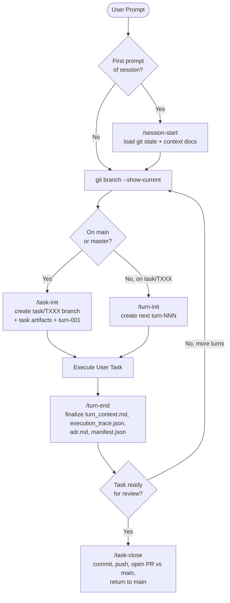

# coding-agents-config

Agentic pipeline configuration for Claude Code (and Codex). Enforces a task/turn-based workflow with provenance tracking, branch protection, and governance rules, plus the **AppFactory** skill set for DSL-driven application generation.

## Setup

### 1. Clone the repo

```sh
git clone <repo-url> ~/coding-agents-config
```

### 2. Create symlinks (automated)

Run the setup script — it creates all symlinks and backs up any existing files:

```sh
bash scripts/setup.sh
```

<details>
<summary>Manual symlink commands</summary>

```sh
# ~/.claude/
ln -s ~/coding-agents-config/skills ~/.claude/skills
ln -s ~/coding-agents-config/agents ~/.claude/agents
ln -s ~/coding-agents-config/hooks ~/.claude/hooks
ln -s ~/coding-agents-config/scripts ~/.claude/scripts
ln -s ~/coding-agents-config/CLAUDE.md ~/.claude/CLAUDE.md
ln -s ~/coding-agents-config/settings.json ~/.claude/settings.json

# ~/.codex/
ln -s ~/coding-agents-config/agents ~/.codex/agents
ln -s ~/coding-agents-config/AGENTS.md ~/.codex/AGENTS.md

# repo-local
ln -s ~/coding-agents-config/CLAUDE.md ./.claude/CLAUDE.md
```

`setup.sh` also links `rules/`, `context/`, and `plugins/` into `~/.claude/` if those directories exist in the repo — they are reserved for future use and may not be present yet, in which case those symlinks remain dangling until added.

If any target already exists, back it up first (`mv <target> <target>.bak`).
</details>

### 3. Verify

```sh
ls -la ~/.claude/skills        # should point to ~/coding-agents-config/skills
ls -la ~/.claude/agents        # should point to ~/coding-agents-config/agents
ls -la ~/.claude/hooks         # should point to ~/coding-agents-config/hooks
ls -la ~/.claude/scripts       # should point to ~/coding-agents-config/scripts
ls -la ~/.claude/CLAUDE.md     # should point to ~/coding-agents-config/CLAUDE.md
ls -la ~/.claude/settings.json # should point to ~/coding-agents-config/settings.json
```

## Structure

```
coding-agents-config/
├── CLAUDE.md           # Global instructions — task/turn protocol, branch rules
├── AGENTS.md           # Codex loader directive (points at CLAUDE.md)
├── settings.json        # Claude Code settings (model, permissions, hooks, voice)
├── package.json         # Plugin dependency (caveman marketplace plugin)
├── hooks/               # Shell hooks triggered by Claude Code events
│   └── branch-guard.sh  # Blocks writes on main/master
├── agents/              # Subagent definitions
│   └── agent-architecture-planner.md
├── skills/               # Slash-command skills
│   ├── .system/          # Meta-skills (skill-creator, skill-installer, plugin-creator, imagegen, openai-docs)
│   ├── .nestjs/           # NestJS/Prisma scaffolding skills
│   ├── session-start/     # Load repo state + governance context at session start
│   ├── task-init/         # Create task/TXXX branch + task & turn-001 artifacts
│   ├── turn-init/         # Create the next turn within the active task
│   ├── turn-end/          # Finalize a turn (ADR, manifest, execution trace)
│   ├── task-close/        # Push task branch and open PR against main
│   ├── branch-guard/      # Safety net if a turn starts on main/master
│   ├── af-*/              # AppFactory SDLC skills (see below)
│   ├── dsl-utils/, e2e-tests/, ui-utils/, unit-tests/  # Utility skill groups
│   └── eval-labeler/      # Model response evaluation/labeling
├── scripts/              # Automation scripts
│   ├── setup.sh           # Creates the symlinks above
│   └── af-state.sh        # AppFactory pipeline state helper
├── .appfactory/          # Task/turn tracking, specs, prompts, memory
│   ├── tasks/             # task-XXX/ directories, each with turns/turn-XXX/
│   ├── tasks_index.csv    # Registry of all tasks
│   ├── specs/
│   ├── prompts/
│   └── memory/
├── docs/                 # Reference documentation (AppFactory plan, skill summary, migration notes)
├── archive/              # Legacy skill library from an earlier project iteration (kept for reference)
└── .github/              # PR and issue templates
```

## Execution Flow

The pipeline enforces a strict task/turn workflow for all coding prompts:


```mermaid
flowchart TB
    START([User Prompt]) --> SS{First prompt<br/>of session?}
    SS -->|Yes| SESSION_START["/session-start<br/>load git state + context docs"]
    SS -->|No| CHECK_BRANCH
    SESSION_START --> CHECK_BRANCH

    CHECK_BRANCH["git branch --show-current"] --> IS_MAIN{On main<br/>or master?}
    IS_MAIN -->|Yes| TASK_INIT["/task-init<br/>create task/TXXX branch<br/>+ task artifacts + turn-001"]
    IS_MAIN -->|No, on task/TXXX| TURN_INIT["/turn-init<br/>create next turn-NNN"]

    TASK_INIT --> EXEC
    TURN_INIT --> EXEC

    EXEC["Execute User Task"] --> TURN_END

    TURN_END["/turn-end<br/>finalize turn_context.md, execution_trace.json,<br/>adr.md, manifest.json"] --> DONE{Task ready<br/>for review?}
    DONE -->|No, more turns| CHECK_BRANCH
    DONE -->|Yes| TASK_CLOSE["/task-close<br/>commit, push, open PR vs main,<br/>return to main"]
```

### Turn Protocol Summary

| Phase | Trigger | Outputs |
|-------|---------|---------|
| **Session Start** | First prompt of session | Git state + governance context loaded |
| **Task Init** | Current branch is `main`/`master` | `task/TXXX` branch, `task_context.md`, `task_status.json`, `task_summary.md`, `pull_request.md`, `turn-001/` |
| **Turn Init** | Already on a `task/TXXX` branch | `turns/turn-NNN/turn_context.md`, `execution_trace.json` |
| **Execution** | Every prompt | Modified files |
| **Turn End** | After every prompt, even on failure | Finalized `turn_context.md`, `adr.md`, `manifest.json`, updated `execution_trace.json` |
| **Task Close** | User signals the task is ready for review | Commit, push, PR against `main`, `tasks_index.csv` updated, branch returned to `main` |

Task ids are global and zero-padded (`001`, `002`, ...); turn ids reset per task and are zero-padded (`001`, `002`, ...).

## Skills

| Category | Skill | Description |
|----------|-------|-------------|
| **Task/Turn Lifecycle** | `session-start` | Load repo state and governance context at session start |
| | `task-init` | Initialize a task branch + task and turn-001 artifacts (run on main/master) |
| | `turn-init` | Initialize the next turn within the active task branch |
| | `turn-end` | Finalize a turn (ADR, manifest, execution trace) |
| | `task-close` | Push the task branch and open a PR against main |
| | `branch-guard` | Create a turn-scoped branch if a turn starts on main/master |
| **AppFactory SDLC** | `af-orchestrator` | Orchestrate the App Factory software development lifecycle end to end |
| | `af-project-init` | Bootstrap a new AppFactory project (env vars, Git/GitHub setup) |
| | `af-be-prd-build` | Build a backend-focused PRD from an intake worksheet |
| | `af-be-ddd-orchestrator` | Orchestrate the backend DDD build → analyze → refactor → test loop |
| | `af-be-ddd-build` | Generate a backend Domain-Driven Design document from an approved PRD |
| | `af-be-ddd-analysis` | Audit a generated DDD document for quality, completeness, PRD alignment |
| | `af-be-ddd-refactor` | Apply targeted patches to a DDD document from analysis findings |
| | `af-be-ddd-tests` | Generate Gherkin/BDD feature files from DDD and PRD specs |
| | `af-be-ddd-dsl` | Generate a backend DSL YAML document from a DDD document |
| | `af-be-plan` | Generate a backend execution plan from a DSL and tech-stack profile |
| | `af-be-implementation` | Generate backend domain code from the execution plan and BDD specs |
| | `af-app-check` | Audit an application for production readiness (security, DB, deployment, quality) |
| | `af-memory` | CRUD operations on AppFactory pipeline state (`.appfactory/`) |
| **Utility** | `dsl-utils/dsl-model-interpreter` | Parse and validate DSL YAML specifications |
| | `e2e-tests/http-test-artifacts` | Generate HTTP request files for end-to-end testing |
| | `ui-utils/ui-implementation-language` | UI implementation language guidance |
| | `unit-tests/test-implementation-sync` | Keep tests and implementation in sync |
| | `eval-labeler` | Evaluate and label model responses (Response A vs Response B) in run directories |
| **NestJS Scaffolding** (`.nestjs/`) | `app-from-dsl`, `field-mapper-generator`, `nestjs-crud-resource`, `nestjs-customer-crud-scaffold`, `nestjs-observability`, `nestjs-prisma-resource`, `prisma` | DSL-driven NestJS/Prisma application scaffolding |
| **Meta** (`.system/`) | `skill-creator`, `skill-installer`, `plugin-creator`, `imagegen`, `openai-docs` | Create/install skills and plugins, generate images, reference OpenAI docs |

Each skill lives in its own directory under `skills/` with a `SKILL.md` file:

```
skills/my-skill/
└── SKILL.md
```

The `.system/skill-creator` meta-skill can guide you through creating one — invoke it from Claude Code.

## Hooks

| Hook | Trigger | Purpose |
|------|---------|---------|
| `branch-guard.sh` | `PreToolUse(Bash)` | Blocks writes/edits on `main`/`master` |

## Other directories

- **`agents/`** — subagent definitions (e.g. `agent-architecture-planner`) used by AppFactory orchestrator skills.
- **`.appfactory/`** — per-task tracking (`tasks/task-XXX/turns/turn-XXX/`), specs, prompts, and pipeline memory state.
- **`docs/`** — reference docs: AppFactory plan, skill summary, migration notes.
- **`archive/`** — a legacy skill library from an earlier project iteration, kept for reference only; not part of the active config.

## Syncing across machines

Since this is a standard git repo, pull on any machine to stay current:

```sh
cd ~/coding-agents-config && git pull
```

The symlinks mean changes are picked up immediately — no reinstall needed.
