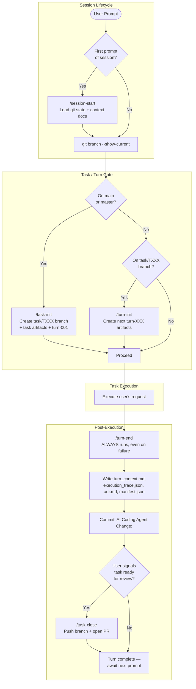

# coding-agents-config

Agentic pipeline configuration for Claude Code (and Codex). Enforces a turn-based workflow with provenance tracking, branch protection, and governance rules, plus a library of skills for the App Factory (AF) backend-generation pipeline, NestJS/Prisma scaffolding, and DSL/UI tooling.

## Setup

### 1. Clone the repo

```sh
git clone <repo-url> ~/coding-agents-config
```

### 2. Create symlinks (automated)

Run the setup script — it creates all symlinks and backs up any existing files:

```sh
bash scripts/setup.sh
```

<details>
<summary>Manual symlink commands</summary>

```sh
ln -s ~/coding-agents-config/skills ~/.claude/skills
ln -s ~/coding-agents-config/agents ~/.claude/agents
ln -s ~/coding-agents-config/hooks ~/.claude/hooks
ln -s ~/coding-agents-config/scripts ~/.claude/scripts
ln -s ~/coding-agents-config/CLAUDE.md ~/.claude/CLAUDE.md
ln -s ~/coding-agents-config/settings.json ~/.claude/settings.json

ln -s ~/coding-agents-config/agents ~/.codex/agents
ln -s ~/coding-agents-config/AGENTS.md ~/.codex/AGENTS.md
```

If any of these already exist, back them up first (`mv <target> <target>.bak`).
</details>

### 3. Verify

```sh
ls -la ~/.claude/skills        # should point to ~/coding-agents-config/skills
ls -la ~/.claude/agents        # should point to ~/coding-agents-config/agents
ls -la ~/.claude/hooks         # should point to ~/coding-agents-config/hooks
ls -la ~/.claude/CLAUDE.md     # should point to ~/coding-agents-config/CLAUDE.md
ls -la ~/.claude/settings.json # should point to ~/coding-agents-config/settings.json
```

## Structure

```
coding-agents-config/
├── CLAUDE.md              # Global instructions — turn protocol, branch rules
├── AGENTS.md              # Codex loader directive (points at CLAUDE.md)
├── settings.json          # Claude Code settings (model, permissions, hooks)
├── agents/                # Standalone agent definitions
│   └── agent-architecture-planner.md
├── hooks/                 # Shell hooks triggered by Claude Code events
│   └── branch-guard.sh    # Auto-creates a task/TXXX branch when on main/master
├── skills/                # Slash-command skills (37 SKILL.md files)
│   ├── session-start/, task-init/, turn-init/, turn-end/, task-close/, branch-guard/
│   ├── af-*/              # App Factory backend DDD pipeline (12 skills)
│   ├── unit-tests/, e2e-tests/, ui-utils/, dsl-utils/
│   ├── eval-labeler/
│   ├── .nestjs/           # NestJS + Prisma code generation (8 skills)
│   └── .system/           # Meta-skills (skill-creator, skill-installer, imagegen, ...)
├── scripts/
│   ├── setup.sh           # Creates the symlinks above
│   └── af-state.sh        # Shared helpers for reading/writing .appfactory state
├── docs/                  # Reference and migration notes
├── archive/               # Retired skills and templates, kept for history
├── .appfactory/           # Task/turn tracking, specs, prompts, memory
│   ├── tasks/              # task-XXX/ directories with turn artifacts
│   ├── tasks_index.csv     # Registry of all tasks (branch, status, PR URL)
│   ├── specs/               # Domain specs (PRD, DDD, DSL) consumed by af-* skills
│   ├── prompts/             # Prompt templates used to drive the pipeline
│   ├── memory/               # state.yaml — cross-skill pipeline state
│   └── changelog.md
└── .github/                # PR and issue templates
```

## Execution Flow

The agentic pipeline enforces a strict task/turn workflow for all coding tasks, defined in `CLAUDE.md` and implemented by the skills below.


```mermaid
flowchart TB
    subgraph SESSION["Session Lifecycle"]
        START([User Prompt]) --> SS{First prompt<br/>of session?}
        SS -->|Yes| SESSION_START["/session-start<br/>Load git state + context docs"]
        SS -->|No| BRANCH_CHECK
        SESSION_START --> BRANCH_CHECK
    end

    subgraph GATE["Task / Turn Gate"]
        BRANCH_CHECK["git branch --show-current"] --> IS_MAIN{On main<br/>or master?}
        IS_MAIN -->|Yes| TASK_INIT["/task-init<br/>Create task/TXXX branch<br/>+ task artifacts + turn-001"]
        IS_MAIN -->|No| IS_TASK{On task/TXXX<br/>branch?}
        IS_TASK -->|Yes| TURN_INIT["/turn-init<br/>Create next turn-XXX artifacts"]
        IS_TASK -->|No| PROCEED
        TASK_INIT --> PROCEED
        TURN_INIT --> PROCEED
    end

    subgraph EXECUTION["Task Execution"]
        PROCEED["Proceed"] --> EXEC["Execute user's request"]
    end

    subgraph POST_EXEC["Post-Execution"]
        EXEC --> TURN_END["/turn-end<br/>ALWAYS runs, even on failure"]
        TURN_END --> WRITE_ARTIFACTS["Write turn_context.md,<br/>execution_trace.json, adr.md, manifest.json"]
        WRITE_ARTIFACTS --> COMMIT["Commit: AI Coding Agent Change:"]
        COMMIT --> READY{User signals<br/>task ready<br/>for review?}
        READY -->|Yes| TASK_CLOSE["/task-close<br/>Push branch + open PR"]
        READY -->|No| DONE["Turn complete —<br/>await next prompt"]
        TASK_CLOSE --> DONE
    end
```

### Turn Protocol Summary

| Phase | Trigger | Skill | Outputs |
|-------|---------|-------|---------|
| **Session Start** | First prompt of session | `session-start` | Git state + context docs loaded |
| **Task Init** | Current branch is `main`/`master` | `task-init` | New `task/TXXX` branch, `task_context.md`, `task_status.json`, `task_summary.md`, `pull_request.md`, `turn-001` |
| **Turn Init** | Current branch is `task/TXXX` | `turn-init` | Next `turn-XXX/` with `turn_context.md`, `execution_trace.json` |
| **Execution** | Every coding prompt | — | Modified files, per the user's request |
| **Turn End** | After every execution, even on failure | `turn-end` | `adr.md`, `manifest.json`, updated `turn_context.md`/`execution_trace.json`, commit |
| **Task Close** | User indicates the task is ready for review | `task-close` | Branch pushed, pull request opened against `main` |
| **Branch Guard** | Any write/bash tool call while on `main`/`master` | `branch-guard` hook | Auto-creates `task/TXXX` as a safety net |

## Skills (37)

### Pipeline / Turn Protocol

| Skill | Description |
|-------|--------------|
| `session-start` | Load repository state and core pipeline context at the start of every session. |
| `task-init` | Initialize a new task branch and create task plus `turn-001` artifacts (run on `main`/`master`). |
| `turn-init` | Initialize the next turn within the active task branch. |
| `turn-end` | Finalize the active turn after execution — PR notes, ADR, manifest, commit. |
| `task-close` | Finalize the active task branch, push it, and open a pull request against `main`. |
| `branch-guard` | Check current git branch and create a task-scoped branch if on `main`/`master`. |

### App Factory (AF) — Backend DDD Pipeline

| Skill | Description |
|-------|--------------|
| `af-project-init` | Orchestrate AppFactory project initialization (env vars + helper script). |
| `af-orchestrator` | Orchestrate the full App Factory software development lifecycle. |
| `af-be-prd-build` | Build a business-facing backend PRD from an intake worksheet. |
| `af-be-ddd-build` | Generate a backend DDD document from an approved PRD. |
| `af-be-ddd-analysis` | Audit a generated DDD spec for quality, completeness, and PRD alignment. |
| `af-be-ddd-refactor` | Apply targeted patches to a DDD spec using `af-be-ddd-analysis` findings. |
| `af-be-ddd-orchestrator` | Orchestrate the DDD build → analyze → refactor loop → test phases. |
| `af-be-ddd-tests` | Generate Gherkin-style BDD feature files from DDD and PRD specs. |
| `af-be-ddd-dsl` | Generate a backend application DSL YAML document from a DDD document. |
| `af-be-plan` | Generate a step-by-step backend execution plan from a DSL + tech-stack profile. |
| `af-be-implementation` | Generate backend domain code from the execution plan and BDD specs. |
| `af-app-check` | Audit an application for production readiness (security, database, deployment, quality). |
| `af-memory` | CRUD operations on `.appfactory/memory/state.yaml` for cross-skill pipeline state. |

### NestJS + Prisma Code Generation (`skills/.nestjs/`)

| Skill | Description |
|-------|--------------|
| `app-from-dsl` | Orchestrate full-stack application generation from app-dsl YAML specifications. |
| `nestjs-crud-resource` | Generate a NestJS CRUD module (controller, service, DTOs) from a DSL backend spec. |
| `nestjs-prisma-resource` | Generate a complete NestJS + Prisma CRUD resource from an input schema. |
| `nestjs-customer-crud-scaffold` | Scaffold a NestJS customer CRUD app via a non-interactive Nest CLI wrapper. |
| `nestjs-observability` | Add structured logging, correlation IDs, and Prisma query logging to a NestJS backend. |
| `field-mapper-generator` | Generate field mapper/converter utilities from DSL mapper specifications. |
| `prisma/prisma-guidelines` | Prisma ORM development guidelines and constraints reference. |
| `prisma/prisma-persistence` | Generate Prisma schema and migrations from a DSL persistence model. |

### DSL, UI & Testing Utilities

| Skill | Description |
|-------|--------------|
| `dsl-utils/dsl-model-interpreter` | Parse and validate app-dsl YAML specifications before code generation. |
| `ui-utils/ui-implementation-language` | Declarative YAML standard for pages, layouts, widgets, forms, and API bindings. |
| `unit-tests/test-implementation-sync` | Keep unit tests synchronized with actual service/DTO implementations. |
| `e2e-tests/http-test-artifacts` | Generate `.http` request files for REST client endpoint testing. |
| `eval-labeler` | Process `Eval.md` files to label and compare model responses (Response A vs B). |

### Meta-Skills (`skills/.system/`)

| Skill | Description |
|-------|--------------|
| `skill-creator` | Guide for creating and updating skills that extend the agent's capabilities. |
| `skill-installer` | Install skills into `$CODEX_HOME/skills` from a curated list or GitHub repo. |
| `plugin-creator` | Scaffold plugin directories with a valid manifest and marketplace entries. |
| `imagegen` | Generate or edit raster images (illustrations, textures, mockups, sprites). |
| `openai-docs` | Look up official OpenAI API/model documentation with citations. |

## Templates & Reference

Turn-lifecycle templates (ADR, pull request, commit message, branch naming, manifest schema) previously lived in a top-level `templates/` directory; they have been retired to `archive/templates/` and are kept for historical reference. `.github/PULL_REQUEST_TEMPLATE.md` and `.github/ISSUE_TEMPLATE/` hold the templates actually used by GitHub.

## Hooks

| Hook | Trigger | Purpose |
|------|---------|---------|
| `branch-guard.sh` | `PreToolUse(Bash)` | Auto-creates a `task/TXXX` branch instead of allowing writes on `main`/`master`. |

## Task/Turn Tracking

Every task lives under `.appfactory/tasks/task-XXX/` with `task_context.md`, `task_status.json`, `task_summary.md`, `pull_request.md`, and a `turns/turn-XXX/` directory per turn (`turn_context.md`, `execution_trace.json`, `adr.md`, `manifest.json`). `.appfactory/tasks_index.csv` is the registry of every task, its branch, status, and pull request URL.

## Adding a new skill

Each skill lives in its own directory under `skills/` with a `SKILL.md` file:

```
skills/my-skill/
└── SKILL.md
```

The `.system/skill-creator` meta-skill can guide you through creating one — invoke it from Claude Code.

## Syncing across machines

Since this is a standard git repo, pull on any machine to stay current:

```sh
cd ~/coding-agents-config && git pull
```

The symlinks mean changes are picked up immediately — no reinstall needed.
