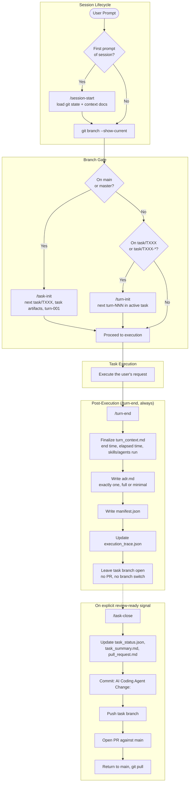

# coding-agents-config

Agentic pipeline configuration for Claude Code (and Codex). Enforces a task/turn-based workflow with provenance tracking, branch protection, governance rules, and a library of AppFactory backend-SDLC skills.

## Setup

### 1. Clone the repo

```sh
git clone <repo-url> ~/coding-agents-config
```

### 2. Create symlinks (automated)

Run the setup script — it links the repo into `~/.claude/`, `~/.codex/`, and a repo-local `./.claude/`, backing up any existing files:

```sh
bash scripts/setup.sh
```

<details>
<summary>Manual symlink commands</summary>

```sh
# ~/.claude/
ln -s ~/coding-agents-config/skills ~/.claude/skills
ln -s ~/coding-agents-config/agents ~/.claude/agents
ln -s ~/coding-agents-config/hooks ~/.claude/hooks
ln -s ~/coding-agents-config/scripts ~/.claude/scripts
ln -s ~/coding-agents-config/CLAUDE.md ~/.claude/CLAUDE.md
ln -s ~/coding-agents-config/settings.json ~/.claude/settings.json

# ~/.codex/
ln -s ~/coding-agents-config/agents ~/.codex/agents
ln -s ~/coding-agents-config/AGENTS.md ~/.codex/AGENTS.md

# repo-local ./.claude/
ln -s ~/coding-agents-config/CLAUDE.md ./.claude/CLAUDE.md
```

`scripts/setup.sh` also links optional `rules/`, `context/`, and `plugins/` directories into `~/.claude/` if/when they exist in the repo. If any target already exists, back it up first (`mv <target> <target>.bak`).
</details>

### 3. Verify

```sh
ls -la ~/.claude/skills        # should point to ~/coding-agents-config/skills
ls -la ~/.claude/agents        # should point to ~/coding-agents-config/agents
ls -la ~/.claude/hooks         # should point to ~/coding-agents-config/hooks
ls -la ~/.claude/CLAUDE.md     # should point to ~/coding-agents-config/CLAUDE.md
ls -la ~/.claude/settings.json # should point to ~/coding-agents-config/settings.json
ls -la ~/.codex/AGENTS.md      # should point to ~/coding-agents-config/AGENTS.md
```

## Structure

```
coding-agents-config/
├── CLAUDE.md            # Global instructions — task/turn protocol, branch rules, governance
├── AGENTS.md            # Codex loader directive → reads ~/.claude/CLAUDE.md
├── settings.json        # Claude Code settings (model, permissions, hooks, plugins)
├── hooks/
│   └── branch-guard.sh  # PreToolUse(Bash) hook — auto-creates a task branch off main/master
├── skills/               # Slash-command skills
│   ├── session-start/    # Session bootstrap — loads git state + context docs
│   ├── task-init/        # Create task/TXXX branch + task + turn-001 artifacts
│   ├── turn-init/        # Create the next turn-NNN inside the active task
│   ├── turn-end/         # Finalize a turn — ADR, manifest, execution trace
│   ├── task-close/       # Push the task branch and open a PR against main
│   ├── branch-guard/     # Turn-scoped branch guard (companion to hooks/branch-guard.sh)
│   ├── af-*/              # AppFactory backend-SDLC skills (see below)
│   ├── dsl-utils/         # DSL model interpreter
│   ├── e2e-tests/         # HTTP test artifact generation
│   ├── ui-utils/          # UI implementation language reference
│   ├── unit-tests/        # Test/implementation sync checks
│   ├── eval-labeler/      # Label/compare model responses for evals
│   ├── .system/           # Vendored meta-skills (skill-creator, skill-installer, plugin-creator, ...)
│   └── .nestjs/            # Vendored NestJS scaffolding skills
├── agents/
│   └── agent-architecture-planner.md
├── scripts/
│   ├── setup.sh           # Create symlinks into ~/.claude and ~/.codex
│   └── af-state.sh        # Read/write .appfactory/memory/state.yaml
├── docs/                  # Reference docs (AppFactory plan, migration notes, tech-stack notes)
├── .appfactory/           # Task/turn tracking, specs, prompts, memory
│   ├── tasks/               task-NNN/ (task_context.md, task_status.json, ...) with turns/turn-NNN/
│   ├── tasks_index.csv     # Registry of all tasks
│   ├── changelog.md
│   ├── specs/
│   ├── prompts/
│   └── memory/
├── archive/                # Retired skills and superseded templates
└── package.json
```

## Execution Flow

The agentic pipeline enforces a task/turn workflow for all coding prompts:


```mermaid
flowchart TB
    subgraph SESSION["Session Lifecycle"]
        START([User Prompt]) --> SS{First prompt<br/>of session?}
        SS -->|Yes| SESSION_START["/session-start<br/>load git state + context docs"]
        SS -->|No| CHECK_BRANCH
        SESSION_START --> CHECK_BRANCH
    end

    subgraph GATE["Branch Gate"]
        CHECK_BRANCH["git branch --show-current"] --> IS_MAIN{On main<br/>or master?}
        IS_MAIN -->|Yes| TASK_INIT["/task-init<br/>next task/TXXX, task artifacts, turn-001"]
        IS_MAIN -->|No| IS_TASK{On task/TXXX<br/>or task/TXXX-*?}
        IS_TASK -->|Yes| TURN_INIT["/turn-init<br/>next turn-NNN in active task"]
        IS_TASK -->|No| PROCEED
        TASK_INIT --> PROCEED["Proceed to execution"]
        TURN_INIT --> PROCEED
    end

    subgraph EXECUTION["Task Execution"]
        PROCEED --> EXEC["Execute the user's request"]
    end

    subgraph POST_EXEC["Post-Execution (/turn-end, always)"]
        EXEC --> TURN_END["/turn-end"]
        TURN_END --> UPDATE_CTX["Finalize turn_context.md<br/>end time, elapsed time, skills/agents run"]
        UPDATE_CTX --> WRITE_ADR["Write adr.md<br/>exactly one, full or minimal"]
        WRITE_ADR --> WRITE_MANIFEST["Write manifest.json"]
        WRITE_MANIFEST --> UPDATE_TRACE["Update execution_trace.json"]
        UPDATE_TRACE --> LEAVE_OPEN["Leave task branch open<br/>no PR, no branch switch"]
    end

    subgraph CLOSE["On explicit review-ready signal"]
        LEAVE_OPEN -.-> TASK_CLOSE["/task-close"]
        TASK_CLOSE --> UPDATE_TASK["Update task_status.json,<br/>task_summary.md, pull_request.md"]
        UPDATE_TASK --> COMMIT["Commit: AI Coding Agent Change:"]
        COMMIT --> PUSH["Push task branch"]
        PUSH --> PR["Open PR against main"]
        PR --> RETURN["Return to main, git pull"]
    end
```

### Turn Protocol Summary

| Phase | Trigger | Steps | Outputs |
|-------|---------|-------|---------|
| **Session Start** | First prompt of the session | Load git state → load 4 context docs → display banner | Context loaded |
| **Task Init** | Current branch is `main`/`master` | Resolve next task id → `git checkout -b task/TXXX` → scaffold task dir + turn-001 | `task_context.md`, `task_status.json`, `task_summary.md`, `pull_request.md`, turn-001 artifacts |
| **Turn Init** | Current branch is `task/TXXX(-*)` | Resolve next turn id in the active task → create `turns/turn-NNN/` | `turn_context.md`, `execution_trace.json` |
| **Execution** | Always | Execute the user's request | Modified files |
| **Turn End** | Always, even on failure | Finalize turn context → write ADR → write manifest → update execution trace | `adr.md`, `manifest.json`, updated `turn_context.md`/`execution_trace.json` |
| **Task Close** | User signals the task is ready for review | Update task artifacts → commit → push → open PR → return to `main` | Updated task artifacts, pushed branch, PR |

The **Hard Gate** in `CLAUDE.md` forbids writing code on `main`/`master` until `/task-init` has run; `hooks/branch-guard.sh` enforces this defensively on every `Bash` tool call by auto-creating the next `task/TXXX` branch.

## Skills

### Task/Turn Lifecycle

| Skill | Description |
|-------|-------------|
| `session-start` | Load repository state and core pipeline context at the start of every session |
| `task-init` | Initialize a new task branch and create task + turn-001 artifacts (run when on `main`/`master`) |
| `turn-init` | Initialize the next turn within the active task branch |
| `turn-end` | Finalize the active turn — ADR, manifest, execution trace (run after every prompt) |
| `task-close` | Finalize the active task branch, push it, and open a PR against `main` |
| `branch-guard` | Check the current branch and create a turn-scoped branch if on `main`/`master` |

### AppFactory Backend SDLC (`af-*`)

| Skill | Description |
|-------|-------------|
| `af-orchestrator` | Orchestrate the App Factory software development lifecycle end to end |
| `af-project-init` | Bootstrap AppFactory project environment variables and helper scripts |
| `af-be-prd-build` | Build a business-facing backend PRD from an intake worksheet |
| `af-be-ddd-build` | Generate a backend Domain-Driven Design document from an approved PRD |
| `af-be-ddd-analysis` | Audit a generated DDD document for quality, completeness, and PRD alignment |
| `af-be-ddd-refactor` | Apply targeted patches to a DDD document from `af-be-ddd-analysis` findings |
| `af-be-ddd-dsl` | Generate a backend application DSL YAML document from a DDD document |
| `af-be-ddd-orchestrator` | Orchestrate the backend DDD build → analyze → refactor → test loop |
| `af-be-ddd-tests` | Generate Gherkin BDD feature files from DDD and PRD specifications |
| `af-be-plan` | Generate a backend execution plan from a domain DSL and tech-stack profile |
| `af-be-implementation` | Execute backend code generation from the plan, tech-stack implementation, and BDD specs |
| `af-app-check` | Audit an application for production readiness (security, database, deployment, code quality) |
| `af-memory` | CRUD operations on `.appfactory/memory/state.yaml` pipeline state |

### Utility

| Skill | Description |
|-------|-------------|
| `dsl-utils/dsl-model-interpreter` | Interpret and validate DSL model documents |
| `e2e-tests/http-test-artifacts` | Generate HTTP end-to-end test artifacts |
| `ui-utils/ui-implementation-language` | UI implementation language reference |
| `unit-tests/test-implementation-sync` | Check unit tests stay in sync with implementation |
| `eval-labeler` | Label and compare Response A vs. Response B model outputs for evals |

### Vendored (`.system`, `.nestjs`)

`skills/.system/` and `skills/.nestjs/` hold third-party/meta-skills vendored as-is (`skill-creator`, `skill-installer`, `plugin-creator`, `imagegen`, `openai-docs`, and a set of NestJS/Prisma scaffolding skills). Superseded first-party skills (e.g. `schema-to-database`, `code-entity-to-crud`) have moved to `archive/`.

## Hooks

| Hook | Trigger | Purpose |
|------|---------|---------|
| `branch-guard.sh` | `PreToolUse(Bash)` | Auto-creates the next `task/TXXX` branch instead of allowing writes on `main`/`master` |

## Adding a new skill

Each skill lives in its own directory under `skills/` with a `SKILL.md` file:

```
skills/my-skill/
└── SKILL.md
```

The `.system/skill-creator` meta-skill can guide you through creating one — invoke it from Claude Code.

## Syncing across machines

Since this is a standard git repo, pull on any machine to stay current:

```sh
cd ~/coding-agents-config && git pull
```

The symlinks mean changes are picked up immediately — no reinstall needed.
