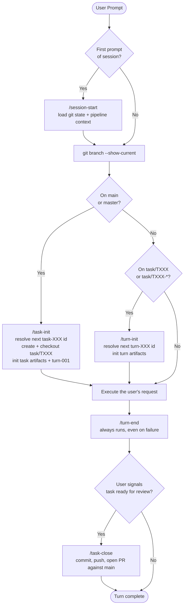

# coding-agents-config

Shared configuration for AI coding agents (Claude Code and Codex): a task/turn execution pipeline with provenance tracking and branch protection, plus the App Factory (`af-*`) skill set for generating applications end-to-end from a PRD.

## Setup

### 1. Clone the repo

```sh
git clone <repo-url> ~/coding-agents-config
```

### 2. Create symlinks (automated)

Run the setup script — it creates all symlinks and backs up any existing files:

```sh
bash scripts/setup.sh
```

<details>
<summary>Manual symlink commands</summary>

```sh
# ~/.claude/
ln -s ~/coding-agents-config/skills ~/.claude/skills
ln -s ~/coding-agents-config/agents ~/.claude/agents
ln -s ~/coding-agents-config/rules ~/.claude/rules
ln -s ~/coding-agents-config/hooks ~/.claude/hooks
ln -s ~/coding-agents-config/context ~/.claude/context
ln -s ~/coding-agents-config/scripts ~/.claude/scripts
ln -s ~/coding-agents-config/plugins ~/.claude/plugins
ln -s ~/coding-agents-config/CLAUDE.md ~/.claude/CLAUDE.md
ln -s ~/coding-agents-config/settings.json ~/.claude/settings.json

# ~/.codex/
ln -s ~/coding-agents-config/agents ~/.codex/agents
ln -s ~/coding-agents-config/AGENTS.md ~/.codex/AGENTS.md

# repo-local ./.claude/
ln -s ~/coding-agents-config/CLAUDE.md ./.claude/CLAUDE.md
```

If any of these already exist, `setup.sh` backs them up automatically (`<target>.bak`); a dangling symlink is created for any source item that doesn't exist yet in this repo (e.g. `rules/`, `context/`, `plugins/`).
</details>

### 3. Verify

```sh
ls -la ~/.claude/skills        # should point to ~/coding-agents-config/skills
ls -la ~/.claude/hooks         # should point to ~/coding-agents-config/hooks
ls -la ~/.claude/CLAUDE.md     # should point to ~/coding-agents-config/CLAUDE.md
ls -la ~/.claude/settings.json # should point to ~/coding-agents-config/settings.json
ls -la ~/.codex/AGENTS.md      # should point to ~/coding-agents-config/AGENTS.md
```

## Structure

```
coding-agents-config/
├── CLAUDE.md              # Global instructions — task/turn protocol, branch rules
├── AGENTS.md              # Codex loader directive (points back to CLAUDE.md)
├── settings.json           # Claude Code settings (model, permissions, hooks)
├── package.json            # npm dependency on the `caveman` plugin
├── hooks/
│   └── branch-guard.sh     # PreToolUse hook — auto-creates a task branch off main/master
├── agents/
│   └── agent-architecture-planner.md  # Planning subagent for App Factory projects
├── skills/                 # Slash-command skills (see Skills below)
│   ├── .system/            # Codex-only meta-skills (skill-creator, skill-installer, ...)
│   ├── .nestjs/            # Legacy NestJS/Prisma scaffolding skills
│   └── ...
├── scripts/
│   ├── setup.sh            # Creates the symlinks above
│   └── af-state.sh         # Helpers for reading/writing .appfactory/memory/state.yaml
├── .appfactory/            # Task/turn tracking, specs, prompts, memory
│   ├── tasks/               # task-XXX/ directories with turns/turn-XXX/ artifacts
│   ├── tasks_index.csv       # Registry of all tasks and their status
│   ├── specs/                # Specifications
│   ├── prompts/               # Prompt drafts and notes
│   ├── memory/                 # Pipeline state (state.yaml)
│   └── changelog.md
├── docs/                    # Reference/design docs (migration notes, plans, skill summary)
└── archive/                 # Retired skills and superseded artifacts
```

Per-skill templates (ADR, PRD, DDD, DSL, Gherkin, execution plan, etc.) live inside each skill's own `templates/` directory rather than a shared top-level `templates/` folder — see [Templates](#templates).

## Execution Flow

Every coding prompt in Claude Code runs through a mandatory skill sequence, defined in `CLAUDE.md`:


```mermaid
flowchart TB
    START([User Prompt]) --> FIRST{First prompt<br/>of session?}
    FIRST -->|Yes| SESSION_START["/session-start<br/>load git state + pipeline context"]
    FIRST -->|No| BRANCH_CHECK
    SESSION_START --> BRANCH_CHECK["git branch --show-current"]

    BRANCH_CHECK --> IS_MAIN{On main<br/>or master?}
    IS_MAIN -->|Yes| TASK_INIT["/task-init<br/>resolve next task-XXX id<br/>create + checkout task/TXXX<br/>init task artifacts + turn-001"]
    IS_MAIN -->|No| IS_TASK{On task/TXXX<br/>or task/TXXX-*?}
    IS_TASK -->|Yes| TURN_INIT["/turn-init<br/>resolve next turn-XXX id<br/>init turn artifacts"]
    IS_TASK -->|No| EXEC

    TASK_INIT --> EXEC
    TURN_INIT --> EXEC["Execute the user's request"]

    EXEC --> TURN_END["/turn-end<br/>always runs, even on failure"]
    TURN_END --> READY{User signals<br/>task ready for review?}
    READY -->|Yes| TASK_CLOSE["/task-close<br/>commit, push, open PR against main"]
    READY -->|No| DONE([Turn complete])
    TASK_CLOSE --> DONE
```

The `branch-guard.sh` hook (wired to `PreToolUse` on `Bash` in `settings.json`) is a safety net: if a tool call is attempted directly on `main`/`master`, it auto-creates and checks out the next `task/TXXX` branch instead of blocking the call.

### Task and Turn Model

- A **task** is the branch-scoped unit of work that becomes one pull request (`task/TXXX`, ids global, zero-padded to 3 digits).
- A **turn** is one AI execution cycle within the active task branch (`turn-XXX`, ids reset per task).
- Every turn writes `turn_context.md`, `execution_trace.json`, `adr.md`, and `manifest.json` under `.appfactory/tasks/task-XXX/turns/turn-XXX/`.
- Every task tracks `task_context.md`, `task_status.json`, `task_summary.md`, and `pull_request.md` under `.appfactory/tasks/task-XXX/`.
- `tasks_index.csv` gets one row per task, updated as status changes.

## Skills

### Pipeline Lifecycle

| Skill | Description |
|-------|-------------|
| `session-start` | Load repository state and core pipeline context at the start of every session |
| `task-init` | Initialize a new task branch and create task plus turn-001 artifacts (runs on main/master) |
| `turn-init` | Initialize the next turn within the active task branch |
| `turn-end` | Finalize the active turn after execution — always runs, even on failure |
| `task-close` | Finalize the active task branch, push it, and open a pull request against main |
| `branch-guard` | Model-invoked variant of the branch-protection check (create a turn-scoped branch if on main/master) |

### App Factory (`af-*`)

End-to-end application generation pipeline — PRD → DDD → DSL → execution plan → implementation → tests:

| Skill | Description |
|-------|-------------|
| `af-orchestrator` | Orchestrates the full App Factory software development lifecycle |
| `af-project-init` | Bootstrap AppFactory project init by exporting required env vars and invoking the helper script |
| `af-memory` | CRUD operations on `.appfactory/memory/state.yaml` for pipeline state |
| `af-be-prd-build` | Build a business-facing backend PRD from a completed intake worksheet |
| `af-be-ddd-orchestrator` | Orchestrate the backend DDD build → analyze → refactor-loop → test workflow |
| `af-be-ddd-build` | Generate a backend Domain-Driven Design document from an approved PRD |
| `af-be-ddd-analysis` | Audit a generated DDD document for quality, completeness, and PRD alignment |
| `af-be-ddd-refactor` | Patch a DDD document using `af-be-ddd-analysis` findings |
| `af-be-ddd-dsl` | Generate a backend application DSL YAML document from a DDD document |
| `af-be-ddd-tests` | Generate Gherkin/BDD feature files from DDD and PRD specifications |
| `af-be-plan` | Generate a backend execution plan from a domain DSL and a tech stack profile |
| `af-be-implementation` | Generate backend domain code from the execution plan and BDD specs into a target project |
| `af-app-check` | Audit an application for production readiness (security, database, deployment, code quality) |

### Testing & Utility (nested skills)

| Category dir | Nested skill | Description |
|---------------|--------------|-------------|
| `dsl-utils/` | `dsl-model-interpreter` | Parse and validate app-dsl YAML specifications before code generation |
| `e2e-tests/` | `http-test-artifacts` | End-to-end HTTP test artifact generation |
| `ui-utils/` | `ui-implementation-language` | UI implementation language reference/utilities |
| `unit-tests/` | `test-implementation-sync` | Keep unit tests in sync with implementation changes |

### Other

| Skill | Description |
|-------|-------------|
| `eval-labeler` | Process `Eval.md` files to label and score Response A vs. Response B for coding tasks |

### `.system/` (Codex-only meta-skills)

Not used by Claude Code; installed for Codex sessions via `skills/.system/`:

| Skill | Description |
|-------|-------------|
| `skill-creator` | Guide for creating and updating skills |
| `skill-installer` | Install Codex skills from a curated list or a GitHub repo |
| `plugin-creator` | Scaffold Codex plugin directories and marketplace entries |
| `imagegen` | Generate or edit raster images |
| `openai-docs` | Look up official OpenAI API/product documentation |

### `.nestjs/` (legacy scaffolding)

Superseded by the `af-be-*` pipeline; kept for reference alongside `archive/`: `app-from-dsl`, `field-mapper-generator`, `nestjs-crud-resource`, `nestjs-customer-crud-scaffold`, `nestjs-observability`, `nestjs-prisma-resource`, `prisma`.

## Agents

| Agent | Purpose |
|-------|---------|
| `agent-architecture-planner` | Reads PRD/DDD/DSL and the existing repo to produce spec alignment, architecture decisions, module maps, task plans, and review artifacts for downstream coding agents |

## Templates

There is no shared top-level `templates/` directory — each skill that needs one ships it under its own `templates/` folder, for example:

| Skill | Template |
|-------|----------|
| `af-be-prd-build` | `prd-template.md` |
| `af-be-ddd-build` | `ddd-template.md` |
| `af-be-ddd-dsl` | `domain-dsl-template.yaml` |
| `af-be-ddd-tests` | `gherkin-spec-template.md`, `feature-template.gherkin` |
| `af-be-plan` | `execution-plan-template.md` |
| `af-be-implementation` | `implementation-manifest-template.yaml` |
| `af-project-init` | `gitignore.template` |
| `task-init`, `turn-init` | Task/turn artifact scaffolding |

## Hooks

| Hook | Trigger | Purpose |
|------|---------|---------|
| `branch-guard.sh` | `PreToolUse` on `Bash` (see `settings.json`) | If the current branch is `main`/`master`, auto-create and check out the next `task/TXXX` branch instead of blocking the call |

## Adding a new skill

Each skill lives in its own directory under `skills/` with a `SKILL.md` file:

```
skills/my-skill/
└── SKILL.md
```

The `.system/skill-creator` meta-skill (Codex) can guide you through creating one.

## Syncing across machines

Since this is a standard git repo, pull on any machine to stay current:

```sh
cd ~/coding-agents-config && git pull
```

The symlinks mean changes are picked up immediately — no reinstall needed.
