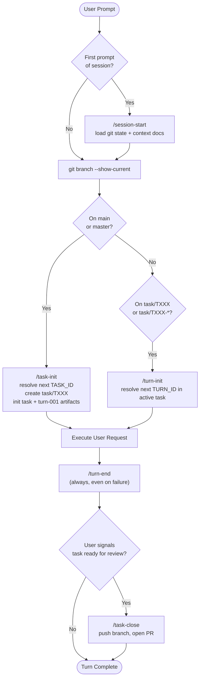

# coding-agents-config

Agentic pipeline configuration for Claude Code and Codex. Provides the **App Factory** skill library — an AI-augmented software development lifecycle (PRD → DDD → DSL → plan → implementation → validation) — plus turn-based workflow enforcement with provenance tracking, branch protection, and governance rules.

## Setup

### 1. Clone the repo

```sh
git clone <repo-url> ~/coding-agents-config
```

### 2. Create symlinks (automated)

Run the setup script — it creates all symlinks and backs up any existing files:

```sh
bash scripts/setup.sh
```

The script links this repo into `~/.claude/`, `~/.codex/`, and a repo-local `./.claude/`:

<details>
<summary>Manual symlink commands</summary>

```sh
# ~/.claude/
ln -s ~/coding-agents-config/skills ~/.claude/skills
ln -s ~/coding-agents-config/agents ~/.claude/agents
ln -s ~/coding-agents-config/hooks ~/.claude/hooks
ln -s ~/coding-agents-config/scripts ~/.claude/scripts
ln -s ~/coding-agents-config/CLAUDE.md ~/.claude/CLAUDE.md
ln -s ~/coding-agents-config/settings.json ~/.claude/settings.json

# ~/.codex/
ln -s ~/coding-agents-config/agents ~/.codex/agents
ln -s ~/coding-agents-config/AGENTS.md ~/.codex/AGENTS.md

# repo-local ./.claude/
ln -s ~/coding-agents-config/CLAUDE.md ./.claude/CLAUDE.md
```

If any of these already exist, back them up first (`mv <target> <target>.bak`).
</details>

`rules/`, `context/`, `templates/`, and `plugins/` are also linked by `scripts/setup.sh` if present — `plugins/` is gitignored and populated locally per machine.

### 3. Verify

```sh
ls -la ~/.claude/skills        # should point to ~/coding-agents-config/skills
ls -la ~/.claude/agents        # should point to ~/coding-agents-config/agents
ls -la ~/.claude/hooks         # should point to ~/coding-agents-config/hooks
ls -la ~/.claude/CLAUDE.md     # should point to ~/coding-agents-config/CLAUDE.md
ls -la ~/.claude/settings.json # should point to ~/coding-agents-config/settings.json
ls -la ~/.codex/AGENTS.md      # should point to ~/coding-agents-config/AGENTS.md
```

## Structure

```
coding-agents-config/
├── CLAUDE.md           # Global instructions — turn/task protocol, branch rules
├── AGENTS.md           # Codex loader directive (reads ~/.claude/CLAUDE.md)
├── settings.json       # Claude Code settings (model, permissions)
├── package.json        # Node dependency manifest (caveman templating)
├── agents/             # Subagent definitions
│   └── agent-architecture-planner.md
├── hooks/               # Shell hooks triggered by Claude Code events
│   └── branch-guard.sh  # Blocks/redirects edits on main/master
├── skills/               # Slash-command skills
│   ├── .system/          # Meta-skills (skill-creator, skill-installer, plugin-creator, imagegen, openai-docs)
│   ├── .nestjs/           # NestJS/Prisma code-generation skill bundle
│   ├── session-start/     # Load repo state and pipeline context
│   ├── task-init/         # Create task branch + turn-001 artifacts (from main/master)
│   ├── turn-init/         # Start the next turn on an active task branch
│   ├── turn-end/          # Finalize a turn (context, trace, ADR, manifest, commit)
│   ├── task-close/        # Push task branch and open a pull request
│   ├── branch-guard/      # Legacy turn-branch guard (superseded by task-init)
│   ├── af-orchestrator/   # Drives the App Factory SDLC end to end
│   ├── af-project-init/   # Project initialization
│   ├── af-be-prd-build/   # Backend PRD generation
│   ├── af-be-ddd-orchestrator/ # DDD build/analyze/refactor loop
│   ├── af-be-ddd-build/       # Generate DDD document from PRD
│   ├── af-be-ddd-analysis/    # Audit DDD document for gaps
│   ├── af-be-ddd-refactor/    # Patch DDD from analysis findings
│   ├── af-be-ddd-tests/       # Generate Gherkin/BDD scenarios from DDD
│   ├── af-be-ddd-dsl/         # Generate backend DSL YAML from DDD
│   ├── af-be-plan/            # Generate backend execution plan from DSL
│   ├── af-be-implementation/  # Generate backend code from plan + tech stack
│   ├── af-app-check/          # Production-readiness audit
│   ├── af-memory/             # CRUD on .appfactory/state.yaml pipeline state
│   ├── dsl-utils/             # → dsl-model-interpreter (parse/validate app-dsl YAML)
│   ├── ui-utils/              # → ui-implementation-language (declarative UI YAML spec)
│   ├── e2e-tests/             # → http-test-artifacts (.http request generation)
│   ├── unit-tests/            # → test-implementation-sync (test/impl alignment)
│   └── eval-labeler/          # Label/compare model responses in eval run directories
├── scripts/             # Automation scripts
│   ├── setup.sh         # Creates the symlinks above
│   └── af-state.sh      # AppFactory state helpers
├── .appfactory/         # Task/turn tracking and specs (this repo's own pipeline state)
│   ├── tasks/           # task-XXX/ — context, status, summary, PR draft, turns/
│   ├── specs/           # PRD/DDD/DSL specs
│   ├── prompts/         # Prompt templates used to drive the pipeline
│   ├── memory/          # Project memory
│   ├── tasks_index.csv  # Registry of all tasks
│   └── changelog.md
├── archive/             # Superseded skills, templates, and docs kept for reference
└── docs/                # Reference documentation
    ├── skill-summary.md                       # App Factory skill/phase reference table
    ├── appFactory-plan.md                      # Implementation plan
    ├── app-nextjs-nestjs-prisma.md             # Next.js + NestJS + Prisma generation pipeline
    ├── migration-ai-to-appfactory.md           # `ai/` → `.appfactory/` migration notes
    └── ai-to-appfactory-migration-analysis.md  # Migration scope analysis
```

## Execution Flow

Every coding prompt goes through session, task, and turn gates before execution, per `CLAUDE.md`:


```mermaid
flowchart TB
    START([User Prompt]) --> SS{First prompt<br/>of session?}
    SS -->|Yes| SESSION_START["/session-start<br/>load git state + context docs"]
    SS -->|No| BRANCH_CHECK
    SESSION_START --> BRANCH_CHECK

    BRANCH_CHECK["git branch --show-current"] --> IS_MAIN{On main<br/>or master?}
    IS_MAIN -->|Yes| TASK_INIT["/task-init<br/>resolve next TASK_ID<br/>create task/TXXX<br/>init task + turn-001 artifacts"]
    IS_MAIN -->|No| IS_TASK{On task/TXXX<br/>or task/TXXX-*?}
    IS_TASK -->|Yes| TURN_INIT["/turn-init<br/>resolve next TURN_ID in active task"]
    TASK_INIT --> EXEC
    TURN_INIT --> EXEC

    EXEC["Execute User Request"] --> TURN_END["/turn-end<br/>(always, even on failure)"]
    TURN_END --> READY{User signals<br/>task ready for review?}
    READY -->|Yes| TASK_CLOSE["/task-close<br/>push branch, open PR"]
    READY -->|No| DONE([Turn Complete])
    TASK_CLOSE --> DONE
```

### Hard Gate

Code may never be written while on `main` or `master`. If the current branch is `main`/`master`, `/task-init` must complete successfully — creating and switching to `task/TXXX` — before any write or edit action.

### Task and Turn Model

- A **task** is the branch-scoped unit of work that becomes one pull request (`task/TXXX`, zero-padded, global IDs).
- A **turn** is one AI execution cycle within the active task branch (`turn-XXX`, zero-padded, resets per task).
- Every turn produces `turn_context.md`, `execution_trace.json`, `adr.md`, and `manifest.json` under `.appfactory/tasks/task-XXX/turns/turn-XXX/`.
- Every task produces `task_context.md`, `task_status.json`, `task_summary.md`, and `pull_request.md` under `.appfactory/tasks/task-XXX/`.
- New tasks get a row in `.appfactory/tasks_index.csv`; commits use the `AI Coding Agent Change:` message format.

## The App Factory Pipeline

`af-orchestrator` drives an end-to-end SDLC across these skills, in order (full detail in [`docs/skill-summary.md`](docs/skill-summary.md)):

| Phase | Skill | Description |
|-------|-------|-------------|
| Initialization | `af-project-init` | Export required environment variables, initialize project |
| Requirements | `af-be-prd-build` | Build a business-facing PRD from a discovery worksheet |
| Domain-Driven Design | `af-be-ddd-orchestrator` | Run the DDD build → analyze → refactor loop |
| ↳ | `af-be-ddd-build` | Generate a human-readable DDD doc from the approved PRD |
| ↳ | `af-be-ddd-analysis` | Audit the DDD doc for quality, completeness, PRD alignment |
| ↳ | `af-be-ddd-refactor` | Patch the DDD doc from analysis findings |
| Testing | `af-be-ddd-tests` | Generate Gherkin/BDD scenarios from DDD + PRD |
| Planning | `af-be-plan` | Generate a backend execution plan from a DSL + tech stack profile |
| DSL Generation | `af-be-ddd-dsl` | Generate backend DSL YAML from the DDD document |
| Implementation | `af-be-implementation` | Generate backend code from the plan and BDD specs |
| Validation | `af-app-check` | Production-readiness audit (security, DB, deployment, code quality) |
| Cross-cutting | `af-memory` | CRUD on `.appfactory/state.yaml` pipeline state, used by all skills |

## Skills Reference

| Category | Skill | Description |
|----------|-------|-------------|
| **Session/Task/Turn** | `session-start` | Load repo state and pipeline context at session start |
| | `task-init` | Create task branch + turn-001 artifacts (run on main/master) |
| | `turn-init` | Start the next turn on the active task branch |
| | `turn-end` | Finalize a turn — context, trace, ADR, manifest, commit |
| | `task-close` | Push the task branch and open a pull request |
| | `branch-guard` | Legacy `turn/T<ID>` branch guard (superseded by `task-init`) |
| **App Factory** | `af-orchestrator` | Orchestrate the full App Factory SDLC |
| | `af-project-init` | Project initialization |
| | `af-be-prd-build` | Backend PRD generation |
| | `af-be-ddd-orchestrator` | DDD build/analyze/refactor loop |
| | `af-be-ddd-build` | DDD document generation |
| | `af-be-ddd-analysis` | DDD document audit |
| | `af-be-ddd-refactor` | DDD document refactor |
| | `af-be-ddd-tests` | Gherkin/BDD scenario generation |
| | `af-be-ddd-dsl` | Backend DSL YAML generation |
| | `af-be-plan` | Backend execution plan generation |
| | `af-be-implementation` | Backend code generation |
| | `af-app-check` | Production-readiness audit |
| | `af-memory` | AppFactory pipeline state CRUD |
| **Utility bundles** | `dsl-utils/dsl-model-interpreter` | Parse/validate app-dsl YAML specs |
| | `ui-utils/ui-implementation-language` | Declarative UI YAML spec (pages, widgets, forms) |
| | `e2e-tests/http-test-artifacts` | Generate `.http` request files for API testing |
| | `unit-tests/test-implementation-sync` | Keep unit tests aligned with implementation |
| | `eval-labeler` | Label/compare model responses in eval run directories |
| **`.nestjs` bundle** | `app-from-dsl` | Orchestrate full-stack generation from app-dsl YAML |
| | `field-mapper-generator` | Generate field mapper/converter utilities |
| | `nestjs-crud-resource` | NestJS CRUD module from DSL backend spec |
| | `nestjs-customer-crud-scaffold` | Scaffold a NestJS customer CRUD app via Nest CLI wrapper |
| | `nestjs-observability` | Add structured logging/observability to a Prisma-backed NestJS app |
| | `nestjs-prisma-resource` | Full NestJS + Prisma CRUD resource from an input schema |
| **`.system` meta-skills** | `skill-creator` | Guide for creating new skills |
| | `skill-installer` | Install skills from marketplaces or a GitHub repo |
| | `plugin-creator` | Scaffold Codex plugin directories |
| | `imagegen` | Generate/edit raster images |
| | `openai-docs` | Look up official OpenAI API/product documentation |

## Agents

| Agent | Description |
|-------|-------------|
| `agent-architecture-planner` | Reads PRD/DDD/DSL and repo structure to produce architecture decisions, module maps, task plans, and review artifacts for downstream coding agents |

## Hooks

| Hook | Trigger | Purpose |
|------|---------|---------|
| `branch-guard.sh` | PreToolUse (write/edit/bash) | Redirects work off `main`/`master` onto a task/turn branch |

## Archive

`archive/` holds superseded skills (e.g. the earlier `schema-to-database`, `code-entity-to-crud`, `react-form-page` generation skills, and the pre-App-Factory `templates/`) kept for reference while the App Factory pipeline is the active system.

## Adding a new skill

Each skill lives in its own directory under `skills/` with a `SKILL.md` file:

```
skills/my-skill/
└── SKILL.md
```

The `.system/skill-creator` meta-skill can guide you through creating one — invoke it from Claude Code.

## Syncing across machines

Since this is a standard git repo, pull on any machine to stay current:

```sh
cd ~/coding-agents-config && git pull
```

The symlinks mean changes are picked up immediately — no reinstall needed.
