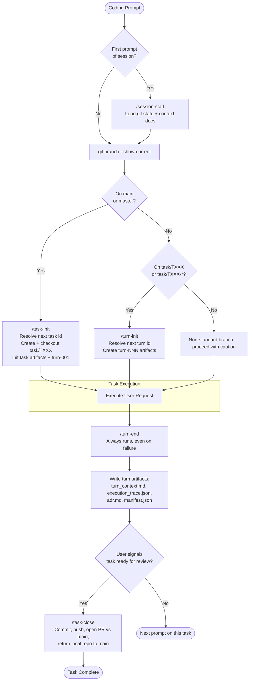

# coding-agents-config

Agentic pipeline configuration for Claude Code and Codex. Enforces a task/turn-based workflow with provenance tracking, branch protection, and governance rules, plus an "App Factory" skill library for generating full-stack applications from a PRD → DDD → DSL → plan → code pipeline.

## Setup

### 1. Clone the repo

```sh
git clone <repo-url> ~/coding-agents-config
```

### 2. Create symlinks (automated)

Run the setup script — it creates all symlinks and backs up any existing files:

```sh
bash scripts/setup.sh
```

It links three sets of targets:

- Into `~/.claude/`: `skills`, `agents`, `hooks`, `scripts`, `CLAUDE.md`, `settings.json` (plus `rules`, `context`, `plugins` if present)
- Into `~/.codex/`: `agents`, `AGENTS.md`
- Into the repo-local `./.claude/`: `CLAUDE.md`

<details>
<summary>Manual symlink commands</summary>

```sh
ln -s ~/coding-agents-config/skills ~/.claude/skills
ln -s ~/coding-agents-config/agents ~/.claude/agents
ln -s ~/coding-agents-config/hooks ~/.claude/hooks
ln -s ~/coding-agents-config/scripts ~/.claude/scripts
ln -s ~/coding-agents-config/CLAUDE.md ~/.claude/CLAUDE.md
ln -s ~/coding-agents-config/settings.json ~/.claude/settings.json

ln -s ~/coding-agents-config/agents ~/.codex/agents
ln -s ~/coding-agents-config/AGENTS.md ~/.codex/AGENTS.md
```

If any of these already exist, back them up first (`mv <target> <target>.bak`).
</details>

### 3. Verify

```sh
ls -la ~/.claude/skills        # should point to ~/coding-agents-config/skills
ls -la ~/.claude/agents        # should point to ~/coding-agents-config/agents
ls -la ~/.claude/hooks         # should point to ~/coding-agents-config/hooks
ls -la ~/.claude/CLAUDE.md     # should point to ~/coding-agents-config/CLAUDE.md
ls -la ~/.claude/settings.json # should point to ~/coding-agents-config/settings.json
ls -la ~/.codex/AGENTS.md      # should point to ~/coding-agents-config/AGENTS.md
```

## Structure

```
coding-agents-config/
├── CLAUDE.md           # Global instructions — task/turn protocol, branch rules
├── AGENTS.md           # Codex loader directive → CLAUDE.md
├── settings.json       # Claude Code settings (model, permissions, hooks)
├── agents/             # Subagent definitions
│   └── agent-architecture-planner.md
├── hooks/              # Shell hooks triggered by Claude Code events
│   └── branch-guard.sh # Auto-creates a task/TXXX branch when on main/master
├── skills/             # Slash-command skills (governance + App Factory pipeline)
│   ├── session-start/  # Load git state + context docs at session start
│   ├── task-init/      # Create task/TXXX branch + task artifacts (run on main/master)
│   ├── turn-init/      # Create the next turn inside the active task
│   ├── turn-end/       # Finalize a turn with trace, ADR, and manifest
│   ├── task-close/     # Push the task branch and open a PR against main
│   ├── branch-guard/   # Fallback branch check/creation
│   ├── af-*/           # App Factory SDLC: PRD → DDD → DSL → plan → implementation
│   ├── .nestjs/        # NestJS/Prisma code-generation skills (hidden dir)
│   └── .system/        # Codex-managed meta-skills (skill-creator, skill-installer, ...)
├── scripts/             # Automation scripts
│   ├── setup.sh         # Create symlinks into ~/.claude and ~/.codex
│   └── af-state.sh      # Helpers for .appfactory/memory/state.yaml
├── .appfactory/         # Task/turn tracking and specs
│   ├── tasks/           # Task branches with nested turns
│   ├── specs/           # Specifications
│   ├── prompts/         # Prompt templates
│   ├── memory/          # Project memory (state.yaml)
│   └── tasks_index.csv  # Registry of all tasks
├── archive/             # Retired skills, templates, and docs kept for reference
├── docs/                # Reference documentation
└── .github/             # Issue and PR templates
```

## Execution Flow

The agentic pipeline enforces a task/turn-based workflow for all coding tasks, driven by the rules in `CLAUDE.md`:


```mermaid
flowchart TB
    START([Coding Prompt]) --> FIRST{First prompt<br/>of session?}
    FIRST -->|Yes| SESSION_START["/session-start<br/>Load git state + context docs"]
    FIRST -->|No| BRANCH_CHECK
    SESSION_START --> BRANCH_CHECK["git branch --show-current"]

    BRANCH_CHECK --> IS_MAIN{On main<br/>or master?}
    IS_MAIN -->|Yes| TASK_INIT["/task-init<br/>Resolve next task id<br/>Create + checkout task/TXXX<br/>Init task artifacts + turn-001"]
    IS_MAIN -->|No| IS_TASK{On task/TXXX<br/>or task/TXXX-*?}
    IS_TASK -->|Yes| TURN_INIT["/turn-init<br/>Resolve next turn id<br/>Create turn-NNN artifacts"]
    IS_TASK -->|No| WARN["Non-standard branch —<br/>proceed with caution"]

    TASK_INIT --> EXEC
    TURN_INIT --> EXEC
    WARN --> EXEC

    subgraph EXECUTION["Task Execution"]
        EXEC["Execute User Request"]
    end

    EXEC --> TURN_END["/turn-end<br/>Always runs, even on failure"]
    TURN_END --> ARTIFACTS["Write turn artifacts:<br/>turn_context.md, execution_trace.json,<br/>adr.md, manifest.json"]
    ARTIFACTS --> READY{User signals<br/>task ready for review?}
    READY -->|Yes| TASK_CLOSE["/task-close<br/>Commit, push, open PR vs main,<br/>return local repo to main"]
    READY -->|No| NEXT([Next prompt on this task])
    TASK_CLOSE --> DONE([Task Complete])
```

### Task & Turn Protocol Summary

| Phase | Trigger | Steps | Outputs |
|-------|---------|-------|---------|
| **Session Start** | First prompt of a session | Load git state → load context docs → display banner | Context loaded |
| **Task Init** | Current branch is `main`/`master` | Resolve task id → create `task/TXXX` → init task artifacts + `turn-001` | `task_context.md`, `task_status.json`, `task_summary.md`, `pull_request.md` |
| **Turn Init** | Current branch is `task/TXXX(-*)` | Resolve next turn id → create `turn-NNN` directory | `turn_context.md`, `execution_trace.json` |
| **Execution** | Every coding prompt | Execute the user's request | Modified files |
| **Turn End** | After every execution, even on failure | Update trace → write ADR (full or minimal) → write manifest | `adr.md`, `manifest.json` |
| **Task Close** | User signals the task is ready for review | Commit → push → open PR against `main` → return local repo to `main` | Pull request |

## Skills (37)

Each skill lives in its own directory under `skills/` with a `SKILL.md` file. Directories prefixed with `.` (`.nestjs/`, `.system/`) are hidden from a plain `ls` but are loaded like any other skill.

### Governance — task/turn protocol

| Skill | Description |
|-------|-------------|
| `session-start` | Load repository state and core pipeline context at the start of every session |
| `task-init` | Initialize a new task branch and create task + `turn-001` artifacts (run on `main`/`master`) |
| `turn-init` | Initialize the next turn within the active task branch |
| `turn-end` | Finalize the active turn after execution — trace, ADR, manifest |
| `task-close` | Finalize the active task branch, push it, and open a pull request against `main` |
| `branch-guard` | Fallback check that creates a turn-scoped branch if still on `main`/`master` |

### App Factory SDLC pipeline (`af-*`)

| Skill | Description |
|-------|-------------|
| `af-orchestrator` | Orchestrates the App Factory Software Development Lifecycle end to end |
| `af-project-init` | Orchestrate AppFactory project initialization (env vars + helper script) |
| `af-memory` | CRUD operations on `.appfactory/memory/state.yaml` pipeline state |
| `af-be-prd-build` | Build a business-facing PRD for a backend application, service, or module |
| `af-be-ddd-build` | Generate a backend Domain-Driven Design document from an approved PRD |
| `af-be-ddd-analysis` | Analyze a generated DDD spec for quality, completeness, and PRD alignment |
| `af-be-ddd-refactor` | Refactor a DDD spec using `af-be-ddd-analysis` findings |
| `af-be-ddd-orchestrator` | Orchestrate the DDD build → analyze → refactor loop → test phases |
| `af-be-ddd-dsl` | Generate a backend application DSL YAML from a DDD document |
| `af-be-ddd-tests` | Generate Gherkin-style BDD scenarios from DDD and PRD specs |
| `af-be-plan` | Generate a backend execution plan from a DSL YAML and tech stack profile |
| `af-be-implementation` | Generate backend domain code from the execution plan and BDD specs |
| `af-app-check` | Audit an application for production readiness (security, DB, deployment, quality) |

### NestJS / Prisma code generation (`skills/.nestjs/`)

| Skill | Description |
|-------|-------------|
| `app-from-dsl` | Orchestrate full-stack application generation from app-dsl YAML specifications |
| `field-mapper-generator` | Generate field mapper/converter utilities from DSL mapper specifications |
| `nestjs-crud-resource` | Generate a NestJS CRUD module (controller, service, DTOs) from a DSL backend spec |
| `nestjs-customer-crud-scaffold` | Scaffold a NestJS customer CRUD app via a non-interactive Nest CLI wrapper |
| `nestjs-observability` | Add structured logging, correlation IDs, and Prisma query logging to a NestJS backend |
| `nestjs-prisma-resource` | Generate a complete NestJS + Prisma CRUD resource from an input schema |
| `prisma/prisma-guidelines` | Prisma ORM development guidelines and constraints |
| `prisma/prisma-persistence` | Generate Prisma schema and migrations from a DSL persistence model |

### Utility

| Skill | Description |
|-------|-------------|
| `eval-labeler` | Label and compare model responses (Response A vs B) for coding tasks |
| `dsl-utils/dsl-model-interpreter` | Parse and validate app-dsl YAML specifications |
| `e2e-tests/http-test-artifacts` | Generate `.http` request files for API endpoint testing |
| `ui-utils/ui-implementation-language` | Declarative YAML language for UI pages, layouts, and widgets |
| `unit-tests/test-implementation-sync` | Keep unit tests synchronized with the actual implementation |

### Meta-skills (`skills/.system/`, Codex-managed)

| Skill | Description |
|-------|-------------|
| `skill-creator` | Guide for creating and updating skills |
| `skill-installer` | Install skills into `$CODEX_HOME/skills` from a curated list or repo |
| `plugin-creator` | Scaffold plugin directories for Codex |
| `imagegen` | Generate or edit raster images |
| `openai-docs` | Look up official OpenAI product/API documentation |

## Hooks

| Hook | Trigger | Purpose |
|------|---------|---------|
| `branch-guard.sh` | `PreToolUse(Bash)` | Auto-creates and switches to the next `task/TXXX` branch when a write/bash tool is invoked on `main`/`master` |

## Archive

`archive/` holds retired skills, templates (`archive/templates/`, including `adr_template.md`, `pull_request_template.md`, `manifest.schema.json`), and design docs kept for reference. They are not symlinked into `~/.claude/` or `~/.codex/`.

## Adding a new skill

Each skill lives in its own directory under `skills/` with a `SKILL.md` file:

```
skills/my-skill/
└── SKILL.md
```

The `skills/.system/skill-creator` meta-skill can guide you through creating one — invoke it from Claude Code or Codex.

## Syncing across machines

Since this is a standard git repo, pull on any machine to stay current:

```sh
cd ~/coding-agents-config && git pull
```

The symlinks mean changes are picked up immediately — no reinstall needed.
