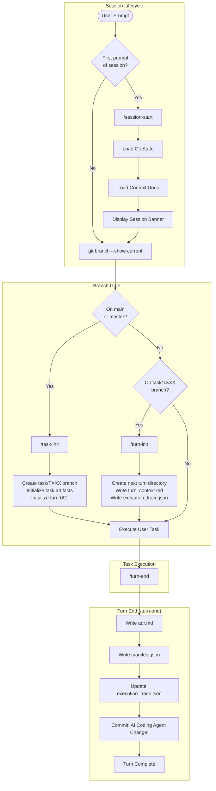
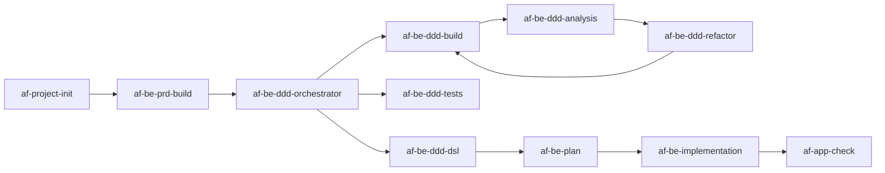

# coding-agents-config

Agentic pipeline configuration for Claude Code. Enforces a turn-based workflow with provenance tracking, branch protection, and governance rules. Includes the **AppFactory** pipeline — a full-stack code generation system that takes a project from requirements through DDD, planning, and implementation.

## Setup

### 1. Clone the repo

```sh
git clone <repo-url> ~/coding-agents-config
```

### 2. Create symlinks (automated)

Run the setup script — it creates all symlinks and backs up any existing files:

```sh
bash scripts/setup.sh
```

<details>
<summary>Manual symlink commands</summary>

```sh
ln -s ~/coding-agents-config/skills ~/.claude/skills
ln -s ~/coding-agents-config/hooks ~/.claude/hooks
ln -s ~/coding-agents-config/agents ~/.claude/agents
ln -s ~/coding-agents-config/scripts ~/.claude/scripts
ln -s ~/coding-agents-config/CLAUDE.md ~/.claude/CLAUDE.md
ln -s ~/coding-agents-config/settings.json ~/.claude/settings.json
```

If any of these already exist, back them up first (`mv <target> <target>.bak`).
</details>

### 3. Verify

```sh
ls -la ~/.claude/skills        # should point to ~/coding-agents-config/skills
ls -la ~/.claude/hooks         # should point to ~/coding-agents-config/hooks
ls -la ~/.claude/agents        # should point to ~/coding-agents-config/agents
ls -la ~/.claude/CLAUDE.md     # should point to ~/coding-agents-config/CLAUDE.md
ls -la ~/.claude/settings.json # should point to ~/coding-agents-config/settings.json
```

## Structure

```
coding-agents-config/
├── CLAUDE.md               # Global instructions — turn protocol, branch rules
├── AGENTS.md               # Agent loader directive
├── settings.json           # Claude Code settings (model, permissions, hooks)
├── hooks/
│   ├── branch-guard.sh     # PreToolUse: blocks edits on main/master, auto-creates task branch
│   └── af-state.sh         # CRUD helpers for .appfactory/memory/state.yml
├── skills/                 # Slash-command skills (20 active)
│   ├── .system/            # Meta-skills (skill-creator, skill-installer)
│   ├── .nestjs/            # NestJS-specific configurations
│   ├── session-start/      # Load repo state and pipeline context
│   ├── task-init/          # Initialize task branch and first turn
│   ├── task-close/         # Finalize task, push, open PR
│   ├── turn-init/          # Initialize next turn within active task
│   ├── turn-end/           # Finalize turn with ADR, manifest, trace
│   ├── branch-guard/       # Create task branch if on main/master
│   ├── af-orchestrator/    # Master AppFactory SDLC orchestrator
│   ├── af-project-init/    # Project initialization
│   ├── af-memory/          # Pipeline state CRUD (state.yml)
│   ├── af-be-prd-build/    # Generate PRD from business inputs
│   ├── af-be-ddd-orchestrator/ # DDD loop orchestration
│   ├── af-be-ddd-build/    # Generate DDD document from PRD
│   ├── af-be-ddd-analysis/ # Analyze DDD for quality and completeness
│   ├── af-be-ddd-refactor/ # Refactor DDD from analysis findings
│   ├── af-be-ddd-dsl/      # Generate DSL YAML from DDD document
│   ├── af-be-ddd-tests/    # Generate Gherkin BDD scenarios from DDD/PRD
│   ├── af-be-plan/         # Generate execution plan from DSL + tech stack
│   ├── af-be-implementation/ # Generate backend code from execution plan
│   ├── af-app-check/       # Production-readiness audit
│   ├── eval-labeler/       # Model response evaluation labeling
│   ├── dsl-utils/          # DSL model interpretation utilities
│   ├── e2e-tests/          # HTTP test artifact generation
│   ├── ui-utils/           # UI implementation language utilities
│   └── unit-tests/         # Test implementation synchronization
├── agents/
│   └── agent-architecture-planner.md  # Architecture planning agent
├── scripts/
│   └── setup.sh            # Symlink installer
├── docs/                   # Reference documentation
│   ├── skill-summary.md    # Quick reference table of all active skills
│   ├── appFactory-plan.md  # AppFactory design and implementation status
│   ├── app-nextjs-nestjs-prisma.md  # NestJS + Next.js + Prisma reference
│   └── migration-ai-to-appfactory.md # ai/ → .appfactory/ migration log
└── .appfactory/            # Task/turn tracking, specs, and pipeline memory
    ├── tasks/              # Per-task artifacts and turns
    ├── specs/              # Generated specs (PRD, DDD, DSL, plan, features)
    ├── prompts/            # Prompt templates
    └── memory/             # Pipeline state (state.yml)
```

## Execution Flow

The agentic pipeline enforces a strict turn-based workflow for all coding tasks:


```mermaid
flowchart TB
    subgraph SESSION["Session Lifecycle"]
        START([User Prompt]) --> SS{First prompt<br/>of session?}
        SS -->|Yes| SESSION_START["/session-start"]
        SS -->|No| BRANCH_CHECK

        SESSION_START --> LOAD_GIT["Load Git State"]
        LOAD_GIT --> LOAD_CTX["Load Context Docs"]
        LOAD_CTX --> BANNER["Display Session Banner"]
        BANNER --> BRANCH_CHECK
    end

    subgraph BRANCH_GATE["Branch Gate"]
        BRANCH_CHECK["git branch --show-current"] --> IS_MAIN{On main<br/>or master?}
        IS_MAIN -->|Yes| TASK_INIT["/task-init"]
        TASK_INIT --> CREATE_TASK["Create task/TXXX branch<br/>Initialize task artifacts<br/>Initialize turn-001"]
        CREATE_TASK --> EXEC
        IS_MAIN -->|No| IS_TASK{On task/TXXX<br/>branch?}
        IS_TASK -->|Yes| TURN_INIT["/turn-init"]
        TURN_INIT --> NEXT_TURN["Create next turn directory<br/>Write turn_context.md<br/>Write execution_trace.json"]
        NEXT_TURN --> EXEC
        IS_TASK -->|No| EXEC
    end

    subgraph EXECUTION["Task Execution"]
        EXEC["Execute User Task"] --> TURN_END["/turn-end"]
    end

    subgraph POST_EXEC["Turn End (/turn-end)"]
        TURN_END --> WRITE_ADR["Write adr.md"]
        WRITE_ADR --> WRITE_MANIFEST["Write manifest.json"]
        WRITE_MANIFEST --> UPDATE_TRACE["Update execution_trace.json"]
        UPDATE_TRACE --> COMMIT["Commit: AI Coding Agent Change:"]
        COMMIT --> COMPLETE["Turn Complete"]
    end
```

### Turn Protocol Summary

| Phase | Steps | Outputs |
|-------|-------|---------|
| **Session Start** | Load git state → Load context docs → Display banner | Context loaded |
| **Task Init** | Resolve task ID → Create `task/TXXX` branch → Init task + turn-001 artifacts | Branch, `task_context.md`, `task_status.json` |
| **Turn Init** | Resolve turn ID → Create turn directory → Write context + trace | `turn_context.md`, `execution_trace.json` |
| **Execution** | Execute task | Modified files |
| **Turn End** | Write ADR → Manifest → Update trace → Commit | `adr.md`, `manifest.json`, commit |
| **Task Close** | Push branch → Open PR | Pull request |

### Task & Turn Model

- A **task** maps to one feature branch and one pull request (`task/T001`, `task/T002`, …)
- A **turn** is one AI execution cycle within a task (`turn-001`, `turn-002`, …)
- Task IDs are global and zero-padded to 3 digits
- Turn IDs reset per task and are zero-padded to 3 digits

### Required Artifacts

**Per turn** (`.appfactory/tasks/task-XXX/turns/turn-XXX/`):

| File | Description |
|------|-------------|
| `turn_context.md` | Turn metadata, timing, and context |
| `execution_trace.json` | Structured trace of execution steps |
| `adr.md` | Architecture Decision Record (full or minimal) |
| `manifest.json` | SHA-256 checksums of all modified files |

**Per task** (`.appfactory/tasks/task-XXX/`):

| File | Description |
|------|-------------|
| `task_context.md` | Task scope and objective |
| `task_status.json` | Current task status |
| `task_summary.md` | Summary of work completed |
| `pull_request.md` | PR description for task-close |

## AppFactory Pipeline

The AppFactory is a full SDLC automation system for generating backend applications. Invoke the master orchestrator (`/af-orchestrator`) to run the full pipeline, or invoke individual skills at any phase.


```mermaid
flowchart LR
    INIT[af-project-init] --> PRD[af-be-prd-build]
    PRD --> DDD_ORCH[af-be-ddd-orchestrator]
    DDD_ORCH --> DDD_BUILD[af-be-ddd-build]
    DDD_BUILD --> DDD_ANALYZE[af-be-ddd-analysis]
    DDD_ANALYZE --> DDD_REFACTOR[af-be-ddd-refactor]
    DDD_REFACTOR --> DDD_BUILD
    DDD_ORCH --> TESTS[af-be-ddd-tests]
    DDD_ORCH --> DSL[af-be-ddd-dsl]
    DSL --> PLAN[af-be-plan]
    PLAN --> IMPL[af-be-implementation]
    IMPL --> CHECK[af-app-check]
```

Cross-cutting: `af-memory` manages pipeline state in `.appfactory/memory/state.yml` throughout all phases.

### AppFactory Environment Variables

| Variable | Default | Description |
|----------|---------|-------------|
| `AF_ROOT` | `~/gallery/app-factory` | App Factory root directory |
| `AF_GITHUB_PROFILE` | `bobwares` | GitHub profile for generated projects |
| `AF_GENERATED_PROJECT_ROOT` | `~/generated-apps` | Output directory for generated apps |
| `AF_TECH_STACK_DSL` | `~/gallery/app-factory/tech-stack-profiles` | Tech stack profile definitions |
| `AF_TECH_STACK_IMPLEMENTATIONS` | `~/gallery/app-factory/tech-stack-implementations` | Tech stack implementation templates |
| `max_ddd_tries` | `3` | Max DDD analyze-refactor iterations |

## Skills (20)

### Session & Task Lifecycle

| Skill | Description |
|-------|-------------|
| `session-start` | Load repository state and core pipeline context at session start |
| `task-init` | Initialize a new task branch and create task + turn-001 artifacts |
| `task-close` | Finalize the active task branch, push it, and open a pull request |
| `turn-init` | Initialize the next turn within an active task branch |
| `turn-end` | Finalize turn; write ADR, manifest, and update execution trace |
| `branch-guard` | Check branch and create a task-scoped branch if on main/master |

### AppFactory — Foundation

| Skill | Description |
|-------|-------------|
| `af-orchestrator` | Master orchestrator for the full AppFactory SDLC pipeline |
| `af-project-init` | Initialize a new AppFactory project and export required env vars |
| `af-memory` | CRUD operations for `.appfactory/memory/state.yml` pipeline state |

### AppFactory — Requirements & Design

| Skill | Description |
|-------|-------------|
| `af-be-prd-build` | Build a backend PRD from business inputs, discovery notes, or questionnaire |
| `af-be-ddd-orchestrator` | Orchestrate the DDD workflow: build → analyze → refactor loop |
| `af-be-ddd-build` | Generate a human-readable DDD document from an approved PRD |
| `af-be-ddd-analysis` | Analyze a DDD document for quality, completeness, and PRD alignment |
| `af-be-ddd-refactor` | Refactor a DDD document using analysis findings |
| `af-be-ddd-dsl` | Generate a backend DSL YAML from a DDD document |
| `af-be-ddd-tests` | Generate Gherkin BDD scenarios from DDD and PRD specifications |

### AppFactory — Implementation & Validation

| Skill | Description |
|-------|-------------|
| `af-be-plan` | Generate a backend execution plan from DSL YAML + tech stack profile |
| `af-be-implementation` | Generate backend application code from execution plan and BDD specs |
| `af-app-check` | Audit application for production readiness (security, DB, deployment, code quality) |

### Evaluation

| Skill | Description |
|-------|-------------|
| `eval-labeler` | Label model response evaluations by comparing Response A vs Response B |

### Meta-Skills (.system)

| Skill | Description |
|-------|-------------|
| `skill-creator` | Create new skills with a SKILL.md scaffold |
| `skill-installer` | Install skills from marketplaces |

## Hooks

| Hook | Trigger | Purpose |
|------|---------|---------|
| `branch-guard.sh` | `PreToolUse(Edit/Write)` | Blocks file edits on main/master; auto-creates `task/TXXX` branch |

## Settings

Key configuration in `settings.json`:

| Setting | Value |
|---------|-------|
| Model | `claude-opus-4-5-20251101` (main), `claude-sonnet-4-6` (fast) |
| Voice | Enabled (hold mode) |
| Branch protection | main/master blocked via hook |
| Commit co-authorship | Enabled (`includeCoAuthoredBy: true`) |
| Cleanup period | 90 days |

Permission policy: git, npm/pnpm, docker, psql, curl, jq, grep, sed, awk are allowed. Dangerous operations (`rm -rf /`, `git push --force main`, `npm publish`) are denied. Git push and commit require confirmation.

## Adding a New Skill

Each skill lives in its own directory under `skills/` with a `SKILL.md` file:

```
skills/my-skill/
└── SKILL.md
```

The `.system/skill-creator` meta-skill guides you through the process. Invoke it from Claude Code:

```
/skill-creator
```

## Commit Message Format

All AI agent commits use:

```
AI Coding Agent Change:
- <imperative bullet>
- <imperative bullet>
```

## Syncing Across Machines

Since this is a standard git repo, pull on any machine to stay current:

```sh
cd ~/coding-agents-config && git pull
```

The symlinks mean changes are picked up immediately — no reinstall needed.
