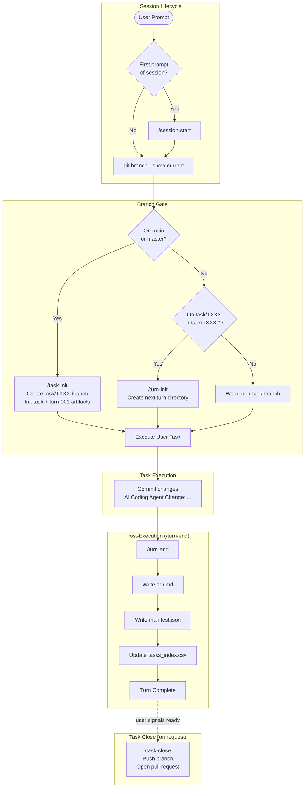

# coding-agents-config

Agentic pipeline configuration for Claude Code. Enforces a task/turn-based workflow with provenance tracking, branch protection, and governance rules.

## Setup

### 1. Clone the repo

```sh
git clone <repo-url> ~/coding-agents-config
```

### 2. Create symlinks (automated)

Run the setup script — it creates all symlinks and backs up any existing files:

```sh
bash scripts/setup.sh
```

<details>
<summary>Manual symlink commands</summary>

```sh
ln -s ~/coding-agents-config/skills ~/.claude/skills
ln -s ~/coding-agents-config/hooks ~/.claude/hooks
ln -s ~/coding-agents-config/scripts ~/.claude/scripts
ln -s ~/coding-agents-config/CLAUDE.md ~/.claude/CLAUDE.md
ln -s ~/coding-agents-config/settings.json ~/.claude/settings.json
```

If any of these already exist, back them up first (`mv <target> <target>.bak`).
</details>

### 3. Verify

```sh
ls -la ~/.claude/skills        # should point to ~/coding-agents-config/skills
ls -la ~/.claude/hooks         # should point to ~/coding-agents-config/hooks
ls -la ~/.claude/CLAUDE.md     # should point to ~/coding-agents-config/CLAUDE.md
ls -la ~/.claude/settings.json # should point to ~/coding-agents-config/settings.json
```

## Structure

```
coding-agents-config/
├── CLAUDE.md               # Global instructions — task/turn protocol, branch rules
├── AGENTS.md               # Agent loader directive
├── settings.json           # Claude Code settings (model, permissions, hooks)
├── hooks/                  # Shell hooks triggered by Claude Code events
│   └── branch-guard.sh     # Prevents edits on main/master
├── skills/                 # Slash-command skills
│   ├── .system/            # Meta-skills (skill-creator, skill-installer, imagegen)
│   ├── .nestjs/            # NestJS-specific skills (inactive)
│   ├── session-start/      # Initialize session context
│   ├── task-init/          # Create task branch and task + turn-001 artifacts
│   ├── task-close/         # Finalize task branch and open pull request
│   ├── turn-init/          # Create turn directory and artifacts
│   ├── turn-end/           # Finalize turn with ADR, manifest, commit
│   ├── branch-guard/       # Enforce branch naming rules
│   ├── af-be-build-prd/    # Build backend PRD from intake worksheet
│   ├── af-be-build-ddd/    # Generate DDD document from PRD
│   ├── af-be-build-dsl/    # Generate backend DSL YAML from DDD document
│   ├── af-be-build-plan/   # Generate backend execution plan from DSL
│   ├── af-be-build-implementation/ # Execute backend code generation
│   ├── af-project-init/    # Initialize new AppFactory project scaffold
│   ├── af-memory/          # Read/write AppFactory pipeline state
│   ├── dsl-utils/          # DSL model interpreter utilities
│   ├── e2e-tests/          # E2E test artifact generation
│   ├── ui-utils/           # UI implementation utilities
│   └── unit-tests/         # Unit test sync utilities
├── agents/                 # Agent definition documents
│   └── agent-architecture-planner.md
├── scripts/                # Automation scripts
│   └── setup.sh
├── docs/                   # Reference documentation
├── archive/                # Retired skills and templates
│   └── templates/          # Legacy turn lifecycle templates
└── .appfactory/            # Task/turn tracking and specs
    ├── tasks_index.csv     # Global task registry
    ├── tasks/              # Task branches with turns
    ├── specs/              # Specifications
    ├── prompts/            # Prompt templates
    └── memory/             # Project memory (state.yml)
```

## Execution Flow

The agentic pipeline enforces a strict task/turn-based workflow for all coding tasks:


```mermaid
flowchart TB
    subgraph SESSION["Session Lifecycle"]
        START([User Prompt]) --> SS{First prompt\nof session?}
        SS -->|Yes| SESSION_START["/session-start"]
        SS -->|No| BRANCH_CHECK
        SESSION_START --> BRANCH_CHECK
    end

    subgraph BRANCH_GATE["Branch Gate"]
        BRANCH_CHECK["git branch --show-current"] --> IS_MAIN{On main\nor master?}
        IS_MAIN -->|Yes| TASK_INIT["/task-init\nCreate task/TXXX branch\nInit task + turn-001 artifacts"]
        IS_MAIN -->|No| IS_TASK{On task/TXXX\nor task/TXXX-*?}
        IS_TASK -->|Yes| TURN_INIT["/turn-init\nCreate next turn directory"]
        IS_TASK -->|No| WARN["Warn: non-task branch"]
        TASK_INIT --> PROCEED
        TURN_INIT --> PROCEED
        WARN --> PROCEED
    end

    subgraph EXECUTION["Task Execution"]
        PROCEED["Execute User Task"] --> COMMIT["Commit changes\nAI Coding Agent Change: ..."]
    end

    subgraph POST_EXEC["Post-Execution (/turn-end)"]
        COMMIT --> TURN_END["/turn-end"]
        TURN_END --> WRITE_ADR["Write adr.md"]
        WRITE_ADR --> WRITE_MANIFEST["Write manifest.json"]
        WRITE_MANIFEST --> UPDATE_INDEX["Update tasks_index.csv"]
        UPDATE_INDEX --> COMPLETE["Turn Complete"]
    end

    subgraph TASK_CLOSE["Task Close (on request)"]
        COMPLETE -.->|user signals ready| TASK_CLOSE_SKILL["/task-close\nPush branch\nOpen pull request"]
    end
```

### Task and Turn Protocol Summary

| Phase | Trigger | Skills | Outputs |
|-------|---------|--------|---------|
| **Session Start** | First prompt of session | `session-start` | Git state + context loaded |
| **Task Init** | On `main`/`master` | `task-init` | `task/TXXX` branch, task + turn-001 artifacts |
| **Turn Init** | On `task/TXXX` branch | `turn-init` | `turn_context.md`, `execution_trace.json` |
| **Execution** | Every coding prompt | — | Modified files, committed |
| **Turn End** | After every execution | `turn-end` | `adr.md`, `manifest.json`, index updated |
| **Task Close** | User signals ready | `task-close` | PR opened against `main` |

## Skills

### Lifecycle Skills (6)

| Skill | Description |
|-------|-------------|
| `session-start` | Load repository state and core pipeline context |
| `task-init` | Initialize a new task branch and create task + turn-001 artifacts |
| `task-close` | Finalize the active task branch, push it, and open a pull request |
| `turn-init` | Initialize the next turn within the active task branch |
| `turn-end` | Finalize the active turn after execution |
| `branch-guard` | Enforce branch naming rules; block edits on main/master |

### AppFactory Skills (7)

| Skill | Description |
|-------|-------------|
| `af-be-build-prd` | Build a backend PRD from a PRD intake worksheet |
| `af-be-build-ddd` | Generate a DDD document from an approved PRD |
| `af-be-build-dsl` | Generate a backend DSL YAML from a DDD document |
| `af-be-build-plan` | Generate a backend execution plan from a DSL and tech stack profile |
| `af-be-build-implementation` | Execute backend code generation from a DSL specification |
| `af-project-init` | Initialize a new AppFactory project scaffold |
| `af-memory` | Read/write AppFactory pipeline state in `.appfactory/memory/` |

### Utility Skill Groups

| Group | Sub-skill | Description |
|-------|-----------|-------------|
| `dsl-utils` | `dsl-model-interpreter` | Interpret DSL model definitions |
| `e2e-tests` | `http-test-artifacts` | Generate HTTP E2E test artifacts |
| `ui-utils` | `ui-implementation-language` | UI implementation language utilities |
| `unit-tests` | `test-implementation-sync` | Sync test implementations with source |

### Meta-Skills (.system)

| Skill | Description |
|-------|-------------|
| `skill-creator` | Create new skills with SKILL.md |
| `skill-installer` | Install skills from marketplaces |
| `plugin-creator` | Create Claude Code plugins |
| `imagegen` | AI image generation utilities |

## Hooks

| Hook | Trigger | Purpose |
|------|---------|---------|
| `branch-guard.sh` | `PreToolUse(Bash)` | Block edits on main/master |

## AppFactory Pipeline

The AppFactory (`af-*`) skills implement an end-to-end backend generation pipeline:

```
af-be-build-prd → af-be-build-ddd → af-be-build-dsl → af-be-build-plan → af-be-build-implementation
```

1. **PRD** — Translate business intake into a structured product requirements document
2. **DDD** — Derive a domain model (entities, aggregates, services) from the PRD
3. **DSL** — Encode the domain model as a YAML DSL for code generation
4. **Plan** — Produce a step-by-step implementation plan from the DSL + tech stack profile
5. **Implementation** — Generate and scaffold the backend application

Pipeline state is persisted across turns via `af-memory` in `.appfactory/memory/state.yml`.

## Adding a New Skill

Each skill lives in its own directory under `skills/` with a `SKILL.md` file:

```
skills/my-skill/
└── SKILL.md
```

Use the `.system/skill-creator` meta-skill to create one:

```
/skill-creator
```

## Syncing Across Machines

Since this is a standard git repo, pull on any machine to stay current:

```sh
cd ~/coding-agents-config && git pull
```

The symlinks mean changes are picked up immediately — no reinstall needed.
