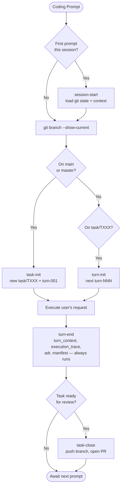

# coding-agents-config

Agentic pipeline configuration for Claude Code. Enforces a task/turn-based workflow with provenance tracking, branch protection, and governance rules, plus a library of AppFactory skills for spec-driven application generation.

## Setup

### 1. Clone the repo

```sh
git clone <repo-url> ~/coding-agents-config
```

### 2. Create symlinks (automated)

Run the setup script — it creates all symlinks and backs up any existing files:

```sh
bash scripts/setup.sh
```

<details>
<summary>Manual symlink commands</summary>

```sh
# ~/.claude/
ln -s ~/coding-agents-config/skills     ~/.claude/skills
ln -s ~/coding-agents-config/agents     ~/.claude/agents
ln -s ~/coding-agents-config/hooks      ~/.claude/hooks
ln -s ~/coding-agents-config/scripts    ~/.claude/scripts
ln -s ~/coding-agents-config/CLAUDE.md  ~/.claude/CLAUDE.md
ln -s ~/coding-agents-config/settings.json ~/.claude/settings.json

# ~/.codex/
ln -s ~/coding-agents-config/agents    ~/.codex/agents
ln -s ~/coding-agents-config/AGENTS.md ~/.codex/AGENTS.md

# repo-local ./.claude/
ln -s ~/coding-agents-config/CLAUDE.md ./.claude/CLAUDE.md
```

If any of these already exist, back them up first (`mv <target> <target>.bak`). `scripts/setup.sh` also links optional `rules/`, `context/`, and `plugins/` directories into `~/.claude/` when present.
</details>

### 3. Verify

```sh
ls -la ~/.claude/skills        # should point to ~/coding-agents-config/skills
ls -la ~/.claude/agents        # should point to ~/coding-agents-config/agents
ls -la ~/.claude/hooks         # should point to ~/coding-agents-config/hooks
ls -la ~/.claude/CLAUDE.md     # should point to ~/coding-agents-config/CLAUDE.md
ls -la ~/.claude/settings.json # should point to ~/coding-agents-config/settings.json
```

## Structure

```
coding-agents-config/
├── CLAUDE.md           # Global instructions — task/turn protocol, branch rules
├── AGENTS.md           # Codex loader directive (points at ~/.claude/CLAUDE.md)
├── settings.json       # Claude Code settings (model, env, permissions)
├── hooks/              # Shell hooks triggered by Claude Code events
│   └── branch-guard.sh # Prevents edits on main/master
├── skills/             # Slash-command skills
│   ├── session-start/  # Load repo state and pipeline context
│   ├── task-init/      # Create a new task branch and task-001.. artifacts
│   ├── turn-init/      # Create the next turn directory within a task
│   ├── turn-end/       # Finalize a turn (PR notes, ADR, manifest)
│   ├── task-close/     # Finalize a task branch and open a pull request
│   ├── branch-guard/   # Legacy turn-scoped branch creation from main/master
│   ├── af-orchestrator/          # Drives the AppFactory SDLC end to end
│   ├── af-project-init/          # Export env vars, bootstrap a new project
│   ├── af-be-prd-build/          # Build a backend PRD from intake notes
│   ├── af-be-ddd-orchestrator/   # Orchestrate the DDD build/analyze/refactor loop
│   ├── af-be-ddd-build/          # Generate a DDD spec from an approved PRD
│   ├── af-be-ddd-analysis/       # Audit a DDD spec for gaps and risks
│   ├── af-be-ddd-refactor/       # Apply DDD analysis findings
│   ├── af-be-ddd-tests/          # Generate Gherkin/BDD scenarios from DDD + PRD
│   ├── af-be-ddd-dsl/            # Generate a backend DSL YAML from a DDD spec
│   ├── af-be-plan/                # Generate a backend execution plan from DSL
│   ├── af-be-implementation/     # Generate backend code from plan + BDD specs
│   ├── af-app-check/             # Production-readiness audit
│   ├── af-memory/                # CRUD for .appfactory/memory/state.yaml
│   ├── dsl-utils/                # DSL parsing/validation helpers
│   ├── ui-utils/                 # UI YAML DSL standard
│   ├── unit-tests/                # Test/implementation sync helpers
│   ├── e2e-tests/                # HTTP test artifact generation
│   └── eval-labeler/             # Label/compare model responses for eval runs
├── agents/              # Subagent definitions
│   └── agent-architecture-planner.md
├── scripts/             # Automation scripts
│   ├── setup.sh         # Create ~/.claude and ~/.codex symlinks
│   └── af-state.sh      # AppFactory state.yaml read/write helpers
├── .appfactory/          # Task/turn tracking, specs, and memory
│   ├── tasks/            # task-NNN/ directories with turns/ subfolders
│   ├── tasks_index.csv   # Registry of all tasks and their status
│   ├── specs/             # Specifications
│   ├── prompts/           # Prompt templates
│   └── memory/            # Project memory (state.yaml)
├── archive/              # Retired/legacy skills kept for reference
└── docs/                 # Reference documentation (pipeline diagrams, skill summary)
```

## Execution Flow

Every coding prompt follows the same governance sequence, defined in `CLAUDE.md`:

1. **First prompt of the session** → invoke `session-start` to load git state and pipeline context.
2. **Every coding prompt** → run `git branch --show-current`.
3. **On `main`/`master`** → invoke `task-init`: resolves the next zero-padded task id (`001`, `002`, …), creates and switches to `task/TXXX`, and initializes `.appfactory/tasks/task-XXX/` with `turn-001`.
4. **On `task/TXXX` (or `task/TXXX-*`)** → invoke `turn-init`: initializes the next zero-padded turn id inside the active task.
5. **Execute the user's request.**
6. **Always** invoke `turn-end` after execution, even on failure, to record `turn_context.md`, `execution_trace.json`, `adr.md`, and `manifest.json`.
7. **When the task is ready for review** → invoke `task-close` to finalize the branch, push it, and open a pull request against `main`.


```mermaid
flowchart TB
    START([Coding Prompt]) --> FIRST{First prompt<br/>this session?}
    FIRST -->|Yes| SESSION_START["session-start<br/>load git state + context"]
    FIRST -->|No| CHECK_BRANCH
    SESSION_START --> CHECK_BRANCH["git branch --show-current"]

    CHECK_BRANCH --> IS_MAIN{On main<br/>or master?}
    IS_MAIN -->|Yes| TASK_INIT["task-init<br/>new task/TXXX + turn-001"]
    IS_MAIN -->|No| IS_TASK{On task/TXXX?}
    IS_TASK -->|Yes| TURN_INIT["turn-init<br/>next turn-NNN"]

    TASK_INIT --> EXECUTE
    TURN_INIT --> EXECUTE["Execute user's request"]

    EXECUTE --> TURN_END["turn-end<br/>turn_context, execution_trace,<br/>adr, manifest — always runs"]
    TURN_END --> READY{Task ready<br/>for review?}
    READY -->|Yes| TASK_CLOSE["task-close<br/>push branch, open PR"]
    READY -->|No| DONE([Await next prompt])
    TASK_CLOSE --> DONE
```

### Directory layout per task

```
.appfactory/tasks/task-XXX/
├── task_context.md
├── task_status.json
├── task_summary.md
├── pull_request.md
└── turns/
    └── turn-XXX/
        ├── turn_context.md
        ├── execution_trace.json
        ├── adr.md
        └── manifest.json
```

## Skills

### Governance (task/turn protocol)

| Skill | Description |
|-------|-------------|
| `session-start` | Load repository state and core pipeline context; run at the start of every session |
| `task-init` | Initialize a new task branch and create task + turn-001 artifacts (run when on `main`/`master`) |
| `turn-init` | Initialize the next turn within the active task branch |
| `turn-end` | Finalize the active turn after execution, even on failure |
| `task-close` | Finalize the active task branch, push it, and open a pull request against `main` |
| `branch-guard` | Legacy skill: create a turn-scoped branch if on `main`/`master` |

### AppFactory pipeline

| Skill | Description |
|-------|-------------|
| `af-orchestrator` | Orchestrates the App Factory software development lifecycle end to end |
| `af-project-init` | Exports required environment variables and bootstraps a new AppFactory project |
| `af-be-prd-build` | Builds a business-facing backend PRD from an intake worksheet or discovery notes |
| `af-be-ddd-orchestrator` | Orchestrates the backend DDD build → analyze → refactor → test loop |
| `af-be-ddd-build` | Generates a human-readable backend DDD document from an approved PRD |
| `af-be-ddd-analysis` | Audits a DDD spec for quality, completeness, and PRD alignment |
| `af-be-ddd-refactor` | Applies `af-be-ddd-analysis` findings to patch the DDD spec |
| `af-be-ddd-tests` | Generates Gherkin/BDD feature files from the DDD spec and PRD |
| `af-be-ddd-dsl` | Generates a backend DSL YAML document from the DDD spec |
| `af-be-plan` | Generates a step-by-step backend execution plan from the DSL and a tech-stack profile |
| `af-be-implementation` | Generates backend domain code from the execution plan and BDD feature specs |
| `af-app-check` | Audits an application for production readiness (security, database, deployment, code quality) |
| `af-memory` | CRUD operations against `.appfactory/memory/state.yaml` for pipeline state tracking |

See `docs/skill-summary.md` for the full pipeline table (phase, invocation order, and description).

### Utility

| Skill | Description |
|-------|-------------|
| `dsl-utils/dsl-model-interpreter` | Parse and validate `app-dsl` YAML specifications |
| `ui-utils/ui-implementation-language` | Declarative YAML standard for UI pages, layouts, widgets, and forms |
| `unit-tests/test-implementation-sync` | Keep unit tests synchronized with service/DTO implementations |
| `e2e-tests/http-test-artifacts` | Generate `.http` request files for REST endpoint testing |
| `eval-labeler` | Process `Eval.md` files to label and compare model responses (Response A vs. Response B) |

## Agents

| Agent | Description |
|-------|-------------|
| `agent-architecture-planner` | Reads the PRD, DDD, and DSL plus the existing repo structure to produce spec alignment, architecture decisions, module maps, task plans, and review artifacts |

## Hooks

| Hook | Trigger | Purpose |
|------|---------|---------|
| `branch-guard.sh` | PreToolUse(Edit) | Block edits on `main`/`master` |

## Registries

- `.appfactory/tasks_index.csv` gets one new row per task (`task_id, branch, status, created_at, closed_at, pull_request_url, total_turns`), updated as status changes.
- Each task may optionally maintain its own `.appfactory/tasks/task-XXX/turns_index.csv`.

## Adding a new skill

Each skill lives in its own directory under `skills/` with a `SKILL.md` file:

```
skills/my-skill/
└── SKILL.md
```

## Syncing across machines

Since this is a standard git repo, pull on any machine to stay current:

```sh
cd ~/coding-agents-config && git pull
```

The symlinks mean changes are picked up immediately — no reinstall needed.
