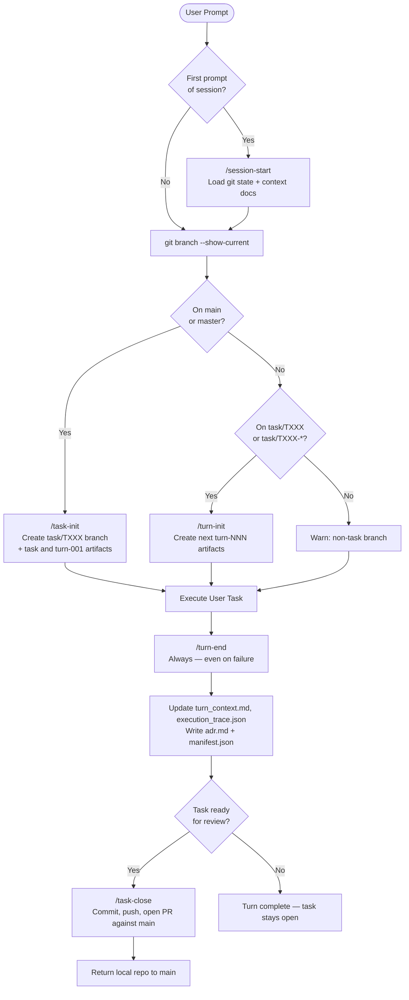

# coding-agents-config

Agentic pipeline configuration for Claude Code (and Codex via `AGENTS.md`). Provides the App Factory SDLC skill set, a task/turn execution protocol with provenance tracking, branch protection, and governance rules.

## Setup

### 1. Clone the repo

```sh
git clone <repo-url> ~/coding-agents-config
```

### 2. Create symlinks (automated)

Run the setup script — it creates all symlinks and backs up any existing files:

```sh
bash scripts/setup.sh
```

The script is idempotent and links three groups of targets:

<details>
<summary>Manual symlink commands</summary>

**`~/.claude/`** (Claude Code):

```sh
ln -s ~/coding-agents-config/skills      ~/.claude/skills
ln -s ~/coding-agents-config/agents      ~/.claude/agents
ln -s ~/coding-agents-config/hooks       ~/.claude/hooks
ln -s ~/coding-agents-config/scripts     ~/.claude/scripts
ln -s ~/coding-agents-config/CLAUDE.md   ~/.claude/CLAUDE.md
ln -s ~/coding-agents-config/settings.json ~/.claude/settings.json
```

`rules/`, `context/`, and `plugins/` are also linked into `~/.claude/` if/when those directories exist in this repo.

**`~/.codex/`** (Codex):

```sh
ln -s ~/coding-agents-config/agents    ~/.codex/agents
ln -s ~/coding-agents-config/AGENTS.md ~/.codex/AGENTS.md
```

**Repo-local `./.claude/`**:

```sh
ln -s ~/coding-agents-config/CLAUDE.md ./.claude/CLAUDE.md
```

If any target already exists, `setup.sh` backs it up first (`mv <target> <target>.bak`).
</details>

### 3. Verify

```sh
ls -la ~/.claude/skills        # should point to ~/coding-agents-config/skills
ls -la ~/.claude/agents        # should point to ~/coding-agents-config/agents
ls -la ~/.claude/hooks         # should point to ~/coding-agents-config/hooks
ls -la ~/.claude/CLAUDE.md     # should point to ~/coding-agents-config/CLAUDE.md
ls -la ~/.claude/settings.json # should point to ~/coding-agents-config/settings.json
ls -la ~/.codex/AGENTS.md      # should point to ~/coding-agents-config/AGENTS.md
```

## Structure

```
coding-agents-config/
├── CLAUDE.md           # Global instructions — task/turn protocol, branch rules
├── AGENTS.md           # Codex loader directive (loads CLAUDE.md)
├── settings.json       # Claude Code settings (model, permissions, hooks, plugins)
├── package.json        # Plugin dependencies (caveman)
├── agents/             # Specialized subagent definitions
│   └── agent-architecture-planner.md
├── hooks/              # Shell hooks triggered by Claude Code events
│   └── branch-guard.sh # Auto-creates a task branch when on main/master
├── scripts/            # Shared automation scripts
│   ├── setup.sh        # Symlink installer
│   └── af-state.sh     # AppFactory state.yaml helpers (used by af-* skills)
├── skills/             # Slash-command skills
│   ├── session-start/  # Session bootstrap — loads git state + context docs
│   ├── task-init/      # Create task/TXXX branch + task & turn-001 artifacts
│   ├── turn-init/      # Create the next turn-NNN artifacts
│   ├── turn-end/       # Finalize a turn (ADR, manifest, trace)
│   ├── task-close/     # Push the task branch and open a PR against main
│   ├── branch-guard/   # Guard against edits on main/master
│   ├── af-*/           # App Factory SDLC skills (PRD, DDD, plan, implementation, ...)
│   ├── .nestjs/        # NestJS/Prisma scaffolding skills
│   ├── .system/        # Meta-skills (skill-creator, skill-installer, plugin-creator, ...)
│   ├── dsl-utils/, ui-utils/, e2e-tests/, unit-tests/, eval-labeler/
│   └── ...
├── .appfactory/        # Task/turn tracking, specs, prompts, memory
│   ├── changelog.md     # Turn-by-turn change history
│   ├── tasks_index.csv  # Registry of all tasks (id, branch, status, PR)
│   ├── tasks/task-XXX/  # Task artifacts + turns/turn-XXX/ artifacts
│   ├── specs/           # Specifications (DSL, DDD, PRD outputs)
│   ├── prompts/         # Prompt drafts and planning notes
│   └── memory/          # AppFactory pipeline state (state.yaml)
├── archive/            # Retired skills and templates kept for reference
├── docs/               # Reference documentation (skill summary, migration notes)
└── .github/            # Issue and pull request templates
```

## Execution Flow

The agentic pipeline enforces a strict task/turn workflow for all coding tasks:


```mermaid
flowchart TB
    START([User Prompt]) --> FIRST{First prompt<br/>of session?}
    FIRST -->|Yes| SESSION_START["/session-start<br/>Load git state + context docs"]
    FIRST -->|No| BRANCH_CHECK
    SESSION_START --> BRANCH_CHECK["git branch --show-current"]

    BRANCH_CHECK --> IS_MAIN{On main<br/>or master?}
    IS_MAIN -->|Yes| TASK_INIT["/task-init<br/>Create task/TXXX branch<br/>+ task and turn-001 artifacts"]
    IS_MAIN -->|No| IS_TASK{On task/TXXX<br/>or task/TXXX-*?}
    IS_TASK -->|Yes| TURN_INIT["/turn-init<br/>Create next turn-NNN artifacts"]
    IS_TASK -->|No| WARN["Warn: non-task branch"]

    TASK_INIT --> EXEC["Execute User Task"]
    TURN_INIT --> EXEC
    WARN --> EXEC

    EXEC --> TURN_END["/turn-end<br/>Always — even on failure"]
    TURN_END --> ARTIFACTS["Update turn_context.md, execution_trace.json<br/>Write adr.md + manifest.json"]
    ARTIFACTS --> READY{Task ready<br/>for review?}
    READY -->|Yes| TASK_CLOSE["/task-close<br/>Commit, push, open PR against main"]
    READY -->|No| DONE["Turn complete — task stays open"]
    TASK_CLOSE --> RETURN["Return local repo to main"]
```

### Task/Turn Protocol Summary

| Phase | Trigger | Skill | Outputs |
|-------|---------|-------|---------|
| **Session Start** | First prompt of session | `session-start` | Git state + governance/ADR/tech-standards/turn-tracking context loaded |
| **Task Init** | On `main`/`master` | `task-init` | New `task/TXXX` branch, `task_context.md`, `task_status.json`, `task_summary.md`, `pull_request.md`, `turn-001/` |
| **Turn Init** | On `task/TXXX[-*]` | `turn-init` | Next `turn-NNN/` with `turn_context.md`, `execution_trace.json` |
| **Execution** | Always | — | User request executed |
| **Turn End** | After every prompt, even on failure | `turn-end` | Updated `turn_context.md` and `execution_trace.json`, new `adr.md`, `manifest.json` |
| **Task Close** | Task ready for review | `task-close` | Commit, push, PR against `main`, local branch returns to `main` |

## Skills

### Lifecycle (Task/Turn Protocol)

| Skill | Description |
|-------|-------------|
| `session-start` | Load repository state and core pipeline context at the start of every session |
| `task-init` | Initialize a new `task/TXXX` branch and create task + turn-001 artifacts (run on `main`/`master`) |
| `turn-init` | Initialize the next turn within the active task branch |
| `turn-end` | Finalize the active turn — update context/trace, write ADR and manifest |
| `task-close` | Finalize the task branch, push it, and open a pull request against `main` |
| `branch-guard` | Auto-create a task branch when currently on `main`/`master` |

### App Factory SDLC (`af-*`)

| Skill | Description |
|-------|-------------|
| `af-orchestrator` | Orchestrate the App Factory software development lifecycle end to end |
| `af-project-init` | Orchestrate AppFactory project initialization (env vars + helper script) |
| `af-be-prd-build` | Build a business-facing backend PRD from an intake worksheet or discovery notes |
| `af-be-ddd-orchestrator` | Orchestrate the backend DDD build → analyze → refactor → test loop |
| `af-be-ddd-build` | Generate a backend Domain-Driven Design document from an approved PRD |
| `af-be-ddd-analysis` | Audit a DDD specification for quality, completeness, and PRD alignment |
| `af-be-ddd-refactor` | Apply targeted patches to a DDD spec based on `af-be-ddd-analysis` findings |
| `af-be-ddd-tests` (`af-ddd-tests`) | Generate Gherkin-style BDD feature files from DDD and PRD specs |
| `af-be-ddd-dsl` | Generate a backend DSL YAML document from a DDD document |
| `af-be-plan` | Generate a backend execution plan from a domain DSL and tech stack profile |
| `af-be-implementation` | Generate backend application code from the execution plan and BDD feature specs |
| `af-app-check` | Audit an application for production readiness (security, database, deployment, code quality) |
| `af-memory` | CRUD operations on `.appfactory/memory/state.yaml` pipeline state |

### NestJS / Prisma Scaffolding (`skills/.nestjs/`)

| Skill | Description |
|-------|-------------|
| `app-from-dsl` | Orchestrate full-stack application generation from app-dsl YAML specifications |
| `nestjs-crud-resource` | Generate a NestJS CRUD module (controller, service, DTOs) from a DSL backend spec |
| `nestjs-prisma-resource` | Generate a complete NestJS CRUD resource backed by Prisma from an input schema |
| `nestjs-customer-crud-scaffold` | Scaffold a NestJS customer CRUD app via a non-interactive Nest CLI wrapper |
| `nestjs-observability` | Add structured logging, correlation IDs, redaction, and Prisma query logging to a NestJS backend |
| `field-mapper-generator` | Generate field mapper/converter utilities from DSL mapper specifications |
| `prisma-guidelines` | Prisma schema, seed, and configuration development guidelines |
| `prisma-persistence` | Generate Prisma schema and migrations from a DSL persistence model |

### DSL, UI & Testing Utilities

| Skill | Description |
|-------|-------------|
| `dsl-model-interpreter` | Parse and validate app-dsl YAML specifications (models, mappers, pages, backends, lookups) |
| `ui-implementation-language` | Declarative YAML standard for UI pages, layouts, widgets, forms, and bindings |
| `http-test-artifacts` | Generate `.http` request files for API endpoint testing |
| `test-implementation-sync` | Keep unit tests synchronized with service/DTO implementations |

### Evaluation

| Skill | Description |
|-------|-------------|
| `eval-labeler` | Process `Eval.md` files to label and score Response A vs Response B coding-task runs |

### Meta-Skills (`skills/.system/`)

| Skill | Description |
|-------|-------------|
| `skill-creator` | Guide for creating or updating skills |
| `skill-installer` | Install skills from a curated list or a GitHub repo |
| `plugin-creator` | Scaffold plugin directories with `.codex-plugin/plugin.json` |
| `imagegen` | Generate or edit raster image assets |
| `openai-docs` | Look up OpenAI API/model documentation with citations |

## Templates

Templates now live alongside the skills that use them, e.g.:

| Template | Used by |
|----------|---------|
| `skills/task-init/templates/task_context.md` | `task-init` |
| `skills/turn-init/templates/turn_context.md` | `turn-init`, `task-init` |
| `skills/af-be-prd-build/templates/prd-template.md` | `af-be-prd-build` |
| `skills/af-be-ddd-build/templates/ddd-template.md` | `af-be-ddd-build` |
| `skills/af-be-ddd-dsl/templates/domain-dsl-template.yaml` | `af-be-ddd-dsl` |
| `skills/af-be-plan/templates/execution-plan-template.md` | `af-be-plan` |
| `skills/af-be-ddd-tests/templates/feature-template.gherkin`, `gherkin-spec-template.md` | `af-be-ddd-tests` |
| `skills/af-be-implementation/templates/implementation-manifest-template.yaml` | `af-be-implementation` |
| `skills/af-project-init/templates/gitignore.template` | `af-project-init` |

Older repo-wide templates (`adr_template.md`, `pull_request_template.md`, `tech-stack.template.md`) are preserved under `archive/templates/` for reference.

## Hooks

| Hook | Trigger | Purpose |
|------|---------|---------|
| `branch-guard.sh` | `PreToolUse(Bash)` | Auto-create a `task/TXXX` branch when the current branch is `main` or `master` |

## Adding a new skill

Each skill lives in its own directory under `skills/` with a `SKILL.md` file:

```
skills/my-skill/
└── SKILL.md
```

The `skills/.system/skill-creator` meta-skill can guide you through creating one — invoke it from Claude Code.

## Syncing across machines

Since this is a standard git repo, pull on any machine to stay current:

```sh
cd ~/coding-agents-config && git pull
```

The symlinks mean changes are picked up immediately — no reinstall needed.
