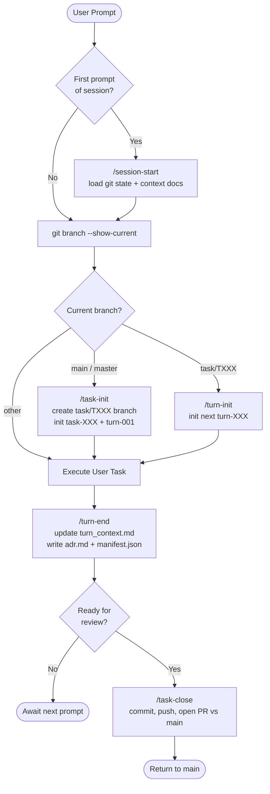

# coding-agents-config

Agentic pipeline configuration for Claude Code (and Codex). Enforces a
task/turn-based workflow with provenance tracking, branch protection, and
governance rules, plus a library of AppFactory backend-generation and
NestJS/Prisma scaffolding skills.

## Setup

### 1. Clone the repo

```sh
git clone <repo-url> ~/coding-agents-config
```

### 2. Create symlinks (automated)

Run the setup script — it creates all symlinks and backs up any existing files:

```sh
bash scripts/setup.sh
```

This links the following into `~/.claude/`: `skills`, `agents`, `hooks`,
`scripts`, `CLAUDE.md`, `settings.json` (the script also attempts `rules`,
`context`, and `plugins`, which are reserved for future use and may not
exist in this repo yet). Into `~/.codex/`: `agents`, `AGENTS.md`. Into the
repo-local `./.claude/`: `CLAUDE.md`.

<details>
<summary>Manual symlink commands</summary>

```sh
ln -s ~/coding-agents-config/skills    ~/.claude/skills
ln -s ~/coding-agents-config/agents    ~/.claude/agents
ln -s ~/coding-agents-config/hooks     ~/.claude/hooks
ln -s ~/coding-agents-config/scripts   ~/.claude/scripts
ln -s ~/coding-agents-config/CLAUDE.md ~/.claude/CLAUDE.md
ln -s ~/coding-agents-config/settings.json ~/.claude/settings.json

ln -s ~/coding-agents-config/agents    ~/.codex/agents
ln -s ~/coding-agents-config/AGENTS.md ~/.codex/AGENTS.md
```

If any of these already exist, back them up first (`mv <target> <target>.bak`).
</details>

### 3. Verify

```sh
ls -la ~/.claude/skills        # should point to ~/coding-agents-config/skills
ls -la ~/.claude/agents        # should point to ~/coding-agents-config/agents
ls -la ~/.claude/hooks         # should point to ~/coding-agents-config/hooks
ls -la ~/.claude/scripts       # should point to ~/coding-agents-config/scripts
ls -la ~/.claude/CLAUDE.md     # should point to ~/coding-agents-config/CLAUDE.md
ls -la ~/.claude/settings.json # should point to ~/coding-agents-config/settings.json
```

## Structure

```
coding-agents-config/
├── CLAUDE.md           # Global instructions — task/turn protocol, branch rules
├── AGENTS.md           # Codex loader directive (points at ~/.claude/CLAUDE.md)
├── settings.json       # Claude Code settings (model, permissions, hooks, plugins)
├── package.json
├── agents/             # Standalone agent reference docs
│   └── agent-architecture-planner.md
├── docs/               # AppFactory plan, migration guides, tech-stack docs
├── hooks/
│   └── branch-guard.sh # PreToolUse hook: auto-creates task/TXXX off main/master
├── scripts/
│   ├── setup.sh        # Installs symlinks into ~/.claude and ~/.codex
│   └── af-state.sh     # Bash helpers for .appfactory/state.yaml
├── skills/             # 37 skills across 24 top-level packs
│   ├── .system/        # Meta-skills (skill-creator, skill-installer, imagegen, ...)
│   ├── .nestjs/        # NestJS/Prisma backend scaffolding skills
│   ├── session-start/, task-init/, turn-init/, turn-end/, task-close/, branch-guard/
│   ├── af-*/           # AppFactory backend pipeline (PRD → DDD → DSL → plan → impl → check)
│   ├── dsl-utils/, ui-utils/, unit-tests/, e2e-tests/, eval-labeler/
│   └── ...
├── archive/            # Deprecated skills and historical turn records (reference only)
├── .appfactory/
│   ├── tasks/          # task-XXX/ directories, each with turns/turn-XXX/
│   ├── tasks_index.csv # Registry of tasks (branch, status, PR url, turn count)
│   ├── specs/          # Specifications
│   ├── prompts/        # Prompt drafts and notes
│   └── memory/         # AppFactory pipeline state (state.yaml)
└── .github/
    └── PULL_REQUEST_TEMPLATE.md
```

## Execution Flow

The agentic pipeline enforces a task/turn-based workflow for all coding tasks:


```mermaid
flowchart TB
    START([User Prompt]) --> SS{First prompt<br/>of session?}
    SS -->|Yes| SESSION_START["/session-start<br/>load git state + context docs"]
    SS -->|No| BRANCH_CHECK
    SESSION_START --> BRANCH_CHECK["git branch --show-current"]

    BRANCH_CHECK --> IS_MAIN{Current branch?}
    IS_MAIN -->|main / master| TASK_INIT["/task-init<br/>create task/TXXX branch<br/>init task-XXX + turn-001"]
    IS_MAIN -->|task/TXXX| TURN_INIT["/turn-init<br/>init next turn-XXX"]
    IS_MAIN -->|other| EXEC

    TASK_INIT --> EXEC["Execute User Task"]
    TURN_INIT --> EXEC

    EXEC --> TURN_END["/turn-end<br/>update turn_context.md<br/>write adr.md + manifest.json"]
    TURN_END --> READY{Ready for<br/>review?}
    READY -->|No| DONE([Await next prompt])
    READY -->|Yes| TASK_CLOSE["/task-close<br/>commit, push, open PR vs main"]
    TASK_CLOSE --> MAIN([Return to main])
```

As a safety net, `hooks/branch-guard.sh` runs on `PreToolUse` for write/bash
tools: if it sees the active branch is `main` or `master`, it auto-creates
the next `task/TXXX` branch before the tool executes.

### Turn Protocol Summary

| Phase | Trigger | Skill | Outputs |
|-------|---------|-------|---------|
| **Session Start** | First prompt of session | `/session-start` | Git state + context docs loaded |
| **Task Init** | On `main`/`master` | `/task-init` | New `task/TXXX` branch, `task-XXX/` dir, `turn-001` |
| **Turn Init** | On `task/TXXX` | `/turn-init` | Next `turn-XXX/` dir, `turn_context.md`, `execution_trace.json` |
| **Execution** | — | (user task) | Modified files |
| **Turn End** | After every prompt, even on failure | `/turn-end` | Updated `turn_context.md`, `adr.md`, `manifest.json` |
| **Task Close** | When task is ready for review | `/task-close` | Commit, push, PR vs `main`, return to `main` |

## Skills (37 across 24 packs)

### Lifecycle

| Skill | Description |
|-------|-------------|
| `session-start` | Load repository state and core pipeline context at session start |
| `task-init` | Initialize a new task branch and create task + turn-001 artifacts (run on main/master) |
| `turn-init` | Initialize the next turn within the active task branch |
| `turn-end` | Finalize the active turn — update context, write ADR + manifest |
| `task-close` | Finalize the active task branch, push it, and open a PR against main |
| `branch-guard` | Create a turn-scoped branch if on main/master |

### AppFactory Backend Pipeline (`af-*`)

| Skill | Description |
|-------|-------------|
| `af-orchestrator` | Orchestrates the App Factory software development lifecycle |
| `af-project-init` | Export required env vars and invoke project-init helper scripts |
| `af-be-prd-build` | Build a business-facing backend PRD from a worksheet, questionnaire, or discovery notes |
| `af-be-ddd-orchestrator` | Orchestrate the backend DDD workflow through build, analyze, refactor loop, and test phases |
| `af-be-ddd-build` | Generate a human-readable backend DDD document from an approved PRD |
| `af-be-ddd-analysis` | Audit a DDD spec for quality, completeness, and PRD alignment |
| `af-be-ddd-refactor` | Apply `af-be-ddd-analysis` findings to patch the DDD spec |
| `af-be-ddd-tests` | Generate Gherkin-style BDD scenarios from the DDD and PRD specs |
| `af-be-plan` | Generate a backend execution plan from a domain DSL YAML and tech stack profile |
| `af-be-ddd-dsl` | Convert a DDD document into a backend DSL YAML for planning/codegen |
| `af-be-implementation` | Generate backend code from the execution plan and BDD specs using a tech stack scaffold |
| `af-app-check` | Audit an application for production readiness (security, database, deployment, code quality) |
| `af-memory` | CRUD operations on `.appfactory/state.yaml` to track pipeline progress across skills |

### NestJS / Prisma Backend Stack (`.nestjs/`)

| Skill | Description |
|-------|-------------|
| `app-from-dsl` | Orchestrate full-stack application generation from app-dsl YAML specs |
| `nestjs-crud-resource` | Generate a NestJS CRUD module (controller, service, DTOs) from a DSL backend spec |
| `nestjs-prisma-resource` | Generate a complete NestJS CRUD resource backed by Prisma from an input schema |
| `nestjs-customer-crud-scaffold` | Scaffold a NestJS customer CRUD app via a non-interactive Nest CLI wrapper |
| `nestjs-observability` | Add structured request/error/query logging, correlation IDs, redaction, and log levels to a Prisma-backed NestJS app |
| `field-mapper-generator` | Generate field mapper/converter utilities between UI, API, and persistence layers |
| `prisma-guidelines` | Prisma ORM development guidelines and common-mistake reference |
| `prisma-persistence` | Generate a Prisma schema and migrations from a DSL persistence model |

### DSL, UI & Test Utilities

| Skill | Description |
|-------|-------------|
| `dsl-model-interpreter` (`dsl-utils/`) | Parse and validate app-dsl YAML specs before code generation |
| `ui-implementation-language` (`ui-utils/`) | Declarative, framework-neutral YAML standard for UI pages, forms, and state bindings |
| `test-implementation-sync` (`unit-tests/`) | Keep unit tests synchronized with service/DTO implementations |
| `http-test-artifacts` (`e2e-tests/`) | Generate `.http` request files for REST client testing of API endpoints |

### Evaluation

| Skill | Description |
|-------|-------------|
| `eval-labeler` | Label and score `Eval.md` files comparing two model responses |

### Meta-Skills (`.system/`)

| Skill | Description |
|-------|-------------|
| `skill-creator` | Guide for creating or updating skills |
| `skill-installer` | Install skills into `$CODEX_HOME/skills` from a curated list or GitHub repo |
| `plugin-creator` | Scaffold Codex plugin directories with a `.codex-plugin/plugin.json` manifest |
| `imagegen` | Generate or edit raster image assets |
| `openai-docs` | Reference for OpenAI APIs/docs, model selection, and upgrade guidance |

## Templates

There is no top-level `templates/` directory — templates live alongside the
skills that use them:

| Location | Templates |
|----------|-----------|
| `skills/task-init/templates/` | `task_context.md`, `turn_context.md` |
| `skills/turn-init/templates/` | `turn_context.md` |
| `skills/af-be-prd-build/templates/` | `prd-template.md` |
| `skills/af-be-ddd-build/templates/` | `ddd-template.md` |
| `skills/af-be-ddd-tests/templates/` | `feature-template.gherkin`, `gherkin-spec-template.md` |
| `skills/af-be-ddd-dsl/templates/` | `domain-dsl-template.yaml` |
| `skills/af-be-plan/templates/` | `execution-plan-template.md` |
| `skills/af-be-implementation/templates/` | `implementation-manifest-template.yaml` |
| `skills/af-project-init/templates/` | `README.md`, `gitignore.template` |
| `skills/.nestjs/nestjs-observability/templates/` | `prisma-observability-refactor-prompt.md` |

## Documentation (`docs/`)

| File | Purpose |
|------|---------|
| `skill-summary.md` | AppFactory skill phases, invocation order, and orchestration map |
| `appFactory-plan.md` | AppFactory strategy and architecture |
| `migration-ai-to-appfactory.md`, `ai-to-appfactory-migration-analysis.md` | Migration guides from the legacy AI workflow to AppFactory |
| `app-nextjs-nestjs-prisma.md` | Next.js + NestJS + Prisma tech-stack integration guide |

## Agents

- `AGENTS.md` — one-line Codex loader directive: read and load `~/.claude/CLAUDE.md`.
- `agents/agent-architecture-planner.md` — reference notes for planning multi-agent architectures.

## Task/Turn Tracking (`.appfactory/`)

- `tasks/task-XXX/` — one directory per task branch (`task/TXXX`), containing
  `task_context.md`, `task_status.json`, `task_summary.md`, `pull_request.md`,
  and a `turns/turn-XXX/` directory per turn (`turn_context.md`,
  `execution_trace.json`, `adr.md`, `manifest.json`).
- `tasks_index.csv` — registry of all tasks: branch, status, created/closed
  timestamps, PR url, and turn count.
- `specs/`, `prompts/`, `memory/` — specifications, prompt drafts, and
  pipeline state (`state.yaml`) shared across skills.

## Archive

`archive/` holds deprecated skills (earlier versions of NestJS/DSL/testing
skills now superseded by `skills/`) and `legacy-turns/`, a record of turn
executions from before the current task/turn model. Kept for historical
reference only — do not build on it.

## Hooks

| Hook | Trigger | Purpose |
|------|---------|---------|
| `branch-guard.sh` | `PreToolUse` (write/bash tools) | If on `main`/`master`, auto-create and switch to the next `task/TXXX` branch before the tool runs |

## Adding a new skill

Each skill lives in its own directory under `skills/` with a `SKILL.md` file:

```
skills/my-skill/
└── SKILL.md
```

The `.system/skill-creator` meta-skill can guide you through creating one — invoke it from Claude Code.

## Syncing across machines

Since this is a standard git repo, pull on any machine to stay current:

```sh
cd ~/coding-agents-config && git pull
```

The symlinks mean changes are picked up immediately — no reinstall needed.
