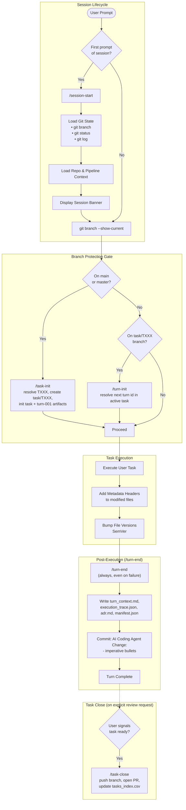

# coding-agents-config

Agentic pipeline configuration for Claude Code. Enforces a turn-based workflow with provenance tracking, branch protection, and governance rules for App Factory (AF) projects — DDD-driven backend generation, DSL modeling, and CRUD scaffolding.

## Setup

### 1. Clone the repo

```sh
git clone <repo-url> ~/coding-agents-config
```

### 2. Create symlinks (automated)

Run the setup script — it links skills, agents, hooks, scripts, plugins, and config into `~/.claude/`, links `agents`/`AGENTS.md` into `~/.codex/`, and links `CLAUDE.md` into a repo-local `./.claude/`, backing up any existing files:

```sh
bash scripts/setup.sh
```

<details>
<summary>Manual symlink commands</summary>

```sh
ln -s ~/coding-agents-config/skills ~/.claude/skills
ln -s ~/coding-agents-config/agents ~/.claude/agents
ln -s ~/coding-agents-config/hooks ~/.claude/hooks
ln -s ~/coding-agents-config/scripts ~/.claude/scripts
ln -s ~/coding-agents-config/CLAUDE.md ~/.claude/CLAUDE.md
ln -s ~/coding-agents-config/settings.json ~/.claude/settings.json

ln -s ~/coding-agents-config/agents ~/.codex/agents
ln -s ~/coding-agents-config/AGENTS.md ~/.codex/AGENTS.md
```

If any of these already exist, back them up first (`mv <target> <target>.bak`).
</details>

### 3. Verify

```sh
ls -la ~/.claude/skills        # should point to ~/coding-agents-config/skills
ls -la ~/.claude/agents        # should point to ~/coding-agents-config/agents
ls -la ~/.claude/hooks         # should point to ~/coding-agents-config/hooks
ls -la ~/.claude/CLAUDE.md     # should point to ~/coding-agents-config/CLAUDE.md
ls -la ~/.claude/settings.json # should point to ~/coding-agents-config/settings.json
```

## Structure

```
coding-agents-config/
├── CLAUDE.md           # Global instructions — turn protocol, branch rules
├── AGENTS.md           # Codex loader directive (reads ~/.claude/CLAUDE.md)
├── settings.json       # Claude Code settings (model, permissions, hooks, plugins)
├── package.json         # Marketplace plugin dependency (caveman)
├── agents/              # Subagent definitions
│   └── agent-architecture-planner.md
├── hooks/                # Shell hooks triggered by Claude Code events
│   └── branch-guard.sh   # Auto-creates a task branch when on main/master
├── skills/               # Slash-command skills (turn protocol + App Factory pipeline)
├── scripts/               # Automation scripts
│   ├── setup.sh           # Installs symlinks into ~/.claude and ~/.codex
│   └── af-state.sh        # App Factory state.yaml helpers, sourced by af-* skills
├── .appfactory/           # Task/turn tracking and specs for this repo's own work
│   ├── tasks/              # Task branches with turns (task_context.md, adr.md, manifest.json, ...)
│   ├── tasks_index.csv     # Registry of tasks and PR links
│   ├── specs/               # Specifications
│   ├── prompts/              # Prompt templates
│   └── memory/                # Project memory
├── archive/               # Retired/superseded skills and legacy turn history
├── docs/                   # Reference documentation (AppFactory plan, migration notes)
└── .github/                 # Issue and PR templates
```

## Execution Flow

The agentic pipeline enforces a strict turn-based workflow for all coding tasks:


```mermaid
flowchart TB
    subgraph SESSION["Session Lifecycle"]
        START([User Prompt]) --> SS{First prompt<br/>of session?}
        SS -->|Yes| SESSION_START["/session-start"]
        SS -->|No| BRANCH_CHECK

        SESSION_START --> LOAD_GIT["Load Git State<br/>• git branch<br/>• git status<br/>• git log"]
        LOAD_GIT --> LOAD_CTX["Load Repo & Pipeline Context"]
        LOAD_CTX --> BANNER["Display Session Banner"]
        BANNER --> BRANCH_CHECK
    end

    subgraph BRANCH_GATE["Branch Protection Gate"]
        BRANCH_CHECK["git branch --show-current"] --> IS_MAIN{On main<br/>or master?}
        IS_MAIN -->|Yes| TASK_INIT["/task-init<br/>resolve TXXX, create task/TXXX,<br/>init task + turn-001 artifacts"]
        IS_MAIN -->|No| IS_TASK{On task/TXXX<br/>branch?}
        IS_TASK -->|Yes| TURN_INIT["/turn-init<br/>resolve next turn id in active task"]
        IS_TASK -->|No| PROCEED
        TASK_INIT --> PROCEED["Proceed"]
        TURN_INIT --> PROCEED
    end

    subgraph EXECUTION["Task Execution"]
        PROCEED --> EXEC["Execute User Task"]
        EXEC --> ADD_HEADERS["Add Metadata Headers<br/>to modified files"]
        ADD_HEADERS --> BUMP_VERSION["Bump File Versions<br/>SemVer"]
    end

    subgraph POST_EXEC["Post-Execution (/turn-end)"]
        BUMP_VERSION --> TURN_END["/turn-end<br/>(always, even on failure)"]
        TURN_END --> WRITE_ARTIFACTS["Write turn_context.md,<br/>execution_trace.json, adr.md, manifest.json"]
        WRITE_ARTIFACTS --> COMMIT["Commit: AI Coding Agent Change:<br/>- imperative bullets"]
        COMMIT --> COMPLETE["Turn Complete"]
    end

    subgraph TASK_CLOSE["Task Close (on explicit review request)"]
        COMPLETE -.-> READY{User signals<br/>task ready?}
        READY -->|Yes| TASK_CLOSE_SKILL["/task-close<br/>push branch, open PR,<br/>update tasks_index.csv"]
    end
```

### Turn Protocol Summary

| Phase | Trigger | Steps | Outputs |
|-------|---------|-------|---------|
| **Session Start** | First prompt of session | `/session-start` — load git state and repo/pipeline context | Context loaded |
| **Task Init** | Current branch is `main`/`master` | `/task-init` — resolve next `TXXX`, create `task/TXXX`, init task + `turn-001` | `.appfactory/tasks/task-XXX/*`, row in `tasks_index.csv` |
| **Turn Init** | Current branch is `task/TXXX` | `/turn-init` — resolve next turn id in the active task | `turns/turn-XXX/*` scaffolding |
| **Execution** | Every coding prompt | Execute the user's request | Modified files |
| **Turn End** | After every execution, even on failure | `/turn-end` — write required turn artifacts, commit | `turn_context.md`, `execution_trace.json`, `adr.md`, `manifest.json` |
| **Task Close** | User signals task is ready for review | `/task-close` — push branch, open PR | `pull_request.md`, updated `tasks_index.csv` |

**Hard gate:** code is never written while on `main`/`master`; `/task-init` must succeed first. `hooks/branch-guard.sh` enforces this automatically by creating a `task/TXXX` branch on any write or Bash tool call made from `main`/`master`.

## Skills

Skills live under `skills/<name>/SKILL.md`. A few directories (`dsl-utils/`, `e2e-tests/`, `ui-utils/`, `unit-tests/`) are category folders that group one or more nested skills rather than being skills themselves.

### Turn Protocol

| Skill | Description |
|-------|-------------|
| `session-start` | Load repository state and core pipeline context; run at the start of every session |
| `task-init` | Initialize a new task branch and create task + `turn-001` artifacts; run when on `main`/`master` |
| `turn-init` | Initialize the next turn within the active task branch |
| `turn-end` | Finalize the active turn after execution — updates context, writes ADR/manifest, commits — run after every prompt, even on failure |
| `task-close` | Finalize the active task branch, push it, and open a pull request against main |
| `branch-guard` | Check current branch and create a turn-scoped branch if on `main`/`master` (model-invocation disabled; also runs as a hook) |

### App Factory (`af-*`) — DDD backend pipeline

| Skill | Description |
|-------|-------------|
| `af-orchestrator` | Orchestrates the App Factory software development lifecycle end to end |
| `af-project-init` | Orchestrates AppFactory project initialization (env vars + helper script) |
| `af-app-check` | Audits an application for production readiness (security, database, deployment, code quality) |
| `af-be-prd-build` | Builds a business-facing backend PRD from an intake worksheet/questionnaire |
| `af-be-ddd-orchestrator` | Orchestrates the backend DDD workflow: build → analyze → refactor loop → test |
| `af-be-ddd-build` | Generates a backend Domain-Driven Design document from an approved PRD |
| `af-be-ddd-analysis` | Audits a generated DDD spec for quality, completeness, and PRD alignment |
| `af-be-ddd-refactor` | Applies targeted patches to a DDD spec based on `af-be-ddd-analysis` findings |
| `af-be-ddd-dsl` | Generates a backend application DSL YAML from a DDD document |
| `af-be-ddd-tests` | Generates Gherkin-style BDD scenarios from DDD and PRD specs |
| `af-be-plan` | Generates a backend execution plan from a DSL YAML and tech-stack profile |
| `af-be-implementation` | Executes backend generation: copies a tech-stack implementation and generates domain code from the plan and BDD specs |
| `af-memory` | CRUD operations on `.appfactory/memory/state.yaml` for pipeline state tracking |

### Scaffolding / Utility (category folders)

| Category | Nested skill | Description |
|----------|--------------|-------------|
| `dsl-utils/` | `dsl-model-interpreter` | Parses and validates app-dsl YAML specifications before code generation |
| `e2e-tests/` | `http-test-artifacts` | Generates `.http` request files for REST endpoint testing |
| `ui-utils/` | `ui-implementation-language` | Declarative YAML language for framework-neutral UI page/layout/widget definitions |
| `unit-tests/` | `test-implementation-sync` | Keeps unit tests synchronized with actual service/DTO implementations |

### Other

| Skill | Description |
|-------|-------------|
| `eval-labeler` | Processes `Eval.md` files to label and compare model responses (Response A vs B) for coding tasks |

## Agents

Subagents live under `agents/<name>.md` and are available to Claude Code and Codex.

| Agent | Description |
|-------|-------------|
| `agent-architecture-planner` | Reads PRD, DDD, DSL, and repo structure to produce spec-gap matrices, architecture/module/event maps, and phased implementation plans for downstream coding agents |

## Scripts

| Script | Purpose |
|--------|---------|
| `scripts/setup.sh` | Symlinks `skills`, `agents`, `hooks`, `scripts`, `plugins`, `CLAUDE.md`, `settings.json` into `~/.claude/`; `agents`/`AGENTS.md` into `~/.codex/`; `CLAUDE.md` into repo-local `./.claude/` |
| `scripts/af-state.sh` | Helper functions (sourced by `af-*` skills) for reading/writing `.appfactory/memory/state.yaml` |

## Hooks

| Hook | Trigger | Purpose |
|------|---------|---------|
| `branch-guard.sh` | `PreToolUse` (Bash/write tools) | Auto-creates the next `task/TXXX` branch when a tool is invoked on `main`/`master` |

## Archive

`archive/` holds skills and turn history superseded by the current `af-*` pipeline (e.g. `schema-to-database`, `nestjs-crud-resource`, `react-form-page`, `project-init`, `legacy-turns/`) plus `find-skills` and `shadcn`, symlinked in from `.agents/skills/`. Kept for reference; not part of the active skill set.

## Configuration (`settings.json`)

Sets the default model, Bash/Read permission allow/deny/ask lists, the `branch-guard.sh` `PreToolUse` hook, the status line command, and enabled marketplace plugins (`document-skills`, `example-skills`, `caveman`).

## Adding a new skill

Each skill lives in its own directory under `skills/` with a `SKILL.md` file:

```
skills/my-skill/
└── SKILL.md
```

## Syncing across machines

Since this is a standard git repo, pull on any machine to stay current:

```sh
cd ~/coding-agents-config && git pull
```

The symlinks mean changes are picked up immediately — no reinstall needed.
