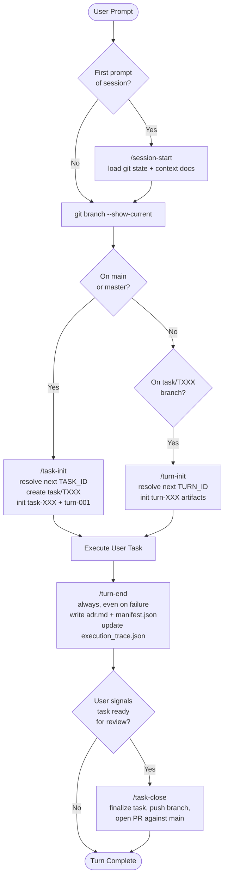

# coding-agents-config

Agentic pipeline configuration for Claude Code (and Codex). Enforces a
task/turn-based workflow with provenance tracking, branch protection, and
governance rules, plus the **App Factory** skill set for DSL-driven
Domain-Driven Design and backend code generation.

## Setup

### 1. Clone the repo

```sh
git clone <repo-url> ~/coding-agents-config
```

### 2. Create symlinks (automated)

Run the setup script — it creates all symlinks and backs up any existing files:

```sh
bash scripts/setup.sh
```

This links the following into `~/.claude/`: `skills`, `agents`, `hooks`,
`scripts`, `CLAUDE.md`, `settings.json` (plus `rules`, `context`, `plugins`
if present). It also links `agents` and `AGENTS.md` into `~/.codex/`, and
`CLAUDE.md` into a repo-local `./.claude/`.

<details>
<summary>Manual symlink commands</summary>

```sh
ln -s ~/coding-agents-config/skills ~/.claude/skills
ln -s ~/coding-agents-config/agents ~/.claude/agents
ln -s ~/coding-agents-config/hooks ~/.claude/hooks
ln -s ~/coding-agents-config/scripts ~/.claude/scripts
ln -s ~/coding-agents-config/CLAUDE.md ~/.claude/CLAUDE.md
ln -s ~/coding-agents-config/settings.json ~/.claude/settings.json

ln -s ~/coding-agents-config/agents ~/.codex/agents
ln -s ~/coding-agents-config/AGENTS.md ~/.codex/AGENTS.md
```

If any of these already exist, back them up first (`mv <target> <target>.bak`).
</details>

### 3. Verify

```sh
ls -la ~/.claude/skills        # should point to ~/coding-agents-config/skills
ls -la ~/.claude/hooks         # should point to ~/coding-agents-config/hooks
ls -la ~/.claude/CLAUDE.md     # should point to ~/coding-agents-config/CLAUDE.md
ls -la ~/.claude/settings.json # should point to ~/coding-agents-config/settings.json
```

## Structure

```
coding-agents-config/
├── CLAUDE.md           # Global instructions — task/turn protocol, branch rules
├── AGENTS.md           # Codex loader directive (reads ~/.claude/CLAUDE.md)
├── settings.json       # Claude Code settings (model, permissions, hooks, plugins)
├── package.json        # Marketplace plugin dependency (caveman)
├── hooks/              # Shell hooks triggered by Claude Code events
│   └── branch-guard.sh # PreToolUse hook — auto-creates a task branch off main/master
├── skills/             # Slash-command skills (see below)
├── agents/             # Agent directives
│   └── agent-architecture-planner.md
├── scripts/            # Repo-level automation
│   ├── setup.sh        # Symlink installer
│   └── af-state.sh     # AppFactory state.yaml helpers, sourced by af-* skills
├── docs/               # Reference documentation and migration notes
├── archive/            # Superseded skills/templates kept for reference
├── .appfactory/        # Task/turn tracking and AppFactory pipeline state
│   ├── tasks/          # task-XXX/ directories, each with turns/turn-XXX/
│   ├── tasks_index.csv # Registry of all tasks (branch, status, PR, turn count)
│   ├── specs/          # Specifications
│   ├── prompts/        # Prompt drafts and notes
│   └── memory/         # AppFactory pipeline state (state.yaml)
└── .github/             # Issue templates and PR template
```

## Execution Flow

Every coding prompt follows the task/turn protocol defined in `CLAUDE.md`:


```mermaid
flowchart TB
    START([User Prompt]) --> SS{First prompt<br/>of session?}
    SS -->|Yes| SESSION_START["/session-start<br/>load git state + context docs"]
    SS -->|No| BRANCH_CHECK
    SESSION_START --> BRANCH_CHECK["git branch --show-current"]

    BRANCH_CHECK --> IS_MAIN{On main<br/>or master?}
    IS_MAIN -->|Yes| TASK_INIT["/task-init<br/>resolve next TASK_ID<br/>create task/TXXX<br/>init task-XXX + turn-001"]
    IS_MAIN -->|No| IS_TASK{On task/TXXX<br/>branch?}
    IS_TASK -->|Yes| TURN_INIT["/turn-init<br/>resolve next TURN_ID<br/>init turn-XXX artifacts"]
    TASK_INIT --> EXEC
    TURN_INIT --> EXEC

    EXEC["Execute User Task"] --> TURN_END["/turn-end<br/>always, even on failure<br/>write adr.md + manifest.json<br/>update execution_trace.json"]
    TURN_END --> READY{User signals<br/>task ready<br/>for review?}
    READY -->|Yes| TASK_CLOSE["/task-close<br/>finalize task, push branch,<br/>open PR against main"]
    READY -->|No| DONE([Turn Complete])
    TASK_CLOSE --> DONE
```

| Phase | Skill | Trigger | Key Outputs |
|-------|-------|---------|-------------|
| Session Start | `session-start` | First prompt of the session | Git state + governance/ADR/tech-standards/turn-tracking context loaded |
| Task Init | `task-init` | Current branch is `main`/`master` | `task/TXXX` branch, `task-XXX/` with `turn-001` artifacts, row in `tasks_index.csv` |
| Turn Init | `turn-init` | Current branch is `task/TXXX` | Next `turn-XXX/` directory with initial artifacts |
| Execution | — | Every prompt | Modified files |
| Turn End | `turn-end` | After every prompt, even on failure | `adr.md`, `manifest.json`, updated `execution_trace.json` |
| Task Close | `task-close` | User signals the task is ready for review | Commit, push, PR against `main`, `tasks_index.csv` updated |

`hooks/branch-guard.sh` backstops this as a `PreToolUse` hook: if a write or
bash tool call is about to run on `main`/`master`, it auto-creates the next
`task/TXXX` branch before the call proceeds.

## Skills

Skills live under `skills/`, one directory per skill (or a namespace
directory containing several related sub-skills).

### Task/Turn Pipeline

| Skill | Description |
|-------|-------------|
| `session-start` | Load repository state and core pipeline context at the start of a session |
| `task-init` | Create a new task branch (`task/TXXX`) and initialize task + turn-001 artifacts |
| `turn-init` | Initialize the next turn within the active task branch |
| `turn-end` | Finalize the active turn — ADR, manifest, execution trace |
| `task-close` | Finalize the task, push the branch, and open a PR against `main` |
| `branch-guard` | Legacy branch guard — creates a `turn/T<ID>` branch if invoked directly on main/master |

### App Factory (`af-*`) — DSL-driven backend generation

| Skill | Description |
|-------|-------------|
| `af-orchestrator` | Orchestrates the full App Factory SDLC: init → PRD → DDD → tests → architecture/tech-stack selection → plan → implementation → acceptance testing |
| `af-project-init` | Export required AppFactory env vars and initialize a new generated project |
| `af-memory` | CRUD operations on `.appfactory/memory/state.yaml` to track pipeline progress across skills |
| `af-be-prd-build` | Build a business-facing backend PRD from an intake worksheet/questionnaire |
| `af-be-ddd-build` | Generate a backend Domain-Driven Design document from an approved PRD |
| `af-be-ddd-analysis` | Audit a generated DDD document for completeness and alignment with the PRD |
| `af-be-ddd-refactor` | Apply targeted patches to a DDD document based on `af-be-ddd-analysis` findings |
| `af-be-ddd-dsl` | Generate a backend application DSL YAML from a DDD document |
| `af-be-ddd-tests` | Generate Gherkin/BDD scenarios from DDD and PRD specifications |
| `af-be-ddd-orchestrator` | Orchestrate the DDD build → analyze → refactor loop → test phases |
| `af-be-plan` | Generate a step-by-step backend execution plan from a DSL YAML and tech-stack profile |
| `af-be-implementation` | Copy the selected tech-stack implementation and generate domain code from the plan and BDD specs |
| `af-app-check` | Audit an application for production readiness (security, database, deployment, code quality) |

### Utility Namespaces

| Namespace | Sub-skill | Description |
|-----------|-----------|-------------|
| `dsl-utils` | `dsl-model-interpreter` | Parse and validate app-dsl YAML specifications before code generation |
| `e2e-tests` | `http-test-artifacts` | Generate `.http` request files for REST client testing of backend endpoints |
| `ui-utils` | `ui-implementation-language` | Declarative YAML standard for UI pages, layouts, widgets, forms, and bindings |
| `unit-tests` | `test-implementation-sync` | Keep unit tests synchronized with service/DTO implementations |

### Other

| Skill | Description |
|-------|-------------|
| `eval-labeler` | Process `Eval.md` files to label and compare Response A vs. Response B for coding tasks |

`archive/` holds an earlier skills library (`app-from-dsl`, `prisma-persistence`,
`nestjs-crud-resource`, `react-form-page`, `schema-to-database`, etc.) kept for
reference; it is not linked into `~/.claude/skills`.

## Agents

| Agent | Purpose |
|-------|---------|
| `agent-architecture-planner.md` | Architecture planning agent directive |

## Hooks

| Hook | Trigger | Purpose |
|------|---------|---------|
| `branch-guard.sh` | `PreToolUse` (Bash / write tools) | Auto-create the next `task/TXXX` branch when a tool is about to run on `main`/`master` |

## Task Tracking (`.appfactory/`)

- `tasks/task-XXX/` holds `task_context.md`, `task_status.json`,
  `task_summary.md`, `pull_request.md`, and a `turns/turn-XXX/` directory per
  turn (`turn_context.md`, `execution_trace.json`, `adr.md`, `manifest.json`).
- `tasks_index.csv` is a registry with one row per task: id, branch, status,
  timestamps, PR URL, and turn count.
- `memory/state.yaml` (managed by `af-memory`) tracks AppFactory pipeline
  progress, inputs, outputs, and context across `af-*` skills.

## Adding a new skill

Each skill lives in its own directory under `skills/` with a `SKILL.md` file:

```
skills/my-skill/
└── SKILL.md
```

Group related sub-skills under a shared namespace directory (see `dsl-utils/`,
`e2e-tests/`, `ui-utils/`, `unit-tests/` above) when they share a theme but
aren't invoked together.

## Syncing across machines

Since this is a standard git repo, pull on any machine to stay current:

```sh
cd ~/coding-agents-config && git pull
```

The symlinks mean changes are picked up immediately — no reinstall needed.
