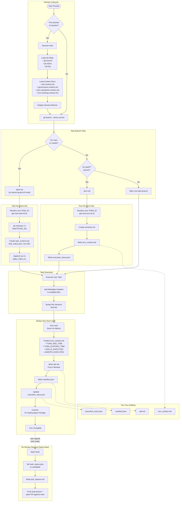

# coding-agents-config

Agentic pipeline configuration for Claude Code. Enforces turn-based workflow with provenance tracking, branch protection, and governance rules.

## Setup

### 1. Clone the repo

```sh
git clone <repo-url> ~/coding-agents-config
```

### 2. Create symlinks (automated)

Run the setup script — it creates all symlinks and backs up any existing files:

```sh
bash scripts/setup.sh
```

<details>
<summary>Manual symlink commands</summary>

```sh
# ~/.claude/
for name in skills agents rules hooks context scripts plugins CLAUDE.md settings.json; do
  ln -s ~/coding-agents-config/$name ~/.claude/$name
done

# ~/.codex/
ln -s ~/coding-agents-config/agents ~/.codex/agents
ln -s ~/coding-agents-config/AGENTS.md ~/.codex/AGENTS.md
```

`rules/`, `context/`, and `plugins/` are reserved for future use and may not exist in the repo yet — the symlink will simply be dangling until they're added.

If any target already exists, back it up first (`mv <target> <target>.bak`).
</details>

### 3. Verify

```sh
ls -la ~/.claude/skills        # should point to ~/coding-agents-config/skills
ls -la ~/.claude/hooks         # should point to ~/coding-agents-config/hooks
ls -la ~/.claude/scripts       # should point to ~/coding-agents-config/scripts
ls -la ~/.claude/CLAUDE.md     # should point to ~/coding-agents-config/CLAUDE.md
ls -la ~/.claude/settings.json # should point to ~/coding-agents-config/settings.json
ls -la ~/.codex/AGENTS.md      # should point to ~/coding-agents-config/AGENTS.md
```

## Structure

```
coding-agents-config/
├── CLAUDE.md           # Global instructions — task/turn protocol, branch rules
├── AGENTS.md           # Agent loader directive (Codex)
├── settings.json       # Claude Code settings (model, permissions, hooks)
├── hooks/              # Shell hooks triggered by Claude Code events
│   └── branch-guard.sh # Auto-creates task/TXXX branch when on main/master
├── skills/              # Slash-command skills
│   ├── .system/         # Meta-skills (skill-creator, skill-installer, plugin-creator, imagegen, openai-docs)
│   ├── session-start/   # Load repo state + pipeline context at session start
│   ├── task-init/       # Create a new task branch + turn-001 artifacts
│   ├── turn-init/       # Create the next turn directory and artifacts
│   ├── turn-end/        # Finalize a turn (ADR, manifest, execution trace)
│   ├── task-close/      # Push the task branch and open a pull request
│   ├── branch-guard/    # Create a task branch if currently on main/master
│   ├── af-*/            # App Factory backend pipeline (PRD → DDD → DSL → plan → build → tests)
│   ├── dsl-utils/       # Category wrapper → dsl-model-interpreter
│   ├── e2e-tests/       # Category wrapper → http-test-artifacts
│   ├── ui-utils/        # Category wrapper → ui-implementation-language
│   ├── unit-tests/      # Category wrapper → test-implementation-sync
│   └── eval-labeler/    # Label/compare model-response evaluation runs
├── agents/              # Agent definitions
│   └── agent-architecture-planner.md
├── scripts/             # Automation scripts
│   ├── setup.sh         # Create ~/.claude and ~/.codex symlinks
│   └── af-state.sh      # Read/write .appfactory/memory/state.yaml
├── .appfactory/         # Task/turn tracking, specs, and pipeline state
│   ├── tasks/           # Task branches with their turns
│   ├── specs/           # Specifications (PRD, DDD, DSL)
│   ├── prompts/         # Prompt templates
│   ├── memory/          # Project memory (state.yaml)
│   └── tasks_index.csv  # Registry of all tasks
├── archive/             # Retired skills and templates kept for reference
└── docs/                # Reference documentation
```

## Execution Flow

The agentic pipeline enforces a strict turn-based workflow for all coding tasks:


```mermaid
flowchart TB
    subgraph SESSION["Session Lifecycle"]
        START([User Prompt]) --> SS{First prompt<br/>of session?}
        SS -->|Yes| SESSION_START["/session-start"]
        SS -->|No| CHECK_BRANCH

        SESSION_START --> LOAD_GIT["Load Git State<br/>• git branch<br/>• git status<br/>• git log"]
        LOAD_GIT --> LOAD_CTX["Load Context Docs<br/>• adr-context.md<br/>• governance-context.md<br/>• tech-standards-context.md<br/>• turn-tracking-context.md"]
        LOAD_CTX --> BANNER["Display Session Banner"]
        BANNER --> CHECK_BRANCH
    end

    subgraph BRANCH_GATE["Task Branch Gate"]
        CHECK_BRANCH["git branch --show-current"] --> IS_MAIN{On main<br/>or master?}
        IS_MAIN -->|Yes| TASK_INIT["/task-init<br/>(or branch-guard.sh hook)"]
        IS_MAIN -->|No| IS_TASK{On task/T*<br/>branch?}
        IS_TASK -->|Yes| TURN_INIT
        IS_TASK -->|No| WARN["Warn non-task branch"]
    end

    subgraph TASK["Task Init (/task-init)"]
        TASK_INIT --> RESOLVE_TASK_ID["Resolve next TASK_ID<br/>get-next-task-id.sh"]
        RESOLVE_TASK_ID --> CREATE_TASK_BRANCH["git checkout -b<br/>task/T{TASK_ID}"]
        CREATE_TASK_BRANCH --> INIT_TASK_ARTIFACTS["Create task_context.md,<br/>task_status.json, turn-001"]
        INIT_TASK_ARTIFACTS --> APPEND_INDEX["Append row to<br/>tasks_index.csv"]
    end

    subgraph TURN["Turn Init (/turn-init)"]
        TURN_INIT["/turn-init"] --> RESOLVE_ID["Resolve next TURN_ID<br/>get-next-turn-id.sh"]
        RESOLVE_ID --> CREATE_DIR["Create turns/turn-N/"]
        CREATE_DIR --> WRITE_CTX["Write turn_context.md"]
        WRITE_CTX --> WRITE_TRACE["Write execution_trace.json"]
    end

    subgraph EXECUTION["Task Execution"]
        APPEND_INDEX --> EXEC
        WRITE_TRACE --> EXEC
        WARN --> EXEC
        EXEC["Execute User Task"] --> ADD_HEADERS["Add Metadata Headers<br/>to modified files"]
        ADD_HEADERS --> BUMP_VERSION["Bump File Versions<br/>SemVer"]
    end

    subgraph POST_EXEC["Always Run (/turn-end)"]
        BUMP_VERSION --> TURN_END["/turn-end<br/>(even on failure)"]
        TURN_END --> UPDATE_CTX["Finalize turn_context.md<br/>• TURN_END_TIME<br/>• TURN_ELAPSED_TIME<br/>• SKILLS_EXECUTED<br/>• AGENTS_EXECUTED"]
        UPDATE_CTX --> WRITE_ADR["Write adr.md<br/>Full or Minimal"]
        WRITE_ADR --> WRITE_MANIFEST["Write manifest.json"]
        WRITE_MANIFEST --> UPDATE_TRACE["Update execution_trace.json"]
        UPDATE_TRACE --> COMMIT["Commit:<br/>AI Coding Agent Change:"]
        COMMIT --> COMPLETE["Turn Complete"]
    end

    subgraph TASK_CLOSE["On Review Request (/task-close)"]
        COMPLETE -.->|user signals<br/>task ready| CLOSE["/task-close"]
        CLOSE --> UPDATE_TASK_STATUS["Set task_status.json<br/>to candidate"]
        UPDATE_TASK_STATUS --> WRITE_PR["Write pull_request.md"]
        WRITE_PR --> PUSH["Push task branch +<br/>open PR against main"]
    end

    subgraph ARTIFACTS["Per-Turn Artifacts"]
        direction LR
        A1["turn_context.md"]
        A2["execution_trace.json"]
        A3["adr.md"]
        A4["manifest.json"]
    end

    WRITE_CTX -.-> A1
    UPDATE_TRACE -.-> A2
    WRITE_ADR -.-> A3
    WRITE_MANIFEST -.-> A4
```

### Turn Protocol Summary

| Phase | Steps | Outputs |
|-------|-------|---------|
| **Session Start** | Load git state → Load 4 context docs → Display banner | Context loaded |
| **Branch Gate** | Check branch → `/task-init` if main/master, else `/turn-init` | Safe branch |
| **Task Init** | Resolve TASK_ID → Create `task/TXXX` → Init turn-001 → Update index | Task scaffolding |
| **Turn Init** | Resolve TURN_ID → Create turn dir → Write context + trace | `turn_context.md`, `execution_trace.json` |
| **Execution** | Execute task → Add headers → Bump versions | Modified files |
| **Turn End** | Finalize context → ADR → Manifest → Trace → Commit | 4 artifacts, always run |
| **Task Close** | Update status → Write PR → Push → Open PR | PR against `main` |

## Skills (24)

| Category | Skill | Description |
|----------|-------|-------------|
| **Lifecycle** | `session-start` | Load repo state and core pipeline context at session start |
| | `task-init` | Initialize a new task branch + turn-001 artifacts (run on main/master) |
| | `turn-init` | Initialize the next turn within the active task branch |
| | `turn-end` | Finalize turn with ADR, manifest, execution trace |
| | `task-close` | Push the task branch and open a PR against main |
| | `branch-guard` | Create a task branch if currently on main/master |
| **App Factory — Backend Pipeline** | `af-orchestrator` | Orchestrate the App Factory backend SDLC end to end |
| | `af-project-init` | Export AppFactory env vars and bootstrap a generated project |
| | `af-memory` | CRUD operations on `.appfactory/memory/state.yaml` |
| | `af-app-check` | Audit an app for production readiness (security, DB, deploy, quality) |
| | `af-be-prd-build` | Build a backend PRD from an intake worksheet |
| | `af-be-ddd-build` | Generate a backend Domain-Driven Design doc from an approved PRD |
| | `af-be-ddd-analysis` | Audit a DDD spec for completeness and PRD alignment |
| | `af-be-ddd-refactor` | Apply `af-be-ddd-analysis` findings back into the DDD spec |
| | `af-be-ddd-orchestrator` | Run the DDD build → analyze → refactor → test loop |
| | `af-be-ddd-dsl` | Generate a backend DSL YAML doc from a DDD doc |
| | `af-be-ddd-tests` | Generate Gherkin/BDD feature files from DDD + PRD |
| | `af-be-plan` | Generate a backend execution plan from DSL + tech stack profile |
| | `af-be-implementation` | Generate backend code from the execution plan and BDD specs |
| **Utility** | `dsl-utils` → `dsl-model-interpreter` | Parse and validate app-dsl YAML specs |
| | `e2e-tests` → `http-test-artifacts` | Generate `.http` files for REST endpoint testing |
| | `ui-utils` → `ui-implementation-language` | Declarative YAML standard for UI pages/widgets |
| | `unit-tests` → `test-implementation-sync` | Keep unit tests synced with service/DTO implementations |
| **Evaluation** | `eval-labeler` | Label and compare model-response evaluation runs |

### Meta-Skills (.system)

| Skill | Description |
|-------|-------------|
| `skill-creator` | Create new skills with SKILL.md |
| `skill-installer` | Install skills from marketplaces |
| `plugin-creator` | Scaffold a new Claude Code plugin |
| `imagegen` | Generate images |
| `openai-docs` | Reference for OpenAI/Codex docs |

## Templates

There is no top-level `templates/` directory anymore. Active templates live next to the skill that consumes them:

| Template | Location |
|----------|----------|
| `task_context.md`, `turn_context.md` | `skills/task-init/templates/` |
| `turn_context.md` | `skills/turn-init/templates/` |

Legacy turn-lifecycle templates (`adr_template.md`, `pull_request_template.md`, `manifest.schema.json`, `metadata_header.txt`, `branch_naming.md`, `commit_message.md`, `tech-stack.template.md`) were superseded by the task/turn skills above and now live under `archive/templates/` for reference.

## Hooks

| Hook | Trigger | Purpose |
|------|---------|---------|
| `branch-guard.sh` | `PreToolUse(Bash)` | Auto-create `task/TXXX` when invoked on main/master |

## Adding a new skill

Each skill lives in its own directory under `skills/` with a `SKILL.md` file:

```
skills/my-skill/
└── SKILL.md
```

The `.system/skill-creator` meta-skill can guide you through creating one — invoke it from Claude Code.

## Syncing across machines

Since this is a standard git repo, pull on any machine to stay current:

```sh
cd ~/coding-agents-config && git pull
```

The symlinks mean changes are picked up immediately — no reinstall needed.
