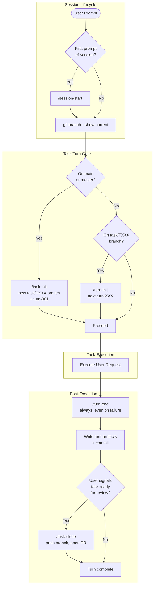

# coding-agents-config

Agentic pipeline configuration for Claude Code and Codex. Enforces a task/turn-based
workflow with provenance tracking, branch protection, and governance rules, plus a
library of AppFactory skills for spec-driven application generation.

## Setup

### 1. Clone the repo

```sh
git clone <repo-url> ~/coding-agents-config
```

### 2. Create symlinks (automated)

Run the setup script — it creates all symlinks and backs up any existing files:

```sh
bash scripts/setup.sh
```

<details>
<summary>Manual symlink commands</summary>

```sh
# ~/.claude/
ln -s ~/coding-agents-config/skills       ~/.claude/skills
ln -s ~/coding-agents-config/agents       ~/.claude/agents
ln -s ~/coding-agents-config/rules        ~/.claude/rules
ln -s ~/coding-agents-config/hooks        ~/.claude/hooks
ln -s ~/coding-agents-config/context      ~/.claude/context
ln -s ~/coding-agents-config/scripts      ~/.claude/scripts
ln -s ~/coding-agents-config/plugins      ~/.claude/plugins
ln -s ~/coding-agents-config/CLAUDE.md    ~/.claude/CLAUDE.md
ln -s ~/coding-agents-config/settings.json ~/.claude/settings.json

# ~/.codex/
ln -s ~/coding-agents-config/agents    ~/.codex/agents
ln -s ~/coding-agents-config/AGENTS.md ~/.codex/AGENTS.md

# repo-local ./.claude/
ln -s ~/coding-agents-config/CLAUDE.md ./.claude/CLAUDE.md
```

If any of these already exist, back them up first (`mv <target> <target>.bak`).
`rules`, `context`, and `plugins` are optional — the script links them if present.
</details>

### 3. Verify

```sh
ls -la ~/.claude/skills        # should point to ~/coding-agents-config/skills
ls -la ~/.claude/hooks         # should point to ~/coding-agents-config/hooks
ls -la ~/.claude/CLAUDE.md     # should point to ~/coding-agents-config/CLAUDE.md
ls -la ~/.claude/settings.json # should point to ~/coding-agents-config/settings.json
ls -la ~/.codex/AGENTS.md      # should point to ~/coding-agents-config/AGENTS.md
```

## Structure

```
coding-agents-config/
├── CLAUDE.md           # Global instructions — task/turn protocol, branch rules
├── AGENTS.md           # Codex agent loader directive
├── settings.json       # Claude Code settings (model, permissions)
├── hooks/              # Shell hooks triggered by Claude Code events
│   └── branch-guard.sh # Prevents edits on main/master
├── skills/             # Slash-command skills
│   ├── .system/        # Meta-skills (skill-creator, skill-installer, plugin-creator, ...)
│   ├── .nestjs/        # NestJS/Prisma scaffolding skills
│   ├── session-start/  # Load repo state and pipeline context
│   ├── task-init/      # Create a task branch and turn-001 artifacts
│   ├── turn-init/      # Initialize the next turn within a task
│   ├── turn-end/       # Finalize a turn (context, trace, ADR, manifest)
│   ├── task-close/     # Push the task branch and open a pull request
│   ├── branch-guard/   # Guard against edits on main/master
│   ├── af-*/           # AppFactory SDLC pipeline skills (PRD → DDD → plan → code)
│   ├── dsl-utils/      # DSL interpretation helpers
│   ├── e2e-tests/      # End-to-end/HTTP test artifact skills
│   ├── ui-utils/       # UI implementation-language helpers
│   ├── unit-tests/     # Test/implementation sync helpers
│   └── eval-labeler/   # Label and compare model-response evaluation runs
├── agents/              # Reusable agent definitions (e.g. agent-architecture-planner)
├── scripts/             # Automation scripts
│   ├── setup.sh         # Creates the symlinks above
│   └── af-state.sh      # AppFactory pipeline state helper
├── .appfactory/         # Task/turn tracking and specs
│   ├── tasks/           # task-XXX/ dirs, each with turns/turn-XXX/ artifacts
│   ├── tasks_index.csv  # Registry of all tasks and their status
│   ├── specs/           # Specifications
│   ├── prompts/         # Prompt templates
│   ├── memory/          # Project memory
│   └── changelog.md     # Project changelog
├── docs/                # Reference documentation (skill summary, migration notes, ...)
└── archive/             # Retired skills and templates kept for reference
```

## Execution Flow

The agentic pipeline enforces a task/turn workflow for all coding tasks, defined in
[`CLAUDE.md`](CLAUDE.md):


```mermaid
flowchart TB
    subgraph SESSION["Session Lifecycle"]
        START([User Prompt]) --> SS{First prompt<br/>of session?}
        SS -->|Yes| SESSION_START["/session-start"]
        SS -->|No| CHECK_BRANCH
        SESSION_START --> CHECK_BRANCH["git branch --show-current"]
    end

    subgraph GATE["Task/Turn Gate"]
        CHECK_BRANCH --> IS_MAIN{On main<br/>or master?}
        IS_MAIN -->|Yes| TASK_INIT["/task-init<br/>new task/TXXX branch<br/>+ turn-001"]
        IS_MAIN -->|No| IS_TASK{On task/TXXX<br/>branch?}
        IS_TASK -->|Yes| TURN_INIT["/turn-init<br/>next turn-XXX"]
        IS_TASK -->|No| PROCEED
        TASK_INIT --> PROCEED["Proceed"]
        TURN_INIT --> PROCEED
    end

    subgraph EXECUTION["Task Execution"]
        PROCEED --> EXEC["Execute User Request"]
    end

    subgraph POST_EXEC["Post-Execution"]
        EXEC --> TURN_END["/turn-end<br/>always, even on failure"]
        TURN_END --> WRITE_ARTIFACTS["Write turn artifacts<br/>+ commit"]
        WRITE_ARTIFACTS --> READY{User signals<br/>task ready<br/>for review?}
        READY -->|Yes| TASK_CLOSE["/task-close<br/>push branch, open PR"]
        READY -->|No| DONE["Turn complete"]
        TASK_CLOSE --> DONE
    end
```

### Task/Turn Model

| Concept | Definition |
|---------|------------|
| **Task** | Branch-scoped unit of work that becomes one pull request. Branch: `task/TXXX`, id zero-padded to 3 digits, global. |
| **Turn** | One AI execution cycle within the active task branch. Id zero-padded to 3 digits, resets per task. |

| Phase | Skill | Runs when |
|-------|-------|-----------|
| Session start | `session-start` | First prompt of the session |
| Task init | `task-init` | Current branch is `main`/`master` |
| Turn init | `turn-init` | Current branch is `task/TXXX` |
| Turn end | `turn-end` | After every execution, even on failure |
| Task close | `task-close` | User signals the task is ready for review |

### Required Artifacts

Every **turn** produces, under `.appfactory/tasks/task-XXX/turns/turn-XXX/`:

`turn_context.md`, `execution_trace.json`, `adr.md`, `manifest.json`

Every **task** produces, under `.appfactory/tasks/task-XXX/`:

`task_context.md`, `task_status.json`, `task_summary.md`, `pull_request.md`

## Skills

### Pipeline (task/turn lifecycle)

| Skill | Description |
|-------|-------------|
| `session-start` | Load repository state and core pipeline context. Runs at the start of every session. |
| `task-init` | Initialize a new task branch and create task plus turn-001 artifacts. |
| `turn-init` | Initialize the next turn within the active task branch. |
| `turn-end` | Finalize the active turn after execution — updates context, trace, ADR, manifest. |
| `task-close` | Finalize the active task branch, push it, and open a pull request against main. |
| `branch-guard` | Check current git branch and guard against edits on main/master. |

### AppFactory SDLC pipeline (`af-*`)

See [`docs/skill-summary.md`](docs/skill-summary.md) for the full phase-by-phase table.

| Skill | Description |
|-------|-------------|
| `af-orchestrator` | Orchestrates the App Factory software development lifecycle end to end. |
| `af-project-init` | Orchestrates AppFactory project initialization by exporting required environment variables. |
| `af-be-prd-build` | Builds a business-facing backend PRD from an intake worksheet or discovery notes. |
| `af-be-ddd-orchestrator` | Orchestrates the backend DDD build → analyze → refactor → test loop. |
| `af-be-ddd-build` | Generates a human-readable backend DDD document from an approved PRD. |
| `af-be-ddd-analysis` | Audits a DDD specification for quality, completeness, and PRD alignment. |
| `af-be-ddd-refactor` | Refactors a DDD specification using `af-be-ddd-analysis` findings. |
| `af-be-ddd-tests` | Generates Gherkin-style BDD scenarios from the DDD and PRD specifications. |
| `af-be-plan` | Generates a backend execution plan from a domain DSL and tech-stack profile. |
| `af-be-ddd-dsl` | Generates a backend DSL YAML document from the DDD document. |
| `af-be-implementation` | Executes backend code generation from the execution plan and BDD specs. |
| `af-app-check` | Audits an application for production readiness (security, database, deployment, quality). |
| `af-memory` | CRUD operations on `.appfactory/state.yaml` for cross-skill pipeline state. |

### Scaffolding & utility

| Category | Skill(s) | Description |
|----------|----------|--------------|
| `.nestjs/` | `nestjs-crud-resource`, `nestjs-prisma-resource`, `nestjs-customer-crud-scaffold`, `nestjs-observability`, `app-from-dsl`, `field-mapper-generator`, `prisma/prisma-guidelines`, `prisma/prisma-persistence` | NestJS + Prisma scaffolding, CRUD generation, and observability helpers |
| `dsl-utils/` | `dsl-model-interpreter` | Interpret DSL model documents |
| `e2e-tests/` | `http-test-artifacts` | Generate end-to-end HTTP test artifacts |
| `ui-utils/` | `ui-implementation-language` | UI implementation-language helpers |
| `unit-tests/` | `test-implementation-sync` | Keep unit tests in sync with implementation |
| — | `eval-labeler` | Label and compare Response A/B model evaluation runs |

### Meta-skills (`.system/`)

| Skill | Description |
|-------|-------------|
| `skill-creator` | Create new skills with a `SKILL.md`. |
| `skill-installer` | Install skills from marketplaces. |
| `plugin-creator` | Scaffold a new plugin. |
| `imagegen` | Generate images. |
| `openai-docs` | Reference OpenAI API documentation. |

Retired skills and older templates live under [`archive/`](archive/) for reference.

## Hooks

| Hook | Trigger | Purpose |
|------|---------|---------|
| `branch-guard.sh` | PreToolUse(Edit) | Block edits on main/master |

## Adding a new skill

Each skill lives in its own directory under `skills/` with a `SKILL.md` file:

```
skills/my-skill/
└── SKILL.md
```

The `.system/skill-creator` meta-skill can guide you through creating one — invoke it from Claude Code.

## Syncing across machines

Since this is a standard git repo, pull on any machine to stay current:

```sh
cd ~/coding-agents-config && git pull
```

The symlinks mean changes are picked up immediately — no reinstall needed.
