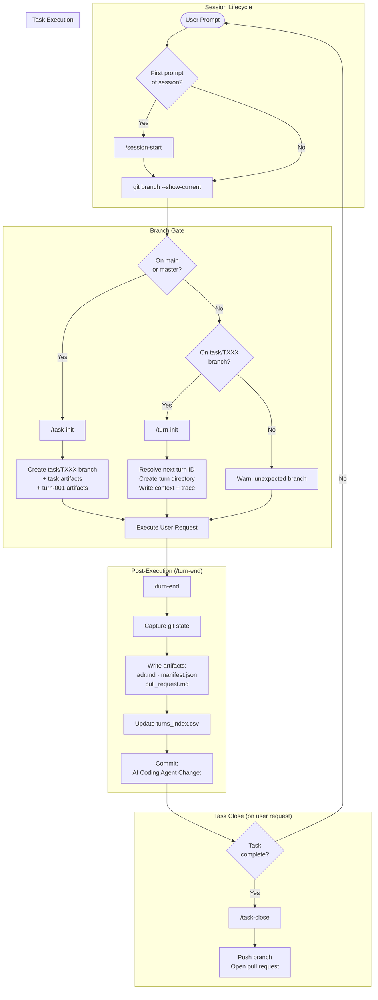

# coding-agents-config

Agentic pipeline configuration for Claude Code. Enforces a task/turn-based workflow with provenance tracking, branch protection, and governance rules for AI-assisted software development.

## Setup

### 1. Clone the repo

```sh
git clone <repo-url> ~/coding-agents-config
```

### 2. Create symlinks (automated)

Run the setup script — it creates all symlinks and backs up any existing files:

```sh
bash scripts/setup.sh
```

<details>
<summary>Manual symlink commands</summary>

```sh
ln -s ~/coding-agents-config/skills ~/.claude/skills
ln -s ~/coding-agents-config/hooks ~/.claude/hooks
ln -s ~/coding-agents-config/CLAUDE.md ~/.claude/CLAUDE.md
ln -s ~/coding-agents-config/settings.json ~/.claude/settings.json
```

If any of these already exist, back them up first (`mv <target> <target>.bak`).
</details>

### 3. Verify

```sh
ls -la ~/.claude/skills        # should point to ~/coding-agents-config/skills
ls -la ~/.claude/hooks         # should point to ~/coding-agents-config/hooks
ls -la ~/.claude/CLAUDE.md     # should point to ~/coding-agents-config/CLAUDE.md
ls -la ~/.claude/settings.json # should point to ~/coding-agents-config/settings.json
```

## Structure

```
coding-agents-config/
├── CLAUDE.md           # Global instructions — task/turn protocol, branch rules
├── AGENTS.md           # Agent loader directive
├── settings.json       # Claude Code settings (model, permissions, hooks, plugins)
├── hooks/              # Shell hooks triggered by Claude Code events
│   └── branch-guard.sh # Blocks edits on main/master
├── skills/             # Slash-command skills (24 total)
│   ├── session-start/  # Initialize session context
│   ├── task-init/      # Bootstrap a new task branch + turn-001 artifacts
│   ├── task-close/     # Finalize task branch and open pull request
│   ├── turn-init/      # Create next turn directory and artifacts
│   ├── turn-end/       # Finalize turn with ADR, manifest, commit
│   ├── branch-guard/   # Create task branch if on main/master
│   ├── af-orchestrator/         # App Factory SDLC orchestrator
│   ├── af-project-init/         # Initialize AppFactory project state
│   ├── af-be-ddd-orchestrator/  # Backend DDD workflow orchestrator
│   ├── af-be-ddd-analysis/      # Analyze DDD design for quality
│   ├── af-be-ddd-build/         # Build DDD document from PRD
│   ├── af-be-ddd-dsl/           # Generate backend DSL YAML from DDD doc
│   ├── af-be-ddd-refactor/      # Refactor DDD design
│   ├── af-be-ddd-tests/         # Generate BDD scenarios from DDD/PRD
│   ├── af-be-prd-build/         # Build backend PRD from intake worksheet
│   ├── af-be-plan/              # Generate backend execution plan from DSL
│   ├── af-be-implementation/    # Execute backend code generation
│   ├── af-app-check/            # Production readiness audit
│   ├── af-memory/               # Read/write pipeline state (state.yaml)
│   ├── dsl-utils/               # DSL utility helpers
│   ├── ui-utils/                # UI utility helpers
│   ├── e2e-tests/               # End-to-end test runner
│   ├── unit-tests/              # Unit test runner
│   └── eval-labeler/            # Model response evaluation and labeling
├── scripts/            # Automation scripts
│   ├── setup.sh        # Symlink installer
│   └── af-state.sh     # AppFactory pipeline state helper
├── docs/               # Reference documentation
│   ├── agent-architecture-planner.md
│   ├── ai-to-appfactory-migration-analysis.md
│   ├── app-nextjs-nestjs-prisma.md
│   ├── appFactory-plan.md
│   ├── migration-ai-to-appfactory.md
│   └── skill-summary.md
├── archive/            # Retired skills and legacy artifacts
└── .appfactory/        # Task/turn tracking and pipeline state
    ├── tasks/          # Task branches with per-turn artifacts
    ├── specs/          # Specifications
    ├── prompts/        # Prompt templates
    └── memory/         # Project memory
```

## Execution Flow

The agentic pipeline enforces a strict task/turn-based workflow for all coding tasks:


```mermaid
flowchart TB
    subgraph SESSION["Session Lifecycle"]
        START([User Prompt]) --> SS{First prompt\nof session?}
        SS -->|Yes| SESSION_START["/session-start"]
        SS -->|No| BRANCH_CHECK
        SESSION_START --> BRANCH_CHECK
    end

    subgraph BRANCH_GATE["Branch Gate"]
        BRANCH_CHECK["git branch --show-current"] --> IS_MAIN{On main\nor master?}
        IS_MAIN -->|Yes| TASK_INIT["/task-init"]
        TASK_INIT --> CREATE_TASK["Create task/TXXX branch\n+ task artifacts\n+ turn-001 artifacts"]
        IS_MAIN -->|No| IS_TASK{On task/TXXX\nbranch?}
        IS_TASK -->|Yes| TURN_INIT["/turn-init"]
        TURN_INIT --> CREATE_TURN["Resolve next turn ID\nCreate turn directory\nWrite context + trace"]
        IS_TASK -->|No| WARN["Warn: unexpected branch"]
        WARN --> EXEC
        CREATE_TASK --> EXEC
        CREATE_TURN --> EXEC
    end

    subgraph EXECUTION["Task Execution"]
        EXEC["Execute User Request"]
    end

    subgraph POST_EXEC["Post-Execution (/turn-end)"]
        EXEC --> TURN_END["/turn-end"]
        TURN_END --> CAPTURE["Capture git state"]
        CAPTURE --> ARTIFACTS["Write artifacts:\nadr.md · manifest.json\npull_request.md"]
        ARTIFACTS --> INDEX["Update turns_index.csv"]
        INDEX --> COMMIT["Commit:\nAI Coding Agent Change:"]
    end

    subgraph TASK_CLOSE_PHASE["Task Close (on user request)"]
        COMMIT --> DONE{Task\ncomplete?}
        DONE -->|Yes| TASK_CLOSE["/task-close"]
        TASK_CLOSE --> PUSH["Push branch\nOpen pull request"]
        DONE -->|No| START
    end
```

### Turn Protocol Summary

| Phase | Skill | Outputs |
|-------|-------|---------|
| **Session Start** | `/session-start` | Git state + context loaded |
| **Task Init** | `/task-init` | `task/TXXX` branch, `task_context.md`, `task_status.json`, `turn-001/` |
| **Turn Init** | `/turn-init` | `turn_context.md`, `execution_trace.json` |
| **Execution** | *(user task)* | Modified files |
| **Turn End** | `/turn-end` | `adr.md`, `manifest.json`, `pull_request.md`, commit |
| **Task Close** | `/task-close` | Branch pushed, PR opened |

### Task and Turn Artifacts

Every turn produces four required artifacts under `.appfactory/tasks/task-XXX/turns/turn-XXX/`:

| File | Purpose |
|------|---------|
| `turn_context.md` | Turn metadata, timing, skills executed |
| `execution_trace.json` | Structured execution log |
| `adr.md` | Architecture Decision Record (full or minimal) |
| `manifest.json` | SHA-256 checksums of all modified files |

Every task also requires four artifacts under `.appfactory/tasks/task-XXX/`:

| File | Purpose |
|------|---------|
| `task_context.md` | Task description and scope |
| `task_status.json` | Current status (open/closed) |
| `task_summary.md` | Human-readable summary |
| `pull_request.md` | PR description draft |

## Skills (24)

### Lifecycle

| Skill | Description |
|-------|-------------|
| `session-start` | Load repository state and core pipeline context at session start |
| `task-init` | Initialize a new `task/TXXX` branch with task + turn-001 artifacts |
| `task-close` | Finalize task branch, push it, and open a pull request against main |
| `turn-init` | Initialize the next turn within an active task branch |
| `turn-end` | Finalize the active turn: write ADR, manifest, PR draft, commit |
| `branch-guard` | Create a task branch if currently on main or master |

### App Factory Orchestration

| Skill | Description |
|-------|-------------|
| `af-orchestrator` | Orchestrate the full App Factory SDLC pipeline |
| `af-project-init` | Export environment variables and initialize AppFactory project state |
| `af-memory` | CRUD operations for pipeline state (`state.yaml` in `.appfactory/`) |

### Backend DDD Pipeline

| Skill | Description |
|-------|-------------|
| `af-be-ddd-orchestrator` | Orchestrate full backend DDD workflow: build → analyze → refactor → test |
| `af-be-prd-build` | Build a backend PRD from an intake worksheet or discovery notes |
| `af-be-ddd-build` | Generate a DDD document from an approved PRD |
| `af-be-ddd-dsl` | Generate a backend DSL YAML from a DDD document |
| `af-be-ddd-analysis` | Analyze a DDD design for quality and completeness |
| `af-be-ddd-refactor` | Refactor a DDD design based on analysis feedback |
| `af-be-ddd-tests` | Generate Gherkin BDD scenarios from DDD and PRD specs |

### Backend Implementation

| Skill | Description |
|-------|-------------|
| `af-be-plan` | Generate a backend execution plan from DSL YAML + tech stack profile |
| `af-be-implementation` | Execute backend code generation from execution plan + BDD specs |
| `af-app-check` | Audit an application for production readiness (security, DB, deployment, quality) |

### Testing & Evaluation

| Skill | Description |
|-------|-------------|
| `unit-tests` | Run unit tests for the active project |
| `e2e-tests` | Run end-to-end tests for the active project |
| `eval-labeler` | Evaluate and label model responses for coding task comparisons |

### Utilities

| Skill | Description |
|-------|-------------|
| `dsl-utils` | DSL manipulation and query helpers |
| `ui-utils` | UI component and pattern utilities |

## Hooks

| Hook | Event | Purpose |
|------|-------|---------|
| `branch-guard.sh` | `PreToolUse(Bash)` | Blocks destructive edits on main/master |

## Settings

`settings.json` configures:

- **Model**: `opus` (default), `claude-sonnet-4-6` for fast operations
- **Permissions**: Allowlist for common dev tools (`git`, `npm`, `docker`, `psql`, etc.); deny list for force-push to main and publishing
- **Voice**: Enabled in hold mode
- **Plugins**: `document-skills`, `example-skills` (from `anthropic-agent-skills` marketplace), `caveman`

## Branch Rules

| Rule | Detail |
|------|--------|
| Task branch format | `task/TXXX` (e.g. `task/T001`) |
| Turn IDs | Zero-padded per task: `001`, `002`, `003` |
| Never commit to | `main` or `master` |
| Gate | `/task-init` must succeed before any write on main/master |

## Adding a New Skill

Each skill lives in its own directory under `skills/` with a `SKILL.md` file:

```
skills/my-skill/
└── SKILL.md
```

Use the `/skill-creator` meta-skill (in `.system/`) to scaffold a new skill interactively.

## Registries

- `.appfactory/tasks_index.csv` — one row per task; updated on create and status change
- `.appfactory/tasks/task-XXX/turns_index.csv` — optional per-task turn log

## Commit Message Format

```
AI Coding Agent Change:
- <imperative bullet>
- <imperative bullet>
```

## Syncing Across Machines

```sh
cd ~/coding-agents-config && git pull
```

Symlinks pick up changes immediately — no reinstall needed.
