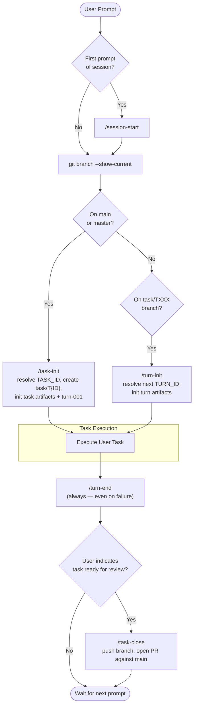

# coding-agents-config

Agentic pipeline configuration for Claude Code. Enforces task/turn-based workflow with provenance tracking, branch protection, and governance rules for App Factory projects.

## Setup

### 1. Clone the repo

```sh
git clone <repo-url> ~/coding-agents-config
```

### 2. Create symlinks (automated)

Run the setup script — it creates all symlinks and backs up any existing files:

```sh
bash scripts/setup.sh
```

<details>
<summary>Manual symlink commands</summary>

```sh
ln -s ~/coding-agents-config/skills ~/.claude/skills
ln -s ~/coding-agents-config/agents ~/.claude/agents
ln -s ~/coding-agents-config/rules ~/.claude/rules
ln -s ~/coding-agents-config/hooks ~/.claude/hooks
ln -s ~/coding-agents-config/context ~/.claude/context
ln -s ~/coding-agents-config/scripts ~/.claude/scripts
ln -s ~/coding-agents-config/plugins ~/.claude/plugins
ln -s ~/coding-agents-config/CLAUDE.md ~/.claude/CLAUDE.md
ln -s ~/coding-agents-config/settings.json ~/.claude/settings.json

ln -s ~/coding-agents-config/agents ~/.codex/agents
ln -s ~/coding-agents-config/AGENTS.md ~/.codex/AGENTS.md
```

If any of these already exist, back them up first (`mv <target> <target>.bak`).
</details>

### 3. Verify

```sh
ls -la ~/.claude/skills        # should point to ~/coding-agents-config/skills
ls -la ~/.claude/agents        # should point to ~/coding-agents-config/agents
ls -la ~/.claude/CLAUDE.md     # should point to ~/coding-agents-config/CLAUDE.md
ls -la ~/.claude/settings.json # should point to ~/coding-agents-config/settings.json
ls -la ~/.codex/AGENTS.md      # should point to ~/coding-agents-config/AGENTS.md
```

## Structure

```
coding-agents-config/
├── CLAUDE.md           # Global instructions — task/turn protocol, branch rules
├── AGENTS.md           # Codex loader directive (reads ~/.claude/CLAUDE.md)
├── settings.json       # Claude Code settings (model, permissions)
├── hooks/              # Shell hooks triggered by Claude Code events
│   └── branch-guard.sh # Prevents edits on main/master
├── agents/             # Subagent definitions
│   └── agent-architecture-planner.md
├── skills/             # Slash-command skills (App Factory pipeline)
├── scripts/            # Automation scripts
│   ├── setup.sh        # Symlink installer
│   └── af-state.sh     # AppFactory state helper
├── .appfactory/        # Task/turn tracking and specs
│   ├── tasks/          # Task branches with turns
│   ├── specs/          # Specifications
│   ├── prompts/        # Prompt templates
│   ├── memory/         # Project memory
│   ├── tasks_index.csv # Registry of all tasks
│   └── changelog.md
├── archive/            # Retired/superseded skills and docs
└── docs/               # Reference documentation
```

## Execution Flow

The pipeline enforces a task/turn workflow for all coding tasks:


```mermaid
flowchart TB
    START([User Prompt]) --> SS{First prompt<br/>of session?}
    SS -->|Yes| SESSION_START["/session-start"]
    SS -->|No| BRANCH_CHECK
    SESSION_START --> BRANCH_CHECK["git branch --show-current"]

    BRANCH_CHECK --> IS_MAIN{On main<br/>or master?}
    IS_MAIN -->|Yes| TASK_INIT["/task-init<br/>resolve TASK_ID, create task/T{ID},<br/>init task artifacts + turn-001"]
    IS_MAIN -->|No| IS_TASK{On task/TXXX<br/>branch?}
    IS_TASK -->|Yes| TURN_INIT["/turn-init<br/>resolve next TURN_ID,<br/>init turn artifacts"]
    TASK_INIT --> EXEC
    TURN_INIT --> EXEC

    subgraph EXECUTION["Task Execution"]
        EXEC["Execute User Task"]
    end

    EXEC --> TURN_END["/turn-end<br/>(always — even on failure)"]
    TURN_END --> READY{User indicates<br/>task ready for review?}
    READY -->|Yes| TASK_CLOSE["/task-close<br/>push branch, open PR against main"]
    READY -->|No| DONE([Wait for next prompt])
    TASK_CLOSE --> DONE
```

### Task/Turn Protocol Summary

| Phase | Trigger | Steps | Outputs |
|-------|---------|-------|---------|
| **Session Start** | First prompt of session | `/session-start` | Git state + context loaded |
| **Task Init** | On `main`/`master` | `/task-init` — new `task/TXXX` branch, task artifacts, turn-001 | `task_context.md`, `task_status.json`, etc. |
| **Turn Init** | On `task/TXXX` | `/turn-init` — next `turn-XXX` inside active task | `turn_context.md`, `execution_trace.json` |
| **Execution** | Every coding prompt | Execute user's request | Modified files |
| **Turn End** | After every prompt, even on failure | `/turn-end` | `adr.md`, `manifest.json`, commit |
| **Task Close** | User signals task is ready for review | `/task-close` | Push branch, open PR |

**Hard gate:** writing or editing code is never allowed while on `main` or `master` — `/task-init` must complete first.

## Skills

| Category | Skill | Description |
|----------|-------|-------------|
| **Session** | `session-start` | Load repository state and core pipeline context at session start |
| **Task** | `task-init` | Initialize a new task branch and create task + turn-001 artifacts |
| | `task-close` | Finalize the active task branch, push it, and open a PR against main |
| **Turn** | `turn-init` | Initialize the next turn within the active task branch |
| | `turn-end` | Finalize the active turn after execution (PR notes, ADR, manifest) |
| | `branch-guard` | Create a turn-scoped branch if currently on main/master |
| **App Factory — PRD/DDD** | `af-be-prd-build` | Build a backend PRD from an intake worksheet or discovery notes |
| | `af-be-ddd-build` | Generate a backend DDD document from an approved PRD |
| | `af-be-ddd-analysis` | Audit a generated DDD document for quality, completeness, and PRD alignment |
| | `af-be-ddd-refactor` | Apply targeted patches to a DDD document from analysis findings |
| | `af-be-ddd-dsl` | Generate a backend DSL YAML document from a DDD document |
| | `af-be-ddd-orchestrator` | Orchestrate the DDD build → analyze → refactor → test loop |
| | `af-be-ddd-tests` | Generate Gherkin/BDD scenarios from DDD and PRD specs |
| **App Factory — Plan/Build** | `af-be-plan` | Generate a backend execution plan from a DSL and tech stack profile |
| | `af-be-implementation` | Generate backend domain code from the execution plan and BDD specs |
| | `af-project-init` | Orchestrate AppFactory project initialization (env vars + helper script) |
| | `af-orchestrator` | Orchestrate the full App Factory SDLC |
| | `af-app-check` | Audit an application for production readiness before release/QA/staging |
| | `af-memory` | CRUD operations on AppFactory `state.yaml` pipeline state |
| **Utilities** | `dsl-utils/dsl-model-interpreter` | Parse and validate app-dsl YAML specs before code generation |
| | `e2e-tests/http-test-artifacts` | Generate `.http` files for REST endpoint testing |
| | `ui-utils/ui-implementation-language` | Declarative YAML standard for UI pages, widgets, forms, and bindings |
| | `unit-tests/test-implementation-sync` | Keep unit tests synchronized with service/DTO implementations |
| | `eval-labeler` | Label/score Response A vs Response B evaluations from `Eval.md` files |

Retired skills (e.g. `schema-to-database`, `nestjs-prisma-resource`, `code-entity-to-crud`) live under `archive/`.

## Agents

| Agent | Description |
|-------|-------------|
| `agent-architecture-planner` | Reads PRD, DDD, DSL, and existing repo structure to produce specification alignment, architecture decisions, module maps, task plans, and review artifacts |

## Hooks

| Hook | Trigger | Purpose |
|------|---------|---------|
| `branch-guard.sh` | PreToolUse(Edit) | Block edits on main/master |

## Adding a new skill

Each skill lives in its own directory under `skills/` with a `SKILL.md` file:

```
skills/my-skill/
└── SKILL.md
```

## Syncing across machines

Since this is a standard git repo, pull on any machine to stay current:

```sh
cd ~/coding-agents-config && git pull
```

The symlinks mean changes are picked up immediately — no reinstall needed.
