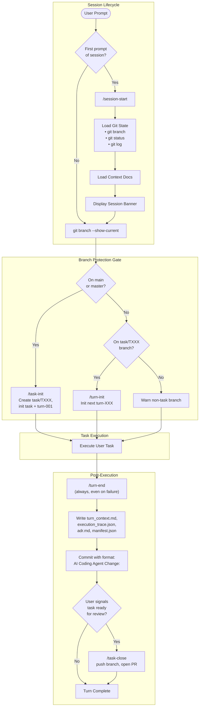

# coding-agents-config

Agentic pipeline configuration for Claude Code. Enforces turn-based workflow with provenance tracking, branch protection, and governance rules, plus the App Factory (`af-*`) skill suite for DSL-driven backend generation.

## Setup

### 1. Clone the repo

```sh
git clone <repo-url> ~/coding-agents-config
```

### 2. Create symlinks (automated)

Run the setup script — it links the repo into `~/.claude/`, `~/.codex/`, and a repo-local `./.claude/`, backing up any existing files:

```sh
bash scripts/setup.sh
```

<details>
<summary>Manual symlink commands</summary>

```sh
# ~/.claude/
ln -s ~/coding-agents-config/skills    ~/.claude/skills
ln -s ~/coding-agents-config/agents    ~/.claude/agents
ln -s ~/coding-agents-config/hooks     ~/.claude/hooks
ln -s ~/coding-agents-config/scripts   ~/.claude/scripts
ln -s ~/coding-agents-config/CLAUDE.md ~/.claude/CLAUDE.md
ln -s ~/coding-agents-config/settings.json ~/.claude/settings.json

# ~/.codex/
ln -s ~/coding-agents-config/agents   ~/.codex/agents
ln -s ~/coding-agents-config/AGENTS.md ~/.codex/AGENTS.md

# repo-local ./.claude/
ln -s ~/coding-agents-config/CLAUDE.md ./.claude/CLAUDE.md
```

If any of these already exist, back them up first (`mv <target> <target>.bak`).
</details>

### 3. Verify

```sh
ls -la ~/.claude/skills        # should point to ~/coding-agents-config/skills
ls -la ~/.claude/agents        # should point to ~/coding-agents-config/agents
ls -la ~/.claude/hooks         # should point to ~/coding-agents-config/hooks
ls -la ~/.claude/CLAUDE.md     # should point to ~/coding-agents-config/CLAUDE.md
ls -la ~/.claude/settings.json # should point to ~/coding-agents-config/settings.json
```

## Structure

```
coding-agents-config/
├── CLAUDE.md           # Global instructions — turn protocol, branch rules
├── AGENTS.md           # Codex loader directive (reads ~/.claude/CLAUDE.md)
├── settings.json       # Claude Code settings (model, permissions, hooks)
├── package.json        # Node dependency (caveman)
├── agents/             # Subagent definitions
│   └── agent-architecture-planner.md
├── hooks/              # Shell hooks triggered by Claude Code events
│   └── branch-guard.sh # Prevents edits on main/master
├── scripts/             # Automation scripts
│   ├── setup.sh         # Create symlinks into ~/.claude, ~/.codex
│   └── af-state.sh      # Helpers for .appfactory/memory/state.yaml
├── skills/              # Slash-command skills (see below)
├── .appfactory/         # Task/turn tracking and specs
│   ├── tasks/           # Task branches with turns (task-NNN/turns/turn-NNN)
│   ├── specs/            # Specifications
│   ├── prompts/           # Prompt drafts and worksheets
│   ├── memory/             # Project memory (state.yaml)
│   ├── changelog.md        # Pipeline changelog
│   └── tasks_index.csv      # Registry of tasks
├── docs/                 # Reference documentation (migration notes, plans)
├── archive/              # Superseded skills and templates, kept for reference
└── .github/               # PR/issue templates
```

## Execution Flow

The agentic pipeline enforces a strict turn-based workflow for all coding tasks:


```mermaid
flowchart TB
    subgraph SESSION["Session Lifecycle"]
        START([User Prompt]) --> SS{First prompt<br/>of session?}
        SS -->|Yes| SESSION_START["/session-start"]
        SS -->|No| BRANCH_CHECK

        SESSION_START --> LOAD_GIT["Load Git State<br/>• git branch<br/>• git status<br/>• git log"]
        LOAD_GIT --> LOAD_CTX["Load Context Docs"]
        LOAD_CTX --> BANNER["Display Session Banner"]
        BANNER --> BRANCH_CHECK
    end

    subgraph BRANCH_GATE["Branch Protection Gate"]
        BRANCH_CHECK["git branch --show-current"] --> IS_MAIN{On main<br/>or master?}
        IS_MAIN -->|Yes| TASK_INIT["/task-init<br/>Create task/TXXX,<br/>init task + turn-001"]
        IS_MAIN -->|No| IS_TASK{On task/TXXX<br/>branch?}
        IS_TASK -->|Yes| TURN_INIT["/turn-init<br/>Init next turn-XXX"]
        IS_TASK -->|No| WARN["Warn non-task branch"]
    end

    subgraph EXECUTION["Task Execution"]
        TASK_INIT --> EXEC
        TURN_INIT --> EXEC
        WARN --> EXEC["Execute User Task"]
    end

    subgraph POST_EXEC["Post-Execution"]
        EXEC --> TURN_END["/turn-end<br/>(always, even on failure)"]
        TURN_END --> WRITE_ARTIFACTS["Write turn_context.md,<br/>execution_trace.json,<br/>adr.md, manifest.json"]
        WRITE_ARTIFACTS --> COMMIT["Commit with format:<br/>AI Coding Agent Change:"]
        COMMIT --> READY{User signals<br/>task ready<br/>for review?}
        READY -->|Yes| TASK_CLOSE["/task-close<br/>push branch, open PR"]
        READY -->|No| COMPLETE["Turn Complete"]
        TASK_CLOSE --> COMPLETE
    end
```

### Turn Protocol Summary

| Phase | Trigger | Steps | Outputs |
|-------|---------|-------|---------|
| **Session Start** | First prompt of session | Load git state → load context docs → display banner | Context loaded |
| **Task Init** | Current branch is `main`/`master` | Resolve next `TXXX` → create `task/TXXX` → init `task-XXX` + `turn-001` | Task directory, `tasks_index.csv` row |
| **Turn Init** | Current branch is `task/TXXX` | Resolve next turn id → create `turn-XXX` dir | `turn_context.md`, `execution_trace.json` |
| **Execution** | Every coding prompt | Execute the user's request | Modified files |
| **Turn End** | After every execution, always | Write `turn_context.md`, `execution_trace.json`, `adr.md`, `manifest.json` → commit | 4 turn artifacts, commit |
| **Task Close** | User signals task is ready for review | Push task branch → open PR | `pull_request.md`, remote branch, PR |

## Skills

Skills live under `skills/`. Most are grouped one-skill-per-directory; a few category folders (`dsl-utils/`, `e2e-tests/`, `ui-utils/`, `unit-tests/`) hold a single nested skill under a topical name.

### Turn/task pipeline

| Skill | Description |
|-------|--------------|
| `session-start` | Load repository state and core pipeline context at the start of every session. |
| `task-init` | Initialize a new task branch (`task/TXXX`) and create task + `turn-001` artifacts. Runs when current branch is `main`/`master`. |
| `turn-init` | Initialize the next turn within the active task branch. |
| `turn-end` | Finalize the active turn (context, trace, ADR, manifest, commit) after every execution, even on failure. |
| `task-close` | Finalize the active task branch, push it, and open a pull request against `main`. |
| `branch-guard` | Check current git branch and create a turn-scoped branch if on `main`/`master`. |

### App Factory (`af-*`) — backend DSL pipeline

| Skill | Description |
|-------|--------------|
| `af-orchestrator` | Orchestrates the App Factory software development lifecycle end to end. |
| `af-project-init` | Orchestrates AppFactory project initialization: exports required environment variables and invokes the helper script. |
| `af-memory` | CRUD operations for AppFactory pipeline state (`state.yaml` in `.appfactory/`). |
| `af-be-prd-build` | Builds a business-facing backend PRD from an intake worksheet or discovery notes. |
| `af-be-ddd-build` | Generates a backend Domain-Driven Design document from an approved PRD. |
| `af-be-ddd-analysis` | Audits a generated DDD spec for quality, completeness, and PRD alignment. |
| `af-be-ddd-refactor` | Refactors a DDD spec using `af-be-ddd-analysis` findings, preserving structure and history. |
| `af-be-ddd-dsl` | Generates a backend DSL YAML document from a DDD document. |
| `af-be-ddd-tests` | Generates Gherkin-style BDD feature files from DDD and PRD specs, organized by aggregate. |
| `af-be-ddd-orchestrator` | Orchestrates the backend DDD workflow: build → analyze → refactor loop → test. |
| `af-be-plan` | Generates a backend execution plan from a domain DSL and a tech-stack profile. |
| `af-be-implementation` | Executes backend generation: copies the selected tech-stack implementation and generates domain code from the plan and BDD specs. |
| `af-app-check` | Audits an application for production readiness (security, database, deployment, code quality). |

### Utility (grouped by category folder)

| Skill (path) | Description |
|--------------|--------------|
| `dsl-utils/dsl-model-interpreter` | Parses and validates `app-dsl` YAML specifications (models, mappers, pages, backends, lookups). |
| `e2e-tests/http-test-artifacts` | Generates `.http` request files for REST client testing of backend endpoints. |
| `ui-utils/ui-implementation-language` | Declarative YAML language standard for UI pages, layouts, widgets, forms, and state bindings. |
| `unit-tests/test-implementation-sync` | Keeps generated unit tests synchronized with actual service/DTO implementations. |
| `eval-labeler` | Processes `Eval.md` files to score and compare two model responses for coding tasks. |

## Agents

| Agent | Description |
|-------|--------------|
| `agent-architecture-planner` | Reads PRD, DDD, DSL, and repo structure to produce architecture decisions, module maps, task plans, and review artifacts for downstream coding agents. |

## Hooks

| Hook | Trigger | Purpose |
|------|---------|---------|
| `branch-guard.sh` | `PreToolUse(Bash)` | Blocks edits/commands on `main`/`master`. |

## Scripts

| Script | Purpose |
|--------|---------|
| `setup.sh` | Creates symlinks from this repo into `~/.claude/`, `~/.codex/`, and repo-local `./.claude/`. |
| `af-state.sh` | Shell helpers for reading/writing `.appfactory/memory/state.yaml`; sourced by `af-*` skills. |

## `.appfactory/`

Task/turn tracking and specs for the pipeline described above:

- `tasks/task-XXX/` — task artifacts (`task_context.md`, `task_status.json`, `task_summary.md`, `pull_request.md`) plus `turns/turn-XXX/` (`turn_context.md`, `execution_trace.json`, `adr.md`, `manifest.json`)
- `specs/` — specifications
- `prompts/` — prompt drafts and intake worksheets
- `memory/` — pipeline state (`state.yaml`)
- `changelog.md` — pipeline changelog
- `tasks_index.csv` — registry of all tasks and their status

## Archive

`archive/` holds an earlier generation of the skill library (`app-from-dsl`, `prisma-persistence`, `nestjs-crud-resource`, `react-form-page`, `shadcn`, and related templates) plus its own `README.md` and `SUMMARY.md`. It is kept for reference but superseded by the `af-*` skills above.

## Adding a new skill

Each skill lives in its own directory under `skills/` with a `SKILL.md` file:

```
skills/my-skill/
└── SKILL.md
```

## Syncing across machines

Since this is a standard git repo, pull on any machine to stay current:

```sh
cd ~/coding-agents-config && git pull
```

The symlinks mean changes are picked up immediately — no reinstall needed.
