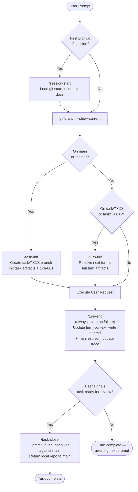

# coding-agents-config

Shared configuration for Claude Code and Codex coding agents. Enforces a task/turn-based
workflow (App Factory pipeline) with provenance tracking, branch protection, and
governance rules, plus a library of 37 skills for App Factory application generation,
NestJS/Prisma scaffolding, and pipeline automation.

## Setup

### 1. Clone the repo

```sh
git clone <repo-url> ~/coding-agents-config
```

### 2. Create symlinks (automated)

Run the setup script — it links this repo into `~/.claude/`, `~/.codex/`, and a
repo-local `./.claude/`, backing up any existing files first:

```sh
bash scripts/setup.sh
```

<details>
<summary>Manual symlink commands</summary>

```sh
# ~/.claude/
ln -s ~/coding-agents-config/skills ~/.claude/skills
ln -s ~/coding-agents-config/agents ~/.claude/agents
ln -s ~/coding-agents-config/hooks ~/.claude/hooks
ln -s ~/coding-agents-config/scripts ~/.claude/scripts
ln -s ~/coding-agents-config/CLAUDE.md ~/.claude/CLAUDE.md
ln -s ~/coding-agents-config/settings.json ~/.claude/settings.json

# ~/.codex/
ln -s ~/coding-agents-config/agents ~/.codex/agents
ln -s ~/coding-agents-config/AGENTS.md ~/.codex/AGENTS.md

# repo-local ./.claude/
ln -s ~/coding-agents-config/CLAUDE.md ./.claude/CLAUDE.md
```

`rules/`, `context/`, and `plugins/` are also linked into `~/.claude/` by the setup
script if present in this repo, for future use.

If any target already exists, back it up first (`mv <target> <target>.bak`).
</details>

### 3. Verify

```sh
ls -la ~/.claude/skills        # should point to ~/coding-agents-config/skills
ls -la ~/.claude/agents        # should point to ~/coding-agents-config/agents
ls -la ~/.claude/hooks         # should point to ~/coding-agents-config/hooks
ls -la ~/.claude/CLAUDE.md     # should point to ~/coding-agents-config/CLAUDE.md
ls -la ~/.claude/settings.json # should point to ~/coding-agents-config/settings.json
ls -la ~/.codex/AGENTS.md      # should point to ~/coding-agents-config/AGENTS.md
```

## Structure

```
coding-agents-config/
├── CLAUDE.md           # Global instructions — task/turn protocol, branch rules
├── AGENTS.md           # Codex agent loader directive (loads ~/.claude/CLAUDE.md)
├── settings.json        # Claude Code settings (model, permissions, hooks, plugins)
├── package.json         # Repo-level npm dependency (caveman)
├── agents/              # Standalone agent definitions
│   └── agent-architecture-planner.md
├── hooks/                # Shell hooks triggered by Claude Code events
│   └── branch-guard.sh   # PreToolUse(Bash) legacy main/master branch guard
├── scripts/              # Automation scripts
│   ├── setup.sh          # Creates the symlinks described above
│   └── af-state.sh       # AppFactory state.yaml helpers, sourced by af-* skills
├── skills/               # Slash-command skills (37 total, see below)
│   ├── .system/           # Meta-skills (skill-creator, skill-installer, plugin-creator, ...)
│   ├── .nestjs/            # NestJS/Prisma scaffolding skills
│   ├── af-*/               # App Factory (AF) pipeline skills
│   ├── session-start/      # Load repo state and pipeline context
│   ├── task-init/          # Create a new task branch + turn-001
│   ├── turn-init/          # Create the next turn on a task branch
│   ├── turn-end/           # Finalize a turn (ADR, manifest, trace)
│   ├── task-close/         # Push task branch and open a PR
│   ├── branch-guard/       # Legacy: create a turn branch if on main
│   ├── dsl-utils/          # DSL parsing utilities
│   ├── e2e-tests/          # HTTP/E2E test artifact generation
│   ├── ui-utils/           # UI DSL language reference
│   ├── unit-tests/         # Test/implementation sync
│   └── eval-labeler/       # Model response evaluation labeling
├── archive/               # Superseded skills library and legacy turn history
├── docs/                  # Reference and migration documentation
└── .appfactory/           # Task/turn tracking and pipeline state
    ├── tasks/              # task-XXX/ directories, each with its turns/
    ├── tasks_index.csv     # Registry of all tasks
    ├── specs/              # Specifications
    ├── prompts/            # Prompt templates
    ├── memory/             # Pipeline state (state.yaml)
    └── changelog.md        # Turn-by-turn change history
```

## Task / Turn Workflow

The agentic pipeline enforces a task-branch + turn-based workflow for all coding
tasks, driven by `CLAUDE.md`:


```mermaid
flowchart TB
    START([User Prompt]) --> FIRST{First prompt<br/>of session?}
    FIRST -->|Yes| SESSION_START["/session-start<br/>Load git state + context docs"]
    FIRST -->|No| CHECK_BRANCH
    SESSION_START --> CHECK_BRANCH["git branch --show-current"]

    CHECK_BRANCH --> IS_MAIN{On main<br/>or master?}
    IS_MAIN -->|Yes| TASK_INIT["/task-init<br/>Create task/TXXX branch<br/>Init task artifacts + turn-001"]
    IS_MAIN -->|No| IS_TASK{On task/TXXX<br/>or task/TXXX-*?}
    IS_TASK -->|Yes| TURN_INIT["/turn-init<br/>Resolve next turn id<br/>Init turn artifacts"]
    IS_TASK -->|No| EXEC

    TASK_INIT --> EXEC["Execute User Request"]
    TURN_INIT --> EXEC

    EXEC --> TURN_END["/turn-end<br/>(always, even on failure)<br/>Update turn_context, write adr.md<br/>+ manifest.json, update trace"]

    TURN_END --> READY{User signals<br/>task ready for review?}
    READY -->|Yes| TASK_CLOSE["/task-close<br/>Commit, push, open PR against main<br/>Return local repo to main"]
    READY -->|No| DONE([Turn complete —<br/>awaiting next prompt])
    TASK_CLOSE --> DONE2([Task complete])
```

### Hard Gate

Code is never written directly on `main` or `master`. If the current branch is
`main`/`master`, `/task-init` must run and succeed — creating `task/TXXX` and its
`turn-001` artifacts — before any write or edit action.

### Task / Turn Protocol Summary

| Phase | Skill | Trigger | Key Outputs |
|-------|-------|---------|--------------|
| **Session Start** | `session-start` | First prompt of session | Git state + context docs loaded |
| **Task Init** | `task-init` | Current branch is `main`/`master` | `task/TXXX` branch, `task_context.md`, `task_status.json`, `task_summary.md`, `pull_request.md`, `turn-001` artifacts |
| **Turn Init** | `turn-init` | Already on a `task/TXXX` branch | Next `turn_context.md`, `execution_trace.json` |
| **Execution** | — | After init | Modified files |
| **Turn End** | `turn-end` | After every prompt, always | Finalized `turn_context.md`, `adr.md`, `manifest.json`, updated `execution_trace.json` |
| **Task Close** | `task-close` | User signals task is ready for review | Commit, push, PR against `main`, task status `pr-open`, local repo returned to `main` |

Task ids are global and zero-padded to 3 digits (`001`, `002`, ...); turn ids reset
per task and are also zero-padded (`turn-001`, `turn-002`, ...). Every task and turn
directory lives under `.appfactory/tasks/task-XXX/` and
`.appfactory/tasks/task-XXX/turns/turn-XXX/` respectively — see `CLAUDE.md` for the
full directory and artifact contract.

## Skills (37)

### Pipeline / Governance

| Skill | Description |
|-------|-------------|
| `session-start` | Load repository state and core pipeline context at session start |
| `task-init` | Initialize a new task branch and create task + turn-001 artifacts |
| `turn-init` | Initialize the next turn within the active task branch |
| `turn-end` | Finalize the active turn (ADR, manifest, execution trace) |
| `task-close` | Finalize the active task, push it, and open a PR against `main` |
| `branch-guard` | Legacy: create a turn-scoped branch if on `main`/`master` |

### App Factory (AF) Pipeline

| Skill | Description |
|-------|-------------|
| `af-orchestrator` | Orchestrates the App Factory software development lifecycle |
| `af-project-init` | Export required env vars and invoke the AppFactory init helper script |
| `af-memory` | CRUD operations for AppFactory pipeline state (`state.yaml`) |
| `af-be-prd-build` | Build a backend-focused PRD from a completed intake worksheet |
| `af-be-ddd-orchestrator` | Orchestrate the backend DDD build → analyze → refactor → test loop |
| `af-be-ddd-build` | Generate a backend Domain-Driven Design document from an approved PRD |
| `af-be-ddd-analysis` | Audit a generated DDD spec for quality, completeness, and PRD alignment |
| `af-be-ddd-refactor` | Apply targeted patches to a DDD spec from analysis findings |
| `af-be-ddd-dsl` | Generate a backend application DSL YAML from a DDD document |
| `af-be-ddd-tests` | Generate Gherkin BDD feature files from DDD and PRD specifications |
| `af-be-plan` | Generate a backend execution plan from a domain DSL and tech stack profile |
| `af-be-implementation` | Generate backend domain code from the execution plan and BDD specs |
| `af-app-check` | Audit an application for production readiness (security, DB, deploy, quality) |

### NestJS / Prisma (`.nestjs`)

| Skill | Description |
|-------|-------------|
| `app-from-dsl` | Orchestrate full-stack app generation from app-dsl YAML specifications |
| `nestjs-crud-resource` | Generate a NestJS CRUD module from a DSL backend specification |
| `nestjs-prisma-resource` | Generate a deterministic, schema-driven NestJS + Prisma CRUD resource |
| `nestjs-customer-crud-scaffold` | Scaffold a NestJS customer CRUD app via a non-interactive Nest CLI wrapper |
| `nestjs-observability` | Add structured logging, correlation ids, and redaction to a NestJS/Prisma backend |
| `field-mapper-generator` | Generate field mapper/converter utilities from DSL mapper specs |
| `prisma/prisma-persistence` | Generate Prisma schema and migrations from a DSL persistence model |
| `prisma/prisma-guidelines` | Prisma ORM development guidelines and constraints reference |

### Utilities

| Skill | Description |
|-------|-------------|
| `dsl-utils/dsl-model-interpreter` | Parse and validate app-dsl YAML specifications |
| `ui-utils/ui-implementation-language` | Declarative YAML standard for UI pages, forms, and widgets |
| `e2e-tests/http-test-artifacts` | Generate `.http` request files for API endpoint testing |
| `unit-tests/test-implementation-sync` | Keep unit tests synchronized with service/DTO implementations |
| `eval-labeler` | Label and score Eval.md model-response comparisons in run directories |

### Meta-Skills (`.system`)

| Skill | Description |
|-------|-------------|
| `skill-creator` | Guide for creating or updating a skill |
| `skill-installer` | Install skills from a curated list or a GitHub repo path |
| `plugin-creator` | Scaffold plugin directories and marketplace entries |
| `imagegen` | Generate or edit raster images for a task |
| `openai-docs` | Look up official OpenAI product/API documentation |

## Agents

| Agent | Description |
|-------|-------------|
| `agent-architecture-planner` | Reads PRD/DDD/DSL and repo structure to produce architecture decisions, module maps, task plans, and review artifacts |

## Hooks

| Hook | Trigger | Purpose |
|------|---------|---------|
| `branch-guard.sh` | `PreToolUse(Bash)` | Legacy guard blocking direct work on `main`/`master` |

## Scripts

| Script | Purpose |
|--------|---------|
| `setup.sh` | Create the `~/.claude`, `~/.codex`, and repo-local `.claude` symlinks |
| `af-state.sh` | Read/write `.appfactory/memory/state.yaml`; sourced by `af-*` skills |

## `.appfactory/`

Runtime state for the task/turn pipeline described above:

- `tasks/task-XXX/` — one directory per task, each with `task_context.md`,
  `task_status.json`, `task_summary.md`, `pull_request.md`, and a `turns/`
  subdirectory of `turn-XXX/` directories (`turn_context.md`,
  `execution_trace.json`, `adr.md`, `manifest.json`)
- `tasks_index.csv` — registry of all tasks and their status
- `specs/` — specifications consumed by the AF pipeline
- `prompts/` — prompt templates used across skills
- `memory/` — `state.yaml` pipeline state, managed by `af-memory` / `af-state.sh`
- `changelog.md` — turn-by-turn change history reconstructed from artifacts

## `docs/`

Reference and migration documentation, including the App Factory plan, the
Next.js/NestJS/Prisma stack guide, and the `ai/` → `.appfactory/` migration
analysis.

## `archive/`

Superseded skills library and legacy turn history, kept for reference. Several
skills here (e.g. `app-from-dsl`, `nestjs-crud-resource`, `prisma-persistence`)
have since been reorganized under `skills/.nestjs/` and other categories above.

## Adding a new skill

Each skill lives in its own directory under `skills/` with a `SKILL.md` file:

```
skills/my-skill/
└── SKILL.md
```

The `.system/skill-creator` meta-skill can guide you through creating one — invoke it from Claude Code.

## Syncing across machines

Since this is a standard git repo, pull on any machine to stay current:

```sh
cd ~/coding-agents-config && git pull
```

The symlinks mean changes are picked up immediately — no reinstall needed.
