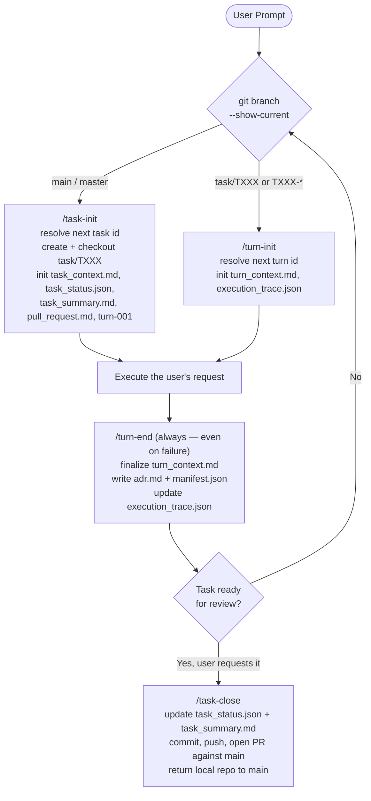

# coding-agents-config

Shared configuration for Claude Code and Codex coding agents. Provides a
task/turn governance workflow (branch protection, provenance tracking, PR
automation) plus the **App Factory** (`af-*`) skill suite for PRD → DDD →
DSL → plan → implementation generation of full-stack applications.

## Setup

### 1. Clone the repo

```sh
git clone <repo-url> ~/coding-agents-config
```

### 2. Create symlinks (automated)

Run the setup script — it creates all symlinks and backs up any existing files:

```sh
bash scripts/setup.sh
```

<details>
<summary>Manual symlink commands</summary>

```sh
# Claude Code (~/.claude/)
ln -s ~/coding-agents-config/skills       ~/.claude/skills
ln -s ~/coding-agents-config/agents       ~/.claude/agents
ln -s ~/coding-agents-config/hooks        ~/.claude/hooks
ln -s ~/coding-agents-config/scripts      ~/.claude/scripts
ln -s ~/coding-agents-config/CLAUDE.md    ~/.claude/CLAUDE.md
ln -s ~/coding-agents-config/settings.json ~/.claude/settings.json

# Codex (~/.codex/)
ln -s ~/coding-agents-config/agents    ~/.codex/agents
ln -s ~/coding-agents-config/AGENTS.md ~/.codex/AGENTS.md

# Repo-local Claude config (for tools that expect ./.claude/)
ln -s ~/coding-agents-config/CLAUDE.md ./.claude/CLAUDE.md
```

If any of these already exist, back them up first (`mv <target> <target>.bak`).
`scripts/setup.sh` also links `rules/`, `context/`, and `plugins/` into
`~/.claude/` in anticipation of those directories being added later — they
don't exist in this repo yet.
</details>

### 3. Verify

```sh
ls -la ~/.claude/skills        # should point to ~/coding-agents-config/skills
ls -la ~/.claude/agents        # should point to ~/coding-agents-config/agents
ls -la ~/.claude/hooks         # should point to ~/coding-agents-config/hooks
ls -la ~/.claude/CLAUDE.md     # should point to ~/coding-agents-config/CLAUDE.md
ls -la ~/.claude/settings.json # should point to ~/coding-agents-config/settings.json
ls -la ~/.codex/AGENTS.md      # should point to ~/coding-agents-config/AGENTS.md
```

## Structure

```
coding-agents-config/
├── CLAUDE.md              # Global instructions — task/turn protocol, branch rules
├── AGENTS.md              # Codex loader directive → reads ~/.claude/CLAUDE.md
├── settings.json          # Claude Code settings (model, permissions)
├── package.json           # Node dependencies (caveman templating)
├── agents/                # Claude Code subagent definitions
│   └── agent-architecture-planner.md
├── hooks/                 # Shell hooks triggered by Claude Code events
│   └── branch-guard.sh    # Blocks edits while on main/master
├── scripts/               # Automation scripts
│   ├── setup.sh           # Create symlinks into ~/.claude and ~/.codex
│   └── af-state.sh        # state.yaml helpers sourced by af-* skills
├── skills/                # Slash-command skills
│   ├── .system/           # Synced Codex meta-skills (skill-creator, skill-installer,
│   │                      #   plugin-creator, imagegen, openai-docs)
│   ├── session-start/     # Load repo state at the start of every session
│   ├── task-init/         # Create task/TXXX branch + task + turn-001 artifacts
│   ├── turn-init/         # Create the next turn's artifacts on a task branch
│   ├── turn-end/          # Finalize a turn (ADR, manifest, execution trace)
│   ├── task-close/        # Finalize task, push branch, open PR against main
│   ├── branch-guard/      # Legacy manual fallback: branch off main if needed
│   ├── af-orchestrator/   # Orchestrates the full App Factory SDLC
│   ├── af-project-init/   # Bootstrap an AppFactory project's env + state
│   ├── af-be-prd-build/   # Business-facing backend PRD from an intake worksheet
│   ├── af-be-ddd-build/   # Backend DDD doc from an approved PRD
│   ├── af-be-ddd-analysis/# Audit a DDD doc for gaps vs. the PRD
│   ├── af-be-ddd-refactor/# Patch a DDD doc using af-be-ddd-analysis findings
│   ├── af-be-ddd-dsl/     # Backend DSL YAML from a DDD doc
│   ├── af-be-ddd-orchestrator/ # Runs the build/analyze/refactor/test DDD loop
│   ├── af-be-ddd-tests/   # Gherkin BDD feature files from DDD + PRD
│   ├── af-be-plan/        # Backend execution plan from DSL + tech-stack profile
│   ├── af-be-implementation/ # Generate backend code from plan + BDD specs
│   ├── af-memory/         # CRUD for .appfactory/memory/state.yaml
│   ├── af-app-check/      # Production-readiness audit
│   ├── dsl-utils/, e2e-tests/, ui-utils/, unit-tests/ # Nested utility skill groups
│   └── eval-labeler/      # Label/compare model responses for eval runs
├── .appfactory/           # Task/turn tracking and AppFactory specs
│   ├── tasks/             # task-XXX/ dirs, each with turns/turn-XXX/ artifacts
│   ├── tasks_index.csv    # Registry of all tasks and their status
│   ├── changelog.md       # Narrative turn-by-turn changelog
│   ├── specs/             # Specifications
│   ├── prompts/           # Prompt templates
│   └── memory/            # Project/pipeline state (state.yaml)
├── archive/               # Retired skills and templates from earlier iterations
│   └── templates/         # Old adr/pr/manifest templates (superseded, kept for reference)
├── docs/                  # Reference/design documentation
└── .github/               # Issue templates, PR template
```

## Task and Turn Model

A **task** is the branch-scoped unit of work that becomes one pull request
(`task/TXXX`). A **turn** is one AI execution cycle within the active task.
Task ids are global and zero-padded (`001`, `002`, ...); turn ids reset per
task and are also zero-padded (`turn-001`, `turn-002`, ...).


```mermaid
flowchart TB
    START([User Prompt]) --> BR{git branch<br/>--show-current}
    BR -->|main / master| TASK_INIT["/task-init<br/>resolve next task id<br/>create + checkout task/TXXX<br/>init task_context.md, task_status.json,<br/>task_summary.md, pull_request.md, turn-001"]
    BR -->|task/TXXX or TXXX-*| TURN_INIT["/turn-init<br/>resolve next turn id<br/>init turn_context.md, execution_trace.json"]

    TASK_INIT --> EXEC["Execute the user's request"]
    TURN_INIT --> EXEC

    EXEC --> TURN_END["/turn-end (always — even on failure)<br/>finalize turn_context.md<br/>write adr.md + manifest.json<br/>update execution_trace.json"]

    TURN_END --> READY{Task ready<br/>for review?}
    READY -->|No| BR
    READY -->|Yes, user requests it| TASK_CLOSE["/task-close<br/>update task_status.json + task_summary.md<br/>commit, push, open PR against main<br/>return local repo to main"]
```

### Turn Protocol Summary

| Phase | Skill | When | Outputs |
|-------|-------|------|---------|
| Session start | `session-start` | First prompt of a session | Git state + pipeline context loaded |
| Task init | `task-init` | Branch is `main`/`master` | `task/TXXX` branch, task artifacts, `turn-001` |
| Turn init | `turn-init` | Branch is `task/TXXX[-*]` | Next `turn-XXX` artifacts |
| Execution | — | Every coding prompt | Modified files |
| Turn end | `turn-end` | After every prompt, even on failure | `adr.md`, `manifest.json`, updated context/trace |
| Task close | `task-close` | User signals the task is ready for review | Pushed branch, PR against `main` |

## Skills

| Category | Skill | Description |
|----------|-------|-------------|
| **Governance** | `session-start` | Load repo state and core pipeline context at session start |
| | `task-init` | Create a new task branch plus task + turn-001 artifacts |
| | `turn-init` | Create the next turn's artifacts within the active task |
| | `turn-end` | Finalize a turn: ADR, manifest, execution trace |
| | `task-close` | Finalize task branch, push, open PR against `main` |
| | `branch-guard` | Legacy manual fallback to branch off `main`/`master` |
| **App Factory** | `af-orchestrator` | Orchestrate the full App Factory SDLC |
| | `af-project-init` | Bootstrap an AppFactory project's env vars and state |
| | `af-be-prd-build` | Build a business-facing backend PRD from an intake worksheet |
| | `af-be-ddd-build` | Generate a backend DDD document from an approved PRD |
| | `af-be-ddd-analysis` | Audit a DDD document for completeness and PRD alignment |
| | `af-be-ddd-refactor` | Patch a DDD document from `af-be-ddd-analysis` findings |
| | `af-be-ddd-dsl` | Generate a backend DSL YAML document from a DDD document |
| | `af-be-ddd-orchestrator` | Run the DDD build/analyze/refactor/test loop |
| | `af-be-ddd-tests` | Generate Gherkin BDD feature files from DDD + PRD |
| | `af-be-plan` | Generate a backend execution plan from DSL + tech-stack profile |
| | `af-be-implementation` | Generate backend code from the plan and BDD feature specs |
| | `af-memory` | CRUD operations on `.appfactory/memory/state.yaml` |
| | `af-app-check` | Audit an application for production readiness |
| **Utility groups** | `dsl-utils/dsl-model-interpreter` | Parse and validate DSL YAML specifications |
| | `e2e-tests/http-test-artifacts` | Generate `.http` request files for end-to-end testing |
| | `ui-utils/ui-implementation-language` | UI implementation language reference |
| | `unit-tests/test-implementation-sync` | Keep unit tests in sync with implementation |
| **Eval** | `eval-labeler` | Label/compare model responses (Response A vs. B) for coding tasks |

### Meta-Skills (`.system`)

Synced from Codex's system skill set (not authored in this repo):

| Skill | Description |
|-------|-------------|
| `skill-creator` | Guide for creating or updating skills |
| `skill-installer` | Install skills into `$CODEX_HOME/skills` from a curated list or repo |
| `plugin-creator` | Scaffold Codex plugin directories and marketplace entries |
| `imagegen` | Generate or edit raster images |
| `openai-docs` | Look up official OpenAI product/API documentation |

## Agents

| Agent | Purpose |
|-------|---------|
| `agent-architecture-planner` | Reads PRD/DDD/DSL and repo structure to produce architecture decisions, module maps, and task plans for App Factory projects |

## Hooks

| Hook | Trigger | Purpose |
|------|---------|---------|
| `branch-guard.sh` | PreToolUse(Edit) | Block edits on `main`/`master` |

## Scripts

| Script | Purpose |
|--------|---------|
| `setup.sh` | Create the symlinks described in [Setup](#setup) above |
| `af-state.sh` | Helpers for reading/writing `.appfactory/memory/state.yaml`, sourced by `af-*` skills |

## Archive

`archive/` holds skills and templates retired from earlier iterations of this
pipeline (e.g. the original DSL-first `app-from-dsl` generation flow and the
pre-`.appfactory` template set). Kept for reference; not symlinked or active.

## Adding a new skill

Each skill lives in its own directory under `skills/` with a `SKILL.md` file:

```
skills/my-skill/
└── SKILL.md
```

The `.system/skill-creator` meta-skill can guide you through creating one — invoke it from Claude Code.

## Syncing across machines

Since this is a standard git repo, pull on any machine to stay current:

```sh
cd ~/coding-agents-config && git pull
```

The symlinks mean changes are picked up immediately — no reinstall needed.
