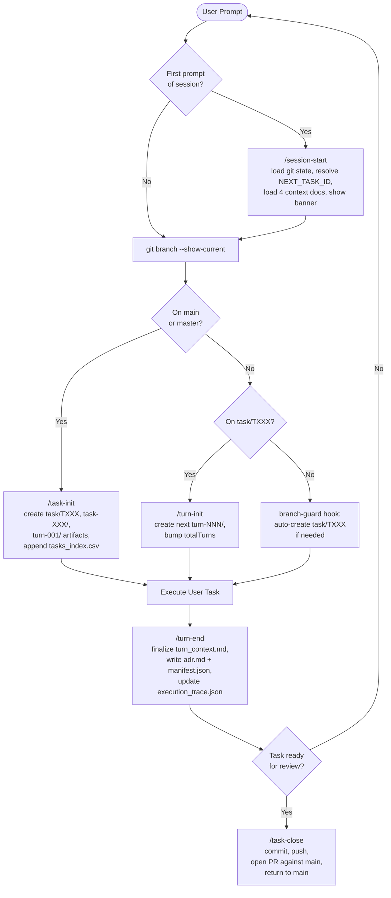

# coding-agents-config

Agentic pipeline configuration for Claude Code (and Codex). Enforces a
task/turn-based workflow with provenance tracking, branch protection,
governance rules, and an AppFactory backend code-generation pipeline.

## Setup

### 1. Clone the repo

```sh
git clone <repo-url> ~/coding-agents-config
```

### 2. Create symlinks (automated)

Run the setup script — it creates all symlinks and backs up any existing files:

```sh
bash scripts/setup.sh
```

This links `skills`, `agents`, `hooks`, `scripts`, `CLAUDE.md`, and
`settings.json` (plus optional `rules/`, `context/`, `plugins/` if present)
into `~/.claude/`, links `agents` and `AGENTS.md` into `~/.codex/`, and links
`CLAUDE.md` into the repo-local `./.claude/`.

<details>
<summary>Manual symlink commands</summary>

```sh
ln -s ~/coding-agents-config/skills ~/.claude/skills
ln -s ~/coding-agents-config/agents ~/.claude/agents
ln -s ~/coding-agents-config/hooks ~/.claude/hooks
ln -s ~/coding-agents-config/scripts ~/.claude/scripts
ln -s ~/coding-agents-config/CLAUDE.md ~/.claude/CLAUDE.md
ln -s ~/coding-agents-config/settings.json ~/.claude/settings.json

ln -s ~/coding-agents-config/agents ~/.codex/agents
ln -s ~/coding-agents-config/AGENTS.md ~/.codex/AGENTS.md
```

If any of these already exist, back them up first (`mv <target> <target>.bak`).
</details>

### 3. Verify

```sh
ls -la ~/.claude/skills        # should point to ~/coding-agents-config/skills
ls -la ~/.claude/agents        # should point to ~/coding-agents-config/agents
ls -la ~/.claude/hooks         # should point to ~/coding-agents-config/hooks
ls -la ~/.claude/scripts       # should point to ~/coding-agents-config/scripts
ls -la ~/.claude/CLAUDE.md     # should point to ~/coding-agents-config/CLAUDE.md
ls -la ~/.claude/settings.json # should point to ~/coding-agents-config/settings.json
```

## Structure

```
coding-agents-config/
├── CLAUDE.md           # Global instructions — task/turn protocol, branch rules
├── AGENTS.md           # Codex agent loader directive
├── settings.json       # Claude Code settings (model, permissions, hooks)
├── package.json        # Node dependency manifest
├── agents/             # Subagent definitions
│   └── agent-architecture-planner.md
├── hooks/              # Shell hooks triggered by Claude Code events
│   └── branch-guard.sh # Auto-creates a task/TXXX branch when on main/master
├── skills/             # Slash-command skills (Agent Skills format)
│   ├── session-start/  # Load repo state + pipeline context docs
│   ├── task-init/      # Create task/TXXX branch + task + turn-001 artifacts
│   ├── turn-init/      # Create the next turn-NNN directory + artifacts
│   ├── turn-end/       # Finalize a turn (ADR, manifest, trace)
│   ├── task-close/     # Push task branch and open a PR against main
│   ├── branch-guard/   # Fallback branch protection
│   ├── af-*/           # AppFactory backend DDD pipeline (13 skills)
│   ├── dsl-utils/, ui-utils/, unit-tests/, e2e-tests/  # Utility skill groups
│   ├── eval-labeler/   # Model response evaluation/labeling
│   ├── .system/        # Vendored Codex meta-skills (skill-creator, etc.)
│   └── .nestjs/        # Vendored NestJS/Prisma/DSL reference skills
├── scripts/            # Repo-level automation
│   ├── setup.sh        # Create symlinks into ~/.claude and ~/.codex
│   └── af-state.sh     # Helpers for .appfactory/memory/state.yaml
├── docs/               # AppFactory reference docs and migration analyses
├── archive/            # Superseded skills, templates, and skill libraries
├── .appfactory/        # Task/turn tracking, specs, prompts, memory
│   ├── tasks/          # task-XXX/ directories with turns/turn-XXX artifacts
│   ├── tasks_index.csv # Registry of all tasks
│   ├── specs/          # Specifications
│   ├── prompts/        # Prompt templates for pipeline stages
│   └── memory/         # Pipeline state (state.yaml)
└── .github/            # Issue and pull request templates
```

## Execution Flow

The agentic pipeline enforces a task/turn-based workflow for all coding tasks:


```mermaid
flowchart TB
    START([User Prompt]) --> SS{First prompt<br/>of session?}
    SS -->|Yes| SESSION_START["/session-start<br/>load git state, resolve NEXT_TASK_ID,<br/>load 4 context docs, show banner"]
    SS -->|No| BRANCH_CHECK
    SESSION_START --> BRANCH_CHECK["git branch --show-current"]

    BRANCH_CHECK --> IS_MAIN{On main<br/>or master?}
    IS_MAIN -->|Yes| TASK_INIT["/task-init<br/>create task/TXXX, task-XXX/,<br/>turn-001/ artifacts,<br/>append tasks_index.csv"]
    IS_MAIN -->|No| IS_TASK{On task/TXXX?}
    IS_TASK -->|Yes| TURN_INIT["/turn-init<br/>create next turn-NNN/,<br/>bump totalTurns"]
    IS_TASK -->|No| WARN["branch-guard hook:<br/>auto-create task/TXXX<br/>if needed"]

    TASK_INIT --> EXEC["Execute User Task"]
    TURN_INIT --> EXEC
    WARN --> EXEC

    EXEC --> TURN_END["/turn-end<br/>finalize turn_context.md,<br/>write adr.md + manifest.json,<br/>update execution_trace.json"]
    TURN_END --> DONE{Task ready<br/>for review?}
    DONE -->|No| START
    DONE -->|Yes| TASK_CLOSE["/task-close<br/>commit, push,<br/>open PR against main,<br/>return to main"]
```

### Turn Protocol Summary

| Phase | Skill | Trigger | Key Outputs |
|-------|-------|---------|-------------|
| **Session start** | `session-start` | First prompt of a session | Git state + 4 context docs loaded, status banner |
| **Task init** | `task-init` | Current branch is `main`/`master` | New `task/TXXX` branch, `task-XXX/` dir, `turn-001/` artifacts, `tasks_index.csv` row |
| **Turn init** | `turn-init` | Already on `task/TXXX` | New `turn-NNN/` dir, `turn_context.md`, `execution_trace.json`, `totalTurns` bumped |
| **Execution** | — | Always | User's request executed |
| **Turn end** | `turn-end` | After every prompt, even on failure | `turn_context.md` finalized, `adr.md`, `manifest.json`, `execution_trace.json` updated |
| **Task close** | `task-close` | User signals the task is ready for review | Task artifacts updated, commit, push, PR opened against `main`, branch returns to `main` |
| **Branch guard** | `branch-guard` skill / `hooks/branch-guard.sh` | Fallback if a write/Bash tool runs on `main`/`master` | Auto-creates and switches to `task/TXXX` |

## Skills (24)

### Pipeline Lifecycle

| Skill | Description |
|-------|-------------|
| `session-start` | Load git state and the four pipeline context docs (ADR, governance, tech standards, turn tracking) at session start |
| `task-init` | Create a `task/TXXX` branch and `task-XXX/` directory with `turn-001` artifacts when on `main`/`master` |
| `turn-init` | Create the next `turn-NNN/` directory and artifacts within the active task |
| `turn-end` | Finalize a turn — update `turn_context.md`, write `adr.md` and `manifest.json`, update `execution_trace.json` |
| `task-close` | Finalize task artifacts, commit, push the task branch, and open a PR against `main` |
| `branch-guard` | Create a turn/task-scoped branch if work is attempted on `main` or `master` |

### AppFactory Backend Pipeline (`af-*`)

| Skill | Description |
|-------|-------------|
| `af-orchestrator` | Orchestrates the App Factory software development lifecycle |
| `af-project-init` | Orchestrate AppFactory project initialization by exporting required environment variables and invoking the helper script |
| `af-be-prd-build` | Build a business-facing backend PRD from an intake worksheet, questionnaire, or discovery notes |
| `af-be-ddd-orchestrator` | Orchestrate the backend DDD workflow through build, analyze, refactor-loop, and test phases |
| `af-be-ddd-build` | Generate a human-readable backend DDD document from an approved PRD |
| `af-be-ddd-analysis` | Audit a generated DDD specification for quality, completeness, and PRD alignment |
| `af-be-ddd-refactor` | Refactor a DDD specification using the findings from `af-be-ddd-analysis` |
| `af-be-ddd-tests` | Generate Gherkin-style BDD feature files from DDD and PRD specifications |
| `af-be-ddd-dsl` | Generate a backend application DSL YAML document from the DDD document |
| `af-be-plan` | Generate a backend execution plan from a domain DSL and a tech stack profile |
| `af-be-implementation` | Generate backend code from the execution plan and BDD feature specifications |
| `af-app-check` | Audit an application for production readiness across security, database, deployment, and code quality |
| `af-memory` | CRUD operations on `.appfactory/memory/state.yaml` for pipeline state tracking |

See `docs/skill-summary.md` for the full pipeline phase/step ordering and invocation hierarchy.

### Utility Skill Groups

| Group | Skill | Description |
|-------|-------|-------------|
| `dsl-utils/` | `dsl-model-interpreter` | Parse and validate `app-dsl` YAML specifications before code generation |
| `ui-utils/` | `ui-implementation-language` | Declarative YAML standard for UI pages, layouts, widgets, forms, and bindings |
| `unit-tests/` | `test-implementation-sync` | Keep generated unit tests synchronized with actual service/DTO implementations |
| `e2e-tests/` | `http-test-artifacts` | Generate `.http` request files for API endpoint testing |

### Evaluation

| Skill | Description |
|-------|-------------|
| `eval-labeler` | Process `Eval.md` files to label and compare model responses (Response A vs B) for coding tasks |

### Vendored Skill Bundles

| Path | Purpose |
|------|---------|
| `skills/.system/` | Codex-bundled meta-skills — `skill-creator`, `skill-installer`, `plugin-creator`, `imagegen`, `openai-docs` |
| `skills/.nestjs/` | Reference skills for NestJS + Prisma + DSL-driven generation (`app-from-dsl`, `nestjs-crud-resource`, `prisma-persistence`, etc.) |

## Agents

| Agent | Description |
|-------|-------------|
| `agent-architecture-planner` | Reads the PRD, DDD, DSL, and existing repo structure to produce architecture decisions, module maps, task plans, sequencing, and review artifacts for downstream coding agents |

## Hooks

| Hook | Trigger | Purpose |
|------|---------|---------|
| `branch-guard.sh` | PreToolUse (Bash and write tools) | Auto-creates and switches to the next `task/TXXX` branch if still on `main`/`master` |

## Reference Docs

`docs/` contains AppFactory planning and migration references:

| Doc | Purpose |
|-----|---------|
| `appFactory-plan.md` | AppFactory implementation plan |
| `skill-summary.md` | AppFactory skill pipeline reference (phases, steps, invocation hierarchy) |
| `app-nextjs-nestjs-prisma.md` | Skill orchestration pipeline for Next.js + NestJS + Prisma generation |
| `migration-ai-to-appfactory.md` | Migration record of `ai/` → `.appfactory/` |
| `ai-to-appfactory-migration-analysis.md` | Analysis backing the `ai/` → `.appfactory/` migration |

## Archive

`archive/` holds superseded skills and reference material kept for history,
including an earlier DSL-driven full-stack skill library (`app-from-dsl`,
`nestjs-crud-resource`, `prisma-persistence`, `react-form-page`, etc.),
`legacy-turns/`, `find-skills/`, and the legacy `templates/` (ADR, PR,
manifest schema, and other turn-lifecycle templates).

## Adding a new skill

Each skill lives in its own directory under `skills/` with a `SKILL.md` file:

```
skills/my-skill/
└── SKILL.md
```

`skills/.system/skill-creator` documents the standard `SKILL.md` structure
and can be used as a reference when authoring a new skill.

## Syncing across machines

Since this is a standard git repo, pull on any machine to stay current:

```sh
cd ~/coding-agents-config && git pull
```

The symlinks mean changes are picked up immediately — no reinstall needed.
