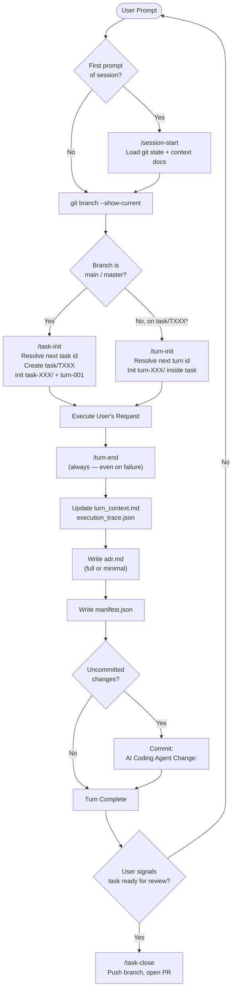

# coding-agents-config

Agentic pipeline configuration for Claude Code and Codex. Enforces a task/turn-based workflow with provenance tracking, branch protection, and governance rules, plus a library of AppFactory skills for backend DDD-driven code generation.

## Setup

### 1. Clone the repo

```sh
git clone <repo-url> ~/coding-agents-config
```

### 2. Create symlinks (automated)

Run the setup script — it creates all symlinks and backs up any existing files:

```sh
bash scripts/setup.sh
```

<details>
<summary>Manual symlink commands</summary>

```sh
# ~/.claude
ln -s ~/coding-agents-config/skills    ~/.claude/skills
ln -s ~/coding-agents-config/agents    ~/.claude/agents
ln -s ~/coding-agents-config/hooks     ~/.claude/hooks
ln -s ~/coding-agents-config/scripts   ~/.claude/scripts
ln -s ~/coding-agents-config/CLAUDE.md ~/.claude/CLAUDE.md
ln -s ~/coding-agents-config/settings.json ~/.claude/settings.json

# ~/.codex
ln -s ~/coding-agents-config/agents    ~/.codex/agents
ln -s ~/coding-agents-config/AGENTS.md ~/.codex/AGENTS.md

# repo-local ./.claude
ln -s ~/coding-agents-config/CLAUDE.md ./.claude/CLAUDE.md
```

If any of these already exist, back them up first (`mv <target> <target>.bak`). `scripts/setup.sh` also links `rules`, `context`, and `plugins` when those directories are present.
</details>

### 3. Verify

```sh
ls -la ~/.claude/skills        # should point to ~/coding-agents-config/skills
ls -la ~/.claude/hooks         # should point to ~/coding-agents-config/hooks
ls -la ~/.claude/CLAUDE.md     # should point to ~/coding-agents-config/CLAUDE.md
ls -la ~/.claude/settings.json # should point to ~/coding-agents-config/settings.json
ls -la ~/.codex/AGENTS.md      # should point to ~/coding-agents-config/AGENTS.md
```

## Structure

```
coding-agents-config/
├── CLAUDE.md            # Global instructions — task/turn protocol, branch rules
├── AGENTS.md            # Agent loader directive for Codex
├── settings.json        # Claude Code settings (model, permissions, hooks, plugins)
├── package.json          # Plugin dependency (caveman)
├── hooks/               # Shell hooks triggered by Claude Code events
│   └── branch-guard.sh  # Legacy auto-branch hook (PreToolUse: Bash)
├── skills/               # Slash-command skills
│   ├── .system/          # Meta-skills shared with Codex
│   ├── session-start/    # Load repo state at session start
│   ├── task-init/        # Create task/TXXX branch + task artifacts
│   ├── turn-init/        # Initialize next turn inside the active task
│   ├── turn-end/         # Finalize turn artifacts (ADR, manifest, trace)
│   ├── task-close/       # Push task branch and open a PR
│   ├── branch-guard/     # Legacy turn/T{ID} branch creation
│   ├── af-*/              # AppFactory backend DDD pipeline skills
│   ├── dsl-utils/, e2e-tests/, ui-utils/, unit-tests/  # Category dirs, one nested skill each
│   └── eval-labeler/     # Label/compare model responses for eval runs
├── agents/                # Agent definitions (e.g. agent-architecture-planner.md)
├── scripts/               # Automation scripts
│   ├── setup.sh          # Create ~/.claude and ~/.codex symlinks
│   └── af-state.sh       # state.yaml helpers, sourced by af-* skills
├── docs/                  # Reference and design docs
├── archive/                # Deprecated skills and generic templates kept for reference
├── .appfactory/            # Task/turn tracking, specs, prompts, memory
│   ├── tasks/             # task-XXX/ directories, each with turns/turn-XXX/
│   ├── tasks_index.csv    # Registry of tasks (branch, status, PR URL)
│   ├── specs/
│   ├── prompts/
│   └── memory/
└── .github/                # PR and issue templates
```

Templates are no longer centralized: each skill that needs one ships it under its own `skills/<skill>/templates/` directory (e.g. `skills/af-be-plan/templates/execution-plan-template.md`). Older shared templates (ADR, PR body, tech-stack doc) live under `archive/templates/` for reference.

## Execution Flow

The agentic pipeline enforces a task/turn workflow for all coding prompts:


```mermaid
flowchart TB
    START([User Prompt]) --> SS{First prompt<br/>of session?}
    SS -->|Yes| SESSION_START["/session-start<br/>Load git state + context docs"]
    SS -->|No| CHECK_BRANCH
    SESSION_START --> CHECK_BRANCH

    CHECK_BRANCH["git branch --show-current"] --> IS_MAIN{Branch is<br/>main / master?}

    IS_MAIN -->|Yes| TASK_INIT["/task-init<br/>Resolve next task id<br/>Create task/TXXX<br/>Init task-XXX/ + turn-001"]
    IS_MAIN -->|No, on task/TXXX*| TURN_INIT["/turn-init<br/>Resolve next turn id<br/>Init turn-XXX/ inside task"]

    TASK_INIT --> EXEC
    TURN_INIT --> EXEC["Execute User's Request"]

    EXEC --> TURN_END["/turn-end<br/>(always — even on failure)"]
    TURN_END --> WRITE_CTX["Update turn_context.md<br/>execution_trace.json"]
    WRITE_CTX --> WRITE_ADR["Write adr.md<br/>(full or minimal)"]
    WRITE_ADR --> WRITE_MANIFEST["Write manifest.json"]
    WRITE_MANIFEST --> COMMIT{"Uncommitted<br/>changes?"}
    COMMIT -->|Yes| DO_COMMIT["Commit:<br/>AI Coding Agent Change:"]
    COMMIT -->|No| DONE
    DO_COMMIT --> DONE["Turn Complete"]

    DONE --> READY{User signals<br/>task ready for review?}
    READY -->|Yes| TASK_CLOSE["/task-close<br/>Push branch, open PR"]
    READY -->|No| START
```

### Turn Protocol Summary

| Phase | Trigger | Skill | Outputs |
|-------|---------|-------|---------|
| **Session Start** | First prompt of session | `/session-start` | Git state + context loaded |
| **Task Init** | Coding prompt while on `main`/`master` | `/task-init` | `task/TXXX` branch, `task-XXX/` + `turn-001/` artifacts |
| **Turn Init** | Coding prompt while on `task/TXXX(-*)` | `/turn-init` | Next `turn-XXX/` directory + context/trace |
| **Turn End** | After every prompt, even on failure | `/turn-end` | Updated context/trace, `adr.md`, `manifest.json`, commit |
| **Task Close** | User marks task ready for review | `/task-close` | Pushed branch, opened PR, `task_summary.md` |

`branch-guard` is a legacy hook-driven flow (still wired into `settings.json` via `hooks/branch-guard.sh`) that auto-creates a `turn/T{ID}` branch on `main`/`master`; the current CLAUDE.md protocol above supersedes it with `task/TXXX` branches.

## Skills

### Pipeline (task/turn protocol)

| Skill | Description |
|-------|-------------|
| `session-start` | Load repository git state and core pipeline context docs at session start |
| `task-init` | Create `task/TXXX` branch and initialize `task-XXX/` + `turn-001` artifacts (run on `main`/`master`) |
| `turn-init` | Initialize the next turn inside the active task branch |
| `turn-end` | Finalize the active turn: ADR, manifest, execution trace (run after every prompt) |
| `task-close` | Finalize the task branch, push it, and open a PR against main |
| `branch-guard` | Legacy: auto-create a `turn/T{ID}` branch when on `main`/`master` |

### AppFactory (backend DDD pipeline)

| Skill | Description |
|-------|-------------|
| `af-orchestrator` | Orchestrate the App Factory software development lifecycle end to end |
| `af-project-init` | Bootstrap AppFactory project env vars and invoke the init helper script |
| `af-memory` | CRUD operations on `.appfactory/memory/state.yaml` pipeline state |
| `af-app-check` | Audit an application for production readiness (security, database, deployment, code quality) |
| `af-be-prd-build` | Build a backend PRD from a completed intake worksheet |
| `af-be-ddd-build` | Generate a backend Domain-Driven Design document from an approved PRD |
| `af-be-ddd-analysis` | Audit a DDD spec for quality, completeness, and PRD alignment |
| `af-be-ddd-refactor` | Patch a DDD spec using `af-be-ddd-analysis` findings |
| `af-be-ddd-dsl` | Generate a backend DSL YAML document from a DDD document |
| `af-be-ddd-orchestrator` | Orchestrate the DDD build → analyze → refactor → test loop |
| `af-be-ddd-tests` | Generate Gherkin BDD feature files from DDD and PRD specs |
| `af-be-plan` | Generate a backend execution plan from a domain DSL and tech stack profile |
| `af-be-implementation` | Generate backend source code from the execution plan and BDD feature specs |

### Utility

| Skill | Description |
|-------|-------------|
| `dsl-utils/dsl-model-interpreter` | Parse and validate app-dsl YAML specifications |
| `e2e-tests/http-test-artifacts` | Generate `.http` files for REST endpoint testing |
| `ui-utils/ui-implementation-language` | Declarative YAML standard for UI pages, widgets, forms, and bindings |
| `unit-tests/test-implementation-sync` | Keep unit tests synchronized with service/DTO implementations |
| `eval-labeler` | Process `Eval.md` files to label and compare Response A vs Response B for coding tasks |

### Meta-skills (`.system`, shared with Codex)

| Skill | Description |
|-------|-------------|
| `skill-creator` | Guide for creating and updating skills |
| `skill-installer` | Install skills into `$CODEX_HOME/skills` from a curated list or GitHub repo |
| `plugin-creator` | Scaffold Codex plugin directories with a `.codex-plugin/plugin.json` manifest |
| `imagegen` | Generate or edit raster images (photos, illustrations, sprites, mockups) |
| `openai-docs` | Look up official OpenAI API/product docs and model guidance |

## Hooks

| Hook | Trigger | Purpose |
|------|---------|---------|
| `branch-guard.sh` | `PreToolUse(Bash)` | Auto-create a turn branch and block direct work on `main`/`master` |

## Adding a new skill

Each skill lives in its own directory under `skills/` with a `SKILL.md` file, and can ship its own `templates/` subdirectory if it needs one:

```
skills/my-skill/
├── SKILL.md
└── templates/
```

The `.system/skill-creator` meta-skill can guide you through creating one — invoke it from Claude Code.

## Syncing across machines

Since this is a standard git repo, pull on any machine to stay current:

```sh
cd ~/coding-agents-config && git pull
```

The symlinks mean changes are picked up immediately — no reinstall needed.
