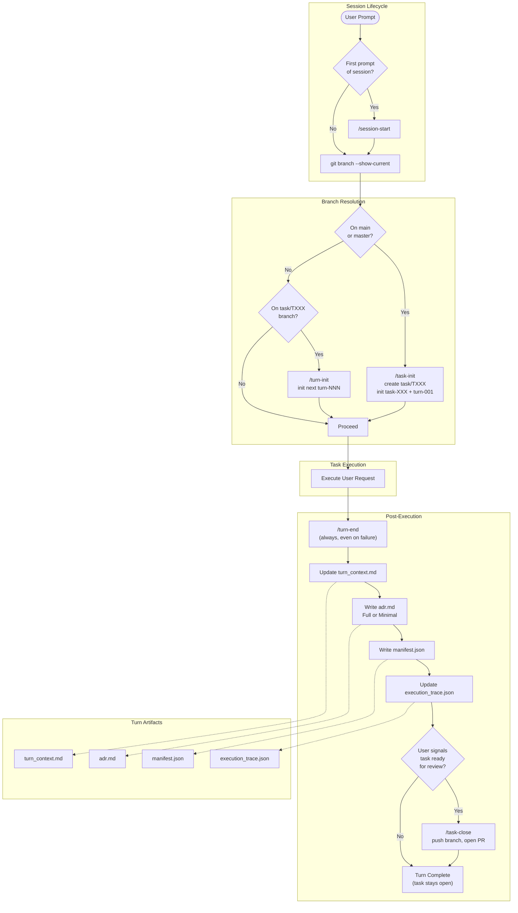

# coding-agents-config

Shared configuration for Claude Code and Codex: global instructions, skills,
agents, hooks, and settings. Enforces a task/turn-based workflow with
provenance tracking, branch protection, and governance rules, and hosts the
AppFactory (`af-*`) skill pipeline for DSL-driven application generation.

## Setup

### 1. Clone the repo

```sh
git clone <repo-url> ~/coding-agents-config
```

### 2. Create symlinks (automated)

Run the setup script — it creates all symlinks and backs up any existing files:

```sh
bash scripts/setup.sh
```

<details>
<summary>Manual symlink commands</summary>

```sh
# ~/.claude/
ln -s ~/coding-agents-config/skills       ~/.claude/skills
ln -s ~/coding-agents-config/agents       ~/.claude/agents
ln -s ~/coding-agents-config/hooks        ~/.claude/hooks
ln -s ~/coding-agents-config/scripts      ~/.claude/scripts
ln -s ~/coding-agents-config/CLAUDE.md    ~/.claude/CLAUDE.md
ln -s ~/coding-agents-config/settings.json ~/.claude/settings.json

# ~/.codex/
ln -s ~/coding-agents-config/agents   ~/.codex/agents
ln -s ~/coding-agents-config/AGENTS.md ~/.codex/AGENTS.md

# repo-local ./.claude/
ln -s ~/coding-agents-config/CLAUDE.md ./.claude/CLAUDE.md
```

If any of these already exist, back them up first (`mv <target> <target>.bak`).
</details>

### 3. Verify

```sh
ls -la ~/.claude/skills        # should point to ~/coding-agents-config/skills
ls -la ~/.claude/agents        # should point to ~/coding-agents-config/agents
ls -la ~/.claude/hooks         # should point to ~/coding-agents-config/hooks
ls -la ~/.claude/CLAUDE.md     # should point to ~/coding-agents-config/CLAUDE.md
ls -la ~/.claude/settings.json # should point to ~/coding-agents-config/settings.json
ls -la ~/.codex/AGENTS.md      # should point to ~/coding-agents-config/AGENTS.md
```

## Structure

```
coding-agents-config/
├── CLAUDE.md           # Global instructions — task/turn protocol, branch rules
├── AGENTS.md           # Codex loader directive (reads ~/.claude/CLAUDE.md)
├── settings.json        # Claude Code settings (model, permissions, hooks, plugins)
├── package.json         # npm dependency pin (caveman plugin)
├── agents/              # Subagent definitions
│   └── agent-architecture-planner.md
├── hooks/                # Shell hooks triggered by Claude Code events
│   └── branch-guard.sh   # Auto-creates task/TXXX branch when on main/master
├── skills/               # Slash-command skills
│   ├── .system/          # Meta-skills (skill-creator, skill-installer, plugin-creator, imagegen, openai-docs)
│   ├── session-start/    # Load repo state and context docs at session start
│   ├── task-init/        # Create a new task branch + task/turn-001 artifacts
│   ├── turn-init/        # Create the next turn within the active task
│   ├── turn-end/         # Finalize a turn (ADR, manifest, trace)
│   ├── task-close/       # Finalize task, push, open PR against main
│   ├── branch-guard/     # Create a turn-scoped branch if on main/master
│   ├── af-*/             # AppFactory pipeline skills (see docs/skill-summary.md)
│   ├── dsl-utils/        # dsl-model-interpreter — parse/validate app-dsl YAML
│   ├── e2e-tests/        # http-test-artifacts — generate .http request files
│   ├── ui-utils/         # ui-implementation-language — declarative UI YAML spec
│   ├── unit-tests/       # test-implementation-sync — keep tests aligned with code
│   └── eval-labeler/     # Label/score model-response evaluation runs
├── scripts/              # Automation scripts
│   ├── setup.sh          # Create ~/.claude, ~/.codex, ./.claude symlinks
│   └── af-state.sh       # AppFactory state.yaml read/write helpers
├── .appfactory/          # Task/turn tracking and AppFactory specs
│   ├── tasks/             # task-XXX/ directories with turns/, PR, status, summary
│   ├── tasks_index.csv    # Registry of all tasks (branch, status, PR URL)
│   ├── changelog.md       # Turn-by-turn changelog reconstructed from artifacts
│   ├── specs/              # Specifications
│   ├── prompts/            # Prompt templates
│   └── memory/             # AppFactory pipeline state (state.yaml)
├── docs/                 # Reference documentation
│   ├── skill-summary.md   # AppFactory skill pipeline reference table
│   ├── app-nextjs-nestjs-prisma.md
│   ├── appFactory-plan.md
│   ├── migration-ai-to-appfactory.md
│   └── ai-to-appfactory-migration-analysis.md
├── archive/              # Retired skill library (pre-AppFactory, kept for reference)
└── .github/              # PR/issue templates
```

## Execution Flow

The agentic pipeline enforces a strict task/turn-based workflow for all coding tasks:


```mermaid
flowchart TB
    subgraph SESSION["Session Lifecycle"]
        START([User Prompt]) --> SS{First prompt<br/>of session?}
        SS -->|Yes| SESSION_START["/session-start"]
        SS -->|No| BRANCH_CHECK
        SESSION_START --> BRANCH_CHECK["git branch --show-current"]
    end

    subgraph BRANCH_GATE["Branch Resolution"]
        BRANCH_CHECK --> IS_MAIN{On main<br/>or master?}
        IS_MAIN -->|Yes| TASK_INIT["/task-init<br/>create task/TXXX<br/>init task-XXX + turn-001"]
        IS_MAIN -->|No| IS_TASK{On task/TXXX<br/>branch?}
        IS_TASK -->|Yes| TURN_INIT["/turn-init<br/>init next turn-NNN"]
        IS_TASK -->|No| PROCEED
        TASK_INIT --> PROCEED["Proceed"]
        TURN_INIT --> PROCEED
    end

    subgraph EXECUTION["Task Execution"]
        PROCEED --> EXEC["Execute User Request"]
    end

    subgraph POST_EXEC["Post-Execution"]
        EXEC --> TURN_END["/turn-end<br/>(always, even on failure)"]
        TURN_END --> WRITE_CTX["Update turn_context.md"]
        WRITE_CTX --> WRITE_ADR["Write adr.md<br/>Full or Minimal"]
        WRITE_ADR --> WRITE_MANIFEST["Write manifest.json"]
        WRITE_MANIFEST --> WRITE_TRACE["Update execution_trace.json"]
        WRITE_TRACE --> READY{User signals<br/>task ready<br/>for review?}
        READY -->|Yes| TASK_CLOSE["/task-close<br/>push branch, open PR"]
        READY -->|No| COMPLETE["Turn Complete<br/>(task stays open)"]
        TASK_CLOSE --> COMPLETE
    end

    subgraph ARTIFACTS["Turn Artifacts"]
        direction LR
        A1["turn_context.md"]
        A2["execution_trace.json"]
        A3["adr.md"]
        A4["manifest.json"]
    end

    WRITE_CTX -.-> A1
    WRITE_TRACE -.-> A2
    WRITE_ADR -.-> A3
    WRITE_MANIFEST -.-> A4
```

### Turn Protocol Summary

| Phase | Trigger | Steps | Outputs |
|-------|---------|-------|---------|
| **Session Start** | First prompt of session | Load git state → load context docs → display banner | Context loaded |
| **Task Init** | Current branch is `main`/`master` | Resolve next `TASK_ID` → create `task/TXXX` → init task artifacts + `turn-001` | `task_context.md`, `task_status.json`, `turn-001/*` |
| **Turn Init** | Current branch is `task/TXXX` | Resolve next `TURN_ID` → create `turns/turn-NNN/` | `turn_context.md`, `execution_trace.json` |
| **Execution** | Every prompt | Execute the user's request | Modified files |
| **Turn End** | After every prompt, even on failure | Finalize turn context → write ADR → write manifest → update trace | `adr.md`, `manifest.json` |
| **Task Close** | User signals the task is ready for review | Update task status/summary/PR draft → commit → push → open PR → return to `main` | `pull_request.md`, PR on GitHub |

## Skills

### Task/Turn Lifecycle

| Skill | Description |
|-------|-------------|
| `session-start` | Load repository state and core pipeline context at the start of every session |
| `task-init` | Initialize a new task branch and create task + `turn-001` artifacts (runs when on `main`/`master`) |
| `turn-init` | Initialize the next turn within the active task branch |
| `turn-end` | Finalize the active turn after execution — ADR, manifest, trace |
| `task-close` | Finalize the active task branch, push it, and open a PR against `main` |
| `branch-guard` | Create a turn-scoped branch if the current branch is `main`/`master` |

### AppFactory Pipeline (`af-*`)

Full detail, invocation order, and phase mapping in [`docs/skill-summary.md`](docs/skill-summary.md).

| Skill | Description |
|-------|-------------|
| `af-orchestrator` | Orchestrates the App Factory software development lifecycle end to end |
| `af-project-init` | Bootstraps a new AppFactory project by exporting required environment variables |
| `af-be-prd-build` | Builds a business-facing backend PRD from worksheets/questionnaires/discovery notes |
| `af-be-ddd-orchestrator` | Runs the backend DDD build → analyze → refactor → test loop |
| `af-be-ddd-build` | Generates a human-readable backend DDD document from an approved PRD |
| `af-be-ddd-analysis` | Analyzes a DDD specification for quality, completeness, and PRD alignment |
| `af-be-ddd-refactor` | Refactors the DDD document based on analysis findings |
| `af-be-ddd-tests` | Generates Gherkin-style BDD scenarios from the DDD and PRD specifications |
| `af-be-plan` | Produces a backend execution plan from a domain DSL and tech stack profile |
| `af-be-ddd-dsl` | Generates the backend application DSL (YAML) from the DDD document |
| `af-be-implementation` | Executes backend code generation from the plan and BDD feature specs |
| `af-app-check` | Audits an application for production readiness (security, database, deployment, code quality) |
| `af-memory` | CRUD operations for AppFactory pipeline state (`state.yaml`) |

### Testing & Utility

| Skill | Description |
|-------|-------------|
| `dsl-utils/dsl-model-interpreter` | Parses and validates `app-dsl` YAML specifications |
| `e2e-tests/http-test-artifacts` | Generates `.http` request files for REST API testing |
| `ui-utils/ui-implementation-language` | Declarative YAML standard for UI pages, forms, and bindings |
| `unit-tests/test-implementation-sync` | Keeps unit tests synchronized with service/DTO implementations |
| `eval-labeler` | Labels and scores model-response evaluation runs (Response A vs B) |

### Meta-Skills (`.system`)

| Skill | Description |
|-------|-------------|
| `skill-creator` | Guide for creating and updating skills |
| `skill-installer` | Install skills from a curated list or a GitHub repo |
| `plugin-creator` | Scaffold plugin directories and marketplace entries |
| `imagegen` | Generate or edit raster images |
| `openai-docs` | Look up official OpenAI API/product documentation |

## Agents

| Agent | Description |
|-------|-------------|
| `agent-architecture-planner` | Reads PRD/DDD/DSL and repo structure to produce architecture decisions, module maps, and task plans for downstream coding agents |

## Hooks

| Hook | Trigger | Purpose |
|------|---------|---------|
| `branch-guard.sh` | PreToolUse (Write/Edit/Bash) | Auto-creates the next `task/TXXX` branch when the current branch is `main`/`master` |

## Adding a new skill

Each skill lives in its own directory under `skills/` with a `SKILL.md` file:

```
skills/my-skill/
└── SKILL.md
```

The `.system/skill-creator` meta-skill can guide you through creating one — invoke it from Claude Code.

## archive/

`archive/` holds an earlier, pre-AppFactory skills library (DSL-first full-stack
generation via `app-from-dsl`, `nestjs-crud-resource`, `react-form-page`, etc.).
It's kept for reference only — the active pipeline is the AppFactory (`af-*`)
skill set described above.

## Syncing across machines

Since this is a standard git repo, pull on any machine to stay current:

```sh
cd ~/coding-agents-config && git pull
```

The symlinks mean changes are picked up immediately — no reinstall needed.
