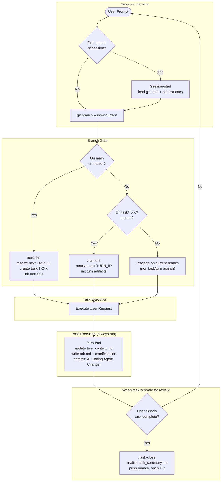

# coding-agents-config

Agentic pipeline configuration for Claude Code (and Codex). Enforces a turn-based workflow with provenance tracking, branch protection, and governance rules, plus the **App Factory** skill pipeline for generating full-stack applications from a PRD through DDD, DSL, and code generation.

## Setup

### 1. Clone the repo

```sh
git clone <repo-url> ~/coding-agents-config
```

### 2. Create symlinks (automated)

Run the setup script — it creates all symlinks and backs up any existing files:

```sh
bash scripts/setup.sh
```

<details>
<summary>Manual symlink commands</summary>

```sh
# ~/.claude/
ln -s ~/coding-agents-config/skills ~/.claude/skills
ln -s ~/coding-agents-config/agents ~/.claude/agents
ln -s ~/coding-agents-config/hooks ~/.claude/hooks
ln -s ~/coding-agents-config/scripts ~/.claude/scripts
ln -s ~/coding-agents-config/CLAUDE.md ~/.claude/CLAUDE.md
ln -s ~/coding-agents-config/settings.json ~/.claude/settings.json

# ~/.codex/
ln -s ~/coding-agents-config/agents ~/.codex/agents
ln -s ~/coding-agents-config/AGENTS.md ~/.codex/AGENTS.md

# repo-local ./.claude/
ln -s ~/coding-agents-config/CLAUDE.md ~/coding-agents-config/.claude/CLAUDE.md
```

`scripts/setup.sh` also pre-declares `rules/`, `context/`, and `plugins/` as symlink targets for `~/.claude/` — they are optional and only linked if present in the repo.

If any of these already exist, back them up first (`mv <target> <target>.bak`).
</details>

### 3. Verify

```sh
ls -la ~/.claude/skills        # should point to ~/coding-agents-config/skills
ls -la ~/.claude/agents        # should point to ~/coding-agents-config/agents
ls -la ~/.claude/hooks         # should point to ~/coding-agents-config/hooks
ls -la ~/.claude/CLAUDE.md     # should point to ~/coding-agents-config/CLAUDE.md
ls -la ~/.claude/settings.json # should point to ~/coding-agents-config/settings.json
```

## Structure

```
coding-agents-config/
├── CLAUDE.md           # Global instructions — turn protocol, branch rules
├── AGENTS.md           # Codex loader directive (points to ~/.claude/CLAUDE.md)
├── settings.json       # Claude Code settings (model, permissions, hooks, plugins)
├── package.json        # Node dependencies (e.g. caveman plugin)
├── agents/             # Subagent definitions
│   └── agent-architecture-planner.md
├── hooks/              # Shell hooks triggered by Claude Code events
│   └── branch-guard.sh # Prevents edits on main/master
├── skills/              # Slash-command skills (24)
│   ├── session-start/  # Load repo state + pipeline context
│   ├── task-init/       # Create task branch + turn-001 artifacts
│   ├── turn-init/        # Initialize the next turn on a task branch
│   ├── turn-end/         # Finalize turn (ADR, manifest, commit)
│   ├── task-close/       # Push task branch, open PR
│   ├── branch-guard/    # Fallback: create turn/T branch if on main
│   ├── af-*/             # App Factory SDLC pipeline skills (see below)
│   ├── dsl-utils/        # DSL parsing/validation utilities
│   ├── e2e-tests/        # HTTP test artifact generation
│   ├── ui-utils/         # UI DSL language reference
│   ├── unit-tests/       # Test/implementation sync checks
│   └── eval-labeler/     # Model response evaluation & labeling
├── scripts/             # Automation scripts
│   ├── setup.sh          # Create symlinks
│   └── af-state.sh       # AppFactory state.yaml helpers
├── docs/                # Reference documentation
│   ├── skill-summary.md              # App Factory pipeline skill table
│   ├── app-nextjs-nestjs-prisma.md    # Next.js + NestJS + Prisma generation pipeline
│   ├── appFactory-plan.md
│   ├── migration-ai-to-appfactory.md
│   └── ai-to-appfactory-migration-analysis.md
├── archive/             # Retired skills, templates, and legacy turn data
└── .appfactory/         # Task/turn tracking and specs
    ├── tasks/            # Task branches with turns (task_context.md, task_status.json, ...)
    ├── specs/            # Specifications
    ├── prompts/          # Prompt templates
    ├── memory/           # Project memory (state.yaml)
    ├── changelog.md
    └── tasks_index.csv
```

## Execution Flow

The agentic pipeline enforces a strict task/turn workflow for all coding tasks:


```mermaid
flowchart TB
    subgraph SESSION["Session Lifecycle"]
        START([User Prompt]) --> SS{First prompt<br/>of session?}
        SS -->|Yes| SESSION_START["/session-start<br/>load git state + context docs"]
        SS -->|No| CHECK_BRANCH
        SESSION_START --> CHECK_BRANCH["git branch --show-current"]
    end

    subgraph BRANCH_GATE["Branch Gate"]
        CHECK_BRANCH --> IS_MAIN{On main<br/>or master?}
        IS_MAIN -->|Yes| TASK_INIT["/task-init<br/>resolve next TASK_ID<br/>create task/TXXX<br/>init turn-001"]
        IS_MAIN -->|No| IS_TASK{On task/TXXX<br/>branch?}
        IS_TASK -->|Yes| TURN_INIT["/turn-init<br/>resolve next TURN_ID<br/>init turn artifacts"]
        IS_TASK -->|No| WARN["Proceed on current branch<br/>(non task/turn branch)"]
    end

    subgraph EXECUTION["Task Execution"]
        TASK_INIT --> EXEC["Execute User Request"]
        TURN_INIT --> EXEC
        WARN --> EXEC
    end

    subgraph POST_EXEC["Post-Execution (always run)"]
        EXEC --> TURN_END["/turn-end<br/>update turn_context.md<br/>write adr.md + manifest.json<br/>commit: AI Coding Agent Change:"]
    end

    subgraph REVIEW["When task is ready for review"]
        TURN_END --> READY{User signals<br/>task complete?}
        READY -->|Yes| TASK_CLOSE["/task-close<br/>finalize task_summary.md<br/>push branch, open PR"]
        READY -->|No| START
    end
```

### Turn Protocol Summary

| Phase | Skill | Trigger | Outputs |
|-------|-------|---------|---------|
| **Session Start** | `session-start` | First prompt of the session | Git state + context loaded |
| **Task Init** | `task-init` | Current branch is `main`/`master` | `task/TXXX` branch, `task-XXX/` + `turn-001/` artifacts |
| **Turn Init** | `turn-init` | Current branch is `task/TXXX` | Next `turn-XXX/` directory + initial artifacts |
| **Execution** | — | Every coding prompt | Modified files |
| **Turn End** | `turn-end` | After every execution, even on failure | `adr.md`, `manifest.json`, commit |
| **Task Close** | `task-close` | User signals the task is ready for review | `task_summary.md`, `pull_request.md`, pushed branch + PR |

## Skills (24)

| Category | Skill | Description |
|----------|-------|-------------|
| **Session / Task / Turn** | `session-start` | Load repository state and core pipeline context at session start |
| | `task-init` | Initialize a new task branch and create task + turn-001 artifacts |
| | `turn-init` | Initialize the next turn within the active task branch |
| | `turn-end` | Finalize the active turn (ADR, manifest, commit) after execution |
| | `task-close` | Finalize the active task branch, push it, and open a PR against main |
| | `branch-guard` | Create a turn-scoped branch if still on main/master |
| **App Factory — Orchestration** | `af-orchestrator` | Orchestrate the App Factory software development lifecycle end to end |
| | `af-project-init` | Orchestrate AppFactory project initialization (env vars, helper script) |
| | `af-memory` | CRUD operations for AppFactory pipeline state (`state.yaml`) |
| **App Factory — Requirements & DDD** | `af-be-prd-build` | Build a business-facing backend PRD from an intake worksheet |
| | `af-be-ddd-orchestrator` | Orchestrate the backend DDD build → analyze → refactor → test loop |
| | `af-be-ddd-build` | Generate a human-readable backend DDD document from an approved PRD |
| | `af-be-ddd-analysis` | Audit a DDD spec for quality, completeness, and PRD alignment |
| | `af-be-ddd-refactor` | Patch a DDD spec using `af-be-ddd-analysis` findings |
| | `af-be-ddd-tests` | Generate Gherkin BDD feature files from DDD + PRD specs |
| **App Factory — Planning & Codegen** | `af-be-ddd-dsl` | Generate a backend application DSL YAML from a DDD document |
| | `af-be-plan` | Generate a backend execution plan from a domain DSL + tech-stack profile |
| | `af-be-implementation` | Generate backend domain code from the execution plan and BDD specs |
| | `af-app-check` | Audit an application for production readiness (security, DB, deploy, quality) |
| **Utility** | `dsl-utils/dsl-model-interpreter` | Parse and validate app-dsl YAML specifications |
| | `e2e-tests/http-test-artifacts` | Generate `.http` request files for API endpoint testing |
| | `ui-utils/ui-implementation-language` | Declarative YAML language standard for UI pages/widgets/forms |
| | `unit-tests/test-implementation-sync` | Keep generated unit tests synchronized with implementations |
| | `eval-labeler` | Label and compare model responses (Response A vs B) for coding tasks |

See `docs/skill-summary.md` for the App Factory pipeline phases and invocation order.

## Agents

| Agent | Purpose |
|-------|---------|
| `agent-architecture-planner` | Reads PRD/DDD/DSL and repo structure to produce architecture decisions, module maps, and task plans for downstream coding agents |

## Hooks

| Hook | Trigger | Purpose |
|------|---------|---------|
| `branch-guard.sh` | `PreToolUse(Bash)` | Block edits on main/master |

## Archive

`archive/` holds retired skills and templates kept for reference (e.g. `schema-to-database`, `code-entity-to-crud`, `nestjs-crud-resource`, `react-form-page`, legacy turn data, and prior `templates/`). See `archive/README.md` and `archive/SUMMARY.md` for details.

## Adding a new skill

Each skill lives in its own directory under `skills/` with a `SKILL.md` file:

```
skills/my-skill/
└── SKILL.md
```

Invoke a skill's own `skill-creator`/`skill-installer` tooling (if present) from Claude Code to scaffold one, or copy an existing skill's `SKILL.md` frontmatter as a starting point.

## Syncing across machines

Since this is a standard git repo, pull on any machine to stay current:

```sh
cd ~/coding-agents-config && git pull
```

The symlinks mean changes are picked up immediately — no reinstall needed.
