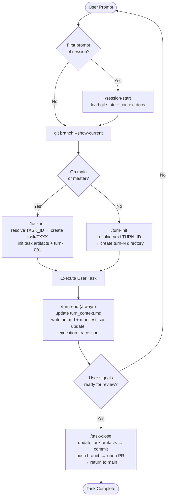

# coding-agents-config

Agentic pipeline configuration for Claude Code and Codex. Enforces a task/turn-based workflow with provenance tracking, branch protection, and governance rules, plus the AppFactory skill library for generating backend applications.

## Setup

### 1. Clone the repo

```sh
git clone <repo-url> ~/coding-agents-config
```

### 2. Create symlinks (automated)

Run the setup script — it creates all symlinks and backs up any existing files:

```sh
bash scripts/setup.sh
```

<details>
<summary>Manual symlink commands</summary>

```sh
# ~/.claude/ (Claude Code)
ln -s ~/coding-agents-config/skills ~/.claude/skills
ln -s ~/coding-agents-config/agents ~/.claude/agents
ln -s ~/coding-agents-config/hooks ~/.claude/hooks
ln -s ~/coding-agents-config/scripts ~/.claude/scripts
ln -s ~/coding-agents-config/CLAUDE.md ~/.claude/CLAUDE.md
ln -s ~/coding-agents-config/settings.json ~/.claude/settings.json

# ~/.codex/ (Codex)
ln -s ~/coding-agents-config/agents ~/.codex/agents
ln -s ~/coding-agents-config/AGENTS.md ~/.codex/AGENTS.md

# Repo-local ./.claude/
ln -s ~/coding-agents-config/CLAUDE.md ./.claude/CLAUDE.md
```

If any of these already exist, back them up first (`mv <target> <target>.bak`).
</details>

### 3. Verify

```sh
ls -la ~/.claude/skills        # should point to ~/coding-agents-config/skills
ls -la ~/.claude/CLAUDE.md     # should point to ~/coding-agents-config/CLAUDE.md
ls -la ~/.claude/settings.json # should point to ~/coding-agents-config/settings.json
ls -la ~/.codex/AGENTS.md      # should point to ~/coding-agents-config/AGENTS.md
```

## Structure

```
coding-agents-config/
├── CLAUDE.md            # Global instructions — task/turn protocol, branch rules
├── AGENTS.md            # Codex loader directive (loads CLAUDE.md)
├── settings.json        # Claude Code settings (model, permissions)
├── package.json         # Node dependency manifest
├── agents/              # Agent architecture/role docs
├── hooks/
│   └── branch-guard.sh  # Blocks edits on main/master
├── skills/              # Slash-command skills
│   ├── .system/         # Meta-skills (skill-creator, skill-installer, plugin-creator, ...)
│   ├── session-start/   # Initialize session, load pipeline context
│   ├── task-init/       # Create task/TXXX branch + task artifacts
│   ├── turn-init/       # Create the next turn directory + artifacts
│   ├── turn-end/        # Finalize a turn (ADR, manifest, trace)
│   ├── task-close/      # Push the task branch and open a PR against main
│   ├── branch-guard/    # Refuse edits on main/master
│   ├── af-orchestrator/ # AppFactory SDLC orchestrator
│   ├── af-*/            # AppFactory backend pipeline (PRD → DDD → DSL → plan → implementation → checks)
│   └── ...              # Utility skills (dsl-utils, e2e-tests, ui-utils, unit-tests)
├── scripts/
│   ├── setup.sh         # Symlink installer
│   └── af-state.sh      # AppFactory pipeline state helper
├── docs/                # Reference docs (migration notes, skill summary, tech stack profile)
├── archive/             # Superseded skills/templates kept for reference
├── .appfactory/         # Task/turn tracking, specs, prompts, memory
│   ├── tasks/           # Task branches with turns (task_context.md, adr.md, manifest.json, ...)
│   ├── specs/           # PRD / DDD / DSL specifications
│   ├── prompts/         # Prompt templates
│   ├── memory/          # Pipeline state (state.yaml)
│   ├── changelog.md
│   └── tasks_index.csv  # Registry of all tasks
└── .github/              # Issue templates, PR template
```

## Execution Flow

The agentic pipeline enforces a task/turn-based workflow for all coding tasks. A **task** is a branch-scoped unit of work that becomes one pull request; a **turn** is one AI execution cycle within that task.


```mermaid
flowchart TB
    START([User Prompt]) --> SS{First prompt<br/>of session?}
    SS -->|Yes| SESSION_START["/session-start<br/>load git state + context docs"]
    SS -->|No| CHECK_BRANCH
    SESSION_START --> CHECK_BRANCH

    CHECK_BRANCH["git branch --show-current"] --> IS_MAIN{On main<br/>or master?}
    IS_MAIN -->|Yes| TASK_INIT["/task-init<br/>resolve TASK_ID → create task/TXXX<br/>→ init task artifacts + turn-001"]
    IS_MAIN -->|No| TURN_INIT["/turn-init<br/>resolve next TURN_ID<br/>→ create turn-N directory"]
    TASK_INIT --> EXEC
    TURN_INIT --> EXEC

    EXEC["Execute User Task"] --> TURN_END["/turn-end (always)<br/>update turn_context.md<br/>write adr.md + manifest.json<br/>update execution_trace.json"]

    TURN_END --> READY{User signals<br/>ready for review?}
    READY -->|Yes| TASK_CLOSE["/task-close<br/>update task artifacts → commit<br/>push branch → open PR → return to main"]
    READY -->|No| START
    TASK_CLOSE --> DONE([Task Complete])
```

### Task & Turn Protocol Summary

| Phase | When | Steps | Outputs |
|-------|------|-------|---------|
| **Session Start** | First prompt of the session | Load git state → load context docs → display banner | Context loaded |
| **Task Init** | Current branch is `main`/`master` | Resolve `TASK_ID` → create `task/TXXX` → scaffold task dir + `turn-001` | `task_context.md`, `task_status.json`, `turn_context.md`, `execution_trace.json` |
| **Turn Init** | Current branch is `task/TXXX` | Resolve next `TURN_ID` → create `turn-N` directory | `turn_context.md`, `execution_trace.json` |
| **Execution** | Every prompt | Execute the user's request | Modified files |
| **Turn End** | Always, even on failure | Finalize turn context → write ADR → write manifest → update trace | `adr.md`, `manifest.json` |
| **Task Close** | User indicates task is ready for review | Update task artifacts → commit → push → open PR → return to `main` | PR against `main` |

Branch protection: writing code is never allowed on `main`/`master` — `branch-guard` and `/task-init` enforce switching to a `task/TXXX` branch first.

## Skills (29)

| Category | Skill | Description |
|----------|-------|-------------|
| **Pipeline** | `session-start` | Load repository state and core pipeline context |
| | `task-init` | Initialize a new task branch and create task + turn-001 artifacts |
| | `turn-init` | Initialize the next turn within the active task branch |
| | `turn-end` | Finalize the active turn after execution |
| | `task-close` | Finalize the active task branch, push it, and open a PR against `main` |
| | `branch-guard` | Create a turn-scoped branch if currently on `main`/`master` |
| **AppFactory** | `af-orchestrator` | Orchestrate the App Factory software development lifecycle |
| | `af-project-init` | Export required environment variables and bootstrap an AppFactory project |
| | `af-be-prd-build` | Build a business-facing backend PRD from a discovery worksheet |
| | `af-be-ddd-orchestrator` | Orchestrate the backend DDD build → analyze → refactor → test loop |
| | `af-be-ddd-build` | Generate a backend Domain-Driven Design document from an approved PRD |
| | `af-be-ddd-analysis` | Audit a generated DDD document for quality, completeness, and PRD alignment |
| | `af-be-ddd-refactor` | Apply targeted patches to a DDD document from analysis findings |
| | `af-be-ddd-tests` | Generate Gherkin BDD feature files from the DDD and PRD specifications |
| | `af-be-plan` | Generate a backend execution plan from a domain DSL and tech-stack profile |
| | `af-be-ddd-dsl` | Generate a backend DSL YAML document from the DDD document |
| | `af-be-implementation` | Generate backend domain code from the execution plan and BDD specs |
| | `af-app-check` | Audit an application for production readiness (security, DB, deploy, quality) |
| | `af-memory` | CRUD operations against `.appfactory/memory/state.yaml` pipeline state |
| **Utility** | `dsl-utils` → `dsl-model-interpreter` | Parse and validate app-dsl YAML specifications |
| | `e2e-tests` → `http-test-artifacts` | Generate `.http` request files for API endpoint testing |
| | `ui-utils` → `ui-implementation-language` | Declarative YAML standard for UI pages, layouts, and bindings |
| | `unit-tests` → `test-implementation-sync` | Keep unit tests synchronized with service/DTO implementations |
| | `eval-labeler` | Generate structured notes and labels comparing two model responses |
| **Meta (`.system`)** | `skill-creator` | Guide for creating or updating skills |
| | `skill-installer` | Install Codex skills from a curated list or a GitHub repo |
| | `plugin-creator` | Scaffold Codex plugin directories and marketplace entries |
| | `imagegen` | Generate or edit raster images for repo assets |
| | `openai-docs` | Look up official OpenAI API/model documentation |

## Hooks

| Hook | Trigger | Purpose |
|------|---------|---------|
| `branch-guard.sh` | PreToolUse(Edit) | Block edits on `main`/`master` |

## Adding a new skill

Each skill lives in its own directory under `skills/` with a `SKILL.md` file:

```
skills/my-skill/
└── SKILL.md
```

The `.system/skill-creator` meta-skill can guide you through creating one — invoke it from Claude Code or Codex.

## Syncing across machines

Since this is a standard git repo, pull on any machine to stay current:

```sh
cd ~/coding-agents-config && git pull
```

The symlinks mean changes are picked up immediately — no reinstall needed.
