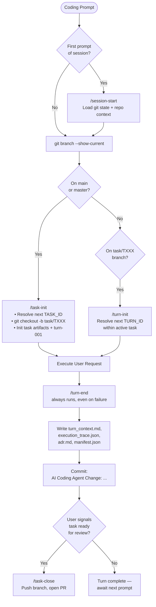

# coding-agents-config

Agentic pipeline configuration for Claude Code (and Codex). Enforces a task/turn-based workflow with provenance tracking, branch protection, and governance rules, and hosts the AppFactory (`af-*`) backend code-generation pipeline as a set of skills.

## Setup

### 1. Clone the repo

```sh
git clone <repo-url> ~/coding-agents-config
```

### 2. Create symlinks (automated)

Run the setup script — it creates all symlinks and backs up any existing files:

```sh
bash scripts/setup.sh
```

<details>
<summary>Manual symlink commands</summary>

```sh
# Into ~/.claude/
ln -s ~/coding-agents-config/skills ~/.claude/skills
ln -s ~/coding-agents-config/agents ~/.claude/agents
ln -s ~/coding-agents-config/hooks ~/.claude/hooks
ln -s ~/coding-agents-config/scripts ~/.claude/scripts
ln -s ~/coding-agents-config/CLAUDE.md ~/.claude/CLAUDE.md
ln -s ~/coding-agents-config/settings.json ~/.claude/settings.json

# Into ~/.codex/
ln -s ~/coding-agents-config/agents ~/.codex/agents
ln -s ~/coding-agents-config/AGENTS.md ~/.codex/AGENTS.md
```

If any of these already exist, back them up first (`mv <target> <target>.bak`). Note: `scripts/setup.sh` also attempts to link `rules/`, `context/`, and `plugins/` into `~/.claude/` — these directories don't exist in the repo yet, so those particular symlinks will point at nonexistent sources until they're added.
</details>

### 3. Verify

```sh
ls -la ~/.claude/skills        # should point to ~/coding-agents-config/skills
ls -la ~/.claude/agents        # should point to ~/coding-agents-config/agents
ls -la ~/.claude/hooks         # should point to ~/coding-agents-config/hooks
ls -la ~/.claude/CLAUDE.md     # should point to ~/coding-agents-config/CLAUDE.md
ls -la ~/.claude/settings.json # should point to ~/coding-agents-config/settings.json
```

## Structure

```
coding-agents-config/
├── CLAUDE.md           # Global instructions — task/turn protocol, branch rules
├── AGENTS.md           # Codex loader directive (points to CLAUDE.md)
├── settings.json       # Claude Code settings (model, permissions, hook wiring)
├── package.json        # npm deps for local tooling (e.g. caveman)
├── agents/             # Standalone Claude subagent definitions
│   └── agent-architecture-planner.md
├── hooks/              # Shell hooks triggered by Claude Code events
│   └── branch-guard.sh # Auto-creates task/TXXX branch when on main/master
├── skills/             # Slash-command skills
│   ├── .system/        # Meta-skills (skill-creator, skill-installer, plugin-creator, ...)
│   ├── session-start/  # Load repo state at the start of every session
│   ├── task-init/      # Create task/TXXX branch and turn-001 artifacts (on main/master)
│   ├── turn-init/      # Create the next turn within the active task
│   ├── turn-end/       # Finalize a turn — adr.md, manifest.json, etc.
│   ├── task-close/     # Push the task branch and open a pull request
│   ├── branch-guard/   # SKILL.md counterpart to hooks/branch-guard.sh
│   ├── af-*/           # AppFactory backend pipeline skills (see below)
│   └── ...             # Utility skills (dsl-utils, e2e-tests, ui-utils, unit-tests, eval-labeler)
├── scripts/             # Automation scripts
│   ├── setup.sh         # Symlink installer
│   └── af-state.sh      # Read/write .appfactory/memory/state.yaml
├── .appfactory/         # Task/turn tracking and pipeline state
│   ├── tasks/           # task-XXX/ dirs with turns/turn-XXX/ subdirs
│   ├── tasks_index.csv  # Registry of all tasks and their status
│   ├── specs/           # Specifications
│   ├── prompts/         # Prompt templates
│   └── memory/          # AppFactory pipeline state (state.yaml)
├── .github/              # PR/issue templates
├── docs/                 # Reference documentation (AppFactory plan, skill summary, migration notes)
└── archive/              # Deprecated first-generation DSL/NestJS/Prisma skill library and templates
```

## Execution Flow

The agentic pipeline enforces a task/turn-based workflow for all coding prompts. A **task** is the branch-scoped unit of work that becomes one pull request (`task/TXXX`); a **turn** is one AI execution cycle within that task branch (`turn-XXX`), numbered from `001` and reset per task.


```mermaid
flowchart TB
    START([Coding Prompt]) --> FIRST{First prompt<br/>of session?}
    FIRST -->|Yes| SESSION_START["/session-start<br/>Load git state + repo context"]
    FIRST -->|No| CHECK_BRANCH
    SESSION_START --> CHECK_BRANCH

    CHECK_BRANCH["git branch --show-current"] --> IS_MAIN{On main<br/>or master?}
    IS_MAIN -->|Yes| TASK_INIT["/task-init<br/>• Resolve next TASK_ID<br/>• git checkout -b task/TXXX<br/>• Init task artifacts + turn-001"]
    IS_MAIN -->|No| IS_TASK{On task/TXXX<br/>branch?}
    IS_TASK -->|Yes| TURN_INIT["/turn-init<br/>Resolve next TURN_ID<br/>within active task"]
    TASK_INIT --> EXEC
    TURN_INIT --> EXEC

    EXEC["Execute User Request"] --> TURN_END["/turn-end<br/>always runs, even on failure"]
    TURN_END --> WRITE["Write turn_context.md,<br/>execution_trace.json,<br/>adr.md, manifest.json"]
    WRITE --> COMMIT["Commit:<br/>AI Coding Agent Change: ..."]
    COMMIT --> READY{User signals<br/>task ready<br/>for review?}
    READY -->|Yes| TASK_CLOSE["/task-close<br/>Push branch, open PR"]
    READY -->|No| DONE["Turn complete —<br/>await next prompt"]
```

### Task/Turn Protocol Summary

| Phase | Trigger | Skill | Outputs |
|-------|---------|-------|---------|
| **Session Start** | First prompt of session | `session-start` | Repo/git state loaded |
| **Task Init** | Branch is `main`/`master` | `task-init` | `task/TXXX` branch, `task-XXX/` dir, `turn-001` |
| **Turn Init** | Branch is `task/TXXX[-*]` | `turn-init` | Next `turn-XXX/` dir under the active task |
| **Execution** | Every coding prompt | — | Modified files |
| **Turn End** | After every prompt, always | `turn-end` | `turn_context.md`, `execution_trace.json`, `adr.md`, `manifest.json` |
| **Task Close** | User signals task is ready for review | `task-close` | Branch pushed, PR opened |

Task and turn artifacts live under `.appfactory/tasks/task-XXX/turns/turn-XXX/`; `.appfactory/tasks_index.csv` tracks every task's branch, status, and PR URL. Full rules are defined in [`CLAUDE.md`](CLAUDE.md).

## Skills (23 + 5 meta-skills)

| Category | Skill | Description |
|----------|-------|-------------|
| **Lifecycle** | `session-start` | Load repository state and core pipeline context at session start |
| | `task-init` | Initialize a new task branch and create task + turn-001 artifacts (run on main/master) |
| | `turn-init` | Initialize the next turn within the active task branch |
| | `turn-end` | Finalize the active turn after execution — always runs, even on failure |
| | `task-close` | Finalize the active task branch, push it, and open a pull request |
| | `branch-guard` | SKILL.md counterpart to `hooks/branch-guard.sh` — create a task branch if on main/master |
| **AppFactory backend pipeline (`af-*`)** | `af-orchestrator` | Orchestrate the App Factory software development lifecycle end to end |
| | `af-project-init` | Export required environment variables and initialize an AppFactory project |
| | `af-be-prd-build` | Build a business-facing backend PRD from an intake worksheet or discovery notes |
| | `af-be-ddd-orchestrator` | Orchestrate the backend DDD workflow: build → analyze → refactor loop → tests |
| | `af-be-ddd-build` | Generate a human-readable backend DDD document from an approved PRD |
| | `af-be-ddd-analysis` | Analyze a DDD specification for quality, completeness, and PRD alignment |
| | `af-be-ddd-refactor` | Refactor a DDD document based on analysis findings |
| | `af-be-ddd-tests` | Generate Gherkin-style BDD scenarios from DDD and PRD specifications |
| | `af-be-ddd-dsl` | Generate a backend domain DSL YAML document from a DDD document |
| | `af-be-plan` | Generate a step-by-step backend execution plan from a domain DSL and tech-stack profile |
| | `af-be-implementation` | Generate backend domain code from the execution plan and BDD feature specs into a selected tech-stack implementation |
| | `af-app-check` | Audit an application for production readiness (security, database, deployment, code quality) |
| | `af-memory` | CRUD operations on `.appfactory/memory/state.yaml` for cross-skill pipeline state |
| **Utility** | `dsl-utils` | Wraps DSL model interpretation for other skills |
| | `e2e-tests` | Wraps end-to-end/HTTP test artifact generation |
| | `ui-utils` | Wraps UI implementation-language helpers |
| | `unit-tests` | Wraps test-implementation synchronization |
| | `eval-labeler` | Label and score Response A vs. Response B when evaluating model outputs on coding tasks |

See [`docs/skill-summary.md`](docs/skill-summary.md) for the full `af-*` pipeline phase-by-phase reference.

### Meta-Skills (`.system/`)

| Skill | Description |
|-------|-------------|
| `skill-creator` | Create new skills with a `SKILL.md` |
| `skill-installer` | Install skills from marketplaces |
| `plugin-creator` | Scaffold new Claude Code plugins |
| `imagegen` | Image generation helper |
| `openai-docs` | OpenAI/Codex documentation lookup |

## Agents

Standalone Claude subagent definitions live in `agents/` (symlinked to `~/.claude/agents`):

| Agent | Purpose |
|-------|---------|
| `agent-architecture-planner` | Converts a PRD/DDD/DSL into architecture decisions, module maps, and task plans for downstream coding agents |

## Hooks

| Hook | Trigger | Purpose |
|------|---------|---------|
| `branch-guard.sh` | `PreToolUse` (Bash / write tools) | If on `main`/`master`, auto-create and check out the next `task/TXXX` branch before allowing the tool call |

Hook wiring lives in [`settings.json`](settings.json).

## Templates & archive

Turn-lifecycle templates (`adr_template.md`, `pull_request_template.md`, `manifest.schema.json`, `metadata_header.txt`, `branch_naming.md`, `commit_message.md`, `tech-stack.template.md`) live under [`archive/templates/`](archive/templates), alongside a first-generation DSL/NestJS/Prisma/React skill library that predates and was superseded by the current `af-*` AppFactory pipeline — kept for reference, not actively used. The live GitHub PR template is [`.github/PULL_REQUEST_TEMPLATE.md`](.github/PULL_REQUEST_TEMPLATE.md).

## Adding a new skill

Each skill lives in its own directory under `skills/` with a `SKILL.md` file:

```
skills/my-skill/
└── SKILL.md
```

The `.system/skill-creator` meta-skill can guide you through creating one — invoke it from Claude Code.

## Syncing across machines

Since this is a standard git repo, pull on any machine to stay current:

```sh
cd ~/coding-agents-config && git pull
```

The symlinks mean changes are picked up immediately — no reinstall needed.
