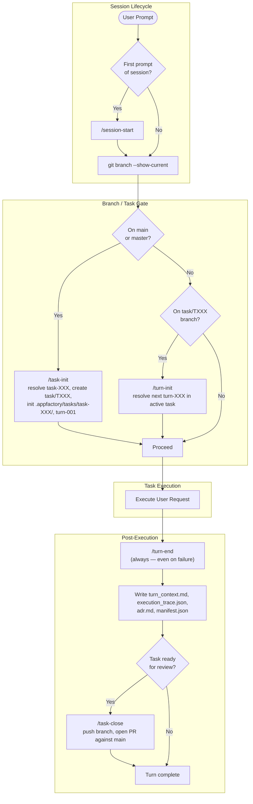

# coding-agents-config

Agentic pipeline configuration for Claude Code and Codex. Provides the App Factory skill library (PRD → DDD → DSL → implementation), enforces a task/turn workflow with provenance tracking, and ships branch-protection governance rules.

## Setup

### 1. Clone the repo

```sh
git clone <repo-url> ~/coding-agents-config
```

### 2. Create symlinks (automated)

Run the setup script — it creates all symlinks and backs up any existing files:

```sh
bash scripts/setup.sh
```

<details>
<summary>Manual symlink commands</summary>

```sh
# ~/.claude/
ln -s ~/coding-agents-config/skills    ~/.claude/skills
ln -s ~/coding-agents-config/agents    ~/.claude/agents
ln -s ~/coding-agents-config/hooks     ~/.claude/hooks
ln -s ~/coding-agents-config/scripts   ~/.claude/scripts
ln -s ~/coding-agents-config/CLAUDE.md ~/.claude/CLAUDE.md
ln -s ~/coding-agents-config/settings.json ~/.claude/settings.json

# ~/.codex/
ln -s ~/coding-agents-config/agents    ~/.codex/agents
ln -s ~/coding-agents-config/AGENTS.md ~/.codex/AGENTS.md

# repo-local ./.claude/
ln -s ~/coding-agents-config/CLAUDE.md ./.claude/CLAUDE.md
```

If any of these already exist, back them up first (`mv <target> <target>.bak`).
</details>

### 3. Verify

```sh
ls -la ~/.claude/skills        # should point to ~/coding-agents-config/skills
ls -la ~/.claude/agents        # should point to ~/coding-agents-config/agents
ls -la ~/.claude/hooks         # should point to ~/coding-agents-config/hooks
ls -la ~/.claude/CLAUDE.md     # should point to ~/coding-agents-config/CLAUDE.md
ls -la ~/.claude/settings.json # should point to ~/coding-agents-config/settings.json
ls -la ~/.codex/AGENTS.md      # should point to ~/coding-agents-config/AGENTS.md
```

`scripts/setup.sh` also links `rules`, `context`, and `plugins` into `~/.claude/` if those directories are present — they aren't part of this repo yet but are reserved extension points.

## Structure

```
coding-agents-config/
├── CLAUDE.md            # Global instructions — task/turn protocol, branch rules
├── AGENTS.md            # Codex loader directive (points at ~/.claude/CLAUDE.md)
├── settings.json        # Claude Code settings (model, permissions, hooks, plugins)
├── hooks/                # Shell hooks triggered by Claude Code events
│   └── branch-guard.sh   # Blocks edits while on main/master
├── agents/               # Subagent definitions
│   └── agent-architecture-planner.md
├── skills/                    # Slash-command skills
│   ├── af-orchestrator/        # Drives the App Factory SDLC end to end
│   ├── af-project-init/        # Export env vars, bootstrap a new AF project
│   ├── af-be-prd-build/        # Business-facing PRD from intake worksheets
│   ├── af-be-ddd-orchestrator/ # Build → analyze → refactor → test loop
│   ├── af-be-ddd-build/        # DDD document from an approved PRD
│   ├── af-be-ddd-analysis/     # Audit a DDD document for quality/gaps
│   ├── af-be-ddd-refactor/     # Apply analysis findings back into the DDD doc
│   ├── af-be-ddd-tests/        # Gherkin/BDD feature files from DDD + PRD
│   ├── af-be-plan/             # Execution plan from DSL + tech-stack profile
│   ├── af-be-ddd-dsl/          # DSL YAML from the DDD document
│   ├── af-be-implementation/   # Generate backend code from plan + BDD specs
│   ├── af-app-check/           # Production-readiness audit
│   ├── af-memory/              # CRUD on .appfactory/memory/state.yaml
│   ├── session-start/          # Load repo/session context (first prompt)
│   ├── task-init/               # New task branch + task/turn-001 artifacts
│   ├── turn-init/                # Next turn within the active task branch
│   ├── turn-end/                  # Finalize a turn (PR notes, ADR, manifest)
│   ├── task-close/               # Push task branch, open PR against main
│   ├── branch-guard/             # Create a safe branch if on main/master
│   ├── dsl-utils/dsl-model-interpreter/     # Parse/validate app-dsl YAML
│   ├── ui-utils/ui-implementation-language/ # Declarative UI YAML spec
│   ├── e2e-tests/http-test-artifacts/       # Generate .http request files
│   ├── unit-tests/test-implementation-sync/ # Keep unit tests aligned with code
│   └── eval-labeler/           # Label/compare model-response evaluation runs
├── scripts/
│   ├── setup.sh          # Create all symlinks described above
│   └── af-state.sh       # Shared helpers for reading/writing af state.yaml
├── .appfactory/           # Task/turn tracking and App Factory pipeline state
│   ├── tasks/             # task-XXX/ dirs, each with turns/turn-XXX/ artifacts
│   ├── tasks_index.csv    # Registry of tasks: branch, status, PR, turn count
│   ├── specs/             # Specifications
│   ├── prompts/           # Prompt templates
│   ├── memory/            # state.yaml — pipeline progress/context
│   └── changelog.md
├── docs/                  # Reference documentation (migration notes, skill summary, plans)
└── archive/               # Superseded skills and templates, kept for reference
```

## Execution Flow

The agentic pipeline enforces a task/turn workflow for all coding tasks:


```mermaid
flowchart TB
    subgraph SESSION["Session Lifecycle"]
        START([User Prompt]) --> SS{First prompt<br/>of session?}
        SS -->|Yes| SESSION_START["/session-start"]
        SS -->|No| CHECK_BRANCH
        SESSION_START --> CHECK_BRANCH["git branch --show-current"]
    end

    subgraph BRANCH_GATE["Branch / Task Gate"]
        CHECK_BRANCH --> IS_MAIN{On main<br/>or master?}
        IS_MAIN -->|Yes| TASK_INIT["/task-init<br/>resolve task-XXX, create task/TXXX,<br/>init .appfactory/tasks/task-XXX/, turn-001"]
        IS_MAIN -->|No| IS_TASK{On task/TXXX<br/>branch?}
        IS_TASK -->|Yes| TURN_INIT["/turn-init<br/>resolve next turn-XXX in active task"]
        IS_TASK -->|No| PROCEED
        TASK_INIT --> PROCEED["Proceed"]
        TURN_INIT --> PROCEED
    end

    subgraph EXECUTION["Task Execution"]
        PROCEED --> EXEC["Execute User Request"]
    end

    subgraph POST_EXEC["Post-Execution"]
        EXEC --> TURN_END["/turn-end<br/>(always — even on failure)"]
        TURN_END --> ARTIFACTS["Write turn_context.md, execution_trace.json,<br/>adr.md, manifest.json"]
        ARTIFACTS --> READY{Task ready<br/>for review?}
        READY -->|Yes| TASK_CLOSE["/task-close<br/>push branch, open PR against main"]
        READY -->|No| DONE["Turn complete"]
        TASK_CLOSE --> DONE
    end
```

### Task/Turn Protocol Summary

| Phase | Steps | Outputs |
|-------|-------|---------|
| **Session Start** | Load git state → load context docs → display banner | Context loaded |
| **Task Gate** | On `main`/`master` → `/task-init` creates `task/TXXX` + `task-XXX/turn-001` | New task branch, task artifacts |
| **Turn Gate** | On `task/TXXX` → `/turn-init` creates the next `turn-XXX` | Turn directory + initial artifacts |
| **Execution** | Execute the user's request | Modified files |
| **Turn End** | `/turn-end` — always, even on failure | `turn_context.md`, `execution_trace.json`, `adr.md`, `manifest.json` |
| **Task Close** | `/task-close` when the user signals the task is ready for review | Pushed branch, opened PR, `tasks_index.csv` updated |

Hard gate: no code is written while on `main`/`master` — `/task-init` must run first. `hooks/branch-guard.sh` backstops this by auto-creating the next `task/TXXX` branch the moment a Bash or write tool runs on `main`/`master`.

## Skills

The App Factory pipeline (`af-*` skills) generates backend applications from a PRD through DDD, DSL, planning, and implementation phases. See `docs/skill-summary.md` for the full phase table.

| Category | Skill | Description |
|----------|-------|-------------|
| **App Factory — Init** | `af-orchestrator` | Orchestrates the App Factory SDLC end to end |
| | `af-project-init` | Exports required env vars, bootstraps a new AF project |
| **App Factory — Requirements** | `af-be-prd-build` | Business-facing PRD from an intake worksheet |
| **App Factory — DDD** | `af-be-ddd-orchestrator` | Runs the build → analyze → refactor → test loop |
| | `af-be-ddd-build` | DDD document from an approved PRD |
| | `af-be-ddd-analysis` | Audits a DDD document for quality, completeness, PRD alignment |
| | `af-be-ddd-refactor` | Applies `af-be-ddd-analysis` findings back into the DDD document |
| **App Factory — Testing** | `af-be-ddd-tests` | Gherkin/BDD feature files from DDD + PRD specs |
| **App Factory — Planning** | `af-be-plan` | Execution plan from a domain DSL and tech-stack profile |
| **App Factory — DSL** | `af-be-ddd-dsl` | DSL YAML generation from the DDD document |
| **App Factory — Implementation** | `af-be-implementation` | Generates backend code from the plan + BDD feature specs |
| **App Factory — Validation** | `af-app-check` | Production-readiness audit (security, DB, deployment, code quality) |
| **App Factory — Utility** | `af-memory` | CRUD on `.appfactory/memory/state.yaml` pipeline state |
| **Session** | `session-start` | Load repo state and core pipeline context at session start |
| **Task** | `task-init` | Create `task/TXXX` branch and `task-XXX`/`turn-001` artifacts |
| | `turn-init` | Initialize the next turn inside the active task branch |
| | `turn-end` | Finalize a turn (always run, even on failure) |
| | `task-close` | Push the task branch and open a pull request against main |
| | `branch-guard` | Create a safe branch if currently on `main`/`master` |
| **DSL / UI / Test Utils** | `dsl-utils/dsl-model-interpreter` | Parse and validate `app-dsl` YAML specifications |
| | `ui-utils/ui-implementation-language` | Declarative YAML spec for UI pages, widgets, forms |
| | `e2e-tests/http-test-artifacts` | Generate `.http` request files for API endpoint testing |
| | `unit-tests/test-implementation-sync` | Keep generated unit tests aligned with implementations |
| **Utility** | `eval-labeler` | Label/compare model-response evaluation runs (Response A vs B) |

## Hooks

| Hook | Trigger | Purpose |
|------|---------|---------|
| `branch-guard.sh` | `PreToolUse(Bash)` | Auto-creates the next `task/TXXX` branch if currently on `main`/`master` |

## Adding a new skill

Each skill lives in its own directory under `skills/` with a `SKILL.md` file:

```
skills/my-skill/
└── SKILL.md
```

## Syncing across machines

Since this is a standard git repo, pull on any machine to stay current:

```sh
cd ~/coding-agents-config && git pull
```

The symlinks mean changes are picked up immediately — no reinstall needed.

## Archive

`archive/` holds skills and templates that predate the App Factory pipeline (DSL-first full-stack generation patterns from `base-node-fullstack`) and are kept for reference rather than active use. See `archive/README.md` and `archive/SUMMARY.md` for details.
