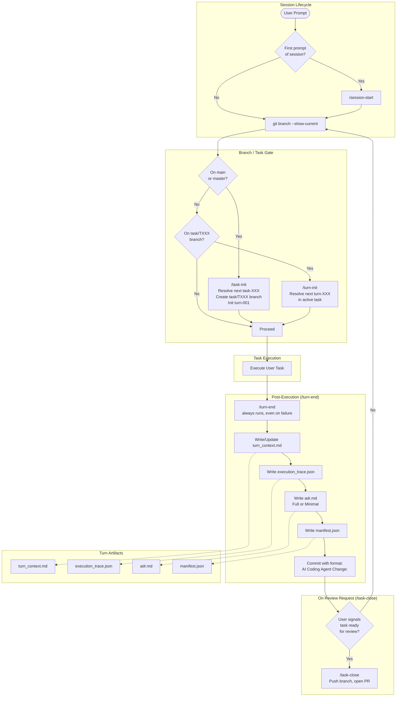

# coding-agents-config

Agentic pipeline configuration for Claude Code. Enforces a task/turn-based workflow with provenance tracking, branch protection, and governance rules, plus the App Factory (`af-*`) skill suite for DSL-driven application generation.

## Setup

### 1. Clone the repo

```sh
git clone <repo-url> ~/coding-agents-config
```

### 2. Create symlinks (automated)

Run the setup script — it creates all symlinks and backs up any existing files:

```sh
bash scripts/setup.sh
```

<details>
<summary>Manual symlink commands</summary>

```sh
ln -s ~/coding-agents-config/skills ~/.claude/skills
ln -s ~/coding-agents-config/agents ~/.claude/agents
ln -s ~/coding-agents-config/hooks ~/.claude/hooks
ln -s ~/coding-agents-config/scripts ~/.claude/scripts
ln -s ~/coding-agents-config/CLAUDE.md ~/.claude/CLAUDE.md
ln -s ~/coding-agents-config/settings.json ~/.claude/settings.json
ln -s ~/coding-agents-config/agents ~/.codex/agents
ln -s ~/coding-agents-config/AGENTS.md ~/.codex/AGENTS.md
```

If any of these already exist, back them up first (`mv <target> <target>.bak`).
</details>

### 3. Verify

```sh
ls -la ~/.claude/skills        # should point to ~/coding-agents-config/skills
ls -la ~/.claude/agents        # should point to ~/coding-agents-config/agents
ls -la ~/.claude/hooks         # should point to ~/coding-agents-config/hooks
ls -la ~/.claude/CLAUDE.md     # should point to ~/coding-agents-config/CLAUDE.md
ls -la ~/.claude/settings.json # should point to ~/coding-agents-config/settings.json
```

## Structure

```
coding-agents-config/
├── CLAUDE.md           # Global instructions — task/turn protocol, branch rules
├── AGENTS.md           # Codex agent loader directive
├── settings.json       # Claude Code settings (model, env, permissions)
├── package.json        # Node dependencies for tooling scripts
├── hooks/              # Shell hooks triggered by Claude Code events
│   └── branch-guard.sh # Auto-creates a task branch when on main/master
├── scripts/            # Automation scripts
│   ├── setup.sh        # Symlink installer
│   └── af-state.sh     # AppFactory state.yaml helper functions
├── agents/              # Reusable subagent definitions
│   └── agent-architecture-planner.md
├── skills/              # Slash-command skills (see below)
├── docs/                 # Reference and migration documentation
├── archive/              # Retired skills, templates, and prior skill-library docs
├── .appfactory/          # Task/turn tracking, specs, prompts, and memory
│   ├── tasks/            # task-XXX directories, each with its own turns/
│   ├── specs/            # Generated PRD/DDD/DSL specifications
│   ├── prompts/          # Prompt drafts and notes
│   ├── memory/           # state.yaml pipeline memory
│   ├── changelog.md
│   └── tasks_index.csv   # Registry of all tasks and their status
└── .github/              # Issue/PR templates and workflow config
```

## Execution Flow

The agentic pipeline enforces a strict task/turn workflow for all coding tasks:


```mermaid
flowchart TB
    subgraph SESSION["Session Lifecycle"]
        START([User Prompt]) --> SS{First prompt<br/>of session?}
        SS -->|Yes| SESSION_START["/session-start"]
        SS -->|No| CHECK_BRANCH
        SESSION_START --> CHECK_BRANCH["git branch --show-current"]
    end

    subgraph BRANCH_GATE["Branch / Task Gate"]
        CHECK_BRANCH --> IS_MAIN{On main<br/>or master?}
        IS_MAIN -->|Yes| TASK_INIT["/task-init<br/>Resolve next task-XXX<br/>Create task/TXXX branch<br/>Init turn-001"]
        IS_MAIN -->|No| IS_TASK{On task/TXXX<br/>branch?}
        IS_TASK -->|Yes| TURN_INIT["/turn-init<br/>Resolve next turn-XXX<br/>in active task"]
        IS_TASK -->|No| PROCEED
        TASK_INIT --> PROCEED["Proceed"]
        TURN_INIT --> PROCEED
    end

    subgraph EXECUTION["Task Execution"]
        PROCEED --> EXEC["Execute User Task"]
    end

    subgraph POST_EXEC["Post-Execution (/turn-end)"]
        EXEC --> TURN_END["/turn-end<br/>always runs, even on failure"]
        TURN_END --> WRITE_CTX["Write/Update turn_context.md"]
        WRITE_CTX --> WRITE_TRACE["Write execution_trace.json"]
        WRITE_TRACE --> WRITE_ADR["Write adr.md<br/>Full or Minimal"]
        WRITE_ADR --> WRITE_MANIFEST["Write manifest.json"]
        WRITE_MANIFEST --> COMMIT["Commit with format:<br/>AI Coding Agent Change:"]
    end

    subgraph TASK_CLOSE["On Review Request (/task-close)"]
        COMMIT --> READY{User signals<br/>task ready<br/>for review?}
        READY -->|Yes| CLOSE["/task-close<br/>Push branch, open PR"]
        READY -->|No| CHECK_BRANCH
    end

    subgraph ARTIFACTS["Turn Artifacts"]
        direction LR
        A1["turn_context.md"]
        A2["execution_trace.json"]
        A3["adr.md"]
        A4["manifest.json"]
    end

    WRITE_CTX -.-> A1
    WRITE_TRACE -.-> A2
    WRITE_ADR -.-> A3
    WRITE_MANIFEST -.-> A4
```

### Task/Turn Protocol Summary

| Phase | Steps | Outputs |
|-------|-------|---------|
| **Session Start** | Load git state → load pipeline context | Context loaded |
| **Task Init** (on `main`/`master`) | Resolve next task id → create `task/TXXX` → init `turn-001` | `task_context.md`, `task_status.json`, `turn-001/*` |
| **Turn Init** (on `task/TXXX`) | Resolve next turn id → create turn dir | `turn_context.md`, `execution_trace.json` |
| **Execution** | Execute user task | Modified files |
| **Turn End** (always) | Update context → write ADR → manifest → commit | `adr.md`, `manifest.json`, commit |
| **Task Close** (on request) | Push branch → open PR | `pull_request.md`, PR |

## Skills

Skills are grouped by directory under `skills/`. Category folders (`dsl-utils/`, `e2e-tests/`, `ui-utils/`, `unit-tests/`) each wrap a single nested skill.

### Pipeline / Governance

| Skill | Description |
|-------|--------------|
| `session-start` | Load repository state and core pipeline context at the start of every session |
| `task-init` | Initialize a new task branch and create task plus `turn-001` artifacts (run on `main`/`master`) |
| `turn-init` | Initialize the next turn within the active task branch |
| `turn-end` | Finalize the active turn after execution, even on failure |
| `task-close` | Finalize the active task branch, push it, and open a pull request against `main` |
| `branch-guard` | Create a turn-scoped branch if currently on `main`/`master` |

### App Factory (`af-*`) — DSL-driven application generation

| Skill | Description |
|-------|--------------|
| `af-orchestrator` | Orchestrates the App Factory software development lifecycle end to end |
| `af-project-init` | Exports required environment variables and invokes the project-init helper script |
| `af-memory` | CRUD operations against `.appfactory/memory/state.yaml` for pipeline state tracking |
| `af-be-prd-build` | Builds a business-facing backend PRD from an intake worksheet or discovery notes |
| `af-be-ddd-orchestrator` | Orchestrates the backend DDD workflow: build → analyze → refactor loop → tests |
| `af-be-ddd-build` | Generates a backend DDD document from an approved PRD |
| `af-be-ddd-analysis` | Audits a generated DDD document for quality, completeness, and PRD alignment |
| `af-be-ddd-refactor` | Applies targeted DDD patches based on `af-be-ddd-analysis` findings |
| `af-be-ddd-tests` | Generates Gherkin BDD feature files from the DDD and PRD specifications |
| `af-be-ddd-dsl` | Generates a backend application DSL YAML from the human-readable DDD document |
| `af-be-plan` | Generates a step-by-step backend execution plan from a DSL and tech stack profile |
| `af-be-implementation` | Executes backend code generation from the execution plan and BDD feature specs |
| `af-app-check` | Audits an application for production readiness (security, database, deployment, code quality) |

### Utilities

| Skill | Nested skill | Description |
|-------|--------------|--------------|
| `dsl-utils` | `dsl-model-interpreter` | Parses and validates `app-dsl` YAML specifications |
| `e2e-tests` | `http-test-artifacts` | Generates `.http` request files for REST endpoint testing |
| `ui-utils` | `ui-implementation-language` | Declarative YAML standard for UI pages, forms, and widgets |
| `unit-tests` | `test-implementation-sync` | Keeps unit tests synchronized with service/DTO implementations |
| `eval-labeler` | — | Labels Response A vs Response B model evaluations from `Eval.md` files |

## Agents

| Agent | Description |
|-------|--------------|
| `agent-architecture-planner` | Subagent definition for architecture planning tasks |

## Hooks

| Hook | Trigger | Purpose |
|------|---------|---------|
| `branch-guard.sh` | PreToolUse (write/bash tools) | Auto-creates a task branch instead of allowing writes on `main`/`master` |

## Scripts

| Script | Purpose |
|--------|---------|
| `setup.sh` | Creates symlinks into `~/.claude/` and `~/.codex/` |
| `af-state.sh` | Shell helper functions for reading/writing `.appfactory/memory/state.yaml` |

## Archive

`archive/` holds retired skills, the legacy `templates/` directory (ADR, PR, manifest, and commit-message templates), and prior skill-library documentation superseded by the current `af-*` suite. See `archive/README.md` and `archive/SUMMARY.md` for details on what moved and why.

## Adding a new skill

Each skill lives in its own directory under `skills/` with a `SKILL.md` file:

```
skills/my-skill/
└── SKILL.md
```

## Syncing across machines

Since this is a standard git repo, pull on any machine to stay current:

```sh
cd ~/coding-agents-config && git pull
```

The symlinks mean changes are picked up immediately — no reinstall needed.
