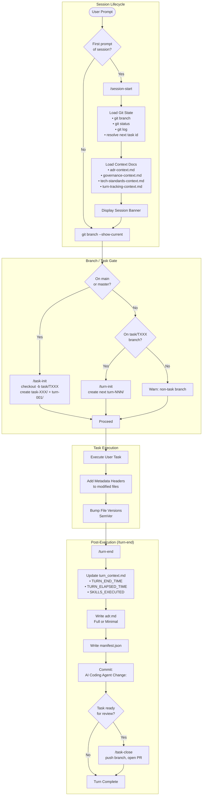

# coding-agents-config

Agentic pipeline configuration for Claude Code and Codex. Enforces a task/turn-based
workflow with provenance tracking, branch protection, and governance rules, plus a
library of AppFactory backend SDLC skills.

## Setup

### 1. Clone the repo

```sh
git clone <repo-url> ~/coding-agents-config
```

### 2. Create symlinks (automated)

Run the setup script — it creates the Claude Code and Codex symlinks and backs up
any existing files:

```sh
bash scripts/setup.sh
```

<details>
<summary>Manual symlink commands</summary>

```sh
# Claude Code (~/.claude)
ln -s ~/coding-agents-config/skills        ~/.claude/skills
ln -s ~/coding-agents-config/agents        ~/.claude/agents
ln -s ~/coding-agents-config/hooks         ~/.claude/hooks
ln -s ~/coding-agents-config/scripts       ~/.claude/scripts
ln -s ~/coding-agents-config/CLAUDE.md     ~/.claude/CLAUDE.md
ln -s ~/coding-agents-config/settings.json ~/.claude/settings.json

# Codex (~/.codex)
ln -s ~/coding-agents-config/agents    ~/.codex/agents
ln -s ~/coding-agents-config/AGENTS.md ~/.codex/AGENTS.md
```

If any of these already exist, back them up first (`mv <target> <target>.bak`).
</details>

### 3. Verify

```sh
ls -la ~/.claude/skills        # should point to ~/coding-agents-config/skills
ls -la ~/.claude/agents        # should point to ~/coding-agents-config/agents
ls -la ~/.claude/hooks         # should point to ~/coding-agents-config/hooks
ls -la ~/.claude/scripts       # should point to ~/coding-agents-config/scripts
ls -la ~/.claude/CLAUDE.md     # should point to ~/coding-agents-config/CLAUDE.md
ls -la ~/.claude/settings.json # should point to ~/coding-agents-config/settings.json
ls -la ~/.codex/AGENTS.md      # should point to ~/coding-agents-config/AGENTS.md
```

## Structure

```
coding-agents-config/
├── CLAUDE.md           # Global instructions — task/turn protocol, branch rules
├── AGENTS.md           # Codex loader directive (points to ~/.claude/CLAUDE.md)
├── settings.json       # Claude Code settings (model, permissions, hooks)
├── package.json        # caveman plugin dependency
├── agents/             # Agent definitions (e.g. agent-architecture-planner.md)
├── hooks/              # Shell hooks triggered by Claude Code events
│   └── branch-guard.sh # Blocks edits on main/master
├── scripts/            # Repo-level automation
│   ├── setup.sh        # Creates ~/.claude and ~/.codex symlinks
│   └── af-state.sh     # AppFactory pipeline state helper
├── skills/              # Slash-command skills
│   ├── session-start/   # Load git state + pipeline context at session start
│   ├── task-init/        # Create task/TXXX branch + task-XXX/turn-001 artifacts
│   ├── turn-init/         # Create the next turn-NNN/ within the active task
│   ├── turn-end/           # Finalize a turn (ADR, manifest, commit)
│   ├── task-close/         # Push the task branch and open a PR against main
│   ├── branch-guard/       # Legacy guard: create turn/T<id> branch off main
│   ├── af-*/               # AppFactory backend SDLC skills (see below)
│   ├── dsl-utils/, e2e-tests/, ui-utils/, unit-tests/  # Utility skill groups
│   ├── eval-labeler/        # Label/score model responses for evals
│   └── .system/              # Codex meta-skills (skill-creator, skill-installer, ...)
├── docs/                  # Reference docs (AppFactory plan, skill summary, migration notes)
├── archive/               # Retired skills and templates kept for reference
└── .appfactory/           # Task/turn tracking, specs, prompts, memory
    ├── tasks/             # task-XXX/ directories with turns/turn-XXX/ subfolders
    ├── tasks_index.csv    # Registry of tasks (branch, status, PR url, turn count)
    ├── changelog.md       # Turn-by-turn change history
    ├── prompts/           # Prompt drafts and templates
    ├── specs/             # Specifications
    └── memory/            # Project memory
```

## Execution Flow

The pipeline enforces a task/turn-based workflow for all coding prompts:


```mermaid
flowchart TB
    subgraph SESSION["Session Lifecycle"]
        START([User Prompt]) --> SS{First prompt<br/>of session?}
        SS -->|Yes| SESSION_START["/session-start"]
        SS -->|No| BRANCH_CHECK
        SESSION_START --> LOAD_GIT["Load Git State<br/>• git branch<br/>• git status<br/>• git log<br/>• resolve next task id"]
        LOAD_GIT --> LOAD_CTX["Load Context Docs<br/>• adr-context.md<br/>• governance-context.md<br/>• tech-standards-context.md<br/>• turn-tracking-context.md"]
        LOAD_CTX --> BANNER["Display Session Banner"]
        BANNER --> BRANCH_CHECK
    end

    subgraph GATE["Branch / Task Gate"]
        BRANCH_CHECK["git branch --show-current"] --> IS_MAIN{On main<br/>or master?}
        IS_MAIN -->|Yes| TASK_INIT["/task-init<br/>checkout -b task/TXXX<br/>create task-XXX/ + turn-001/"]
        IS_MAIN -->|No| IS_TASK{On task/TXXX<br/>branch?}
        IS_TASK -->|Yes| TURN_INIT["/turn-init<br/>create next turn-NNN/"]
        IS_TASK -->|No| WARN["Warn: non-task branch"]
        TASK_INIT --> PROCEED["Proceed"]
        TURN_INIT --> PROCEED
        WARN --> PROCEED
    end

    subgraph EXECUTION["Task Execution"]
        PROCEED --> EXEC["Execute User Task"]
        EXEC --> ADD_HEADERS["Add Metadata Headers<br/>to modified files"]
        ADD_HEADERS --> BUMP_VERSION["Bump File Versions<br/>SemVer"]
    end

    subgraph POST_EXEC["Post-Execution (/turn-end)"]
        BUMP_VERSION --> TURN_END["/turn-end"]
        TURN_END --> UPDATE_CTX["Update turn_context.md<br/>• TURN_END_TIME<br/>• TURN_ELAPSED_TIME<br/>• SKILLS_EXECUTED"]
        UPDATE_CTX --> WRITE_ADR["Write adr.md<br/>Full or Minimal"]
        WRITE_ADR --> WRITE_MANIFEST["Write manifest.json"]
        WRITE_MANIFEST --> COMMIT["Commit:<br/>AI Coding Agent Change:"]
        COMMIT --> READY{Task ready<br/>for review?}
        READY -->|Yes| TASK_CLOSE["/task-close<br/>push branch, open PR"]
        READY -->|No| COMPLETE["Turn Complete"]
        TASK_CLOSE --> COMPLETE
    end
```

### Turn Protocol Summary

| Phase | Steps | Outputs |
|-------|-------|---------|
| **Session Start** | Load git state → resolve next task id → load 4 context docs → display banner | Context loaded |
| **Branch / Task Gate** | Check branch → `/task-init` if on `main`/`master` (new `task/TXXX` branch + `turn-001/`) → `/turn-init` if already on a task branch (next `turn-NNN/`) | Task/turn directories ready |
| **Execution** | Execute task → add metadata headers → bump versions | Modified files |
| **Turn End** | Update `turn_context.md` → write `adr.md` → write `manifest.json` → commit (`AI Coding Agent Change:`) | Turn artifacts + commit |
| **Task Close** (on request) | Update task artifacts → push branch → open PR against `main` | `pull_request.md`, PR opened |

See `CLAUDE.md` for the full directory layout and required artifacts per task/turn.

## Skills

### Pipeline / Governance

| Skill | Description |
|-------|-------------|
| `session-start` | Load repository state and core pipeline context at the start of every session |
| `task-init` | Create a new `task/TXXX` branch plus `task-XXX/turn-001` artifacts (run on `main`/`master`) |
| `turn-init` | Create the next `turn-NNN/` directory within the active task |
| `turn-end` | Finalize the active turn: update context, write ADR + manifest, commit |
| `task-close` | Finalize the task branch, push it, and open a PR against `main` |
| `branch-guard` | Legacy guard — create a `turn/T<id>` branch if currently on `main`/`master` |

### AppFactory Backend SDLC (`af-*`)

| Skill | Role in the pipeline |
|-------|----------------------|
| `af-orchestrator` | Orchestrates the AppFactory SDLC across all phases |
| `af-project-init` | Exports required env vars and bootstraps a new AppFactory project |
| `af-be-prd-build` | Builds a business-facing backend PRD from an intake worksheet |
| `af-be-ddd-orchestrator` | Orchestrates the DDD build → analyze → refactor → test loop |
| `af-be-ddd-build` | Generates a backend DDD document from an approved PRD |
| `af-be-ddd-analysis` | Audits a DDD document for quality, completeness, and PRD alignment |
| `af-be-ddd-refactor` | Applies targeted patches to the DDD document from analysis findings |
| `af-be-ddd-tests` | Generates Gherkin BDD feature files from the DDD and PRD |
| `af-be-ddd-dsl` | Generates a domain DSL YAML document from the DDD document |
| `af-be-plan` | Generates a backend execution plan from the DSL and a tech stack profile |
| `af-be-implementation` | Generates backend code from the execution plan and BDD specs |
| `af-app-check` | Audits an application for production readiness (security, db, deploy, code quality) |
| `af-memory` | CRUD operations on AppFactory pipeline state (`state.yaml`) |

See `docs/skill-summary.md` for the full phase-by-phase reference.

### Utility

| Skill | Description |
|-------|-------------|
| `dsl-utils/dsl-model-interpreter` | Parse and validate `app-dsl` YAML specs before code generation |
| `e2e-tests/http-test-artifacts` | Generate `.http` request files for REST endpoint testing |
| `ui-utils/ui-implementation-language` | Declarative YAML standard for UI pages, layouts, and widgets |
| `unit-tests/test-implementation-sync` | Keep unit tests synchronized with service/DTO implementations |
| `eval-labeler` | Label and score Response A vs Response B for coding-task evals |

### Meta-Skills (`.system`, Codex)

| Skill | Description |
|-------|-------------|
| `skill-creator` | Guide for creating or updating skills |
| `skill-installer` | Install curated skills from `openai/skills` or other repos |
| `plugin-creator` | Scaffold Codex plugin directories |
| `imagegen` | Generate or edit raster images |
| `openai-docs` | Look up OpenAI API/product documentation |

## Templates

Templates live alongside the skills that use them rather than in a shared top-level
`templates/` directory:

| Location | Templates |
|----------|-----------|
| `skills/task-init/templates/`, `skills/turn-init/templates/` | Task/turn lifecycle artifacts (`turn_context.md`, `adr.md`, `manifest.json`, etc.) |
| `skills/af-be-prd-build/templates/` | `prd-template.md` |
| `skills/af-be-ddd-build/templates/` | `ddd-template.md` |
| `skills/af-be-ddd-dsl/templates/` | `domain-dsl-template.yaml` |
| `skills/af-be-ddd-tests/templates/` | `feature-template.gherkin`, `gherkin-spec-template.md` |
| `skills/af-be-plan/templates/` | `execution-plan-template.md` |
| `skills/af-be-implementation/templates/` | `implementation-manifest-template.yaml` |
| `skills/af-project-init/templates/` | `gitignore.template` |
| `archive/templates/` | Retired global templates (`adr_template.md`, `pull_request_template.md`, `tech-stack.template.md`) kept for reference |

## Hooks

| Hook | Trigger | Purpose |
|------|---------|---------|
| `branch-guard.sh` | PreToolUse(Edit) | Block edits on main/master |

## Adding a new skill

Each skill lives in its own directory under `skills/` with a `SKILL.md` file:

```
skills/my-skill/
└── SKILL.md
```

The `.system/skill-creator` meta-skill can guide you through creating one — invoke it from Claude Code.

## Syncing across machines

Since this is a standard git repo, pull on any machine to stay current:

```sh
cd ~/coding-agents-config && git pull
```

The symlinks mean changes are picked up immediately — no reinstall needed.
