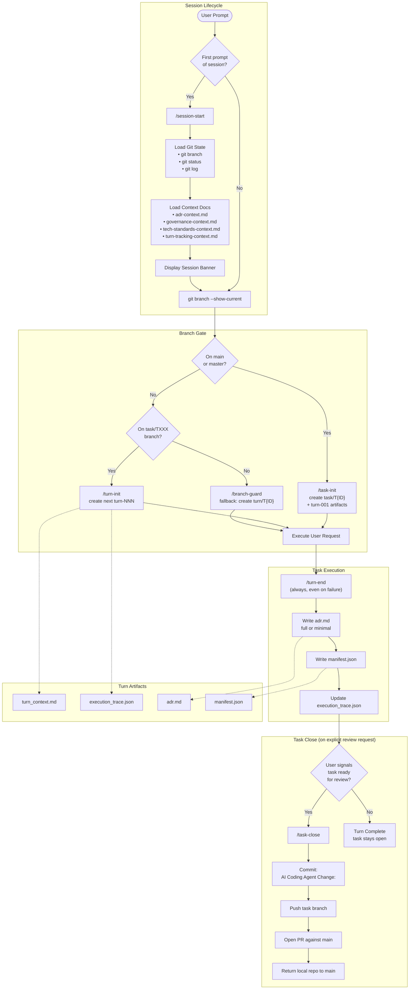

# coding-agents-config

Agentic pipeline configuration for Claude Code and Codex. Enforces a task/turn-based workflow with provenance tracking, branch protection, and governance rules, plus the AppFactory skill library for DDD-driven backend generation.

## Setup

### 1. Clone the repo

```sh
git clone <repo-url> ~/coding-agents-config
```

### 2. Create symlinks (automated)

Run the setup script — it creates all symlinks and backs up any existing files:

```sh
bash scripts/setup.sh
```

<details>
<summary>Manual symlink commands</summary>

```sh
# ~/.claude/
ln -s ~/coding-agents-config/skills       ~/.claude/skills
ln -s ~/coding-agents-config/agents       ~/.claude/agents
ln -s ~/coding-agents-config/hooks        ~/.claude/hooks
ln -s ~/coding-agents-config/scripts      ~/.claude/scripts
ln -s ~/coding-agents-config/CLAUDE.md    ~/.claude/CLAUDE.md
ln -s ~/coding-agents-config/settings.json ~/.claude/settings.json

# ~/.codex/
ln -s ~/coding-agents-config/agents   ~/.codex/agents
ln -s ~/coding-agents-config/AGENTS.md ~/.codex/AGENTS.md

# repo-local ./.claude/
ln -s ~/coding-agents-config/CLAUDE.md ./.claude/CLAUDE.md
```

If any of these already exist, back them up first (`mv <target> <target>.bak`). `rules/`, `context/`, and `plugins/` are also linked into `~/.claude/` by `setup.sh` when present in the repo.

</details>

### 3. Verify

```sh
ls -la ~/.claude/skills        # should point to ~/coding-agents-config/skills
ls -la ~/.claude/hooks         # should point to ~/coding-agents-config/hooks
ls -la ~/.claude/CLAUDE.md     # should point to ~/coding-agents-config/CLAUDE.md
ls -la ~/.claude/settings.json # should point to ~/coding-agents-config/settings.json
ls -la ~/.codex/AGENTS.md      # should point to ~/coding-agents-config/AGENTS.md
```

## Structure

```
coding-agents-config/
├── CLAUDE.md            # Global instructions — task/turn protocol, branch rules
├── AGENTS.md            # Codex agent loader directive (loads ~/.claude/CLAUDE.md)
├── settings.json        # Claude Code settings (model, permissions, hooks)
├── package.json         # Repo-local dependency (caveman)
├── hooks/               # Shell hooks triggered by Claude Code events
│   └── branch-guard.sh  # Blocks edits on main/master (PreToolUse hook)
├── skills/              # Slash-command skills (35 total)
│   ├── .system/         # Codex meta-skills (skill-creator, imagegen, ...)
│   ├── .nestjs/         # NestJS/Prisma code-generation skills
│   ├── session-start/   # Initialize session context
│   ├── task-init/       # Create task branch + turn-001 artifacts
│   ├── turn-init/       # Create next turn directory and artifacts
│   ├── turn-end/        # Finalize turn with ADR + manifest
│   ├── task-close/      # Push task branch and open PR against main
│   ├── branch-guard/    # Fallback guard against edits on main/master
│   ├── af-*/            # AppFactory backend DDD pipeline (13 skills)
│   ├── dsl-utils/, ui-utils/, e2e-tests/, unit-tests/  # Grouped utility skills
│   └── eval-labeler/    # Model response evaluation/labeling
├── agents/              # Reusable subagent definitions
│   └── agent-architecture-planner.md
├── scripts/             # Automation scripts
│   ├── setup.sh         # Creates symlinks into ~/.claude and ~/.codex
│   └── af-state.sh      # AppFactory state.yaml helpers, sourced by af-* skills
├── .appfactory/         # Task/turn tracking and AppFactory specs (this repo's own state)
│   ├── tasks/           # Task branches with turns (task_context.md, task_status.json, ...)
│   ├── tasks_index.csv  # Registry of all tasks
│   ├── specs/           # AppFactory specifications
│   ├── prompts/         # Prompt templates
│   └── memory/          # Project memory
├── docs/                # Reference documentation (migration analysis, skill summary, ...)
├── archive/             # Superseded skills/templates kept for reference
└── .github/             # PR and issue templates
```

## Execution Flow

The agentic pipeline enforces a strict task/turn-based workflow for all coding tasks:


```mermaid
flowchart TB
    subgraph SESSION["Session Lifecycle"]
        START([User Prompt]) --> SS{First prompt<br/>of session?}
        SS -->|Yes| SESSION_START["/session-start"]
        SS -->|No| BRANCH_CHECK
        SESSION_START --> LOAD_GIT["Load Git State<br/>• git branch<br/>• git status<br/>• git log"]
        LOAD_GIT --> LOAD_CTX["Load Context Docs<br/>• adr-context.md<br/>• governance-context.md<br/>• tech-standards-context.md<br/>• turn-tracking-context.md"]
        LOAD_CTX --> BANNER["Display Session Banner"]
        BANNER --> BRANCH_CHECK
    end

    subgraph GATE["Branch Gate"]
        BRANCH_CHECK["git branch --show-current"] --> IS_MAIN{On main<br/>or master?}
        IS_MAIN -->|Yes| TASK_INIT["/task-init<br/>create task/T{ID}<br/>+ turn-001 artifacts"]
        IS_MAIN -->|No| IS_TASK{On task/TXXX<br/>branch?}
        IS_TASK -->|Yes| TURN_INIT["/turn-init<br/>create next turn-NNN"]
        IS_TASK -->|No| BRANCH_GUARD["/branch-guard<br/>fallback: create turn/T{ID}"]
        TASK_INIT --> EXEC
        TURN_INIT --> EXEC
        BRANCH_GUARD --> EXEC
    end

    subgraph EXECUTION["Task Execution"]
        EXEC["Execute User Request"] --> TURN_END["/turn-end<br/>(always, even on failure)"]
        TURN_END --> WRITE_ADR["Write adr.md<br/>full or minimal"]
        WRITE_ADR --> WRITE_MANIFEST["Write manifest.json"]
        WRITE_MANIFEST --> UPDATE_TRACE["Update execution_trace.json"]
    end

    subgraph CLOSE["Task Close (on explicit review request)"]
        UPDATE_TRACE --> READY{User signals<br/>task ready<br/>for review?}
        READY -->|Yes| TASK_CLOSE["/task-close"]
        TASK_CLOSE --> COMMIT["Commit:<br/>AI Coding Agent Change:"]
        COMMIT --> PUSH["Push task branch"]
        PUSH --> PR["Open PR against main"]
        PR --> RETURN_MAIN["Return local repo to main"]
        READY -->|No| DONE["Turn Complete<br/>task stays open"]
    end

    subgraph ARTIFACTS["Turn Artifacts"]
        direction LR
        A1["turn_context.md"]
        A2["execution_trace.json"]
        A3["adr.md"]
        A4["manifest.json"]
    end

    TURN_INIT -.-> A1
    TURN_INIT -.-> A2
    WRITE_ADR -.-> A3
    WRITE_MANIFEST -.-> A4
```

### Task/Turn Protocol Summary

| Phase | Skill | Steps | Outputs |
|-------|-------|-------|---------|
| **Session Start** | `session-start` | Load git state → load 4 context docs → display banner | Context loaded |
| **Task Init** | `task-init` | Resolve next task id → `git checkout -b task/TXXX` → init task dir + turn-001 → append `tasks_index.csv` | `task_context.md`, `task_status.json`, `task_summary.md`, `pull_request.md`, turn-001 artifacts |
| **Turn Init** | `turn-init` | Resolve next turn id within active task → create turn dir | `turn_context.md`, `execution_trace.json` |
| **Branch Guard** | `branch-guard` | Fallback: if still on main/master and `turn-init` hasn't run, create `turn/T{ID}` | Safe branch |
| **Execution** | — | Execute the user's request | Modified files |
| **Turn End** | `turn-end` | Finalize `turn_context.md` → write ADR → write manifest → update trace | `adr.md`, `manifest.json` |
| **Task Close** | `task-close` | Commit → push → open PR against `main` → return to `main` | PR opened, task status `pr-open` |

## Skills (35)

| Category | Skill | Description |
|----------|-------|-------------|
| **Task/Turn Protocol** | `session-start` | Load repository state and core pipeline context at session start |
| | `task-init` | Initialize a new task branch (`task/TXXX`) and create task + turn-001 artifacts |
| | `turn-init` | Initialize the next turn within the active task branch |
| | `turn-end` | Finalize the active turn (ADR, manifest, trace), run after every prompt |
| | `task-close` | Finalize the active task, push it, and open a PR against `main` |
| | `branch-guard` | Fallback guard: create a turn-scoped branch if still on main/master |
| **AppFactory Pipeline** (`af-*`) | `af-orchestrator` | Orchestrates the full AppFactory software development lifecycle |
| | `af-project-init` | Export required env vars and initialize an AppFactory project |
| | `af-be-prd-build` | Build a business-facing backend PRD from an intake worksheet |
| | `af-be-ddd-orchestrator` | Orchestrate the backend DDD build → analyze → refactor → test loop |
| | `af-be-ddd-build` | Generate a human-readable backend DDD document from an approved PRD |
| | `af-be-ddd-analysis` | Audit a DDD spec for quality, completeness, and PRD alignment |
| | `af-be-ddd-refactor` | Apply targeted DDD patches based on `af-be-ddd-analysis` findings |
| | `af-be-ddd-tests` | Generate Gherkin-style BDD scenarios from the DDD and PRD |
| | `af-be-plan` | Generate a backend execution plan from a domain DSL and tech-stack profile |
| | `af-be-ddd-dsl` | Generate a backend application DSL YAML from the DDD document |
| | `af-be-implementation` | Copy the target tech-stack implementation and generate domain code |
| | `af-app-check` | Audit an application for production readiness before release |
| | `af-memory` | CRUD operations over `.appfactory/memory/state.yaml` pipeline state |
| **DSL / UI / Test Utility** | `dsl-utils/dsl-model-interpreter` | Parse and validate app-dsl YAML specifications |
| | `ui-utils/ui-implementation-language` | Declarative YAML standard for UI pages, layouts, widgets, and bindings |
| | `e2e-tests/http-test-artifacts` | Generate `.http` request files for REST endpoint testing |
| | `unit-tests/test-implementation-sync` | Keep unit tests synchronized with service/DTO implementations |
| | `eval-labeler` | Label and score Response A vs Response B model evaluations |
| **NestJS/Prisma Codegen** (`.nestjs/`) | `app-from-dsl` | Orchestrate full-stack generation from app-dsl YAML specs |
| | `nestjs-crud-resource` | Generate a NestJS CRUD module from a DSL backend spec |
| | `nestjs-prisma-resource` | Generate a schema-driven NestJS CRUD resource backed by Prisma |
| | `nestjs-customer-crud-scaffold` | Scaffold a NestJS customer CRUD app via the Nest CLI |
| | `nestjs-observability` | Add structured logging, correlation IDs, and Prisma query logging |
| | `field-mapper-generator` | Generate field mapper/converter code between UI, API, and persistence layers |
| **Codex Meta-Skills** (`.system/`) | `skill-creator` | Guide for creating and updating skills |
| | `skill-installer` | Install skills into `$CODEX_HOME/skills` from a curated list or repo |
| | `plugin-creator` | Scaffold plugin directories with `.codex-plugin/plugin.json` |
| | `imagegen` | Generate or edit raster images (photos, illustrations, sprites, mockups) |
| | `openai-docs` | Look up official OpenAI docs and model guidance with citations |

## Agents

| Agent | Purpose |
|-------|---------|
| `agent-architecture-planner` | Reusable subagent definition for architecture planning |

## Hooks

| Hook | Trigger | Purpose |
|------|---------|---------|
| `branch-guard.sh` | `PreToolUse(Bash)` | Blocks edits on `main`/`master` before a task branch exists |

## Templates

There is no single top-level `templates/` directory. Templates live where they're consumed:

- Each `af-*` skill ships its own `templates/` (e.g. `skills/af-be-ddd-build/templates/ddd-template.md`)
- `task-init/` and `turn-init/` ship `turn_context.md` / `task_context.md` templates
- `archive/templates/` holds the older generic `adr_template.md`, `pull_request_template.md`, and `tech-stack.template.md`
- `.github/PULL_REQUEST_TEMPLATE.md` and `.github/ISSUE_TEMPLATE/` hold GitHub templates

## Adding a new skill

Each skill lives in its own directory under `skills/` with a `SKILL.md` file:

```
skills/my-skill/
└── SKILL.md
```

The `.system/skill-creator` meta-skill can guide you through creating one — invoke it from Claude Code or Codex.

## Syncing across machines

Since this is a standard git repo, pull on any machine to stay current:

```sh
cd ~/coding-agents-config && git pull
```

The symlinks mean changes are picked up immediately — no reinstall needed.
