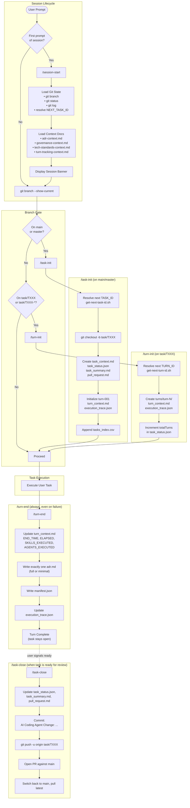

# coding-agents-config

Agentic pipeline configuration shared by Claude Code and Codex. Enforces a task/turn-based workflow with provenance tracking, branch protection, and governance rules, and ships the **App Factory** (`af-*`) skill library for spec-driven application generation (PRD → DDD → DSL → plan → implementation).

## Setup

### 1. Clone the repo

```sh
git clone <repo-url> ~/coding-agents-config
```

### 2. Create symlinks (automated)

Run the setup script — it creates all symlinks and backs up any existing files:

```sh
bash scripts/setup.sh
```

<details>
<summary>Manual symlink commands</summary>

```sh
# Into ~/.claude/
ln -s ~/coding-agents-config/skills       ~/.claude/skills
ln -s ~/coding-agents-config/agents       ~/.claude/agents
ln -s ~/coding-agents-config/hooks        ~/.claude/hooks
ln -s ~/coding-agents-config/scripts      ~/.claude/scripts
ln -s ~/coding-agents-config/CLAUDE.md    ~/.claude/CLAUDE.md
ln -s ~/coding-agents-config/settings.json ~/.claude/settings.json

# Into ~/.codex/
ln -s ~/coding-agents-config/agents    ~/.codex/agents
ln -s ~/coding-agents-config/AGENTS.md ~/.codex/AGENTS.md

# Repo-local
ln -s ~/coding-agents-config/CLAUDE.md ~/coding-agents-config/.claude/CLAUDE.md
```

`rules/`, `context/`, and `plugins/` are also linked into `~/.claude/` by `scripts/setup.sh` if present in the repo (reserved for future use — not currently checked in).

If any target already exists, back it up first (`mv <target> <target>.bak`).
</details>

### 3. Verify

```sh
ls -la ~/.claude/skills        # should point to ~/coding-agents-config/skills
ls -la ~/.claude/agents        # should point to ~/coding-agents-config/agents
ls -la ~/.claude/hooks         # should point to ~/coding-agents-config/hooks
ls -la ~/.claude/CLAUDE.md     # should point to ~/coding-agents-config/CLAUDE.md
ls -la ~/.claude/settings.json # should point to ~/coding-agents-config/settings.json
ls -la ~/.codex/AGENTS.md      # should point to ~/coding-agents-config/AGENTS.md
```

## Structure

```
coding-agents-config/
├── CLAUDE.md              # Global instructions — task/turn protocol, branch rules
├── AGENTS.md              # Codex loader directive (points at CLAUDE.md)
├── settings.json          # Claude Code settings (model, permissions)
├── package.json           # Node dependency for helper scripts (caveman)
├── hooks/
│   └── branch-guard.sh    # PreToolCall hook — auto-creates a task branch off main/master
├── agents/
│   └── agent-architecture-planner.md  # Sonnet subagent: PRD/DDD/DSL → architecture & task plan
├── skills/                # Slash-command skills (37 SKILL.md files)
│   ├── session-start/     # Load git + governance context at session start
│   ├── task-init/         # Create task/TXXX branch + task_context + turn-001
│   ├── turn-init/         # Create the next turn inside the active task
│   ├── turn-end/          # Finalize a turn: adr.md, manifest.json, execution_trace.json
│   ├── task-close/        # Finalize task, push branch, open PR against main
│   ├── branch-guard/      # Fallback branch creation if on main/master
│   ├── af-orchestrator/   # Drives the App Factory SDLC end to end
│   ├── af-project-init/   # Bootstrap a new AppFactory project
│   ├── af-be-prd-build/   # Draft a backend PRD from an intake worksheet
│   ├── af-be-ddd-orchestrator/  # Runs build → analyze → refactor → tests loop
│   ├── af-be-ddd-build/   # Generate DDD doc from PRD
│   ├── af-be-ddd-analysis/      # Audit a DDD doc against its PRD
│   ├── af-be-ddd-refactor/      # Patch a DDD doc from analysis findings
│   ├── af-be-ddd-tests/   # Generate Gherkin/BDD scenarios from DDD + PRD
│   ├── af-be-ddd-dsl/     # Generate domain DSL YAML from a DDD doc
│   ├── af-be-plan/        # Generate a backend execution plan from DSL + tech stack
│   ├── af-be-implementation/    # Copy tech-stack impl and generate domain code
│   ├── af-app-check/      # Production-readiness audit
│   ├── af-memory/         # CRUD on .appfactory/memory/state.yaml
│   ├── eval-labeler/      # Label/compare model-response evals in a run directory
│   ├── dsl-utils/dsl-model-interpreter/     # Parse & validate app-dsl YAML
│   ├── e2e-tests/http-test-artifacts/       # Generate .http files from DSL endpoints
│   ├── ui-utils/ui-implementation-language/ # Declarative UI YAML spec standard
│   ├── unit-tests/test-implementation-sync/ # Keep unit tests aligned with implementations
│   ├── .nestjs/            # NestJS/Prisma scaffolding & guideline skills (8)
│   └── .system/            # Codex system skills — skill-creator, skill-installer, plugin-creator, imagegen, openai-docs
├── scripts/
│   ├── setup.sh            # Creates the symlinks above
│   └── af-state.sh         # Bash helpers for reading/writing .appfactory/memory/state.yaml
├── docs/                   # Reference & migration documentation
│   ├── skill-summary.md
│   ├── appFactory-plan.md
│   ├── app-nextjs-nestjs-prisma.md
│   ├── migration-ai-to-appfactory.md
│   └── ai-to-appfactory-migration-analysis.md
├── .appfactory/            # Task/turn tracking, specs, prompts, memory (see below)
├── archive/                 # Superseded skills and docs kept for reference
└── .github/                 # PR and issue templates
```

Per-skill `templates/` directories (e.g. `skills/task-init/templates/`, `skills/af-be-ddd-build/templates/`) hold the Markdown/YAML templates each skill fills in — there is no longer a shared top-level `templates/` directory.

## Execution Flow

The agentic pipeline enforces a strict task/turn workflow for all coding tasks:


```mermaid
flowchart TB
    subgraph SESSION["Session Lifecycle"]
        START([User Prompt]) --> SS{First prompt<br/>of session?}
        SS -->|Yes| SESSION_START["/session-start"]
        SS -->|No| BRANCH_CHECK
        SESSION_START --> LOAD_GIT["Load Git State<br/>• git branch<br/>• git status<br/>• git log<br/>• resolve NEXT_TASK_ID"]
        LOAD_GIT --> LOAD_CTX["Load Context Docs<br/>• adr-context.md<br/>• governance-context.md<br/>• tech-standards-context.md<br/>• turn-tracking-context.md"]
        LOAD_CTX --> BANNER["Display Session Banner"]
        BANNER --> BRANCH_CHECK
    end

    subgraph BRANCH_GATE["Branch Gate"]
        BRANCH_CHECK["git branch --show-current"] --> IS_MAIN{On main<br/>or master?}
        IS_MAIN -->|Yes| TASK_INIT
        IS_MAIN -->|No| IS_TASK{On task/TXXX<br/>or task/TXXX-*?}
        IS_TASK -->|Yes| TURN_INIT
        IS_TASK -->|No| PROCEED
    end

    subgraph TASK_START["/task-init (on main/master)"]
        TASK_INIT["/task-init"] --> RESOLVE_TASK["Resolve next TASK_ID<br/>get-next-task-id.sh"]
        RESOLVE_TASK --> NEW_BRANCH["git checkout -b task/TXXX"]
        NEW_BRANCH --> TASK_ARTIFACTS["Create task_context.md<br/>task_status.json<br/>task_summary.md<br/>pull_request.md"]
        TASK_ARTIFACTS --> TURN001["Initialize turn-001<br/>turn_context.md<br/>execution_trace.json"]
        TURN001 --> INDEX["Append tasks_index.csv"]
        INDEX --> PROCEED
    end

    subgraph TURN_START["/turn-init (on task/TXXX)"]
        TURN_INIT["/turn-init"] --> RESOLVE_TURN["Resolve next TURN_ID<br/>get-next-turn-id.sh"]
        RESOLVE_TURN --> TURN_DIR["Create turns/turn-N/<br/>turn_context.md<br/>execution_trace.json"]
        TURN_DIR --> BUMP_TOTAL["Increment totalTurns<br/>in task_status.json"]
        BUMP_TOTAL --> PROCEED
    end

    subgraph EXECUTION["Task Execution"]
        PROCEED["Proceed"] --> EXEC["Execute User Task"]
    end

    subgraph POST_EXEC["/turn-end (always, even on failure)"]
        EXEC --> TURN_END["/turn-end"]
        TURN_END --> UPDATE_CTX["Update turn_context.md<br/>END_TIME, ELAPSED, SKILLS_EXECUTED,<br/>AGENTS_EXECUTED"]
        UPDATE_CTX --> WRITE_ADR["Write exactly one adr.md<br/>(full or minimal)"]
        WRITE_ADR --> WRITE_MANIFEST["Write manifest.json"]
        WRITE_MANIFEST --> UPDATE_TRACE["Update execution_trace.json"]
        UPDATE_TRACE --> COMPLETE["Turn Complete<br/>(task stays open)"]
    end

    subgraph TASK_END["/task-close (when task is ready for review)"]
        COMPLETE -.->|user signals ready| TASK_CLOSE["/task-close"]
        TASK_CLOSE --> UPDATE_TASK["Update task_status.json,<br/>task_summary.md, pull_request.md"]
        UPDATE_TASK --> COMMIT["Commit:<br/>AI Coding Agent Change: ..."]
        COMMIT --> PUSH["git push -u origin task/TXXX"]
        PUSH --> PR["Open PR against main"]
        PR --> RETURN_MAIN["Switch back to main, pull latest"]
    end
```

### Turn Protocol Summary

| Phase | Trigger | Steps | Outputs |
|-------|---------|-------|---------|
| **Session Start** | First prompt of session | Load git state → resolve next task id → load 4 context docs → display banner | Context loaded |
| **Task Init** | Branch is `main`/`master` | Resolve TASK_ID → `git checkout -b task/TXXX` → create task artifacts → init turn-001 → append `tasks_index.csv` | New task branch + turn-001 |
| **Turn Init** | Branch is `task/TXXX[-*]` | Resolve next TURN_ID → create `turns/turn-N/` → write `turn_context.md` + `execution_trace.json` → bump `totalTurns` | New turn directory |
| **Execution** | Every prompt | Execute the user's request | Modified files |
| **Turn End** | After every prompt, even on failure | Finalize `turn_context.md` → write `adr.md` → write `manifest.json` → update `execution_trace.json` | 4 turn artifacts complete |
| **Task Close** | User signals task ready for review | Update task artifacts → commit (`AI Coding Agent Change:` format) → push → open PR against `main` → return to `main` | PR opened, task status `pr-open` |

As a fallback, the `hooks/branch-guard.sh` PreToolCall hook auto-creates a `task/TXXX` branch if a write/bash tool call is attempted while still on `main`/`master`.

## Skills (37)

| Category | Skill | Description |
|----------|-------|-------------|
| **Session/Task/Turn** | `session-start` | Load git state and governance context docs at session start |
| | `task-init` | Create `task/TXXX` branch, task artifacts, and turn-001 (run on `main`/`master`) |
| | `turn-init` | Create the next turn directory inside the active task branch |
| | `turn-end` | Finalize the active turn: adr, manifest, execution trace |
| | `task-close` | Finalize task, commit, push, and open a PR against `main` |
| | `branch-guard` | Create a turn-scoped branch if still on `main`/`master` |
| **App Factory — Orchestration** | `af-orchestrator` | Drive the full App Factory SDLC (init → PRD → DDD → tests → plan → implementation) |
| | `af-project-init` | Export env vars and bootstrap a new AppFactory project |
| | `af-memory` | CRUD on `.appfactory/memory/state.yaml` pipeline state |
| **App Factory — Requirements/Design** | `af-be-prd-build` | Build a business-facing backend PRD from an intake worksheet |
| | `af-be-ddd-orchestrator` | Orchestrate DDD build → analyze → refactor loop → tests |
| | `af-be-ddd-build` | Generate a DDD document from an approved PRD |
| | `af-be-ddd-analysis` | Audit a DDD spec for quality, completeness, and PRD alignment |
| | `af-be-ddd-refactor` | Patch a DDD spec using `af-be-ddd-analysis` findings |
| | `af-be-ddd-tests` | Generate Gherkin/BDD scenarios from DDD + PRD |
| | `af-be-ddd-dsl` | Generate domain DSL YAML from a DDD document |
| **App Factory — Build/Verify** | `af-be-plan` | Generate a backend execution plan from DSL + tech-stack profile |
| | `af-be-implementation` | Copy a tech-stack implementation and generate domain code |
| | `af-app-check` | Production-readiness audit (security, database, deployment, quality) |
| **Utility** | `eval-labeler` | Label/compare Response A vs B model evals in a run directory |
| | `dsl-utils/dsl-model-interpreter` | Parse and validate `app-dsl` YAML specs |
| | `e2e-tests/http-test-artifacts` | Generate `.http` request files from DSL backend endpoints |
| | `ui-utils/ui-implementation-language` | Declarative YAML language for UI pages, forms, and API bindings |
| | `unit-tests/test-implementation-sync` | Keep generated unit tests aligned with their implementations |
| **NestJS/Prisma** (`.nestjs/`) | `app-from-dsl` | Orchestrate full-stack generation from `app-dsl` YAML |
| | `nestjs-crud-resource` | Generate a NestJS CRUD module from a DSL backend spec |
| | `nestjs-prisma-resource` | Generate a NestJS + Prisma CRUD resource from an input schema |
| | `nestjs-customer-crud-scaffold` | Scaffold a NestJS customer CRUD app via the Nest CLI |
| | `nestjs-observability` | Add structured logging/observability to a NestJS + Prisma backend |
| | `field-mapper-generator` | Generate field mapper/converter utilities from DSL mapper specs |
| | `prisma/prisma-persistence` | Generate Prisma schema and migrations from a DSL persistence model |
| | `prisma/prisma-guidelines` | Prisma development guidelines and constraints reference |
| **Codex System** (`.system/`) | `skill-creator` | Guide for creating/updating skills |
| | `skill-installer` | Install curated skills from `openai/skills` or another repo |
| | `plugin-creator` | Scaffold Codex plugin directories and marketplace entries |
| | `imagegen` | Generate or edit raster images |
| | `openai-docs` | Look up official OpenAI API/model documentation |

See `docs/skill-summary.md` for the App Factory skills mapped to SDLC phase and invoking orchestrator.

## Agents

| Agent | Model | Purpose |
|-------|-------|---------|
| `agent-architecture-planner` | sonnet | Reads PRD/DDD/DSL and repo structure to produce architecture decisions, module maps, and task plans for downstream coding agents |

## Hooks

| Hook | Trigger | Purpose |
|------|---------|---------|
| `branch-guard.sh` | PreToolCall (`bash`/write tools) | If on `main`/`master`, auto-create and switch to the next `task/TXXX` branch instead of blocking the call |

## `.appfactory/` — Task and Project State

```
.appfactory/
├── changelog.md         # Project changelog
├── tasks_index.csv       # Registry of all tasks (id, branch, status, PR url, turn count)
├── tasks/
│   └── task-XXX/
│       ├── task_context.md
│       ├── task_status.json
│       ├── task_summary.md
│       ├── pull_request.md
│       └── turns/
│           └── turn-XXX/
│               ├── turn_context.md
│               ├── execution_trace.json
│               ├── adr.md
│               └── manifest.json
├── specs/                # PRD / DDD / DSL specification artifacts
├── prompts/               # Prompt templates
└── memory/                # AppFactory pipeline state (state.yaml), read/written via af-memory
```

## Adding a new skill

Each skill lives in its own directory under `skills/` with a `SKILL.md` file:

```
skills/my-skill/
└── SKILL.md
```

The `.system/skill-creator` meta-skill can guide you through creating one — invoke it from Claude Code or Codex.

## Archive

`archive/` holds skills and docs superseded by the current App Factory / `.nestjs` skills (e.g. earlier `code-entity-to-crud`, `schema-to-database`, `react-form-page` implementations) — kept for reference, not symlinked into `~/.claude/`.

## Syncing across machines

Since this is a standard git repo, pull on any machine to stay current:

```sh
cd ~/coding-agents-config && git pull
```

The symlinks mean changes are picked up immediately — no reinstall needed.
