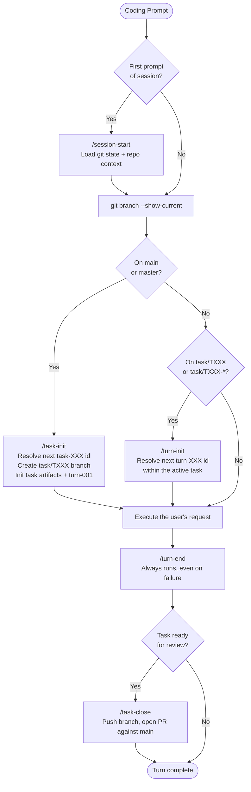

# coding-agents-config

Shared configuration for Claude Code and Codex CLI agents. Provides a governed task/turn workflow (branch protection, provenance tracking, ADRs) plus the **AppFactory** skill library for AI-driven full-stack application generation.

## Setup

### 1. Clone the repo

```sh
git clone <repo-url> ~/coding-agents-config
```

### 2. Create symlinks (automated)

Run the setup script — it links this repo into `~/.claude/`, `~/.codex/`, and a repo-local `./.claude/`, backing up any existing files first:

```sh
bash scripts/setup.sh
```

<details>
<summary>Manual symlink commands</summary>

```sh
# Claude Code (~/.claude/)
ln -s ~/coding-agents-config/skills ~/.claude/skills
ln -s ~/coding-agents-config/agents ~/.claude/agents
ln -s ~/coding-agents-config/hooks ~/.claude/hooks
ln -s ~/coding-agents-config/scripts ~/.claude/scripts
ln -s ~/coding-agents-config/CLAUDE.md ~/.claude/CLAUDE.md
ln -s ~/coding-agents-config/settings.json ~/.claude/settings.json

# Codex (~/.codex/)
ln -s ~/coding-agents-config/agents ~/.codex/agents
ln -s ~/coding-agents-config/AGENTS.md ~/.codex/AGENTS.md
```

If any of these already exist, back them up first (`mv <target> <target>.bak`).
</details>

### 3. Verify

```sh
ls -la ~/.claude/skills        # should point to ~/coding-agents-config/skills
ls -la ~/.claude/hooks         # should point to ~/coding-agents-config/hooks
ls -la ~/.claude/CLAUDE.md     # should point to ~/coding-agents-config/CLAUDE.md
ls -la ~/.claude/settings.json # should point to ~/coding-agents-config/settings.json
ls -la ~/.codex/AGENTS.md      # should point to ~/coding-agents-config/AGENTS.md
```

## Structure

```
coding-agents-config/
├── CLAUDE.md           # Global instructions for Claude Code — task/turn protocol, branch rules
├── AGENTS.md           # Codex loader directive (points at CLAUDE.md)
├── settings.json        # Claude Code settings (model, permissions, hooks, plugins)
├── hooks/
│   └── branch-guard.sh # PreToolUse hook: auto-creates a task/TXXX branch when on main/master
├── skills/              # 37 skills across pipeline, AppFactory, and utility categories (see below)
├── agents/
│   └── agent-architecture-planner.md  # Planning agent for App Factory PRD/DDD/DSL analysis
├── scripts/
│   ├── setup.sh         # Creates the symlinks above
│   └── af-state.sh      # Shell helpers for reading/writing .appfactory/memory/state.yaml
├── docs/                # Reference docs (pipeline design, migration history, skill index)
├── .github/              # PR template and issue templates
├── .appfactory/          # Task/turn tracking, specs, prompts, memory (see below)
└── archive/              # Retired skills/templates from an earlier taxonomy (see archive/README.md)
```

## Task & Turn Workflow

Every coding prompt runs through a governed task/turn lifecycle defined in `CLAUDE.md`:


```mermaid
flowchart TB
    START([Coding Prompt]) --> FIRST{First prompt<br/>of session?}
    FIRST -->|Yes| SESSION_START["/session-start<br/>Load git state + repo context"]
    FIRST -->|No| CHECK_BRANCH
    SESSION_START --> CHECK_BRANCH["git branch --show-current"]

    CHECK_BRANCH --> IS_MAIN{On main<br/>or master?}
    IS_MAIN -->|Yes| TASK_INIT["/task-init<br/>Resolve next task-XXX id<br/>Create task/TXXX branch<br/>Init task artifacts + turn-001"]
    IS_MAIN -->|No| IS_TASK{On task/TXXX<br/>or task/TXXX-*?}
    IS_TASK -->|Yes| TURN_INIT["/turn-init<br/>Resolve next turn-XXX id<br/>within the active task"]
    IS_TASK -->|No| EXEC

    TASK_INIT --> EXEC["Execute the user's request"]
    TURN_INIT --> EXEC

    EXEC --> TURN_END["/turn-end<br/>Always runs, even on failure"]
    TURN_END --> READY{Task ready<br/>for review?}
    READY -->|Yes| TASK_CLOSE["/task-close<br/>Push branch, open PR against main"]
    READY -->|No| DONE([Turn complete])
    TASK_CLOSE --> DONE
```

**Hard gate:** code is never written directly on `main`/`master` — `branch-guard.sh` (a `PreToolUse` hook on `Bash`) auto-creates the next `task/TXXX` branch if that guard is ever bypassed.

| Concept | Scope | Directory |
|---------|-------|-----------|
| **Task** | Branch-scoped unit of work; becomes one pull request | `.appfactory/tasks/task-XXX/` |
| **Turn** | One AI execution cycle within a task; ids reset per task | `.appfactory/tasks/task-XXX/turns/turn-XXX/` |

Required task artifacts: `task_context.md`, `task_status.json`, `task_summary.md`, `pull_request.md`.
Required turn artifacts: `turn_context.md`, `execution_trace.json`, `adr.md`, `manifest.json`.

Task status is tracked in `.appfactory/tasks_index.csv` (`task_id,branch,status,created_at,closed_at,pull_request_url,total_turns`) — one row per task, appended by `/task-init` and updated as status changes.

## Skills (37)

### Pipeline lifecycle

| Skill | Description |
|-------|--------------|
| `session-start` | Load repository state and core pipeline context at the start of every session |
| `task-init` | Initialize a new task branch and create task + turn-001 artifacts (run on main/master) |
| `turn-init` | Initialize the next turn within the active task branch |
| `turn-end` | Finalize the active turn after execution, even on failure |
| `task-close` | Finalize the active task branch, push it, and open a PR against main |
| `branch-guard` | Create a task-scoped branch if on main/master (backs the `PreToolUse` hook) |

### AppFactory SDLC

Backend application generation pipeline, orchestrated end-to-end by `af-orchestrator` (see `docs/skill-summary.md` for the full phase table):

| Skill | Description |
|-------|--------------|
| `af-project-init` | Orchestrate AppFactory project initialization (env vars, helper script) |
| `af-be-prd-build` | Build a business-facing backend PRD from an intake worksheet |
| `af-be-ddd-orchestrator` | Orchestrate the backend DDD workflow: build → analyze → refactor loop → tests |
| `af-be-ddd-build` | Generate a human-readable backend DDD document from an approved PRD |
| `af-be-ddd-analysis` | Audit a DDD spec for quality, completeness, and PRD alignment |
| `af-be-ddd-refactor` | Patch a DDD spec using `af-be-ddd-analysis` findings |
| `af-be-ddd-tests` | Generate Gherkin BDD feature files from DDD and PRD specs |
| `af-be-plan` | Generate a backend execution plan from a domain DSL and tech-stack profile |
| `af-be-ddd-dsl` | Generate a backend application DSL YAML document from a DDD document |
| `af-be-implementation` | Generate backend domain code from the execution plan and BDD specs |
| `af-app-check` | Audit an application for production readiness (security, DB, deployment, code quality) |
| `af-memory` | CRUD operations on `.appfactory/memory/state.yaml` pipeline state |
| `af-orchestrator` | Orchestrate the full App Factory software development lifecycle |

### NestJS / Prisma scaffolding (`.nestjs/`)

| Skill | Description |
|-------|--------------|
| `app-from-dsl` | Orchestrate full-stack generation (entity, CRUD API, forms, tests) from app-dsl YAML |
| `dsl-model-interpreter` *(dsl-utils/)* | Parse and validate app-dsl YAML specifications |
| `prisma-persistence` | Generate Prisma schema and migrations from a DSL persistence model |
| `prisma-guidelines` | Prisma ORM development guidelines and constraints |
| `nestjs-crud-resource` | Generate a NestJS CRUD module (controller, service, DTOs) from a DSL backend spec |
| `nestjs-prisma-resource` | Generate a complete NestJS + Prisma CRUD resource from an input schema |
| `nestjs-customer-crud-scaffold` | Scaffold a NestJS customer CRUD app via a non-interactive Nest CLI wrapper |
| `nestjs-observability` | Add structured logging, correlation IDs, and Prisma query logging to a NestJS backend |
| `field-mapper-generator` | Generate field mapper/converter utilities from DSL mapper specs |

### Utility

| Skill | Category | Description |
|-------|----------|--------------|
| `http-test-artifacts` | `e2e-tests/` | Generate `.http` request files for API endpoint testing |
| `ui-implementation-language` | `ui-utils/` | Declarative YAML language for UI pages, layouts, widgets, forms, and bindings |
| `test-implementation-sync` | `unit-tests/` | Keep generated unit tests synchronized with actual service/DTO implementations |
| `eval-labeler` | — | Label and compare model responses (A vs B) for coding tasks from `Eval.md` run directories |

### System / meta (`.system/`)

Codex-facing meta-skills for authoring and installing skills and plugins:

| Skill | Description |
|-------|--------------|
| `skill-creator` | Guide for creating or updating a skill |
| `skill-installer` | Install skills into `$CODEX_HOME/skills` from a curated list or GitHub repo |
| `plugin-creator` | Scaffold Codex plugin directories and marketplace entries |
| `imagegen` | Generate or edit raster images (photos, illustrations, textures, mockups) |
| `openai-docs` | Look up official OpenAI API/product documentation with citations |

## Templates & Artifacts

There is no single top-level `templates/` directory — templates live next to the skill that owns them:

| Location | Contents |
|----------|----------|
| `skills/task-init/templates/` | `task_context.md`, `turn_context.md` |
| `skills/turn-init/templates/` | `turn_context.md` |
| `skills/af-be-*/templates/` | PRD, DDD, DSL, execution-plan, and Gherkin templates for the AppFactory pipeline |
| `.github/PULL_REQUEST_TEMPLATE.md`, `.github/ISSUE_TEMPLATE/` | GitHub PR/issue templates |
| `archive/templates/` | Legacy ADR/PR/manifest/branch-naming templates from the earlier `turn/T{ID}` workflow |

## Hooks

| Hook | Trigger | Purpose |
|------|---------|---------|
| `branch-guard.sh` | `PreToolUse(Bash)` | If the current branch is `main`/`master`, auto-create and switch to the next `task/TXXX` branch before the command runs |

## Docs

| Doc | Purpose |
|-----|---------|
| `docs/skill-summary.md` | AppFactory skill reference table (phase, step, invoker, description) |
| `docs/app-nextjs-nestjs-prisma.md` | Skill orchestration pipeline for generating Next.js + NestJS + Prisma apps from DSL |
| `docs/appFactory-plan.md` | AppFactory implementation plan |
| `docs/migration-ai-to-appfactory.md` | Migration record: `ai/` → `.appfactory/` layout |
| `docs/ai-to-appfactory-migration-analysis.md` | Analysis backing the `ai/` → `.appfactory/` migration |

## Adding a new skill

Each skill lives in its own directory with a `SKILL.md` (frontmatter `name` + `description`, plus optional `templates/`, `references/`, or `scripts/`):

```
skills/my-skill/
└── SKILL.md
```

Use the `skill-creator` skill (`skills/.system/skill-creator/`) to scaffold one, or Claude Code's built-in skill-creator plugin.

## Archive

`archive/` preserves an earlier skill taxonomy (`app-from-dsl`, `dsl-model-interpreter`, `prisma-persistence`, `react-form-page`, `shadcn`, `legacy-turns`, and the original top-level `templates/`) along with the `turn/T{ID}`-per-branch workflow it supported. See `archive/README.md` and `archive/SUMMARY.md` for the retired taxonomy and rationale; current work uses the task/turn model above.

## Syncing across machines

Since this is a standard git repo, pull on any machine to stay current:

```sh
cd ~/coding-agents-config && git pull
```

The symlinks mean changes are picked up immediately — no reinstall needed.
