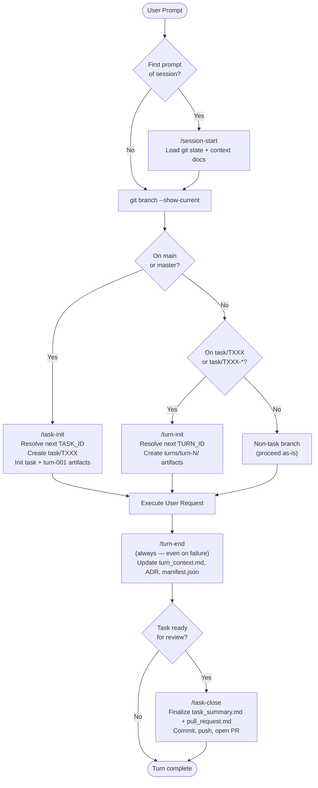

# coding-agents-config

Agentic pipeline configuration for Claude Code (and Codex). Enforces a task/turn-based workflow with provenance tracking, branch protection, and governance rules, plus a growing library of App Factory (`af-*`) skills for spec-to-code generation.

## Setup

### 1. Clone the repo

```sh
git clone <repo-url> ~/coding-agents-config
```

### 2. Create symlinks (automated)

Run the setup script — it creates all symlinks and backs up any existing files:

```sh
bash scripts/setup.sh
```

<details>
<summary>Manual symlink commands</summary>

```sh
# ~/.claude/
ln -s ~/coding-agents-config/skills       ~/.claude/skills
ln -s ~/coding-agents-config/agents       ~/.claude/agents
ln -s ~/coding-agents-config/hooks        ~/.claude/hooks
ln -s ~/coding-agents-config/scripts      ~/.claude/scripts
ln -s ~/coding-agents-config/CLAUDE.md    ~/.claude/CLAUDE.md
ln -s ~/coding-agents-config/settings.json ~/.claude/settings.json

# ~/.codex/
ln -s ~/coding-agents-config/agents    ~/.codex/agents
ln -s ~/coding-agents-config/AGENTS.md ~/.codex/AGENTS.md

# repo-local ./.claude/ (per-project override)
ln -s ~/coding-agents-config/CLAUDE.md ./.claude/CLAUDE.md
```

`scripts/setup.sh` also links `rules/`, `context/`, and `plugins/` into `~/.claude/` when those directories are present. They are optional/gitignored and are not part of this repo by default. If a target already exists, it is backed up first (`mv <target> <target>.bak`).

</details>

### 3. Verify

```sh
ls -la ~/.claude/skills        # should point to ~/coding-agents-config/skills
ls -la ~/.claude/agents        # should point to ~/coding-agents-config/agents
ls -la ~/.claude/hooks         # should point to ~/coding-agents-config/hooks
ls -la ~/.claude/CLAUDE.md     # should point to ~/coding-agents-config/CLAUDE.md
ls -la ~/.claude/settings.json # should point to ~/coding-agents-config/settings.json
```

## Structure

```
coding-agents-config/
├── CLAUDE.md            # Global instructions — task/turn protocol, branch rules
├── AGENTS.md            # Codex loader directive (reads ~/.claude/CLAUDE.md)
├── settings.json         # Claude Code settings (model, permissions, hooks, plugins)
├── hooks/
│   └── branch-guard.sh   # PreToolUse hook — auto-creates a task/TXXX branch when on main/master
├── skills/                # Slash-command skills (see below)
├── agents/
│   └── agent-architecture-planner.md  # Architecture/planning subagent for App Factory projects
├── scripts/
│   ├── setup.sh           # Creates the symlinks described above
│   └── af-state.sh        # Shared helpers for reading/writing .appfactory/memory/state.yaml
├── docs/                  # Reference docs (App Factory plan, migration analyses, skill summary)
├── archive/                # Retired skill library + notes from earlier iterations of this repo
├── .github/
│   ├── PULL_REQUEST_TEMPLATE.md
│   └── ISSUE_TEMPLATE/    # epic.md, task.md, bug.md
└── .appfactory/            # Task/turn tracking and project state
    ├── changelog.md        # Turn-by-turn history of this repo
    ├── tasks_index.csv      # Registry of all tasks
    ├── tasks/                # task-XXX/ directories with turns/ inside each
    ├── specs/                # Generated PRD/DDD/DSL specs (project-specific, usually empty here)
    ├── prompts/              # Prompt drafts used to build/update skills
    └── memory/               # state.yaml — pipeline state for af-* skills
```

## Execution Flow

The pipeline enforces a task/turn workflow: a **task** is the branch-scoped unit of work that becomes one pull request (`task/TXXX`), and a **turn** is one AI execution cycle within that task branch.


```mermaid
flowchart TB
    START([User Prompt]) --> FIRST{First prompt<br/>of session?}
    FIRST -->|Yes| SESSION_START["/session-start<br/>Load git state + context docs"]
    FIRST -->|No| BRANCH_CHECK
    SESSION_START --> BRANCH_CHECK["git branch --show-current"]

    BRANCH_CHECK --> IS_MAIN{On main<br/>or master?}
    IS_MAIN -->|Yes| TASK_INIT["/task-init<br/>Resolve next TASK_ID<br/>Create task/TXXX<br/>Init task + turn-001 artifacts"]
    IS_MAIN -->|No| IS_TASK{On task/TXXX<br/>or task/TXXX-*?}
    IS_TASK -->|Yes| TURN_INIT["/turn-init<br/>Resolve next TURN_ID<br/>Create turns/turn-N/ artifacts"]
    IS_TASK -->|No| OTHER["Non-task branch<br/>(proceed as-is)"]

    TASK_INIT --> EXEC
    TURN_INIT --> EXEC
    OTHER --> EXEC

    EXEC["Execute User Request"] --> TURN_END["/turn-end<br/>(always — even on failure)<br/>Update turn_context.md, ADR, manifest.json"]

    TURN_END --> READY{Task ready<br/>for review?}
    READY -->|Yes| TASK_CLOSE["/task-close<br/>Finalize task_summary.md + pull_request.md<br/>Commit, push, open PR"]
    READY -->|No| DONE([Turn complete])
    TASK_CLOSE --> DONE
```

### Turn Protocol Summary

| Phase | Skill | Trigger | Outputs |
|-------|-------|---------|---------|
| **Session Start** | `session-start` | First prompt of the session | Git state + context docs loaded |
| **Task Init** | `task-init` | Current branch is `main`/`master` | `task/TXXX` branch, `task_context.md`, `task_status.json`, `turn-001` artifacts |
| **Turn Init** | `turn-init` | Current branch is `task/TXXX(-*)` | `turns/turn-N/turn_context.md`, `execution_trace.json` |
| **Execution** | — | Every coding prompt | Modified files |
| **Turn End** | `turn-end` | After every prompt, even on failure | Updated `turn_context.md`, `adr.md`, `manifest.json` |
| **Task Close** | `task-close` | User signals the task is ready for review | `task_summary.md`, `pull_request.md`, commit, push, PR |

### Hard gate

Code is never written directly on `main`/`master`. The `hooks/branch-guard.sh` `PreToolUse` hook auto-creates the next `task/TXXX` branch before any `Bash`/`Write`/`Edit` tool call proceeds while on `main`/`master`.

## Skills

### Task/turn lifecycle

| Skill | Description |
|-------|-------------|
| `session-start` | Load repository state and core pipeline context at the start of every session |
| `task-init` | Initialize a new task branch (`task/TXXX`) and create task + `turn-001` artifacts |
| `turn-init` | Initialize the next turn within the active task branch |
| `turn-end` | Finalize the active turn (ADR, manifest, execution trace) after every prompt |
| `task-close` | Finalize the active task, commit/push, and open a pull request against `main` |
| `branch-guard` | Fallback: create a turn-scoped branch if a session starts directly on `main`/`master` |

### App Factory (`af-*`) — spec-to-code pipeline

| Skill | Description |
|-------|-------------|
| `af-orchestrator` | Orchestrates the App Factory software development lifecycle end to end |
| `af-project-init` | Exports required environment variables and bootstraps a new AppFactory project |
| `af-memory` | CRUD operations on `.appfactory/memory/state.yaml` for pipeline state tracking |
| `af-app-check` | Audits an application for production readiness (security, database, deployment, code quality) |
| `af-be-prd-build` | Builds a business-facing backend PRD from an intake worksheet |
| `af-be-ddd-orchestrator` | Orchestrates the backend DDD build → analyze → refactor → test loop |
| `af-be-ddd-build` | Generates a backend Domain-Driven Design document from an approved PRD |
| `af-be-ddd-analysis` | Audits a generated DDD document for quality, completeness, and PRD alignment |
| `af-be-ddd-refactor` | Applies `af-be-ddd-analysis` findings back into the DDD document |
| `af-be-ddd-dsl` | Generates a backend DSL YAML document from the DDD document |
| `af-be-ddd-tests` | Generates Gherkin/BDD feature files from the DDD and PRD specs |
| `af-be-plan` | Generates a step-by-step backend execution plan from the DSL + a tech stack profile |
| `af-be-implementation` | Executes backend code generation from the plan and BDD feature specs |

### Utility skill groups

| Group | Sub-skill | Description |
|-------|-----------|--------------|
| `dsl-utils` | `dsl-model-interpreter` | Parses and validates app-dsl YAML specifications before code generation |
| `ui-utils` | `ui-implementation-language` | Declarative YAML language for UI pages, widgets, forms, and API interactions |
| `unit-tests` | `test-implementation-sync` | Keeps generated unit tests aligned with actual service/DTO implementations |
| `e2e-tests` | `http-test-artifacts` | Generates `.http` request files for REST client API testing |

### Other

| Skill | Description |
|-------|-------------|
| `eval-labeler` | Processes `Eval.md` files to score and compare two model responses on coding tasks |

### Meta-skills (`.system/`)

| Skill | Description |
|-------|-------------|
| `skill-creator` | Guide for creating (or updating) a new skill's `SKILL.md` |
| `skill-installer` | Installs skills into `$CODEX_HOME/skills` from a curated list or a GitHub repo path |

`archive/` holds a retired, standalone skill library (`app-from-dsl`, `nestjs-crud-resource`, `prisma-persistence`, `react-form-page`, `shadcn`, etc.) from an earlier iteration of this repo, kept for reference — see `archive/README.md` and `archive/SUMMARY.md`.

## Agents

| Agent | Description |
|-------|-------------|
| `agent-architecture-planner` | Reads PRD/DDD/DSL and repo structure to produce architecture decisions, module maps, and task plans for downstream coding agents |

## Hooks

| Hook | Trigger | Purpose |
|------|---------|---------|
| `branch-guard.sh` | `PreToolUse` (Bash/Write/Edit) | Auto-creates the next `task/TXXX` branch instead of allowing writes on `main`/`master` |

## Adding a new skill

Each skill lives in its own directory under `skills/` with a `SKILL.md` file:

```
skills/my-skill/
└── SKILL.md
```

The `.system/skill-creator` meta-skill can guide you through creating one, and `.system/skill-installer` can install skills from a marketplace — invoke either from Claude Code or Codex.

## Syncing across machines

Since this is a standard git repo, pull on any machine to stay current:

```sh
cd ~/coding-agents-config && git pull
```

The symlinks mean changes are picked up immediately — no reinstall needed.
