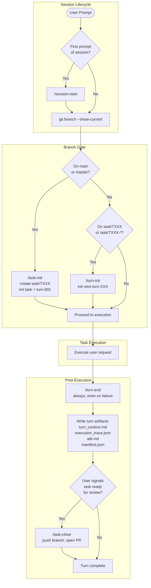

# coding-agents-config

Agentic pipeline configuration for Claude Code and Codex. Enforces a task/turn-based workflow with provenance tracking, branch protection, and governance rules, plus the App Factory (`af-*`) skill set for spec-driven backend application generation.

## Setup

### 1. Clone the repo

```sh
git clone <repo-url> ~/coding-agents-config
```

### 2. Create symlinks (automated)

Run the setup script — it links the repo into `~/.claude/` (Claude Code), `~/.codex/` (Codex), and a repo-local `./.claude/`, backing up any existing files:

```sh
bash scripts/setup.sh
```

<details>
<summary>Manual symlink commands</summary>

```sh
# ~/.claude/ (Claude Code)
ln -s ~/coding-agents-config/skills ~/.claude/skills
ln -s ~/coding-agents-config/agents ~/.claude/agents
ln -s ~/coding-agents-config/hooks ~/.claude/hooks
ln -s ~/coding-agents-config/scripts ~/.claude/scripts
ln -s ~/coding-agents-config/CLAUDE.md ~/.claude/CLAUDE.md
ln -s ~/coding-agents-config/settings.json ~/.claude/settings.json

# ~/.codex/ (Codex)
ln -s ~/coding-agents-config/agents ~/.codex/agents
ln -s ~/coding-agents-config/AGENTS.md ~/.codex/AGENTS.md

# repo-local ./.claude/
ln -s ~/coding-agents-config/CLAUDE.md ./.claude/CLAUDE.md
```

`scripts/setup.sh` also attempts to link optional `rules/`, `context/`, and `plugins/` directories if present in the repo. If any target already exists, it is backed up first (`mv <target> <target>.bak`).
</details>

### 3. Verify

```sh
ls -la ~/.claude/skills        # should point to ~/coding-agents-config/skills
ls -la ~/.claude/agents        # should point to ~/coding-agents-config/agents
ls -la ~/.claude/hooks         # should point to ~/coding-agents-config/hooks
ls -la ~/.claude/CLAUDE.md     # should point to ~/coding-agents-config/CLAUDE.md
ls -la ~/.claude/settings.json # should point to ~/coding-agents-config/settings.json
ls -la ~/.codex/AGENTS.md      # should point to ~/coding-agents-config/AGENTS.md
```

## Structure

```
coding-agents-config/
├── CLAUDE.md           # Global instructions — task/turn protocol, branch rules
├── AGENTS.md           # Codex loader directive (reads ~/.claude/CLAUDE.md)
├── settings.json        # Claude Code settings (model, permissions, hooks)
├── package.json         # npm dependency (caveman) used by setup tooling
├── hooks/                # Shell hooks triggered by Claude Code events
│   └── branch-guard.sh  # Blocks edits while on main/master
├── agents/               # Reusable subagent definitions
│   └── agent-architecture-planner.md
├── skills/                # Slash-command skills
│   ├── session-start/    # Load git state + pipeline context (run once per session)
│   ├── task-init/        # Create task/TXXX branch + task artifacts (run on main/master)
│   ├── turn-init/        # Start next turn inside the active task branch
│   ├── turn-end/         # Finalize a turn (context, trace, ADR, manifest, commit)
│   ├── task-close/       # Push task branch and open a pull request
│   ├── branch-guard/     # Legacy guard: create a turn-scoped branch if on main
│   ├── af-orchestrator/          # Drives the App Factory SDLC end to end
│   ├── af-project-init/          # Bootstrap a new AppFactory project
│   ├── af-memory/                # CRUD for .appfactory/memory/state.yaml
│   ├── af-be-prd-build/          # Draft a backend PRD from an intake worksheet
│   ├── af-be-ddd-build/          # Generate a backend DDD doc from an approved PRD
│   ├── af-be-ddd-analysis/       # Audit a DDD doc for gaps and PRD alignment
│   ├── af-be-ddd-refactor/       # Apply DDD analysis findings back into the DDD doc
│   ├── af-be-ddd-orchestrator/   # Loop the DDD build/analyze/refactor/test cycle
│   ├── af-be-ddd-dsl/            # Generate a backend DSL YAML from the DDD doc
│   ├── af-be-ddd-tests/          # Generate Gherkin/BDD feature specs from DDD + PRD
│   ├── af-be-plan/               # Generate a backend execution plan from DSL + tech-stack profile
│   ├── af-be-implementation/     # Execute the plan against a tech-stack implementation
│   ├── af-app-check/             # Production-readiness audit (security, DB, deploy, quality)
│   ├── eval-labeler/             # Label/compare Response A vs B for coding-eval runs
│   ├── dsl-utils/                # Grouping dir — see dsl-model-interpreter
│   ├── e2e-tests/                # Grouping dir — see http-test-artifacts
│   ├── ui-utils/                 # Grouping dir — see ui-implementation-language
│   └── unit-tests/               # Grouping dir — see test-implementation-sync
├── scripts/               # Automation scripts
│   ├── setup.sh          # Create symlinks into ~/.claude, ~/.codex, ./.claude
│   └── af-state.sh       # Helper for reading/writing AppFactory state
├── .appfactory/            # Task/turn tracking and specs (this repo's own pipeline state)
│   ├── tasks/             # Task branches, each with turns/turn-XXX artifacts
│   ├── tasks_index.csv    # Registry of tasks: id, branch, status, PR URL, turn count
│   ├── specs/              # Specifications
│   ├── prompts/            # Prompt templates
│   ├── memory/             # Project memory (state.yaml)
│   └── changelog.md
├── archive/                # Retired/superseded skills and templates kept for reference
├── docs/                    # Reference documentation (App Factory plan, migration notes)
└── node_modules/            # npm deps (caveman)
```

## Execution Flow

The agentic pipeline enforces a strict task/turn workflow for all coding tasks (see `CLAUDE.md`):


```mermaid
flowchart TB
    subgraph SESSION["Session Lifecycle"]
        START([User Prompt]) --> SS{First prompt<br/>of session?}
        SS -->|Yes| SESSION_START["/session-start"]
        SS -->|No| BRANCH_CHECK
        SESSION_START --> BRANCH_CHECK["git branch --show-current"]
    end

    subgraph BRANCH_GATE["Branch Gate"]
        BRANCH_CHECK --> IS_MAIN{On main<br/>or master?}
        IS_MAIN -->|Yes| TASK_INIT["/task-init<br/>create task/TXXX<br/>init task + turn-001"]
        IS_MAIN -->|No| IS_TASK{On task/TXXX<br/>or task/TXXX-*?}
        IS_TASK -->|Yes| TURN_INIT["/turn-init<br/>init next turn-XXX"]
        IS_TASK -->|No| PROCEED
        TASK_INIT --> PROCEED["Proceed to execution"]
        TURN_INIT --> PROCEED
    end

    subgraph EXECUTION["Task Execution"]
        PROCEED --> EXEC["Execute user request"]
    end

    subgraph POST_EXEC["Post-Execution"]
        EXEC --> TURN_END["/turn-end<br/>always, even on failure"]
        TURN_END --> WRITE_TURN["Write turn artifacts:<br/>turn_context.md<br/>execution_trace.json<br/>adr.md<br/>manifest.json"]
        WRITE_TURN --> READY{User signals<br/>task ready<br/>for review?}
        READY -->|Yes| TASK_CLOSE["/task-close<br/>push branch, open PR"]
        READY -->|No| DONE["Turn complete"]
        TASK_CLOSE --> DONE
    end
```

### Turn Protocol Summary

| Phase | Trigger | Steps | Outputs |
|-------|---------|-------|---------|
| **Session Start** | First prompt of session | `/session-start` — load git state + context | Context loaded |
| **Task Init** | Branch is `main`/`master` | `/task-init` — resolve next task id, create `task/TXXX`, init task + `turn-001` | `task_context.md`, `task_status.json`, turn-001 artifacts |
| **Turn Init** | Already on `task/TXXX` | `/turn-init` — resolve next turn id, init `turn-XXX` | `turn_context.md`, `execution_trace.json` |
| **Execution** | Every coding prompt | Execute the user's request | Modified files |
| **Turn End** | After every execution, even on failure | `/turn-end` — finalize context, trace, ADR, manifest; commit | `adr.md`, `manifest.json`, commit |
| **Task Close** | User signals task is ready for review | `/task-close` — push branch, open PR | Pull request |

**Hard gate:** code is never written while on `main` or `master` — `/task-init` must complete first.

## Skills

### Task/Turn Pipeline

| Skill | Description |
|-------|-------------|
| `session-start` | Load repository state and core pipeline context; run at the start of every session |
| `task-init` | Initialize a new task branch (`task/TXXX`) and create task + turn-001 artifacts |
| `turn-init` | Initialize the next turn within the active task branch |
| `turn-end` | Finalize the active turn (context, trace, ADR, manifest, commit) |
| `task-close` | Finalize the active task branch, push it, and open a pull request against main |
| `branch-guard` | Legacy guard: create a turn-scoped branch if on main/master |

### App Factory (`af-*`) — Backend SDLC Pipeline

| Skill | Description |
|-------|-------------|
| `af-orchestrator` | Orchestrates the App Factory software development lifecycle end to end |
| `af-project-init` | Exports required environment variables and bootstraps a new AppFactory project |
| `af-memory` | CRUD operations for `.appfactory/memory/state.yaml` pipeline state |
| `af-be-prd-build` | Builds a backend-focused PRD from a completed intake worksheet |
| `af-be-ddd-build` | Generates a backend Domain-Driven Design doc from an approved PRD |
| `af-be-ddd-analysis` | Audits a DDD doc for completeness and PRD alignment |
| `af-be-ddd-refactor` | Applies `af-be-ddd-analysis` findings back into the DDD doc |
| `af-be-ddd-orchestrator` | Loops the DDD build → analyze → refactor → test cycle |
| `af-be-ddd-dsl` | Generates a backend DSL YAML from the DDD doc |
| `af-be-ddd-tests` | Generates Gherkin/BDD feature specs from DDD + PRD, organized by aggregate |
| `af-be-plan` | Generates a step-by-step backend execution plan from a DSL + tech-stack profile |
| `af-be-implementation` | Copies a tech-stack implementation and generates domain code from the plan + BDD specs |
| `af-app-check` | Audits an application for production readiness (security, database, deployment, code quality) |

### Utility

| Skill | Description |
|-------|-------------|
| `eval-labeler` | Processes `Eval.md` files to label/score/compare Response A vs Response B for coding tasks |
| `dsl-utils/dsl-model-interpreter`, `e2e-tests/http-test-artifacts`, `ui-utils/ui-implementation-language`, `unit-tests/test-implementation-sync` | Grouping directories holding archived-style helper skills (see `archive/` for the originals and their history) |

## Agents

| Agent | Description |
|-------|-------------|
| `agent-architecture-planner` | Reads PRD, DDD, DSL, and repo structure to produce architecture decisions, module maps, and task plans for downstream coding agents |

## Hooks

| Hook | Trigger | Purpose |
|------|---------|---------|
| `branch-guard.sh` | `PreToolUse(Bash)` | Blocks edits while on `main`/`master` |

## Scripts

| Script | Purpose |
|--------|---------|
| `scripts/setup.sh` | Symlinks this repo into `~/.claude/`, `~/.codex/`, and `./.claude/` |
| `scripts/af-state.sh` | Reads/writes AppFactory pipeline state |

## `.appfactory/` — This Repo's Own Pipeline State

This repository uses its own task/turn pipeline on itself. Each task lives under `.appfactory/tasks/task-XXX/` with `task_context.md`, `task_status.json`, `task_summary.md`, `pull_request.md`, and one `turns/turn-XXX/` directory per turn (`turn_context.md`, `execution_trace.json`, `adr.md`, `manifest.json`). `.appfactory/tasks_index.csv` is the registry of all tasks and their status/PR links.

## Adding a New Skill

Each skill lives in its own directory under `skills/` with a `SKILL.md` file (YAML frontmatter with `name` and `description`, followed by instructions):

```
skills/my-skill/
└── SKILL.md
```

## Archive

`archive/` holds superseded skills and templates (e.g. the original `app-from-dsl` full-stack generation library) kept for reference and historical context — see `archive/README.md` and `archive/SUMMARY.md`.

## Syncing Across Machines

Since this is a standard git repo, pull on any machine to stay current:

```sh
cd ~/coding-agents-config && git pull
```

The symlinks mean changes are picked up immediately — no reinstall needed.
