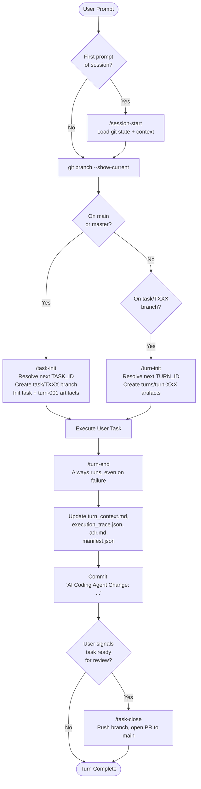

# coding-agents-config

Agentic pipeline configuration for Claude Code (and Codex). Enforces a task/turn-based workflow — the App Factory pipeline — with provenance tracking, branch protection, and governance rules.

## Setup

### 1. Clone the repo

```sh
git clone <repo-url> ~/coding-agents-config
```

### 2. Create symlinks (automated)

Run the setup script — it creates all symlinks and backs up any existing files:

```sh
bash scripts/setup.sh
```

It links, per target:

- `~/.claude/`: `skills`, `agents`, `rules`, `hooks`, `context`, `scripts`, `plugins`, `CLAUDE.md`, `settings.json`
- `~/.codex/`: `agents`, `AGENTS.md`
- `./.claude/` (repo-local): `CLAUDE.md`

Only items that exist in this repo are meaningful after linking (e.g. `rules/`, `context/`, and `plugins/` are reserved for future use and are currently empty symlink targets).

<details>
<summary>Manual symlink commands</summary>

```sh
ln -s ~/coding-agents-config/skills ~/.claude/skills
ln -s ~/coding-agents-config/agents ~/.claude/agents
ln -s ~/coding-agents-config/hooks ~/.claude/hooks
ln -s ~/coding-agents-config/scripts ~/.claude/scripts
ln -s ~/coding-agents-config/CLAUDE.md ~/.claude/CLAUDE.md
ln -s ~/coding-agents-config/settings.json ~/.claude/settings.json
ln -s ~/coding-agents-config/agents ~/.codex/agents
ln -s ~/coding-agents-config/AGENTS.md ~/.codex/AGENTS.md
```

If any of these already exist, back them up first (`mv <target> <target>.bak`).
</details>

### 3. Verify

```sh
ls -la ~/.claude/skills        # should point to ~/coding-agents-config/skills
ls -la ~/.claude/hooks         # should point to ~/coding-agents-config/hooks
ls -la ~/.claude/CLAUDE.md     # should point to ~/coding-agents-config/CLAUDE.md
ls -la ~/.claude/settings.json # should point to ~/coding-agents-config/settings.json
```

## Structure

```
coding-agents-config/
├── CLAUDE.md           # Global instructions — task/turn protocol, branch rules
├── AGENTS.md           # Codex loader directive (points to CLAUDE.md)
├── settings.json       # Claude Code settings (model, permissions, hooks)
├── hooks/
│   └── branch-guard.sh # PreToolUse(Bash) hook — blocks work on main/master
├── skills/             # Slash-command skills (see below)
│   └── .system/        # Codex-bundled meta-skills (not authored in this repo)
├── agents/             # Agent architecture reference docs
├── docs/               # Reference documentation (migration notes, stack plan, skill summary)
├── scripts/            # Automation scripts (setup.sh, af-state.sh)
├── .appfactory/        # Task/turn tracking and specs
│   ├── tasks/          # task-XXX/ directories, each with a turns/turn-XXX/ subtree
│   ├── specs/          # Specifications
│   ├── prompts/        # Prompt templates
│   ├── memory/         # Project memory (state.yaml)
│   └── tasks_index.csv # Registry of all tasks and their status
├── archive/            # Retired skills and templates kept for reference
└── .github/            # PR and issue templates
```

## Execution Flow

The agentic pipeline enforces a task/turn workflow for all coding tasks:


```mermaid
flowchart TB
    START([User Prompt]) --> SS{First prompt<br/>of session?}
    SS -->|Yes| SESSION_START["/session-start<br/>Load git state + context"]
    SS -->|No| BRANCH_CHECK
    SESSION_START --> BRANCH_CHECK

    BRANCH_CHECK["git branch --show-current"] --> IS_MAIN{On main<br/>or master?}
    IS_MAIN -->|Yes| TASK_INIT["/task-init<br/>Resolve next TASK_ID<br/>Create task/TXXX branch<br/>Init task + turn-001 artifacts"]
    IS_MAIN -->|No| IS_TASK{On task/TXXX<br/>branch?}
    IS_TASK -->|Yes| TURN_INIT["/turn-init<br/>Resolve next TURN_ID<br/>Create turns/turn-XXX artifacts"]

    TASK_INIT --> EXEC
    TURN_INIT --> EXEC["Execute User Task"]

    EXEC --> TURN_END["/turn-end<br/>Always runs, even on failure"]
    TURN_END --> UPDATE["Update turn_context.md,<br/>execution_trace.json, adr.md,<br/>manifest.json"]
    UPDATE --> COMMIT["Commit:<br/>'AI Coding Agent Change: ...'"]
    COMMIT --> READY{User signals<br/>task ready<br/>for review?}
    READY -->|Yes| TASK_CLOSE["/task-close<br/>Push branch, open PR to main"]
    READY -->|No| DONE([Turn Complete])
    TASK_CLOSE --> DONE
```

### Turn Protocol Summary

| Phase | Trigger | Outputs |
|-------|---------|---------|
| **Session Start** | First prompt of the session | Git state + context loaded |
| **Task Init** | Current branch is `main`/`master` | `task/TXXX` branch, `task-XXX/` + `turn-001/` artifacts |
| **Turn Init** | Current branch matches `task/TXXX` | Next `turn-XXX/` artifacts |
| **Execution** | Every coding prompt | Modified files |
| **Turn End** | After every execution, even on failure | Updated turn artifacts, commit |
| **Task Close** | User signals the task is ready for review | Pushed branch, PR against `main` |

## Skills

### Task/Turn Lifecycle

| Skill | Description |
|-------|-------------|
| `session-start` | Load repository state and core pipeline context at session start |
| `task-init` | Initialize a new task branch and create task + turn-001 artifacts (run on `main`/`master`) |
| `turn-init` | Initialize the next turn within the active task branch |
| `turn-end` | Finalize the active turn after execution — always runs, even on failure |
| `task-close` | Finalize the active task branch, push it, and open a PR against `main` |
| `branch-guard` | Create a turn-scoped branch if on `main`/`master` (invoked by `task-init`) |

### App Factory Orchestration

| Skill | Description |
|-------|-------------|
| `af-orchestrator` | Orchestrates the App Factory software development lifecycle (project init → PRD → DDD → plan → implementation) |
| `af-project-init` | Export required environment variables and initialize a new AppFactory project |
| `af-memory` | CRUD operations against `.appfactory/memory/state.yaml` for pipeline state tracking |

### Backend DDD Pipeline

| Skill | Description |
|-------|-------------|
| `af-be-prd-build` | Build a business-facing PRD for a backend application from an intake worksheet |
| `af-be-ddd-build` | Generate a backend Domain-Driven Design document from an approved PRD |
| `af-be-ddd-analysis` | Audit a generated DDD spec for quality, completeness, and alignment with the PRD |
| `af-be-ddd-refactor` | Apply targeted patches to a DDD spec based on `af-be-ddd-analysis` findings |
| `af-be-ddd-orchestrator` | Orchestrate the DDD build → analyze → refactor loop → test phases |
| `af-be-ddd-dsl` | Generate a backend application DSL YAML document from a DDD document |
| `af-be-ddd-tests` | Generate Gherkin/BDD feature files from DDD and PRD specifications |
| `af-be-plan` | Generate a step-by-step backend execution plan from a DSL and tech-stack profile |
| `af-be-implementation` | Generate backend domain code from the execution plan and BDD feature specs |
| `af-app-check` | Audit an application for production readiness (security, database, deployment, code quality) |

### Shared Utilities

| Skill | Description |
|-------|-------------|
| `dsl-utils/dsl-model-interpreter` | Parse and validate `app-dsl` YAML specifications |
| `ui-utils/ui-implementation-language` | Declarative YAML standard for framework-neutral UI definitions |
| `unit-tests/test-implementation-sync` | Keep generated unit tests synchronized with their implementations |
| `e2e-tests/http-test-artifacts` | Generate `.http` request files from backend endpoint specs |

### Evaluation

| Skill | Description |
|-------|-------------|
| `eval-labeler` | Process `Eval.md` files to label and compare Response A vs Response B for coding tasks |

### `.system/` (Codex-bundled meta-skills)

Not authored in this repo — installed by Codex for skill/plugin authoring and are kept here for compatibility: `skill-creator`, `skill-installer`, `plugin-creator`, `imagegen`, `openai-docs`.

## Hooks

| Hook | Trigger | Purpose |
|------|---------|---------|
| `branch-guard.sh` | `PreToolUse(Bash)` | Blocks Bash tool use while on `main`/`master` |

## Adding a new skill

Each skill lives in its own directory under `skills/` with a `SKILL.md` file:

```
skills/my-skill/
└── SKILL.md
```

The `.system/skill-creator` meta-skill can guide you through creating one — invoke it from Claude Code.

## Syncing across machines

Since this is a standard git repo, pull on any machine to stay current:

```sh
cd ~/coding-agents-config && git pull
```

The symlinks mean changes are picked up immediately — no reinstall needed.
