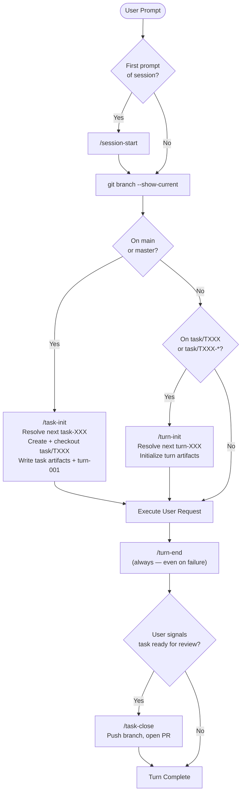

# coding-agents-config

Agentic pipeline configuration for Claude Code. Enforces a task/turn-based workflow with provenance tracking, branch protection, and governance rules.

## Setup

### 1. Clone the repo

```sh
git clone <repo-url> ~/coding-agents-config
```

### 2. Create symlinks (automated)

Run the setup script — it creates all symlinks and backs up any existing files:

```sh
bash scripts/setup.sh
```

<details>
<summary>Manual symlink commands</summary>

```sh
# ~/.claude/ — skills, agents, hooks, scripts, config
ln -s ~/coding-agents-config/skills ~/.claude/skills
ln -s ~/coding-agents-config/agents ~/.claude/agents
ln -s ~/coding-agents-config/hooks ~/.claude/hooks
ln -s ~/coding-agents-config/scripts ~/.claude/scripts
ln -s ~/coding-agents-config/CLAUDE.md ~/.claude/CLAUDE.md
ln -s ~/coding-agents-config/settings.json ~/.claude/settings.json

# ~/.codex/ — agent loader directive
ln -s ~/coding-agents-config/agents ~/.codex/agents
ln -s ~/coding-agents-config/AGENTS.md ~/.codex/AGENTS.md

# ./.claude/ (repo-local, per project)
ln -s ~/coding-agents-config/CLAUDE.md ./.claude/CLAUDE.md
```

`scripts/setup.sh` runs all of the above (plus a few optional targets —
`rules/`, `context/`, `plugins/` — reserved for future use) and backs up any
existing files first.
</details>

### 3. Verify

```sh
ls -la ~/.claude/skills        # should point to ~/coding-agents-config/skills
ls -la ~/.claude/hooks         # should point to ~/coding-agents-config/hooks
ls -la ~/.claude/agents        # should point to ~/coding-agents-config/agents
ls -la ~/.claude/CLAUDE.md     # should point to ~/coding-agents-config/CLAUDE.md
ls -la ~/.claude/settings.json # should point to ~/coding-agents-config/settings.json
```

## Structure

```
coding-agents-config/
├── CLAUDE.md            # Global instructions — task/turn protocol, branch rules
├── AGENTS.md            # Codex loader directive (reads ~/.claude/CLAUDE.md)
├── settings.json        # Claude Code settings (model, permissions, hooks)
├── package.json          # npm deps for the AppFactory tooling (caveman)
├── hooks/
│   └── branch-guard.sh   # PreToolUse(Bash) hook — auto-creates a task/TXXX branch off main/master
├── skills/               # Slash-command skills, one SKILL.md per directory
│   ├── session-start/      # Session bootstrap (run once per session)
│   ├── task-init/           # Create task/TXXX branch + task/turn-001 artifacts
│   ├── turn-init/            # Create the next turn-XXX inside the active task
│   ├── turn-end/              # Finalize a turn's artifacts and commit
│   ├── task-close/            # Push the task branch and open a PR against main
│   ├── branch-guard/          # Branch safety check used by the lifecycle skills
│   ├── af-*/                   # AppFactory backend DDD pipeline (13 skills — see below)
│   ├── dsl-utils/, e2e-tests/, ui-utils/, unit-tests/  # Reference sub-projects (no SKILL.md)
│   ├── .system/                 # Codex meta-skills (skill-creator, skill-installer, imagegen, ...)
│   └── .nestjs/                  # Legacy NestJS scaffold skills kept for reference
├── agents/                # Standalone subagent definitions
│   └── agent-architecture-planner.md
├── scripts/
│   ├── setup.sh            # Symlink installer (see Setup below)
│   └── af-state.sh          # CRUD helper for .appfactory/state.yaml
├── docs/                  # Reference docs (AppFactory plan, migration notes, skill summary)
├── .appfactory/           # Task/turn tracking, specs, prompts, memory
│   ├── tasks/               # task-XXX/ directories, each with turns/turn-XXX/
│   ├── tasks_index.csv       # Registry of all tasks and their status
│   ├── specs/                # Generated specifications
│   ├── prompts/               # Prompt library
│   └── memory/                 # Project memory (state.yaml)
├── archive/               # Retired skills and prototypes kept for reference
└── .github/               # Issue and pull request templates
```

## Execution Flow

The pipeline enforces a task/turn workflow for every coding prompt. A **task**
is the branch-scoped unit of work that becomes one pull request; a **turn** is
one AI execution cycle within the active task.


```mermaid
flowchart TB
    START([User Prompt]) --> SS{First prompt<br/>of session?}
    SS -->|Yes| SESSION_START["/session-start"]
    SS -->|No| CHECK_BRANCH
    SESSION_START --> CHECK_BRANCH["git branch --show-current"]

    CHECK_BRANCH --> IS_MAIN{On main<br/>or master?}
    IS_MAIN -->|Yes| TASK_INIT["/task-init<br/>Resolve next task-XXX<br/>Create + checkout task/TXXX<br/>Write task artifacts + turn-001"]
    IS_MAIN -->|No| IS_TASK{On task/TXXX<br/>or task/TXXX-*?}
    IS_TASK -->|Yes| TURN_INIT["/turn-init<br/>Resolve next turn-XXX<br/>Initialize turn artifacts"]
    IS_TASK -->|No| EXEC

    TASK_INIT --> EXEC["Execute User Request"]
    TURN_INIT --> EXEC

    EXEC --> TURN_END["/turn-end<br/>(always — even on failure)"]

    TURN_END --> READY{User signals<br/>task ready for review?}
    READY -->|Yes| TASK_CLOSE["/task-close<br/>Push branch, open PR"]
    READY -->|No| DONE["Turn Complete"]
    TASK_CLOSE --> DONE
```

### Hard Gate

Writing or editing code is never allowed while on `main` or `master`.
`/task-init` must succeed first — the `branch-guard.sh` hook also auto-creates
a `task/TXXX` branch as a safety net if a write is attempted while on
`main`/`master`.

### Task/Turn Protocol Summary

| Phase | When | Steps | Outputs |
|-------|------|-------|---------|
| **Session Start** | First prompt of the session | Load git state and pipeline context | Session context loaded |
| **Task Init** | Current branch is `main`/`master` | Resolve next `task-XXX` → create `task/TXXX` → write task artifacts + `turn-001` | `task_context.md`, `task_status.json`, `turn-001/*` |
| **Turn Init** | Current branch is `task/TXXX[-*]` | Resolve next `turn-XXX` inside the active task | `turn_context.md`, `execution_trace.json`, `adr.md`, `manifest.json` |
| **Execution** | Every prompt | Execute the user's request | Modified files |
| **Turn End** | Every prompt, even on failure | Finalize turn artifacts, commit as `AI Coding Agent Change:` | Completed turn artifacts |
| **Task Close** | User signals the task is ready for review | Push the task branch, open a PR against `main` | `pull_request.md`, open PR |

## Skills

Each skill lives under `skills/<name>/SKILL.md`. There are 19 invocable
skills, grouped as:

### Lifecycle

| Skill | Description |
|-------|-------------|
| `session-start` | Load repository state and core pipeline context; run at the start of every session |
| `task-init` | Initialize a new task branch and create task + turn-001 artifacts; run when on `main`/`master` |
| `turn-init` | Initialize the next turn within the active task branch |
| `turn-end` | Finalize the active turn after execution, run after every coding prompt |
| `task-close` | Finalize the active task branch, push it, and open a pull request against `main` |
| `branch-guard` | Check the current branch and create a turn-scoped branch if on `main`/`master` |

### AppFactory backend DDD pipeline (`af-*`)

| Skill | Description |
|-------|-------------|
| `af-orchestrator` | Orchestrate the App Factory software development lifecycle |
| `af-project-init` | Bootstrap AppFactory project environment variables and scaffolding |
| `af-memory` | CRUD operations for AppFactory pipeline state (`state.yaml`) |
| `af-app-check` | Audit an application for production readiness (security, database, deployment, code quality) |
| `af-be-prd-build` | Build a business-facing PRD for a backend application from an intake worksheet |
| `af-be-ddd-build` | Generate a backend Domain-Driven Design document from an approved PRD |
| `af-be-ddd-analysis` | Audit a generated DDD spec for quality, completeness, and PRD alignment |
| `af-be-ddd-refactor` | Apply targeted patches to a DDD spec using `af-be-ddd-analysis` findings |
| `af-be-ddd-tests` | Generate Gherkin BDD feature files from the DDD and PRD specifications |
| `af-be-ddd-dsl` | Generate a backend application DSL YAML from the DDD document |
| `af-be-ddd-orchestrator` | Orchestrate the backend DDD build → analyze → refactor → test loop |
| `af-be-plan` | Generate a backend execution plan from the domain DSL and a tech-stack profile |
| `af-be-implementation` | Generate backend domain code from the execution plan and BDD feature specs |

### Reference sub-projects (no `SKILL.md`)

`dsl-utils/`, `e2e-tests/`, `ui-utils/`, and `unit-tests/` each wrap a single
legacy prototype (`dsl-model-interpreter`, `http-test-artifacts`,
`ui-implementation-language`, `test-implementation-sync`) kept for reference;
they are not invocable skills.

### Meta-skills (`.system/`, `.nestjs/`)

`skills/.system/` holds Codex meta-skills (`skill-creator`, `skill-installer`,
`plugin-creator`, `imagegen`, `openai-docs`). `skills/.nestjs/` holds retired
NestJS/Prisma scaffolding skills superseded by the `af-be-*` pipeline.

## Hooks

| Hook | Trigger | Purpose |
|------|---------|---------|
| `branch-guard.sh` | `PreToolUse(Bash)` | If still on `main`/`master`, auto-create and switch to the next `task/TXXX` branch before the command runs |

## Adding a new skill

Each skill lives in its own directory under `skills/` with a `SKILL.md` file:

```
skills/my-skill/
└── SKILL.md
```

The `.system/skill-creator` meta-skill can guide you through creating one — invoke it from Claude Code.

## Syncing across machines

Since this is a standard git repo, pull on any machine to stay current:

```sh
cd ~/coding-agents-config && git pull
```

The symlinks mean changes are picked up immediately — no reinstall needed.
