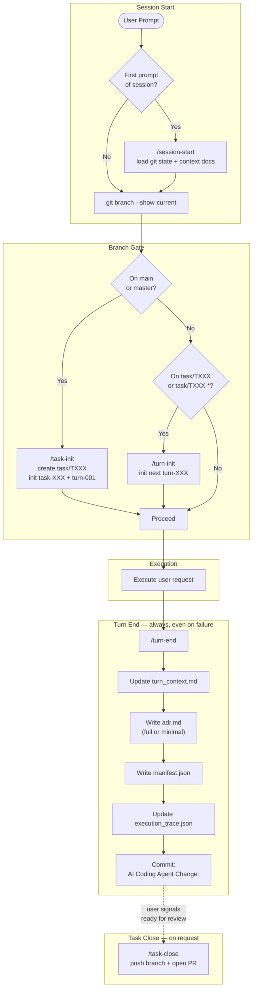

# coding-agents-config

Agentic pipeline configuration for Claude Code. Enforces a task/turn-based workflow with provenance tracking, branch protection, and governance rules for the App Factory (AF) code-generation pipeline.

## Setup

### 1. Clone the repo

```sh
git clone <repo-url> ~/coding-agents-config
```

### 2. Create symlinks (automated)

Run the setup script — it creates all symlinks and backs up any existing files:

```sh
bash scripts/setup.sh
```

<details>
<summary>Manual symlink commands</summary>

```sh
ln -s ~/coding-agents-config/skills ~/.claude/skills
ln -s ~/coding-agents-config/agents ~/.claude/agents
ln -s ~/coding-agents-config/hooks ~/.claude/hooks
ln -s ~/coding-agents-config/scripts ~/.claude/scripts
ln -s ~/coding-agents-config/CLAUDE.md ~/.claude/CLAUDE.md
ln -s ~/coding-agents-config/settings.json ~/.claude/settings.json
ln -s ~/coding-agents-config/agents ~/.codex/agents
ln -s ~/coding-agents-config/AGENTS.md ~/.codex/AGENTS.md
```

If any of these already exist, back them up first (`mv <target> <target>.bak`).
</details>

### 3. Verify

```sh
ls -la ~/.claude/skills        # should point to ~/coding-agents-config/skills
ls -la ~/.claude/hooks         # should point to ~/coding-agents-config/hooks
ls -la ~/.claude/CLAUDE.md     # should point to ~/coding-agents-config/CLAUDE.md
ls -la ~/.claude/settings.json # should point to ~/coding-agents-config/settings.json
```

## Structure

```
coding-agents-config/
├── CLAUDE.md            # Global instructions — task/turn protocol, branch rules
├── AGENTS.md            # Agent loader directive for Codex-style CLIs
├── settings.json        # Claude Code settings (model, permissions, hooks, plugins)
├── package.json         # Plugin dependency manifest (caveman marketplace)
├── hooks/
│   └── branch-guard.sh  # PreToolUse hook — auto-creates a task branch off main/master
├── skills/               # Slash-command skills (24), see table below
│   ├── session-start/    # Load session context
│   ├── task-init/        # Create task/TXXX branch + task-XXX/turn-001 artifacts
│   ├── turn-init/        # Create the next turn-XXX directory + artifacts
│   ├── turn-end/         # Finalize a turn (ADR, manifest, execution trace)
│   ├── task-close/       # Push task branch and open a PR against main
│   ├── branch-guard/     # Turn-scoped branch guard
│   ├── af-*/             # App Factory SDLC pipeline (PRD → DDD → DSL → plan → implementation)
│   ├── dsl-utils/, ui-utils/, e2e-tests/, unit-tests/  # Category folders, each wrapping one nested skill
│   └── eval-labeler/     # Label/compare model responses for coding tasks
├── agents/
│   └── agent-architecture-planner.md
├── docs/                 # Reference and migration documentation
├── scripts/
│   ├── setup.sh          # Create ~/.claude and ~/.codex symlinks
│   └── af-state.sh       # AppFactory state helper
├── archive/              # Retired skills and legacy turn-based artifacts
├── .appfactory/          # Task/turn tracking, specs, prompts, memory
│   ├── tasks/             # task-XXX/ directories with turns/turn-XXX/ artifacts
│   ├── tasks_index.csv    # Task registry
│   ├── specs/
│   ├── prompts/
│   └── memory/
└── .github/               # Issue templates, PR template
```

## Execution Flow

The agentic pipeline enforces a task/turn workflow for all coding tasks. A **task** is the branch-scoped unit of work that becomes one pull request; a **turn** is one AI execution cycle within the active task branch.


```mermaid
flowchart TB
    subgraph SESSION["Session Start"]
        START([User Prompt]) --> SS{First prompt<br/>of session?}
        SS -->|Yes| SESSION_START["/session-start<br/>load git state + context docs"]
        SS -->|No| BRANCH_CHECK
        SESSION_START --> BRANCH_CHECK
    end

    subgraph GATE["Branch Gate"]
        BRANCH_CHECK["git branch --show-current"] --> IS_MAIN{On main<br/>or master?}
        IS_MAIN -->|Yes| TASK_INIT["/task-init<br/>create task/TXXX<br/>init task-XXX + turn-001"]
        IS_MAIN -->|No| IS_TASK{On task/TXXX<br/>or task/TXXX-*?}
        IS_TASK -->|Yes| TURN_INIT["/turn-init<br/>init next turn-XXX"]
        TASK_INIT --> PROCEED["Proceed"]
        TURN_INIT --> PROCEED
        IS_TASK -->|No| PROCEED
    end

    subgraph EXECUTION["Execution"]
        PROCEED --> EXEC["Execute user request"]
    end

    subgraph POST["Turn End — always, even on failure"]
        EXEC --> TURN_END["/turn-end"]
        TURN_END --> UPDATE_CTX["Update turn_context.md"]
        UPDATE_CTX --> ADR["Write adr.md<br/>(full or minimal)"]
        ADR --> MANIFEST["Write manifest.json"]
        MANIFEST --> TRACE["Update execution_trace.json"]
        TRACE --> COMMIT["Commit:<br/>AI Coding Agent Change:"]
    end

    subgraph CLOSE["Task Close — on request"]
        COMMIT -.->|"user signals<br/>ready for review"| TASK_CLOSE["/task-close<br/>push branch + open PR"]
    end
```

### Task/Turn Protocol Summary

| Phase | Trigger | Steps | Outputs |
|-------|---------|-------|---------|
| **Session Start** | First prompt of session | Load git state → load 4 context docs → display banner | Context loaded |
| **Task Init** | Current branch is `main`/`master` | Resolve next task id → `git checkout -b task/TXXX` → scaffold task + turn-001 | `task_context.md`, `task_status.json`, `task_summary.md`, `pull_request.md`, turn-001 artifacts |
| **Turn Init** | Current branch matches `task/TXXX` | Resolve next turn id → create `turns/turn-XXX/` → write context + trace | `turn_context.md`, `execution_trace.json` |
| **Execution** | Every coding prompt | Execute the user's request | Modified files |
| **Turn End** | After every prompt, even on failure | Update turn context → write ADR → write manifest → update trace | `adr.md`, `manifest.json`, updated `execution_trace.json` |
| **Task Close** | User signals task is ready for review | Push task branch → open PR against `main` | Pull request |

### Hard Gate

Writing code while on `main` or `master` is never allowed — `/task-init` must succeed first. `hooks/branch-guard.sh` enforces this automatically for `Bash`/write tool calls by creating the next `task/TXXX` branch on the fly if one is needed.

## Skills (24)

| Category | Skill | Description |
|----------|-------|-------------|
| **Session & Task Lifecycle** | `session-start` | Load repository state and core pipeline context at the start of every session |
| | `task-init` | Create a new `task/TXXX` branch plus task and turn-001 artifacts (runs on `main`/`master`) |
| | `turn-init` | Initialize the next turn directory and artifacts within the active task branch |
| | `turn-end` | Finalize the active turn (context, ADR, manifest, trace) after every prompt |
| | `task-close` | Finalize the active task branch, push it, and open a pull request against `main` |
| | `branch-guard` | Auto-create a task-scoped branch when a write happens on `main`/`master` |
| **App Factory Pipeline** | `af-orchestrator` | Orchestrate the App Factory Software Development Lifecycle end to end |
| | `af-project-init` | Orchestrate AppFactory project initialization (env vars + helper script) |
| | `af-memory` | CRUD operations against `state.yaml` for AppFactory pipeline state |
| | `af-app-check` | Audit an application for production readiness (security, database, deployment, code quality) |
| | `af-be-prd-build` | Build a business-facing backend PRD from an intake worksheet or discovery notes |
| | `af-be-ddd-build` | Generate a backend Domain-Driven Design document from an approved PRD |
| | `af-be-ddd-analysis` | Audit a generated DDD document for quality, completeness, and PRD alignment |
| | `af-be-ddd-refactor` | Apply targeted patches to a DDD document per `af-be-ddd-analysis` findings |
| | `af-be-ddd-orchestrator` | Orchestrate the backend DDD build → analyze → refactor loop → test phases |
| | `af-be-ddd-dsl` | Generate a backend DSL YAML document from a DDD document |
| | `af-be-ddd-tests` | Generate Gherkin BDD feature files from DDD and PRD specifications |
| | `af-be-plan` | Generate a backend execution plan from a domain DSL and a tech-stack profile |
| | `af-be-implementation` | Generate backend domain code from the execution plan and tech-stack implementation |
| **Utilities** | `dsl-utils/dsl-model-interpreter` | Parse and validate `app-dsl` YAML specifications |
| | `ui-utils/ui-implementation-language` | Declarative YAML standard for UI pages, layouts, widgets, and forms |
| | `e2e-tests/http-test-artifacts` | Generate `.http` request files for API endpoint testing |
| | `unit-tests/test-implementation-sync` | Keep generated unit tests synchronized with their target implementations |
| | `eval-labeler` | Label and compare model responses (Response A vs. B) for coding tasks |

## Hooks

| Hook | Trigger | Purpose |
|------|---------|---------|
| `branch-guard.sh` | `PreToolUse` (Bash / write tools) | Auto-creates the next `task/TXXX` branch instead of allowing writes on `main`/`master` |

## Adding a new skill

Each skill lives in its own directory under `skills/` with a `SKILL.md` file:

```
skills/my-skill/
└── SKILL.md
```

Retired skills and legacy (pre-task/turn) artifacts live under `archive/` for reference.

## Settings

`settings.json` configures the model (`opus`), the `branch-guard.sh` `PreToolUse` hook, a Bash/Read permission allowlist and ask-list, and the enabled plugin marketplaces (`anthropic-agent-skills`, `caveman`).

## Syncing across machines

Since this is a standard git repo, pull on any machine to stay current:

```sh
cd ~/coding-agents-config && git pull
```

The symlinks mean changes are picked up immediately — no reinstall needed.
