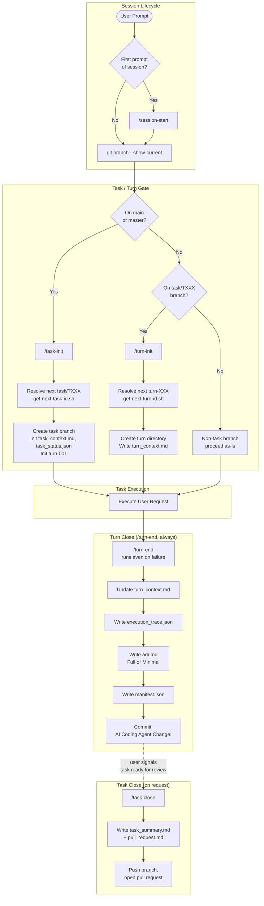

# coding-agents-config

Agentic pipeline configuration for Claude Code (and Codex). Enforces a task/turn-based workflow with provenance tracking, branch protection, and governance rules, plus the App Factory skill library for DSL-driven backend generation.

## Setup

### 1. Clone the repo

```sh
git clone <repo-url> ~/coding-agents-config
```

### 2. Create symlinks (automated)

Run the setup script — it creates all symlinks and backs up any existing files:

```sh
bash scripts/setup.sh
```

<details>
<summary>Manual symlink commands</summary>

```sh
# Claude Code (~/.claude)
ln -s ~/coding-agents-config/skills    ~/.claude/skills
ln -s ~/coding-agents-config/agents    ~/.claude/agents
ln -s ~/coding-agents-config/hooks     ~/.claude/hooks
ln -s ~/coding-agents-config/scripts   ~/.claude/scripts
ln -s ~/coding-agents-config/CLAUDE.md ~/.claude/CLAUDE.md
ln -s ~/coding-agents-config/settings.json ~/.claude/settings.json

# Codex (~/.codex)
ln -s ~/coding-agents-config/agents    ~/.codex/agents
ln -s ~/coding-agents-config/AGENTS.md ~/.codex/AGENTS.md

# Repo-local ./.claude (per-project override)
ln -s ~/coding-agents-config/CLAUDE.md ./.claude/CLAUDE.md
```

If any of these already exist, back them up first (`mv <target> <target>.bak`). `scripts/setup.sh` also links `rules/`, `context/`, and `plugins/` into `~/.claude` if those directories are present.

</details>

### 3. Verify

```sh
ls -la ~/.claude/skills        # should point to ~/coding-agents-config/skills
ls -la ~/.claude/agents        # should point to ~/coding-agents-config/agents
ls -la ~/.claude/hooks         # should point to ~/coding-agents-config/hooks
ls -la ~/.claude/CLAUDE.md     # should point to ~/coding-agents-config/CLAUDE.md
ls -la ~/.claude/settings.json # should point to ~/coding-agents-config/settings.json
```

## Structure

```
coding-agents-config/
├── CLAUDE.md            # Global instructions — task/turn protocol, branch rules
├── AGENTS.md            # Codex agent loader directive
├── settings.json        # Claude Code settings (model, permissions, hooks)
├── hooks/               # Shell hooks triggered by Claude Code events
│   └── branch-guard.sh  # Auto-creates a task branch when on main/master
├── agents/               # Subagent definitions
│   └── agent-architecture-planner.md
├── skills/               # Slash-command skills
│   ├── .system/          # Meta-skills (skill-creator, skill-installer, plugin-creator, ...)
│   ├── session-start/     # Load repo state and pipeline context
│   ├── task-init/         # Create task/TXXX branch + turn-001 artifacts
│   ├── turn-init/         # Initialize the next turn within a task
│   ├── turn-end/          # Finalize a turn with context, trace, ADR, manifest
│   ├── task-close/        # Push task branch and open a pull request
│   ├── branch-guard/      # Create a turn-scoped branch if on main/master
│   ├── af-*/              # App Factory PRD/DDD/DSL/build/orchestration skills
│   ├── dsl-utils/, ui-utils/, unit-tests/, e2e-tests/  # Nested utility skills
│   └── eval-labeler/      # Label/compare model responses for coding tasks
├── scripts/              # Automation scripts
│   ├── setup.sh          # Creates the symlinks above
│   └── af-state.sh       # Helpers for reading/writing .appfactory state.yaml
├── .appfactory/          # Task/turn tracking and specs for THIS repo
│   ├── tasks/            # task-XXX/ directories with turns/
│   ├── specs/            # Specifications
│   ├── prompts/          # Prompt templates
│   ├── memory/           # Project memory
│   └── tasks_index.csv   # Registry of all tasks and their status
├── archive/              # Earlier skill/template library, kept for reference (not symlinked)
│   └── templates/        # Legacy ADR/PR/manifest templates
└── docs/                 # Reference documentation
```

## Execution Flow

The agentic pipeline enforces a strict task/turn-based workflow for all coding tasks:


```mermaid
flowchart TB
    subgraph SESSION["Session Lifecycle"]
        START([User Prompt]) --> SS{First prompt<br/>of session?}
        SS -->|Yes| SESSION_START["/session-start"]
        SS -->|No| CHECK_BRANCH
        SESSION_START --> CHECK_BRANCH["git branch --show-current"]
    end

    subgraph GATE["Task / Turn Gate"]
        CHECK_BRANCH --> IS_MAIN{On main<br/>or master?}
        IS_MAIN -->|Yes| TASK_INIT["/task-init"]
        TASK_INIT --> RESOLVE_TASK["Resolve next task/TXXX<br/>get-next-task-id.sh"]
        RESOLVE_TASK --> NEW_TASK["Create task branch<br/>Init task_context.md, task_status.json<br/>Init turn-001"]
        IS_MAIN -->|No| IS_TASK{On task/TXXX<br/>branch?}
        IS_TASK -->|Yes| TURN_INIT["/turn-init"]
        TURN_INIT --> RESOLVE_TURN["Resolve next turn-XXX<br/>get-next-turn-id.sh"]
        RESOLVE_TURN --> NEW_TURN["Create turn directory<br/>Write turn_context.md"]
        IS_TASK -->|No| OTHER["Non-task branch<br/>proceed as-is"]
    end

    subgraph EXECUTION["Task Execution"]
        NEW_TASK --> EXEC["Execute User Request"]
        NEW_TURN --> EXEC
        OTHER --> EXEC
    end

    subgraph POST_EXEC["Turn Close (/turn-end, always)"]
        EXEC --> TURN_END["/turn-end<br/>runs even on failure"]
        TURN_END --> WRITE_CTX["Update turn_context.md"]
        WRITE_CTX --> WRITE_TRACE["Write execution_trace.json"]
        WRITE_TRACE --> WRITE_ADR["Write adr.md<br/>Full or Minimal"]
        WRITE_ADR --> WRITE_MANIFEST["Write manifest.json"]
        WRITE_MANIFEST --> COMMIT["Commit:<br/>AI Coding Agent Change:"]
    end

    subgraph TASK_REVIEW["Task Close (on request)"]
        COMMIT -.->|user signals<br/>task ready for review| TASK_CLOSE["/task-close"]
        TASK_CLOSE --> WRITE_SUMMARY["Write task_summary.md<br/>+ pull_request.md"]
        WRITE_SUMMARY --> PUSH["Push branch,<br/>open pull request"]
    end
```

### Turn Protocol Summary

| Phase | Trigger | Skill | Outputs |
|-------|---------|-------|---------|
| **Session Start** | First prompt of the session | `/session-start` | Git state + context loaded |
| **Task Init** | Current branch is `main`/`master` | `/task-init` | New `task/TXXX` branch, `task_context.md`, `task_status.json`, `turn-001` |
| **Turn Init** | Current branch is `task/TXXX` | `/turn-init` | Next `turn-XXX` directory, `turn_context.md` |
| **Execution** | Every prompt | — | Modified files |
| **Turn End** | After every prompt, always | `/turn-end` | `turn_context.md`, `execution_trace.json`, `adr.md`, `manifest.json` |
| **Task Close** | User signals the task is ready for review | `/task-close` | `task_summary.md`, `pull_request.md`, pushed branch + PR |

## Skills (24)

| Category | Skill | Description |
|----------|-------|--------------|
| **Session / Task / Turn** | `session-start` | Load repository state and core pipeline context at the start of every session |
| | `task-init` | Initialize a new task branch and create task + turn-001 artifacts (run when on `main`/`master`) |
| | `turn-init` | Initialize the next turn within the active task branch |
| | `turn-end` | Finalize the active turn with context, trace, ADR, and manifest — run after every prompt, even on failure |
| | `task-close` | Finalize the active task branch, push it, and open a pull request against `main` |
| | `branch-guard` | Check current branch and create a turn-scoped branch if on `main`/`master` |
| **App Factory — Project** | `af-project-init` | Orchestrate AppFactory project initialization: export required env vars and invoke helper scripts |
| | `af-orchestrator` | Orchestrate the App Factory software development lifecycle end to end |
| | `af-memory` | CRUD operations against `.appfactory/memory/state.yaml` for pipeline state tracking |
| | `af-app-check` | Audit an application for production readiness across security, database, deployment, and code quality |
| **App Factory — Backend PRD/DDD** | `af-be-prd-build` | Build a business-facing backend PRD from an intake worksheet or discovery notes |
| | `af-be-ddd-build` | Generate a backend Domain-Driven Design document from an approved PRD |
| | `af-be-ddd-analysis` | Audit a generated DDD spec for quality, completeness, and PRD alignment |
| | `af-be-ddd-refactor` | Apply targeted patches to a DDD spec using `af-be-ddd-analysis` findings |
| | `af-be-ddd-orchestrator` | Orchestrate the backend DDD workflow: build → analyze → refactor loop → test |
| | `af-be-ddd-dsl` | Generate a backend DSL YAML document from a DDD document |
| | `af-be-ddd-tests` | Generate Gherkin-style BDD scenarios from DDD and PRD specifications |
| **App Factory — Backend Build** | `af-be-plan` | Generate a backend execution plan from a domain DSL and a tech stack profile |
| | `af-be-implementation` | Generate backend code from the execution plan and BDD feature specs |
| **Test / UI / DSL Utilities** | `dsl-utils/dsl-model-interpreter` | Parse and validate `app-dsl` YAML specifications |
| | `e2e-tests/http-test-artifacts` | Generate `.http` request files for REST API endpoint testing |
| | `ui-utils/ui-implementation-language` | Declarative YAML standard for UI pages, layouts, widgets, forms, and actions |
| | `unit-tests/test-implementation-sync` | Keep unit tests synchronized with actual service/DTO implementations |
| **Evaluation** | `eval-labeler` | Process `Eval.md` files to label and compare model responses (Response A vs Response B) |

### Meta-Skills (.system)

| Skill | Description |
|-------|-------------|
| `skill-creator` | Guide for creating or updating skills |
| `skill-installer` | Install skills into `$CODEX_HOME/skills` from a curated list or a GitHub repo |
| `plugin-creator` | Scaffold plugin directories with a `.codex-plugin/plugin.json` manifest |
| `imagegen` | Generate or edit raster images (photos, illustrations, textures, sprites, mockups) |
| `openai-docs` | Look up official OpenAI API/product documentation with citations |

## Archive

`archive/` holds an earlier iteration of the skill library (DSL-first full-stack generation: `app-from-dsl`, `nestjs-crud-resource`, `react-form-page`, etc.) and the legacy `templates/` directory (`adr_template.md`, `pull_request_template.md`, `manifest.schema.json`, ...). It's kept for reference and is not symlinked or part of the active pipeline — current task/turn artifact templates live inside `skills/task-init/templates/` and `skills/turn-init/templates/`.

## Hooks

| Hook | Trigger | Purpose |
|------|---------|---------|
| `branch-guard.sh` | `PreToolUse(Bash)` | Auto-create a `task/TXXX` branch when the current branch is `main` or `master` |

## Adding a new skill

Each skill lives in its own directory under `skills/` with a `SKILL.md` file:

```
skills/my-skill/
└── SKILL.md
```

The `.system/skill-creator` meta-skill can guide you through creating one — invoke it from Claude Code.

## Syncing across machines

Since this is a standard git repo, pull on any machine to stay current:

```sh
cd ~/coding-agents-config && git pull
```

The symlinks mean changes are picked up immediately — no reinstall needed.
