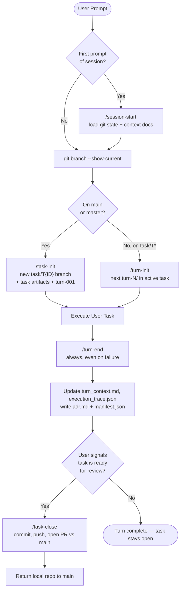

# coding-agents-config

Agentic pipeline configuration for Claude Code and Codex. Provides a task/turn-based workflow with provenance tracking and branch protection, plus the **App Factory** skill set — an AI-augmented SDLC that takes a project from PRD through Domain-Driven Design, planning, and backend implementation.

## Setup

### 1. Clone the repo

```sh
git clone <repo-url> ~/coding-agents-config
```

### 2. Create symlinks (automated)

Run the setup script — it symlinks the repo into `~/.claude`, `~/.codex`, and a repo-local `./.claude`, backing up any existing files:

```sh
bash scripts/setup.sh
```

<details>
<summary>Manual symlink commands</summary>

```sh
# ~/.claude
ln -s ~/coding-agents-config/skills    ~/.claude/skills
ln -s ~/coding-agents-config/agents    ~/.claude/agents
ln -s ~/coding-agents-config/hooks     ~/.claude/hooks
ln -s ~/coding-agents-config/scripts   ~/.claude/scripts
ln -s ~/coding-agents-config/CLAUDE.md ~/.claude/CLAUDE.md
ln -s ~/coding-agents-config/settings.json ~/.claude/settings.json

# ~/.codex
ln -s ~/coding-agents-config/agents    ~/.codex/agents
ln -s ~/coding-agents-config/AGENTS.md ~/.codex/AGENTS.md

# repo-local
ln -s ~/coding-agents-config/CLAUDE.md ~/coding-agents-config/.claude/CLAUDE.md
```

If any of these already exist, back them up first (`mv <target> <target>.bak`). `scripts/setup.sh` also links `rules/`, `context/`, and `plugins/` into `~/.claude` when those directories are present.

</details>

### 3. Verify

```sh
ls -la ~/.claude/skills        # should point to ~/coding-agents-config/skills
ls -la ~/.claude/hooks         # should point to ~/coding-agents-config/hooks
ls -la ~/.claude/CLAUDE.md     # should point to ~/coding-agents-config/CLAUDE.md
ls -la ~/.claude/settings.json # should point to ~/coding-agents-config/settings.json
ls -la ~/.codex/AGENTS.md      # should point to ~/coding-agents-config/AGENTS.md
```

## Structure

```
coding-agents-config/
├── CLAUDE.md               # Global instructions — task/turn protocol, branch rules
├── AGENTS.md               # Codex loader directive (reads ~/.claude/CLAUDE.md)
├── settings.json            # Claude Code settings (model, permissions, hooks, plugins)
├── package.json             # npm metadata (caveman plugin dependency)
├── agents/                  # Agent definitions
│   └── agent-architecture-planner.md
├── hooks/                   # Shell hooks triggered by Claude Code events
│   └── branch-guard.sh      # PreToolUse(Bash) hook — auto-creates task/T{ID} off main/master
├── skills/                  # Slash-command / model-invoked skills (see below)
├── scripts/
│   ├── setup.sh              # Symlinks this repo into ~/.claude, ~/.codex, ./.claude
│   └── af-state.sh           # Shell helpers for .appfactory/memory/state.yaml
├── .appfactory/              # Task/turn tracking, specs, prompts, and pipeline memory
│   ├── tasks/                 # task-XXX/ directories, each with a turns/ subtree
│   ├── tasks_index.csv        # Registry of all tasks (branch, status, PR URL, turn count)
│   ├── specs/
│   ├── prompts/
│   ├── memory/
│   └── changelog.md
├── archive/                  # Retired skills and templates, kept for reference
└── docs/                     # Reference docs (skill-summary.md, migration notes, plans)
```

## Execution Flow

Every coding prompt runs inside a **task** (one branch, one eventual PR) made up of one or more **turns** (one AI execution cycle each):


```mermaid
flowchart TB
    START([User Prompt]) --> SS{First prompt<br/>of session?}
    SS -->|Yes| SESSION_START["/session-start<br/>load git state + context docs"]
    SS -->|No| CHECK_BRANCH
    SESSION_START --> CHECK_BRANCH["git branch --show-current"]

    CHECK_BRANCH --> IS_MAIN{On main<br/>or master?}
    IS_MAIN -->|Yes| TASK_INIT["/task-init<br/>new task/T{ID} branch<br/>+ task artifacts + turn-001"]
    IS_MAIN -->|No, on task/T*| TURN_INIT["/turn-init<br/>next turn-N/ in active task"]

    TASK_INIT --> EXEC
    TURN_INIT --> EXEC["Execute User Task"]

    EXEC --> TURN_END["/turn-end<br/>always, even on failure"]
    TURN_END --> WRITE["Update turn_context.md, execution_trace.json<br/>write adr.md + manifest.json"]

    WRITE --> READY{User signals<br/>task is ready<br/>for review?}
    READY -->|Yes| TASK_CLOSE["/task-close<br/>commit, push, open PR vs main"]
    READY -->|No| DONE([Turn complete — task stays open])
    TASK_CLOSE --> RETURN["Return local repo to main"]
```

### Task / Turn Protocol Summary

| Phase | Skill | What it does | Key artifacts |
|-------|-------|---------------|----------------|
| Session start | `session-start` | Load git state and pipeline context docs (first prompt only) | — |
| Task init | `task-init` | On `main`/`master`: create `task/T{ID}`, task artifacts, `turn-001` | `task_context.md`, `task_status.json`, `task_summary.md`, `pull_request.md` |
| Turn init | `turn-init` | On an active task branch: create the next `turn-N/` | `turn_context.md`, `execution_trace.json` |
| Execution | — | Execute the user's request | Modified files |
| Turn end | `turn-end` | Always run after execution, even on failure | `adr.md`, `manifest.json`, updated `execution_trace.json` |
| Task close | `task-close` | When the user signals the task is ready for review: commit, push, open PR against `main` | Updated `task_status.json`, `pull_request.md`, `tasks_index.csv` |
| Branch guard | `branch-guard` (hook + skill) | Safety net: `hooks/branch-guard.sh` fires on every `Bash` tool call and auto-creates `task/T{ID}` if still on `main`/`master` | — |

## Skills (35)

### Task / Turn Lifecycle

| Skill | Description |
|-------|-------------|
| `session-start` | Load repository state and core pipeline context at the start of a session |
| `task-init` | Create a task branch (`task/T{ID}`) plus task and `turn-001` artifacts when on `main`/`master` |
| `turn-init` | Initialize the next turn directory within the active task branch |
| `turn-end` | Finalize a turn: ADR, manifest, updated execution trace |
| `task-close` | Finalize the task, push the branch, and open a PR against `main` |
| `branch-guard` | Manually check the current branch and create a task branch if on `main`/`master` |

### App Factory Pipeline (`af-*`)

An AI-augmented SDLC for generating backend applications, orchestrated end to end by `af-orchestrator`. See `docs/skill-summary.md` for the full phase-by-phase breakdown.

| Skill | Description |
|-------|-------------|
| `af-orchestrator` | Orchestrates the App Factory software development lifecycle across all phases below |
| `af-project-init` | Bootstrap a new AppFactory project and export required environment variables |
| `af-be-prd-build` | Build a business-facing PRD from an intake worksheet or discovery notes |
| `af-be-ddd-orchestrator` | Run the backend DDD build → analyze → refactor → test loop |
| `af-be-ddd-build` | Generate a human-readable DDD document from an approved PRD |
| `af-be-ddd-analysis` | Audit a DDD spec for completeness, consistency, and PRD alignment |
| `af-be-ddd-refactor` | Patch a DDD spec per `af-be-ddd-analysis` findings |
| `af-be-ddd-tests` | Generate Gherkin/BDD feature files from the DDD and PRD specs |
| `af-be-ddd-dsl` | Generate a backend domain DSL YAML document from the DDD spec |
| `af-be-plan` | Generate a backend execution plan from the DSL and a selected tech stack profile |
| `af-be-implementation` | Generate backend source code from the execution plan and BDD feature specs |
| `af-app-check` | Audit an application for production readiness (security, database, deployment, code quality) |
| `af-memory` | CRUD operations on `.appfactory/memory/state.yaml` pipeline state |

### Utilities

| Skill | Description |
|-------|-------------|
| `dsl-utils/dsl-model-interpreter` | Parse and validate app-dsl YAML specifications |
| `ui-utils/ui-implementation-language` | Declarative YAML standard for UI pages, layouts, widgets, and bindings |
| `unit-tests/test-implementation-sync` | Keep unit tests synchronized with actual service/DTO implementations |
| `e2e-tests/http-test-artifacts` | Generate `.http` request files for REST endpoint testing |
| `eval-labeler` | Label Response A vs Response B model evaluations from `Eval.md` files |

### Tech-Stack Scaffolding (`.nestjs/`)

| Skill | Description |
|-------|-------------|
| `app-from-dsl` | Orchestrate full-stack app generation from an app-dsl YAML spec |
| `field-mapper-generator` | Generate field mapper/converter utilities from DSL mapper specs |
| `nestjs-crud-resource` | Generate a NestJS CRUD module (controller, service, DTOs) from a DSL backend spec |
| `nestjs-customer-crud-scaffold` | Scaffold a NestJS customer CRUD app via a non-interactive Nest CLI wrapper |
| `nestjs-observability` | Add structured logging, request tracing, and Prisma query logging to a NestJS backend |
| `nestjs-prisma-resource` | Generate a complete NestJS CRUD resource backed by Prisma |
| `prisma/prisma-guidelines` | Prisma ORM development guidelines and constraints |
| `prisma/prisma-persistence` | Generate a Prisma schema and migrations from a DSL persistence model |

### Meta-Skills (`.system/`)

| Skill | Description |
|-------|-------------|
| `skill-creator` | Guide for creating and updating skills |
| `skill-installer` | Install Codex skills from a curated list or a GitHub repo path |
| `plugin-creator` | Scaffold Codex plugin directories with a valid `.codex-plugin/plugin.json` manifest |
| `imagegen` | Generate or edit raster images for mockups, textures, and illustrations |
| `openai-docs` | Look up official OpenAI product/API documentation with citations |

## Templates

Templates now live alongside the skill that owns them (e.g. `skills/task-init/templates/task_context.md`, `skills/turn-init/templates/turn_context.md`) rather than in a single shared directory. Retired shared templates (`adr_template.md`, `pull_request_template.md`, `manifest.schema.json`, `metadata_header.txt`, `branch_naming.md`, `commit_message.md`, `tech-stack.template.md`) are kept in `archive/templates/` for reference.

## Hooks

| Hook | Trigger | Purpose |
|------|---------|---------|
| `branch-guard.sh` | `PreToolUse(Bash)` | Auto-create `task/T{ID}` and switch to it if the current branch is `main` or `master` |

## Adding a new skill

Each skill lives in its own directory under `skills/` with a `SKILL.md` file:

```
skills/my-skill/
└── SKILL.md
```

The `.system/skill-creator` meta-skill can guide you through creating one — invoke it from Claude Code.

## Syncing across machines

Since this is a standard git repo, pull on any machine to stay current:

```sh
cd ~/coding-agents-config && git pull
```

The symlinks mean changes are picked up immediately — no reinstall needed.
