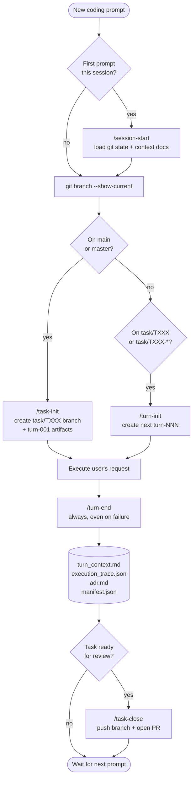

# coding-agents-config

Shared configuration and skill library for AI coding agents (Claude Code and Codex). Provides a task/turn execution protocol with provenance tracking and branch governance, plus **AppFactory** — a spec-driven skill pipeline that takes a backend application from PRD through Domain-Driven Design, DSL, planning, implementation, and production-readiness checks.

## Setup

### 1. Clone the repo

```sh
git clone <repo-url> ~/coding-agents-config
```

### 2. Create symlinks (automated)

Run the setup script — it creates all symlinks and backs up any existing files:

```sh
bash scripts/setup.sh
```

<details>
<summary>Manual symlink commands</summary>

```sh
# Into ~/.claude/
ln -s ~/coding-agents-config/skills ~/.claude/skills
ln -s ~/coding-agents-config/agents ~/.claude/agents
ln -s ~/coding-agents-config/hooks ~/.claude/hooks
ln -s ~/coding-agents-config/scripts ~/.claude/scripts
ln -s ~/coding-agents-config/CLAUDE.md ~/.claude/CLAUDE.md
ln -s ~/coding-agents-config/settings.json ~/.claude/settings.json

# Into ~/.codex/
ln -s ~/coding-agents-config/agents ~/.codex/agents
ln -s ~/coding-agents-config/AGENTS.md ~/.codex/AGENTS.md

# Repo-local copy (for sessions that read project-local config)
ln -s ~/coding-agents-config/CLAUDE.md ~/coding-agents-config/.claude/CLAUDE.md
```

`scripts/setup.sh` also reserves `rules/`, `context/`, and `plugins/` symlinks under `~/.claude/` for future use; these directories don't exist in this repo yet.

If any targets already exist, back them up first (`mv <target> <target>.bak`).
</details>

### 3. Verify

```sh
ls -la ~/.claude/skills        # should point to ~/coding-agents-config/skills
ls -la ~/.claude/agents        # should point to ~/coding-agents-config/agents
ls -la ~/.claude/hooks         # should point to ~/coding-agents-config/hooks
ls -la ~/.claude/CLAUDE.md     # should point to ~/coding-agents-config/CLAUDE.md
ls -la ~/.claude/settings.json # should point to ~/coding-agents-config/settings.json
ls -la ~/.codex/AGENTS.md      # should point to ~/coding-agents-config/AGENTS.md
```

## Structure

```
coding-agents-config/
├── CLAUDE.md              # Global instructions — task/turn protocol, branch rules, AppFactory constants
├── AGENTS.md              # Codex agent loader directive
├── settings.json          # Claude Code settings (model, permissions, hooks, plugins)
├── package.json           # npm metadata (caveman plugin dependency)
├── agents/                # Subagent definitions (e.g. agent-architecture-planner)
├── hooks/
│   └── branch-guard.sh    # PreToolUse(Bash) hook — auto-creates a task/TXXX branch on main/master
├── scripts/
│   ├── setup.sh           # Creates ~/.claude and ~/.codex symlinks
│   └── af-state.sh        # Helpers for reading/writing .appfactory/memory/state.yaml
├── skills/                # Slash-command skills
│   ├── .system/           # Meta-skills: skill-creator, skill-installer, plugin-creator, imagegen, openai-docs
│   ├── .nestjs/           # NestJS/Prisma scaffolding skills
│   ├── session-start/     # Load repo + pipeline context at session start
│   ├── task-init/         # Create task/TXXX branch + turn-001 artifacts (run on main/master)
│   ├── turn-init/         # Create the next turn-NNN artifacts (run on a task branch)
│   ├── turn-end/          # Finalize a turn — context, trace, ADR, manifest
│   ├── task-close/        # Push the task branch and open a PR against main
│   ├── branch-guard/      # Legacy branch-protection skill
│   ├── af-orchestrator/   # AppFactory SDLC orchestrator
│   ├── af-*/              # AppFactory phase skills (PRD, DDD, DSL, plan, implementation, checks, memory)
│   ├── dsl-utils/         # DSL parsing/validation utilities
│   ├── e2e-tests/         # HTTP test artifact generation
│   ├── ui-utils/          # UI DSL utilities
│   ├── unit-tests/        # Test/implementation sync utilities
│   └── eval-labeler/      # Label/compare model responses for evals
├── .appfactory/
│   ├── changelog.md       # Turn-by-turn history
│   ├── memory/            # AppFactory pipeline state (state.yaml)
│   ├── prompts/           # Prompt templates and notes
│   ├── specs/             # Specifications
│   ├── tasks/             # task-XXX/ directories with turn artifacts
│   └── tasks_index.csv    # Task registry
├── archive/               # Deprecated skills and templates kept for reference
├── docs/                  # Reference docs (AppFactory plan, skill summary, migration notes)
└── .github/               # Issue and PR templates
```

## Execution Flow

Every coding prompt follows the task/turn protocol defined in `CLAUDE.md`:


```mermaid
flowchart TB
    START([New coding prompt]) --> FIRST{First prompt<br/>this session?}
    FIRST -- yes --> SS["/session-start<br/>load git state + context docs"]
    FIRST -- no --> CHECK
    SS --> CHECK

    CHECK["git branch --show-current"] --> ISMAIN{On main<br/>or master?}
    ISMAIN -- yes --> TASKINIT["/task-init<br/>create task/TXXX branch<br/>+ turn-001 artifacts"]
    ISMAIN -- no --> ISTASK{On task/TXXX<br/>or task/TXXX-*?}
    ISTASK -- yes --> TURNINIT["/turn-init<br/>create next turn-NNN"]

    TASKINIT --> EXEC["Execute user's request"]
    TURNINIT --> EXEC

    EXEC --> TURNEND["/turn-end<br/>always, even on failure"]
    TURNEND --> ARTIFACTS[("turn_context.md<br/>execution_trace.json<br/>adr.md<br/>manifest.json")]

    ARTIFACTS --> REVIEW{Task ready<br/>for review?}
    REVIEW -- yes --> TASKCLOSE["/task-close<br/>push branch + open PR"]
    REVIEW -- no --> DONE([Wait for next prompt])
    TASKCLOSE --> DONE
```

**Hard gate:** code must never be written while on `main` or `master`. `/task-init` must run first, and `hooks/branch-guard.sh` enforces this at the tool level by auto-creating a `task/TXXX` branch before any Bash command runs on a protected branch.

Task IDs (`001`, `002`, ...) and turn IDs (per task, reset to `001`, ...) are global, zero-padded to 3 digits, and recorded in `.appfactory/tasks_index.csv`.

## Skills

### Task/Turn Protocol

| Skill | Description |
|-------|-------------|
| `session-start` | Load repository state and core pipeline context. Run at the start of every session. |
| `task-init` | Initialize a new task branch and create task + turn-001 artifacts. Run when on `main`/`master`. |
| `turn-init` | Initialize the next turn within the active task branch. Run when already on a task branch. |
| `turn-end` | Finalize the active turn after execution. Run after every coding prompt, even on failure. |
| `task-close` | Finalize the active task branch, push it, and open a pull request against `main`. |
| `branch-guard` | Create a turn-scoped branch if on `main`/`master`. Requires `TURN_ID` set by `turn-init`. |

### AppFactory SDLC (`af-*`)

A spec-driven pipeline for generating backend applications. See `docs/appFactory-plan.md` and `docs/skill-summary.md` for the full phase breakdown.

| Phase | Skill | Description |
|-------|-------|-------------|
| Orchestration | `af-orchestrator` | Orchestrates the App Factory software development lifecycle end to end. |
| Initialization | `af-project-init` | Export AppFactory environment variables and run project initialization. |
| Requirements | `af-be-prd-build` | Build a business-facing backend PRD from an intake worksheet or discovery notes. |
| Domain Design | `af-be-ddd-orchestrator` | Orchestrate the DDD build → analyze → refactor loop and test generation. |
| Domain Design | `af-be-ddd-build` | Generate a human-readable backend DDD document from an approved PRD. |
| Domain Design | `af-be-ddd-analysis` | Audit a generated DDD document for quality, completeness, and PRD alignment. |
| Domain Design | `af-be-ddd-refactor` | Apply targeted patches to a DDD document based on `af-be-ddd-analysis` findings. |
| Testing | `af-be-ddd-tests` | Generate Gherkin BDD feature files from the DDD and PRD specifications. |
| Planning | `af-be-plan` | Generate a backend execution plan from a domain DSL and a tech stack profile. |
| DSL Generation | `af-be-ddd-dsl` | Generate a backend application DSL (YAML) from a DDD document. |
| Implementation | `af-be-implementation` | Copy the selected tech stack implementation and generate domain code from the plan and BDD specs. |
| Validation | `af-app-check` | Audit an application for production readiness (security, database, deployment, code quality). |
| Utility | `af-memory` | CRUD operations on `.appfactory/memory/state.yaml` for pipeline state tracking. |

AppFactory skills rely on container constants defined in `CLAUDE.md` (`AF_ROOT`, `AF_GITHUB_PROFILE`, `AF_GENERATED_PROJECT_ROOT`, `AF_TECH_STACK_DSL`, `AF_TECH_STACK_IMPLEMENTATIONS`, `max_ddd_tries`).

### Utility Skills

| Category | Skill | Description |
|----------|-------|-------------|
| `dsl-utils` | `dsl-model-interpreter` | Parse and validate app-dsl YAML specs (models, mappers, pages, backends, lookups). |
| `e2e-tests` | `http-test-artifacts` | Generate `.http` request files for API endpoint testing from `app-dsl/backend/`. |
| `ui-utils` | `ui-implementation-language` | Declarative YAML language for UI pages, layouts, forms, and API interactions. |
| `unit-tests` | `test-implementation-sync` | Keep generated unit tests synchronized with their target implementations. |
| — | `eval-labeler` | Process `Eval.md` files to label and compare Response A vs Response B for coding tasks. |

### NestJS / Prisma Scaffolding (`.nestjs`)

| Skill | Description |
|-------|-------------|
| `app-from-dsl` | Orchestrate full-stack generation (entity, CRUD API, forms, tests) from app-dsl YAML. |
| `nestjs-crud-resource` | Generate a NestJS CRUD module (controller, service, DTOs) from a DSL backend spec. |
| `nestjs-prisma-resource` | Generate a complete schema-driven NestJS + Prisma CRUD resource from an input schema. |
| `nestjs-customer-crud-scaffold` | Scaffold a NestJS customer CRUD app via a non-interactive Nest CLI wrapper. |
| `nestjs-observability` | Add structured logging, correlation IDs, and Prisma query logging to a NestJS backend. |
| `field-mapper-generator` | Generate field mapper/converter utilities between UI, API, and persistence layers from DSL. |
| `prisma/prisma-persistence` | Generate Prisma schema and migrations from a DSL persistence model. |
| `prisma/prisma-guidelines` | Prisma ORM guidelines and constraints for schema, seeds, and configuration. |

### Meta-Skills (`.system`)

| Skill | Description |
|-------|-------------|
| `skill-creator` | Guide for creating or updating skills with a `SKILL.md`. |
| `skill-installer` | Install skills into `$CODEX_HOME/skills` from a curated list or GitHub repo. |
| `plugin-creator` | Scaffold Codex plugin directories with `.codex-plugin/plugin.json` and marketplace entries. |
| `imagegen` | Generate or edit raster images (illustrations, mockups, sprites, textures). |
| `openai-docs` | Look up OpenAI API/model docs with citations and migration guidance. |

## Task & Turn Tracking (`.appfactory/`)

Each task lives under `.appfactory/tasks/task-XXX/` and requires:

- `task_context.md`, `task_status.json`, `task_summary.md`, `pull_request.md`

Each turn lives under `.appfactory/tasks/task-XXX/turns/turn-XXX/` and requires:

- `turn_context.md`, `execution_trace.json`, `adr.md`, `manifest.json`

`.appfactory/tasks_index.csv` tracks every task's branch, status, PR URL, and turn count. `.appfactory/changelog.md` summarizes what each recorded turn did. `.appfactory/memory/` holds AppFactory pipeline state (`state.yaml`), and `.appfactory/prompts/` / `.appfactory/specs/` hold supporting prompt and spec material.

## Hooks

| Hook | Trigger | Purpose |
|------|---------|---------|
| `branch-guard.sh` | `PreToolUse(Bash)` | If on `main`/`master`, auto-create and switch to the next `task/TXXX` branch before the command runs. |

## Adding a new skill

Each skill lives in its own directory under `skills/` with a `SKILL.md` file:

```
skills/my-skill/
└── SKILL.md
```

The `skills/.system/skill-creator` meta-skill can guide you through creating one — invoke it from Claude Code or Codex.

## Syncing across machines

Since this is a standard git repo, pull on any machine to stay current:

```sh
cd ~/coding-agents-config && git pull
```

The symlinks mean changes are picked up immediately — no reinstall needed.
