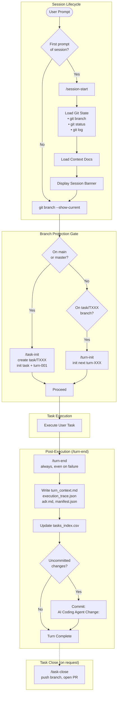

# coding-agents-config

Agentic pipeline configuration for Claude Code. Enforces turn-based workflow with provenance tracking, branch protection, and governance rules, plus the **App Factory** skill suite for DSL-driven backend generation.

## Setup

### 1. Clone the repo

```sh
git clone <repo-url> ~/coding-agents-config
```

### 2. Create symlinks (automated)

Run the setup script — it creates all symlinks and backs up any existing files:

```sh
bash scripts/setup.sh
```

<details>
<summary>Manual symlink commands</summary>

```sh
# ~/.claude/
ln -s ~/coding-agents-config/skills ~/.claude/skills
ln -s ~/coding-agents-config/agents ~/.claude/agents
ln -s ~/coding-agents-config/rules ~/.claude/rules
ln -s ~/coding-agents-config/hooks ~/.claude/hooks
ln -s ~/coding-agents-config/context ~/.claude/context
ln -s ~/coding-agents-config/scripts ~/.claude/scripts
ln -s ~/coding-agents-config/plugins ~/.claude/plugins
ln -s ~/coding-agents-config/CLAUDE.md ~/.claude/CLAUDE.md
ln -s ~/coding-agents-config/settings.json ~/.claude/settings.json

# ~/.codex/
ln -s ~/coding-agents-config/agents ~/.codex/agents
ln -s ~/coding-agents-config/AGENTS.md ~/.codex/AGENTS.md

# repo-local ./.claude/
ln -s ~/coding-agents-config/CLAUDE.md ./.claude/CLAUDE.md
```

If any of these already exist, back them up first (`mv <target> <target>.bak`). `rules`, `context`, and `plugins` are optional — `setup.sh` skips items that don't exist in the repo.

</details>

### 3. Verify

```sh
ls -la ~/.claude/skills        # should point to ~/coding-agents-config/skills
ls -la ~/.claude/hooks         # should point to ~/coding-agents-config/hooks
ls -la ~/.claude/CLAUDE.md     # should point to ~/coding-agents-config/CLAUDE.md
ls -la ~/.claude/settings.json # should point to ~/coding-agents-config/settings.json
ls -la ~/.codex/AGENTS.md      # should point to ~/coding-agents-config/AGENTS.md
```

## Structure

```
coding-agents-config/
├── CLAUDE.md           # Global instructions — turn protocol, branch rules
├── AGENTS.md           # Codex loader directive (points to ~/.claude/CLAUDE.md)
├── settings.json        # Claude Code settings (model, permissions, hooks, plugins)
├── package.json         # Marketplace plugin dependency (caveman)
├── hooks/                # Shell hooks triggered by Claude Code events
│   └── branch-guard.sh   # Blocks edits on main/master
├── agents/               # Reusable subagent definitions
│   └── agent-architecture-planner.md
├── skills/                    # Slash-command skills
│   ├── session-start/         # Initialize session context
│   ├── task-init/              # Create a new task branch + turn-001
│   ├── task-close/              # Finalize task, push, open PR
│   ├── turn-init/                # Start the next turn on a task branch
│   ├── turn-end/                 # Finalize a turn (PR/ADR/manifest/commit)
│   ├── branch-guard/              # Create a turn branch if on main/master
│   ├── af-orchestrator/           # App Factory SDLC orchestrator
│   ├── af-project-init/           # Bootstrap an App Factory project
│   ├── af-memory/                 # CRUD over .appfactory/state.yaml
│   ├── af-app-check/              # Production-readiness audit
│   ├── af-be-prd-build/           # Backend PRD generation
│   ├── af-be-ddd-build/           # Backend DDD spec generation
│   ├── af-be-ddd-analysis/        # Audit a DDD spec for gaps/risks
│   ├── af-be-ddd-refactor/        # Patch a DDD spec from analysis findings
│   ├── af-be-ddd-orchestrator/    # Build → analyze → refactor → test loop
│   ├── af-be-ddd-dsl/             # DDD doc → DSL YAML
│   ├── af-be-plan/                # DSL + tech-stack profile → execution plan
│   ├── af-be-ddd-tests/           # DSL/PRD → Gherkin BDD feature files
│   ├── af-be-implementation/      # Execution plan + BDD specs → generated code
│   ├── dsl-utils/dsl-model-interpreter/       # Parse/validate app-dsl YAML
│   ├── ui-utils/ui-implementation-language/   # Declarative UI YAML standard
│   ├── e2e-tests/http-test-artifacts/         # Generate .http request files
│   ├── unit-tests/test-implementation-sync/   # Keep unit tests in sync with code
│   └── eval-labeler/          # Label/score model-response evals from Eval.md files
├── scripts/               # Automation scripts
│   ├── setup.sh            # Creates the symlinks above
│   └── af-state.sh         # Helper for reading/writing .appfactory state
├── .appfactory/            # Task/turn tracking, specs, prompts, memory
│   ├── tasks/               # Task branches with turns (task_context.md, adr.md, manifest.json, ...)
│   ├── specs/                # Specifications
│   ├── prompts/               # Prompt templates
│   ├── memory/                 # Project memory
│   ├── changelog.md
│   └── tasks_index.csv
├── docs/                   # Reference documentation (App Factory plan, migration notes, skill summary)
├── archive/                # Retired skills/templates kept for reference (not symlinked)
└── .github/                # Issue/PR templates
```

## Execution Flow

The agentic pipeline enforces a strict turn-based workflow for all coding tasks:


```mermaid
flowchart TB
    subgraph SESSION["Session Lifecycle"]
        START([User Prompt]) --> SS{First prompt<br/>of session?}
        SS -->|Yes| SESSION_START["/session-start"]
        SS -->|No| BRANCH_CHECK

        SESSION_START --> LOAD_GIT["Load Git State<br/>• git branch<br/>• git status<br/>• git log"]
        LOAD_GIT --> LOAD_CTX["Load Context Docs"]
        LOAD_CTX --> BANNER["Display Session Banner"]
        BANNER --> BRANCH_CHECK
    end

    subgraph BRANCH_GATE["Branch Protection Gate"]
        BRANCH_CHECK["git branch --show-current"] --> IS_MAIN{On main<br/>or master?}
        IS_MAIN -->|Yes| TASK_INIT["/task-init<br/>create task/TXXX<br/>init task + turn-001"]
        IS_MAIN -->|No| IS_TASK{On task/TXXX<br/>branch?}
        IS_TASK -->|Yes| TURN_INIT["/turn-init<br/>init next turn-XXX"]
        TASK_INIT --> PROCEED
        TURN_INIT --> PROCEED
    end

    subgraph EXECUTION["Task Execution"]
        PROCEED["Proceed"] --> EXEC["Execute User Task"]
    end

    subgraph POST_EXEC["Post-Execution (/turn-end)"]
        EXEC --> TURN_END["/turn-end<br/>always, even on failure"]
        TURN_END --> WRITE_ARTIFACTS["Write turn_context.md<br/>execution_trace.json<br/>adr.md, manifest.json"]
        WRITE_ARTIFACTS --> UPDATE_INDEX["Update tasks_index.csv"]
        UPDATE_INDEX --> CHECK_UNCOMMITTED{Uncommitted<br/>changes?}
        CHECK_UNCOMMITTED -->|Yes| COMMIT["Commit:<br/>AI Coding Agent Change:"]
        CHECK_UNCOMMITTED -->|No| COMPLETE
        COMMIT --> COMPLETE["Turn Complete"]
    end

    subgraph CLOSE["Task Close (on request)"]
        COMPLETE -.-> TASK_CLOSE["/task-close<br/>push branch, open PR"]
    end
```

### Turn Protocol Summary

| Phase | Steps | Outputs |
|-------|-------|---------|
| **Session Start** | Load git state → Load context docs → Display banner | Context loaded |
| **Task Init** (on `main`/`master`) | Resolve next task id → `git checkout -b task/TXXX` → init task + turn-001 | `task_context.md`, `task_status.json`, turn-001 artifacts |
| **Turn Init** (on `task/TXXX`) | Resolve next turn id → create `turns/turn-XXX/` | `turn_context.md`, `execution_trace.json` |
| **Execution** | Execute the user's request | Modified files |
| **Turn End** | Always runs, even on failure | `adr.md`, `manifest.json`, commit, `tasks_index.csv` update |
| **Task Close** (on request) | Push branch, open PR against `main` | `pull_request.md`, PR |

## Skills

### Turn Protocol

| Skill | Description |
|-------|--------------|
| `session-start` | Load repository state and core pipeline context; run at the start of every session |
| `task-init` | Initialize a new task branch (`task/TXXX`) and create task + turn-001 artifacts |
| `task-close` | Finalize the active task branch, push it, and open a pull request against `main` |
| `turn-init` | Initialize the next turn within the active task branch |
| `turn-end` | Finalize the active turn after execution — runs even on failure |
| `branch-guard` | Create a turn-scoped branch if currently on `main`/`master` |

### App Factory — Backend DDD Pipeline

| Skill | Description |
|-------|--------------|
| `af-orchestrator` | Orchestrates the App Factory software development lifecycle |
| `af-project-init` | Exports required environment variables and bootstraps a new App Factory project |
| `af-memory` | CRUD operations over `.appfactory/state.yaml` for pipeline state tracking |
| `af-app-check` | Audits an application for production readiness (security, database, deployment, code quality) |
| `af-be-prd-build` | Builds a backend PRD from an intake worksheet or discovery notes |
| `af-be-ddd-build` | Generates a backend Domain-Driven Design document from an approved PRD |
| `af-be-ddd-analysis` | Audits a generated DDD spec for completeness, consistency, and gaps |
| `af-be-ddd-refactor` | Patches a DDD spec using `af-be-ddd-analysis` findings |
| `af-be-ddd-orchestrator` | Runs the DDD build → analyze → refactor loop → test phases |
| `af-be-ddd-dsl` | Converts a human-readable DDD document into a backend DSL YAML document |
| `af-be-plan` | Generates a backend execution plan from a DSL YAML and tech-stack profile |
| `af-be-ddd-tests` | Generates Gherkin BDD feature files from DDD/PRD specs, organized by aggregate |
| `af-be-implementation` | Generates backend code from the execution plan and BDD feature specs |

### Utilities

| Skill | Description |
|-------|--------------|
| `dsl-utils/dsl-model-interpreter` | Parses and validates `app-dsl` YAML specifications before code generation |
| `ui-utils/ui-implementation-language` | Declarative YAML standard for framework-neutral UI page/layout/widget definitions |
| `e2e-tests/http-test-artifacts` | Generates `.http` request files for REST API endpoint testing |
| `unit-tests/test-implementation-sync` | Keeps unit tests synchronized with service/DTO implementations |
| `eval-labeler` | Labels and scores model-response evaluations (Response A vs. B) from `Eval.md` files |

Retired skills (e.g. `schema-to-database`, `nestjs-prisma-resource`, `code-entity-to-crud`, prior `templates/`) live under `archive/` for reference and are not symlinked into `~/.claude`.

## Agents

| Agent | Purpose |
|-------|---------|
| `agent-architecture-planner` | Plans multi-agent/skill architecture for App Factory work |

## Hooks

| Hook | Trigger | Purpose |
|------|---------|---------|
| `branch-guard.sh` | `PreToolUse(Bash)` | Blocks edits/commands on `main`/`master` outside the turn protocol |

## `.appfactory/` directory

Per-repo task and turn tracking, created and updated by the turn-protocol skills:

```
.appfactory/
├── tasks/
│   └── task-XXX/
│       ├── task_context.md
│       ├── task_status.json
│       ├── task_summary.md
│       ├── pull_request.md
│       └── turns/
│           └── turn-XXX/
│               ├── turn_context.md
│               ├── execution_trace.json
│               ├── adr.md
│               └── manifest.json
├── specs/
├── prompts/
├── memory/
├── changelog.md
└── tasks_index.csv
```

## Adding a new skill

Each skill lives in its own directory under `skills/` with a `SKILL.md` file:

```
skills/my-skill/
└── SKILL.md
```

Skills can also be nested one level under a category directory (see `dsl-utils/`, `ui-utils/`, `e2e-tests/`, `unit-tests/` above) when several related skills share a theme.

## Syncing across machines

Since this is a standard git repo, pull on any machine to stay current:

```sh
cd ~/coding-agents-config && git pull
```

The symlinks mean changes are picked up immediately — no reinstall needed.
