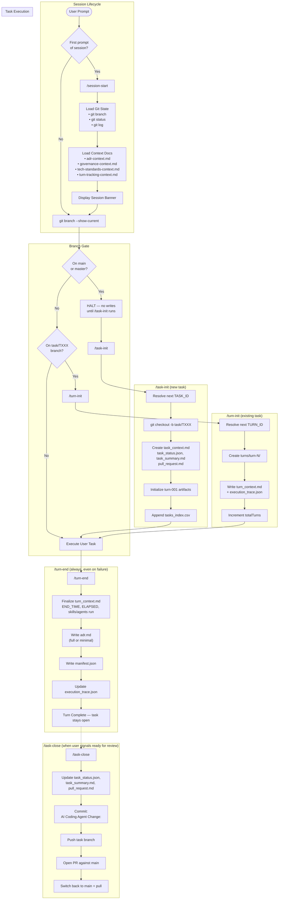

# coding-agents-config

Agentic pipeline configuration for Claude Code and Codex. Enforces a task/turn-based workflow with provenance tracking, branch protection, and governance rules, plus the App Factory (`af-*`) skill set for spec-to-code generation.

## Setup

### 1. Clone the repo

```sh
git clone <repo-url> ~/coding-agents-config
```

### 2. Create symlinks (automated)

Run the setup script — it creates all symlinks and backs up any existing files:

```sh
bash scripts/setup.sh
```

<details>
<summary>Manual symlink commands</summary>

```sh
# ~/.claude/
ln -s ~/coding-agents-config/skills    ~/.claude/skills
ln -s ~/coding-agents-config/agents    ~/.claude/agents
ln -s ~/coding-agents-config/hooks     ~/.claude/hooks
ln -s ~/coding-agents-config/scripts   ~/.claude/scripts
ln -s ~/coding-agents-config/CLAUDE.md ~/.claude/CLAUDE.md
ln -s ~/coding-agents-config/settings.json ~/.claude/settings.json

# ~/.codex/
ln -s ~/coding-agents-config/agents   ~/.codex/agents
ln -s ~/coding-agents-config/AGENTS.md ~/.codex/AGENTS.md

# repo-local ./.claude/
ln -s ~/coding-agents-config/CLAUDE.md ./.claude/CLAUDE.md
```

If any of these already exist, `scripts/setup.sh` backs them up automatically (`mv <target> <target>.bak`).
</details>

### 3. Verify

```sh
ls -la ~/.claude/skills        # should point to ~/coding-agents-config/skills
ls -la ~/.claude/agents        # should point to ~/coding-agents-config/agents
ls -la ~/.claude/hooks         # should point to ~/coding-agents-config/hooks
ls -la ~/.claude/CLAUDE.md     # should point to ~/coding-agents-config/CLAUDE.md
ls -la ~/.claude/settings.json # should point to ~/coding-agents-config/settings.json
```

## Structure

```
coding-agents-config/
├── CLAUDE.md            # Global instructions — turn protocol, branch rules
├── AGENTS.md             # Codex loader directive (points at CLAUDE.md)
├── settings.json         # Claude Code settings (model, permissions, hooks)
├── package.json          # npm dependency for skills (caveman templating)
├── agents/                # Reusable agent definitions
│   └── agent-architecture-planner.md
├── hooks/                 # Shell hooks triggered by Claude Code events
│   └── branch-guard.sh    # Auto-creates a task branch when on main/master
├── skills/                # Slash-command skills
│   ├── session-start/     # Load git state + pipeline context at session start
│   ├── task-init/         # Create task branch + task/turn-001 artifacts
│   ├── turn-init/         # Create the next turn's artifacts on a task branch
│   ├── turn-end/          # Finalize a turn (ADR, manifest, trace)
│   ├── task-close/        # Push task branch, open PR, return to main
│   ├── branch-guard/       # Legacy turn-branch guard
│   ├── af-orchestrator/    # Orchestrates the App Factory SDLC
│   ├── af-project-init/    # Initialize an AppFactory project
│   ├── af-memory/          # CRUD for .appfactory/ pipeline state (state.yaml)
│   ├── af-app-check/       # Production-readiness audit
│   ├── af-be-prd-build/    # Draft a backend PRD from an intake worksheet
│   ├── af-be-ddd-build/    # PRD → Domain-Driven Design document
│   ├── af-be-ddd-analysis/ # Audit a DDD document for gaps/risks
│   ├── af-be-ddd-refactor/ # Apply DDD analysis findings
│   ├── af-be-ddd-dsl/      # DDD document → domain DSL YAML
│   ├── af-be-ddd-orchestrator/ # Build/analyze/refactor/test loop for DDD
│   ├── af-be-ddd-tests/    # DDD + PRD → Gherkin BDD feature files
│   ├── af-be-plan/         # Domain DSL + tech stack → execution plan
│   ├── af-be-implementation/ # Execution plan + BDD specs → generated backend code
│   ├── dsl-utils/dsl-model-interpreter/    # Parse/validate app-dsl YAML
│   ├── e2e-tests/http-test-artifacts/      # Generate .http request files
│   ├── ui-utils/ui-implementation-language/# Declarative UI YAML language spec
│   ├── unit-tests/test-implementation-sync/# Keep unit tests aligned with code
│   ├── eval-labeler/       # Label/compare model responses in eval runs
│   └── .system/            # Meta-skills (skill-creator, skill-installer, plugin-creator, imagegen, openai-docs)
├── scripts/                # Automation scripts
│   ├── setup.sh            # Create ~/.claude and ~/.codex symlinks
│   └── af-state.sh         # Helper for AppFactory state management
├── .appfactory/             # Task/turn tracking, specs, prompts, memory
│   ├── tasks/               # task-XXX/ directories with turns/turn-XXX/ artifacts
│   ├── tasks_index.csv      # Registry of all tasks and their status
│   ├── specs/               # Generated specs (PRD, DDD, DSL, plans)
│   ├── prompts/             # Prompt templates
│   └── memory/              # Project memory (state.yaml)
├── archive/                 # Deprecated/superseded skills, kept for reference
├── docs/                    # Reference documentation and migration notes
└── .github/                 # PR and issue templates
```

## Execution Flow

The agentic pipeline enforces a task/turn workflow for all coding tasks, driven by `CLAUDE.md`:


```mermaid
flowchart TB
    subgraph SESSION["Session Lifecycle"]
        START([User Prompt]) --> SS{First prompt<br/>of session?}
        SS -->|Yes| SESSION_START["/session-start"]
        SS -->|No| BRANCH_CHECK

        SESSION_START --> LOAD_GIT["Load Git State<br/>• git branch<br/>• git status<br/>• git log"]
        LOAD_GIT --> LOAD_CTX["Load Context Docs<br/>• adr-context.md<br/>• governance-context.md<br/>• tech-standards-context.md<br/>• turn-tracking-context.md"]
        LOAD_CTX --> BANNER["Display Session Banner"]
        BANNER --> BRANCH_CHECK
    end

    subgraph BRANCH_GATE["Branch Gate"]
        BRANCH_CHECK["git branch --show-current"] --> IS_MAIN{On main<br/>or master?}
        IS_MAIN -->|Yes| HALT["HALT — no writes<br/>until /task-init runs"]
        HALT --> TASK_INIT
        IS_MAIN -->|No| IS_TASK{On task/TXXX<br/>branch?}
        IS_TASK -->|Yes| TURN_INIT
        IS_TASK -->|No| EXEC
    end

    subgraph TASK["/task-init (new task)"]
        TASK_INIT["/task-init"] --> RESOLVE_TASK["Resolve next TASK_ID"]
        RESOLVE_TASK --> NEW_BRANCH["git checkout -b task/TXXX"]
        NEW_BRANCH --> TASK_ARTIFACTS["Create task_context.md<br/>task_status.json, task_summary.md<br/>pull_request.md"]
        TASK_ARTIFACTS --> FIRST_TURN["Initialize turn-001 artifacts"]
        FIRST_TURN --> INDEX["Append tasks_index.csv"]
    end

    subgraph TURN["/turn-init (existing task)"]
        TURN_INIT["/turn-init"] --> RESOLVE_TURN["Resolve next TURN_ID"]
        RESOLVE_TURN --> TURN_DIR["Create turns/turn-N/"]
        TURN_DIR --> TURN_CTX["Write turn_context.md<br/>+ execution_trace.json"]
        TURN_CTX --> BUMP_TOTAL["Increment totalTurns"]
    end

    INDEX --> EXEC
    BUMP_TOTAL --> EXEC

    subgraph EXECUTION["Task Execution"]
        EXEC["Execute User Task"]
    end

    subgraph POST_EXEC["/turn-end (always, even on failure)"]
        EXEC --> TURN_END["/turn-end"]
        TURN_END --> FINALIZE_CTX["Finalize turn_context.md<br/>END_TIME, ELAPSED, skills/agents run"]
        FINALIZE_CTX --> WRITE_ADR["Write adr.md<br/>(full or minimal)"]
        WRITE_ADR --> WRITE_MANIFEST["Write manifest.json"]
        WRITE_MANIFEST --> UPDATE_TRACE["Update execution_trace.json"]
        UPDATE_TRACE --> COMPLETE["Turn Complete — task stays open"]
    end

    subgraph CLOSE["/task-close (when user signals ready for review)"]
        COMPLETE -.-> TASK_CLOSE["/task-close"]
        TASK_CLOSE --> UPDATE_TASK["Update task_status.json,<br/>task_summary.md, pull_request.md"]
        UPDATE_TASK --> COMMIT["Commit:<br/>AI Coding Agent Change:"]
        COMMIT --> PUSH["Push task branch"]
        PUSH --> PR["Open PR against main"]
        PR --> RETURN_MAIN["Switch back to main + pull"]
    end
```

### Turn Protocol Summary

| Phase | Skill | Trigger | Outputs |
|-------|-------|---------|---------|
| **Session Start** | `session-start` | First prompt of the session | Git state + 4 context docs loaded |
| **Task Init** | `task-init` | Current branch is `main`/`master` | `task/TXXX` branch, task artifacts, `turn-001` |
| **Turn Init** | `turn-init` | Current branch is `task/TXXX` | New `turn-XXX/` with `turn_context.md`, `execution_trace.json` |
| **Execution** | — | Every coding prompt | Modified files |
| **Turn End** | `turn-end` | After every prompt, even on failure | `adr.md`, `manifest.json`, updated trace/context |
| **Task Close** | `task-close` | User signals task ready for review | Commit, push, PR against `main`, back to `main` |

## Skills

### Pipeline Governance

| Skill | Description |
|-------|-------------|
| `session-start` | Load repository state and core pipeline context at the start of a session |
| `task-init` | Create a task branch and initialize task + turn-001 artifacts (runs on `main`/`master`) |
| `turn-init` | Initialize the next turn's artifacts within the active task branch |
| `turn-end` | Finalize the active turn — ADR, manifest, execution trace |
| `task-close` | Finalize the task branch, push it, and open a PR against `main` |
| `branch-guard` | Legacy guard that creates a `turn/T<id>` branch if on `main`/`master` |

### App Factory (`af-*`)

| Skill | Description |
|-------|-------------|
| `af-orchestrator` | Orchestrates the App Factory software development lifecycle |
| `af-project-init` | Orchestrate AppFactory project initialization (env vars + helper script) |
| `af-memory` | CRUD operations on `.appfactory/memory/state.yaml` pipeline state |
| `af-app-check` | Audit an application for production readiness (security, DB, deploy, code quality) |
| `af-be-prd-build` | Build a backend PRD from a completed intake worksheet |
| `af-be-ddd-build` | Generate a backend Domain-Driven Design document from an approved PRD |
| `af-be-ddd-analysis` | Audit a DDD document for completeness and PRD alignment |
| `af-be-ddd-refactor` | Apply `af-be-ddd-analysis` findings to patch the DDD document |
| `af-be-ddd-dsl` | Generate a backend domain DSL YAML from the DDD document |
| `af-be-ddd-orchestrator` | Run the build → analyze → refactor → test loop for DDD |
| `af-be-ddd-tests` | Generate Gherkin BDD feature files from DDD + PRD specs |
| `af-be-plan` | Generate a backend execution plan from a domain DSL and tech stack profile |
| `af-be-implementation` | Generate backend code from the execution plan and BDD feature specs |

### Utilities

| Skill | Description |
|-------|-------------|
| `dsl-utils/dsl-model-interpreter` | Parse and validate app-dsl YAML specifications |
| `e2e-tests/http-test-artifacts` | Generate `.http` request files for API endpoint testing |
| `ui-utils/ui-implementation-language` | Declarative YAML language for framework-neutral UI definitions |
| `unit-tests/test-implementation-sync` | Keep unit tests synchronized with service/DTO implementations |
| `eval-labeler` | Label and compare model responses (Response A vs B) in eval run directories |

### Meta-Skills (`.system/`)

| Skill | Description |
|-------|-------------|
| `skill-creator` | Guide for creating and updating skills |
| `skill-installer` | Install skills from a curated list or a GitHub repo |
| `plugin-creator` | Scaffold plugin directories with `.codex-plugin/plugin.json` |
| `imagegen` | Generate or edit raster images |
| `openai-docs` | Look up OpenAI product/API documentation |

## Templates

Task/turn templates live alongside the skills that use them rather than in a shared top-level folder:

| Template | Location | Purpose |
|----------|----------|---------|
| `task_context.md` | `skills/task-init/templates/` | Task context scaffold used by `/task-init` |
| `turn_context.md` | `skills/task-init/templates/`, `skills/turn-init/templates/` | Turn context scaffold used by `/task-init` and `/turn-init` |

`.github/PULL_REQUEST_TEMPLATE.md` and the `.github/ISSUE_TEMPLATE/` files provide the PR/issue templates used when opening GitHub pull requests and issues.

## Hooks

| Hook | Trigger | Purpose |
|------|---------|---------|
| `branch-guard.sh` | `PreToolUse(Bash)` | If on `main`/`master`, auto-creates and switches to the next `task/TXXX` branch instead of blocking |

## Archive

`archive/` holds skills and templates that were superseded by the current App Factory / task-turn pipeline (e.g. `schema-to-database`, `nestjs-crud-resource`, `legacy-turns`, `templates`). See `archive/README.md` and `archive/SUMMARY.md` for what moved and why.

## Adding a new skill

Each skill lives in its own directory under `skills/` with a `SKILL.md` file:

```
skills/my-skill/
└── SKILL.md
```

The `.system/skill-creator` meta-skill can guide you through creating one — invoke it from Claude Code.

## Syncing across machines

Since this is a standard git repo, pull on any machine to stay current:

```sh
cd ~/coding-agents-config && git pull
```

The symlinks mean changes are picked up immediately — no reinstall needed.
