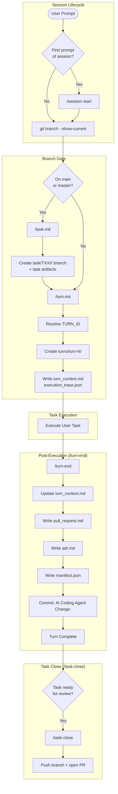

# coding-agents-config

Agentic pipeline configuration for Claude Code. Enforces a turn-based workflow with provenance tracking, branch protection, and governance rules. Includes the full **App Factory** skill suite for AI-driven backend application generation.

## Setup

### 1. Clone the repo

```sh
git clone <repo-url> ~/coding-agents-config
```

### 2. Create symlinks (automated)

Run the setup script — it creates all symlinks and backs up any existing files:

```sh
bash scripts/setup.sh
```

The script links into both `~/.claude/` (Claude Code) and `~/.codex/` (Codex):

| Destination | Items linked |
|-------------|-------------|
| `~/.claude/` | `skills`, `agents`, `rules`, `hooks`, `context`, `scripts`, `plugins`, `CLAUDE.md`, `settings.json` |
| `~/.codex/` | `agents`, `AGENTS.md` |
| `./.claude/` | `CLAUDE.md` (repo-local) |

<details>
<summary>Manual symlink commands</summary>

```sh
# Claude Code
ln -s ~/coding-agents-config/skills ~/.claude/skills
ln -s ~/coding-agents-config/agents ~/.claude/agents
ln -s ~/coding-agents-config/hooks ~/.claude/hooks
ln -s ~/coding-agents-config/scripts ~/.claude/scripts
ln -s ~/coding-agents-config/CLAUDE.md ~/.claude/CLAUDE.md
ln -s ~/coding-agents-config/settings.json ~/.claude/settings.json

# Codex
ln -s ~/coding-agents-config/agents ~/.codex/agents
ln -s ~/coding-agents-config/AGENTS.md ~/.codex/AGENTS.md
```

If any target already exists, back it up first (`mv <target> <target>.bak`).
</details>

### 3. Verify

```sh
ls -la ~/.claude/skills        # should point to ~/coding-agents-config/skills
ls -la ~/.claude/hooks         # should point to ~/coding-agents-config/hooks
ls -la ~/.claude/CLAUDE.md     # should point to ~/coding-agents-config/CLAUDE.md
ls -la ~/.claude/settings.json # should point to ~/coding-agents-config/settings.json
```

## Structure

```
coding-agents-config/
├── CLAUDE.md           # Global instructions — turn protocol, branch rules
├── AGENTS.md           # Agent loader directive
├── settings.json       # Claude Code settings (model, permissions, hooks, voice)
├── hooks/              # Shell hooks triggered by Claude Code events
│   └── branch-guard.sh # Blocks edits on main/master
├── skills/             # Slash-command skills (see Skills section below)
├── agents/             # Agent definition files
│   └── agent-architecture-planner.md
├── scripts/            # Automation scripts
│   ├── setup.sh        # Symlink installer
│   └── af-state.sh     # AppFactory state management utilities
├── docs/               # Reference documentation
│   ├── skill-summary.md
│   ├── app-nextjs-nestjs-prisma.md
│   └── appFactory-plan.md
├── .appfactory/        # Task/turn tracking and pipeline specs
│   ├── tasks/          # Task branches with turns
│   ├── specs/          # Specifications
│   ├── prompts/        # Prompt templates
│   └── memory/         # Project memory and state
└── archive/            # Retired/legacy skills
```

## Execution Flow

The agentic pipeline enforces a strict turn-based workflow for all coding tasks:


```mermaid
flowchart TB
    subgraph SESSION["Session Lifecycle"]
        START([User Prompt]) --> SS{First prompt<br/>of session?}
        SS -->|Yes| SESSION_START["/session-start"]
        SS -->|No| BRANCH_CHECK
        SESSION_START --> BRANCH_CHECK["git branch --show-current"]
    end

    subgraph BRANCH_GATE["Branch Gate"]
        BRANCH_CHECK --> IS_MAIN{On main<br/>or master?}
        IS_MAIN -->|Yes| TASK_INIT["/task-init"]
        TASK_INIT --> CREATE_TASK["Create task/TXXX branch<br/>+ task artifacts"]
        CREATE_TASK --> TURN_INIT
        IS_MAIN -->|No| TURN_INIT["/turn-init"]
        TURN_INIT --> RESOLVE_ID["Resolve TURN_ID"]
        RESOLVE_ID --> CREATE_DIR["Create turns/turn-N/"]
        CREATE_DIR --> WRITE_ARTIFACTS["Write turn_context.md<br/>execution_trace.json"]
    end

    subgraph EXECUTION["Task Execution"]
        WRITE_ARTIFACTS --> EXEC["Execute User Task"]
    end

    subgraph POST_EXEC["Post-Execution (/turn-end)"]
        EXEC --> TURN_END["/turn-end"]
        TURN_END --> UPDATE_CTX["Update turn_context.md"]
        UPDATE_CTX --> WRITE_PR["Write pull_request.md"]
        WRITE_PR --> WRITE_ADR["Write adr.md"]
        WRITE_ADR --> WRITE_MANIFEST["Write manifest.json"]
        WRITE_MANIFEST --> COMMIT["Commit: AI Coding Agent Change:"]
        COMMIT --> COMPLETE["Turn Complete"]
    end

    subgraph TASK_CLOSE["Task Close (/task-close)"]
        COMPLETE --> USER{Task ready<br/>for review?}
        USER -->|Yes| TASK_CLOSE_SKILL["/task-close"]
        TASK_CLOSE_SKILL --> PUSH["Push branch + open PR"]
    end
```

### Turn Protocol Summary

| Phase | Steps | Outputs |
|-------|-------|---------|
| **Session Start** | Load git state → Load context | Context ready |
| **Branch Gate** | Check branch → HALT if main → `/task-init` | `task/TXXX` branch |
| **Turn Init** | Resolve ID → Create dir → Write artifacts | `turn_context.md`, `execution_trace.json` |
| **Execution** | Execute task | Modified files |
| **Turn End** | Update context → PR → ADR → Manifest → Commit | 4 artifacts complete |
| **Task Close** | Push branch → Open PR | Pull request |

## Skills

### Turn & Session Management

| Skill | Description |
|-------|-------------|
| `session-start` | Load repository state and pipeline context. Run at the start of every session. |
| `task-init` | Initialize a new `task/TXXX` branch and create task + first turn artifacts. Run when on main/master. |
| `task-close` | Finalize the active task branch, push it, and open a pull request. |
| `turn-init` | Initialize the next turn within an active task branch. |
| `turn-end` | Finalize the active turn — write artifacts, commit. Run after every coding prompt. |
| `branch-guard` | Create a task-scoped branch if on main/master. |

### App Factory Pipeline

The `af-*` skills implement a full AI-driven backend SDLC pipeline:

| # | Skill | Phase | Description |
|---|-------|-------|-------------|
| 1 | `af-orchestrator` | Orchestration | Top-level orchestrator for the full App Factory SDLC |
| 2 | `af-project-init` | Initialization | Export env vars and initialize the project |
| 3 | `af-be-prd-build` | Requirements | Build a backend PRD from worksheets or discovery notes |
| 4 | `af-be-ddd-orchestrator` | DDD | Orchestrate DDD workflow: build → analyze → refactor loop |
| 5 | `af-be-ddd-build` | DDD | Generate human-readable DDD document from approved PRD |
| 6 | `af-be-ddd-analysis` | DDD | Analyze DDD spec for quality and PRD alignment |
| 7 | `af-be-ddd-refactor` | DDD | Refactor DDD based on analysis findings |
| 8 | `af-be-ddd-tests` | Testing | Generate Gherkin/BDD scenarios from DDD and PRD |
| 9 | `af-be-plan` | Planning | Generate a backend execution plan from DDD + tech stack profile |
| 10 | `af-be-ddd-dsl` | DSL | Generate a backend DSL YAML from the DDD document |
| 11 | `af-be-implementation` | Implementation | Execute backend generation from tech stack implementation + DSL |
| 12 | `af-app-check` | Validation | Audit application for production readiness |
| 13 | `af-memory` | Utility | CRUD operations for `.appfactory/memory/state.yaml` |

### Testing & Utility

| Skill | Description |
|-------|-------------|
| `unit-tests` | Unit test generation and execution |
| `e2e-tests` | End-to-end test utilities |
| `eval-labeler` | Evaluate and label model responses (A vs B comparison) |
| `ui-utils` | UI helper utilities |
| `dsl-utils` | DSL helper utilities |

### Meta-Skills (.system)

| Skill | Description |
|-------|-------------|
| `skill-creator` | Create new skills with SKILL.md |
| `skill-installer` | Install skills from marketplaces |

## App Factory Pipeline

The App Factory (`af-*`) pipeline generates production-ready backend applications through a structured SDLC:

```
PRD → DDD Spec → DSL YAML → Execution Plan → Code Generation → Validation
```

State is tracked in `.appfactory/memory/state.yaml` via `af-memory` and the `scripts/af-state.sh` utility library.

### Environment Variables

| Variable | Description |
|----------|-------------|
| `AF_ROOT` | App Factory home directory (`~/gallery/app-factory`) |
| `AF_GITHUB_PROFILE` | GitHub username |
| `AF_GENERATED_PROJECT_ROOT` | Output directory for generated apps (`~/generated-apps`) |
| `AF_TECH_STACK_DSL` | Tech stack profile definitions |
| `AF_TECH_STACK_IMPLEMENTATIONS` | Tech stack implementation templates |

## Hooks

| Hook | Trigger | Purpose |
|------|---------|---------|
| `branch-guard.sh` | `PreToolUse(Bash)` | Block edits on main/master |

## Settings

`settings.json` configures Claude Code globally:

- **Model**: `claude-opus-4-5` (primary), `claude-sonnet-4-6` (fast/small tasks)
- **Permissions**: Pre-approved commands for git, npm/pnpm, docker, psql, jq, and standard shell utilities
- **Voice**: Enabled in hold mode
- **Status line**: Custom status command via `~/.claude/statusline-command.sh`
- **Plugins**: `document-skills`, `example-skills` (anthropic-agent-skills marketplace), `caveman`
- **Marketplaces**: `anthropic-agent-skills` (github:anthropics/skills), `caveman` (github:JuliusBrussee/caveman)

## Adding a New Skill

Each skill lives in its own directory under `skills/` with a `SKILL.md` file:

```
skills/my-skill/
└── SKILL.md
```

Use the `.system/skill-creator` meta-skill to scaffold a new skill, or copy an existing one as a template.

## Syncing Across Machines

Since this is a standard git repo, pull on any machine to stay current:

```sh
cd ~/coding-agents-config && git pull
```

The symlinks pick up changes immediately — no reinstall needed.
