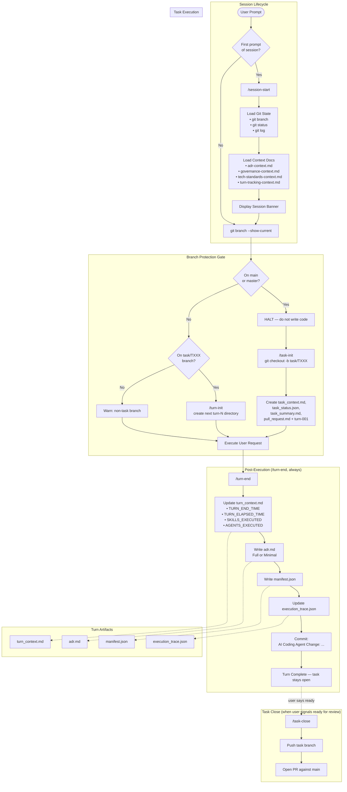

# coding-agents-config

Agentic pipeline configuration for Claude Code (and Codex). Enforces a task/turn-based workflow with provenance tracking, branch protection, and governance rules, plus an "App Factory" skill pipeline for generating full-stack applications from specs.

## Setup

### 1. Clone the repo

```sh
git clone <repo-url> ~/coding-agents-config
```

### 2. Create symlinks (automated)

Run the setup script — it creates all symlinks and backs up any existing files:

```sh
bash scripts/setup.sh
```

It links the following into `~/.claude/`: `skills`, `agents`, `hooks`, `scripts`, `CLAUDE.md`, `settings.json` (plus `rules`, `context`, `plugins` if present); into `~/.codex/`: `agents`, `AGENTS.md`; and `CLAUDE.md` into a repo-local `./.claude/` directory.

<details>
<summary>Manual symlink commands</summary>

```sh
ln -s ~/coding-agents-config/skills ~/.claude/skills
ln -s ~/coding-agents-config/agents ~/.claude/agents
ln -s ~/coding-agents-config/hooks ~/.claude/hooks
ln -s ~/coding-agents-config/scripts ~/.claude/scripts
ln -s ~/coding-agents-config/CLAUDE.md ~/.claude/CLAUDE.md
ln -s ~/coding-agents-config/settings.json ~/.claude/settings.json
ln -s ~/coding-agents-config/agents ~/.codex/agents
ln -s ~/coding-agents-config/AGENTS.md ~/.codex/AGENTS.md
```

If any of these already exist, back them up first (`mv <target> <target>.bak`).
</details>

### 3. Verify

```sh
ls -la ~/.claude/skills        # should point to ~/coding-agents-config/skills
ls -la ~/.claude/hooks         # should point to ~/coding-agents-config/hooks
ls -la ~/.claude/CLAUDE.md     # should point to ~/coding-agents-config/CLAUDE.md
ls -la ~/.claude/settings.json # should point to ~/coding-agents-config/settings.json
ls -la ~/.codex/AGENTS.md      # should point to ~/coding-agents-config/AGENTS.md
```

## Structure

```
coding-agents-config/
├── CLAUDE.md            # Global instructions — task/turn protocol, branch rules
├── AGENTS.md            # Codex loader directive — points at CLAUDE.md
├── settings.json        # Claude Code settings (model, permissions, hooks, plugins)
├── package.json         # Declares the `caveman` plugin dependency
├── hooks/               # Shell hooks triggered by Claude Code events
│   └── branch-guard.sh  # PreToolUse hook — auto-creates a task/TXXX branch if on main/master
├── agents/               # Standalone subagent definitions (e.g. agent-architecture-planner.md)
├── skills/               # Slash-command skills
│   ├── session-start/    # Load repo state + governance/ADR/tech-standards context
│   ├── task-init/        # Create task/TXXX branch + task_context + turn-001 (run on main/master)
│   ├── turn-init/        # Create the next turn directory within the active task
│   ├── turn-end/         # Finalize a turn: ADR, manifest, execution trace
│   ├── task-close/       # Push the task branch and open a PR against main
│   ├── branch-guard/     # Turn-scoped branch guard helper
│   ├── af-orchestrator/       # Orchestrates the full App Factory SDLC
│   ├── af-project-init/       # Bootstraps a new App Factory project
│   ├── af-be-prd-build/       # Business-facing backend PRD generation
│   ├── af-be-ddd-build/       # PRD → backend Domain-Driven Design document
│   ├── af-be-ddd-dsl/         # DDD document → backend DSL YAML
│   ├── af-be-ddd-analysis/    # Audits a generated DDD spec for gaps/risks
│   ├── af-be-ddd-refactor/    # Applies DDD analysis findings back into the spec
│   ├── af-be-ddd-orchestrator/# Runs the DDD build → analyze → refactor → test loop
│   ├── af-be-ddd-tests/       # DDD/PRD → Gherkin BDD feature files
│   ├── af-be-plan/            # DSL + tech stack profile → backend execution plan
│   ├── af-be-implementation/  # Execution plan + BDD specs → generated backend code
│   ├── af-app-check/          # Production-readiness audit (security, DB, deploy, quality)
│   ├── af-memory/             # CRUD over .appfactory/state.yaml pipeline state
│   ├── eval-labeler/           # Labels/compares Response A vs Response B eval runs
│   ├── dsl-utils/dsl-model-interpreter/     # Parses and validates app-dsl YAML
│   ├── e2e-tests/http-test-artifacts/       # Generates .http request files
│   ├── ui-utils/ui-implementation-language/ # UI implementation language helper
│   ├── unit-tests/test-implementation-sync/ # Keeps unit tests in sync with implementation
│   ├── .nestjs/           # NestJS/Prisma codegen skills (app-from-dsl, nestjs-crud-resource,
│   │                      #   nestjs-prisma-resource, nestjs-customer-crud-scaffold,
│   │                      #   nestjs-observability, field-mapper-generator, prisma/*)
│   └── .system/           # Meta-skills (skill-creator, skill-installer, plugin-creator,
│                          #   imagegen, openai-docs)
├── docs/                 # Reference docs and repo analyses
├── archive/              # Retired/superseded skills and shared templates, kept for reference
├── .github/              # Issue and PR templates
└── .appfactory/          # Task/turn tracking, specs, prompts, memory
    ├── tasks/             # task-XXX/ directories, each with turns/turn-XXX/
    ├── tasks_index.csv    # Registry of all tasks (branch, status, PR URL, turn count)
    ├── changelog.md       # Reconstructed history of what each turn actually changed
    ├── specs/             # Specifications
    ├── prompts/           # Prompt templates
    └── memory/             # Project memory
```

Templates now live inside the skill that owns them (e.g. `skills/task-init/templates/task_context.md`, `skills/af-be-plan/templates/execution-plan-template.md`) rather than in a shared top-level `templates/` directory. The earlier shared template set (`adr_template.md`, `pull_request_template.md`, `manifest.schema.json`, `metadata_header.txt`, `branch_naming.md`, `commit_message.md`, `tech-stack.template.md`) has been moved to `archive/templates/`.

## Execution Flow

The agentic pipeline enforces a strict task/turn workflow for all coding tasks:


```mermaid
flowchart TB
    subgraph SESSION["Session Lifecycle"]
        START([User Prompt]) --> SS{First prompt<br/>of session?}
        SS -->|Yes| SESSION_START["/session-start"]
        SS -->|No| BRANCH_CHECK
        SESSION_START --> LOAD_GIT["Load Git State<br/>• git branch<br/>• git status<br/>• git log"]
        LOAD_GIT --> LOAD_CTX["Load Context Docs<br/>• adr-context.md<br/>• governance-context.md<br/>• tech-standards-context.md<br/>• turn-tracking-context.md"]
        LOAD_CTX --> BANNER["Display Session Banner"]
        BANNER --> BRANCH_CHECK
    end

    subgraph BRANCH_GATE["Branch Protection Gate"]
        BRANCH_CHECK["git branch --show-current"] --> IS_MAIN{On main<br/>or master?}
        IS_MAIN -->|Yes| HALT["HALT — do not write code"]
        HALT --> TASK_INIT["/task-init<br/>git checkout -b task/TXXX"]
        TASK_INIT --> INIT_TASK_DIR["Create task_context.md,<br/>task_status.json,<br/>task_summary.md,<br/>pull_request.md + turn-001"]
        IS_MAIN -->|No| IS_TASK{On task/TXXX<br/>branch?}
        IS_TASK -->|Yes| TURN_INIT["/turn-init<br/>create next turn-N directory"]
        IS_TASK -->|No| WARN["Warn: non-task branch"]
        WARN --> EXEC
        TURN_INIT --> EXEC
        INIT_TASK_DIR --> EXEC
    end

    subgraph EXECUTION["Task Execution"]
        EXEC["Execute User Request"]
    end

    subgraph POST_EXEC["Post-Execution (/turn-end, always)"]
        EXEC --> TURN_END["/turn-end"]
        TURN_END --> UPDATE_CTX["Update turn_context.md<br/>• TURN_END_TIME<br/>• TURN_ELAPSED_TIME<br/>• SKILLS_EXECUTED<br/>• AGENTS_EXECUTED"]
        UPDATE_CTX --> WRITE_ADR["Write adr.md<br/>Full or Minimal"]
        WRITE_ADR --> WRITE_MANIFEST["Write manifest.json"]
        WRITE_MANIFEST --> UPDATE_TRACE["Update execution_trace.json"]
        UPDATE_TRACE --> COMMIT["Commit:<br/>AI Coding Agent Change: ..."]
        COMMIT --> COMPLETE["Turn Complete — task stays open"]
    end

    subgraph TASK_CLOSE_FLOW["Task Close (when user signals ready for review)"]
        COMPLETE -.->|user says ready| TASK_CLOSE["/task-close"]
        TASK_CLOSE --> PUSH["Push task branch"]
        PUSH --> OPEN_PR["Open PR against main"]
    end

    subgraph ARTIFACTS["Turn Artifacts"]
        direction LR
        A1["turn_context.md"]
        A2["execution_trace.json"]
        A3["adr.md"]
        A4["manifest.json"]
    end

    UPDATE_CTX -.-> A1
    UPDATE_TRACE -.-> A2
    WRITE_ADR -.-> A3
    WRITE_MANIFEST -.-> A4
```

As a backstop, the `hooks/branch-guard.sh` PreToolUse hook auto-creates the next `task/TXXX` branch if a write or Bash tool is invoked while still on `main`/`master`.

### Task/Turn Protocol Summary

| Phase | Trigger | Steps | Outputs |
|-------|---------|-------|---------|
| **Session Start** | First prompt of session | Load git state → load 4 context docs → display banner | Context loaded |
| **Task Init** | Branch is `main`/`master` | Resolve task id → create `task/TXXX` → scaffold task dir + turn-001 | `task_context.md`, `task_status.json`, `task_summary.md`, `pull_request.md` |
| **Turn Init** | Branch is `task/TXXX` | Resolve next turn id → create `turn-N` directory | `turn_context.md`, `execution_trace.json` |
| **Execution** | Every prompt | Execute the user's request | Modified files |
| **Turn End** | After every execution, even on failure | Update turn context → write ADR + manifest → update trace → commit | 4 turn artifacts complete |
| **Task Close** | User signals task is ready for review | Push branch → open PR against main | Open pull request |

## Skills

Skills live under `skills/`, one directory per skill (or nested one level deeper for grouped categories like `.nestjs/`, `.system/`, `dsl-utils/`, `e2e-tests/`, `ui-utils/`, `unit-tests/`). Each has a `SKILL.md` with frontmatter (`name`, `description`) and instructions.

| Category | Skill | Description |
|----------|-------|--------------|
| **Lifecycle** | `session-start` | Load repository state and core pipeline context at session start |
| | `task-init` | Initialize a new task branch (`task/TXXX`) and create task + turn-001 artifacts |
| | `turn-init` | Initialize the next turn within the active task branch |
| | `turn-end` | Finalize the active turn: ADR, manifest, execution trace |
| | `task-close` | Finalize the active task branch, push it, and open a PR against main |
| | `branch-guard` | Create a turn-scoped branch if on main/master |
| **App Factory — pipeline** | `af-orchestrator` | Orchestrates the full App Factory software development lifecycle |
| | `af-project-init` | Exports required env vars and bootstraps a new App Factory project |
| | `af-be-prd-build` | Builds a business-facing backend PRD from an intake worksheet |
| | `af-be-ddd-build` | Generates a backend DDD document from an approved PRD |
| | `af-be-ddd-dsl` | Generates a backend DSL YAML from a DDD document |
| | `af-be-ddd-analysis` | Audits a generated DDD spec for completeness, consistency, and gaps |
| | `af-be-ddd-refactor` | Applies `af-be-ddd-analysis` findings back into the DDD spec |
| | `af-be-ddd-orchestrator` | Runs the DDD build → analyze → refactor → test loop |
| | `af-be-ddd-tests` | Generates Gherkin BDD feature files from DDD + PRD specs |
| | `af-be-plan` | Generates a backend execution plan from DSL + tech stack profile |
| | `af-be-implementation` | Generates backend code from the execution plan and BDD specs |
| | `af-app-check` | Production-readiness audit — security, database, deployment, code quality |
| | `af-memory` | CRUD operations over `.appfactory/state.yaml` pipeline state |
| **Utility** | `eval-labeler` | Labels and compares Response A vs Response B model-eval runs |
| | `dsl-utils/dsl-model-interpreter` | Parses and validates `app-dsl/**/*.yaml` specifications |
| | `e2e-tests/http-test-artifacts` | Generates `.http` request files for REST clients |
| | `ui-utils/ui-implementation-language` | UI implementation language helper |
| | `unit-tests/test-implementation-sync` | Keeps unit tests in sync with implementation changes |
| **NestJS/Prisma codegen (`.nestjs/`)** | `app-from-dsl` | Orchestrates full-stack generation from `app-dsl` specs |
| | `nestjs-crud-resource` | Generates a NestJS CRUD module from a DSL backend spec |
| | `nestjs-prisma-resource` | Generates a full NestJS + Prisma CRUD resource from a schema |
| | `nestjs-customer-crud-scaffold` | Scaffolds a NestJS customer CRUD app via the Nest CLI |
| | `nestjs-observability` | Adds structured logging/observability to a Prisma-backed NestJS backend |
| | `field-mapper-generator` | Generates field mapper/converter utilities between layers |
| | `prisma/prisma-persistence` | Generates Prisma schema/migrations from a DSL persistence model |
| | `prisma/prisma-guidelines` | Prisma ORM guidelines and constraints reference |

### Meta-Skills (`.system/`)

| Skill | Description |
|-------|-------------|
| `skill-creator` | Guide for creating and updating skills |
| `skill-installer` | Install skills into `$CODEX_HOME/skills` from a curated list or GitHub repo |
| `plugin-creator` | Scaffold Codex plugin directories and marketplace entries |
| `imagegen` | Generate or edit raster images for the task at hand |
| `openai-docs` | Look up official OpenAI product/API documentation with citations |

## Hooks

| Hook | Trigger | Purpose |
|------|---------|---------|
| `branch-guard.sh` | PreToolUse (Bash/write tools) | Auto-creates the next `task/TXXX` branch if invoked while on `main`/`master` |

## Archive

`archive/` holds an earlier generation of DSL-first codegen skills (`app-from-dsl`, `dsl-model-interpreter`, `prisma-persistence`, `nestjs-crud-resource`, `field-mapper-generator`, `react-form-page`, `http-test-artifacts`, etc.) and the original shared `templates/` set, retired in favor of the App Factory (`af-*`) pipeline and per-skill templates. See `archive/README.md` and `archive/SUMMARY.md` for the taxonomy and lessons captured before retirement.

## Adding a new skill

Each skill lives in its own directory under `skills/` with a `SKILL.md` file:

```
skills/my-skill/
└── SKILL.md
```

The `.system/skill-creator` meta-skill can guide you through creating one — invoke it from Claude Code.

## Syncing across machines

Since this is a standard git repo, pull on any machine to stay current:

```sh
cd ~/coding-agents-config && git pull
```

The symlinks mean changes are picked up immediately — no reinstall needed.
