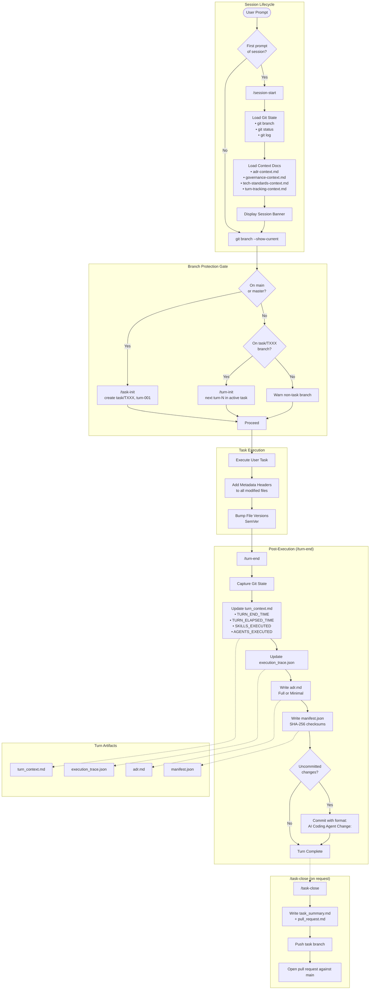

# coding-agents-config

Agentic pipeline configuration for Claude Code and Codex. Enforces turn-based workflow with provenance tracking, branch protection, and governance rules, plus the App Factory (`af-*`) skill suite for DSL-driven application generation.

## Setup

### 1. Clone the repo

```sh
git clone <repo-url> ~/coding-agents-config
```

### 2. Create symlinks (automated)

Run the setup script — it creates all symlinks and backs up any existing files:

```sh
bash scripts/setup.sh
```

<details>
<summary>Manual symlink commands</summary>

```sh
# Claude Code (~/.claude/)
ln -s ~/coding-agents-config/skills ~/.claude/skills
ln -s ~/coding-agents-config/agents ~/.claude/agents
ln -s ~/coding-agents-config/hooks ~/.claude/hooks
ln -s ~/coding-agents-config/scripts ~/.claude/scripts
ln -s ~/coding-agents-config/CLAUDE.md ~/.claude/CLAUDE.md
ln -s ~/coding-agents-config/settings.json ~/.claude/settings.json

# Codex (~/.codex/)
ln -s ~/coding-agents-config/agents ~/.codex/agents
ln -s ~/coding-agents-config/AGENTS.md ~/.codex/AGENTS.md
```

If any of these already exist, back them up first (`mv <target> <target>.bak`).
</details>

### 3. Verify

```sh
ls -la ~/.claude/skills        # should point to ~/coding-agents-config/skills
ls -la ~/.claude/agents        # should point to ~/coding-agents-config/agents
ls -la ~/.claude/hooks         # should point to ~/coding-agents-config/hooks
ls -la ~/.claude/CLAUDE.md     # should point to ~/coding-agents-config/CLAUDE.md
ls -la ~/.claude/settings.json # should point to ~/coding-agents-config/settings.json
ls -la ~/.codex/AGENTS.md      # should point to ~/coding-agents-config/AGENTS.md
```

`scripts/setup.sh` also links `rules`, `context`, and `plugins` into `~/.claude/` when those directories exist in the repo.

## Structure

```
coding-agents-config/
├── CLAUDE.md              # Global instructions — turn protocol, branch rules, container constants
├── AGENTS.md              # Codex loader directive (reads ~/.claude/CLAUDE.md)
├── settings.json           # Claude Code settings (model, env, permissions)
├── package.json            # Minimal Node dependency (caveman templating)
├── agents/                 # Standalone agent definitions
│   └── agent-architecture-planner.md
├── hooks/                  # Shell hooks triggered by Claude Code events
│   └── branch-guard.sh     # PreToolUse hook — auto-creates a task branch when on main/master
├── skills/                 # Slash-command skills
│   ├── .system/             # Meta-skills (skill-creator, skill-installer, plugin-creator, imagegen, openai-docs)
│   ├── session-start/       # Initialize session context
│   ├── task-init/           # Create a new task branch + turn-001 artifacts
│   ├── turn-init/           # Create the next turn directory and initial artifacts
│   ├── turn-end/            # Finalize turn with PR, ADR, manifest
│   ├── task-close/          # Push the task branch and open a pull request
│   ├── branch-guard/        # Create a turn branch if on main/master
│   ├── af-orchestrator/     # Orchestrate the App Factory SDLC end to end
│   ├── af-project-init/     # Export AppFactory env vars and initialize a project
│   ├── af-memory/           # CRUD on .appfactory/memory/state.yaml pipeline state
│   ├── af-be-prd-build/     # Build a backend PRD from an intake worksheet
│   ├── af-be-ddd-build/     # Generate a backend DDD document from an approved PRD
│   ├── af-be-ddd-analysis/  # Audit a DDD document for quality and PRD alignment
│   ├── af-be-ddd-refactor/  # Apply DDD analysis findings back into the DDD document
│   ├── af-be-ddd-orchestrator/ # Orchestrate the DDD build/analyze/refactor/test loop
│   ├── af-be-ddd-dsl/       # Generate a backend DSL YAML document from a DDD document
│   ├── af-be-ddd-tests/     # Generate Gherkin BDD feature files from DDD + PRD
│   ├── af-be-plan/          # Generate a backend execution plan from DSL + tech stack profile
│   ├── af-be-implementation/# Generate backend domain code from the plan and BDD specs
│   ├── af-app-check/        # Audit an app for production readiness before release
│   ├── dsl-utils/           # → dsl-model-interpreter: parse/validate app-dsl YAML
│   ├── e2e-tests/           # → http-test-artifacts: generate .http request files
│   ├── ui-utils/            # → ui-implementation-language: declarative UI YAML spec
│   ├── unit-tests/          # → test-implementation-sync: keep tests aligned with code
│   └── eval-labeler/        # Label/compare model-response evaluation runs
├── scripts/                 # Automation scripts
│   ├── setup.sh              # Symlink installer for Claude Code + Codex
│   └── af-state.sh           # Helpers for reading/writing .appfactory/memory/state.yaml
├── templates/                # Turn lifecycle templates (currently empty; see archive/templates)
├── .appfactory/               # Task/turn tracking and specs
│   ├── tasks/                  # Task branches with turns (task-001, task-002, ...)
│   ├── specs/                  # Specifications (PRD, DDD, DSL artifacts)
│   ├── prompts/                 # Prompt templates
│   ├── memory/                  # Project pipeline state (state.yaml)
│   ├── changelog.md             # Project changelog
│   └── tasks_index.csv          # Registry of all tasks and their status
├── docs/                     # Reference documentation (App Factory plan, migration notes, skill summaries)
├── .github/                   # PR template and issue templates (epic, task, bug)
└── archive/                   # Retired skills and templates kept for reference
```

## Execution Flow

The agentic pipeline enforces a strict turn-based workflow for all coding tasks:


```mermaid
flowchart TB
    subgraph SESSION["Session Lifecycle"]
        START([User Prompt]) --> SS{First prompt<br/>of session?}
        SS -->|Yes| SESSION_START["/session-start"]
        SS -->|No| BRANCH_CHECK

        SESSION_START --> LOAD_GIT["Load Git State<br/>• git branch<br/>• git status<br/>• git log"]
        LOAD_GIT --> LOAD_CTX["Load Context Docs<br/>• adr-context.md<br/>• governance-context.md<br/>• tech-standards-context.md<br/>• turn-tracking-context.md"]
        LOAD_CTX --> BANNER["Display Session Banner"]
        BANNER --> BRANCH_CHECK
    end

    subgraph BRANCH_GATE["Branch Protection Gate"]
        BRANCH_CHECK["git branch --show-current"] --> IS_MAIN{On main<br/>or master?}
        IS_MAIN -->|Yes| TASK_INIT["/task-init<br/>create task/TXXX, turn-001"]
        IS_MAIN -->|No| IS_TASK{On task/TXXX<br/>branch?}
        IS_TASK -->|Yes| TURN_INIT["/turn-init<br/>next turn-N in active task"]
        IS_TASK -->|No| WARN["Warn non-task branch"]
        TASK_INIT --> PROCEED
        TURN_INIT --> PROCEED
        WARN --> PROCEED
    end

    subgraph EXECUTION["Task Execution"]
        PROCEED["Proceed"] --> EXEC["Execute User Task"]
        EXEC --> ADD_HEADERS["Add Metadata Headers<br/>to all modified files"]
        ADD_HEADERS --> BUMP_VERSION["Bump File Versions<br/>SemVer"]
    end

    subgraph POST_EXEC["Post-Execution (/turn-end)"]
        BUMP_VERSION --> TURN_END["/turn-end"]
        TURN_END --> CAPTURE_GIT["Capture Git State"]
        CAPTURE_GIT --> UPDATE_CTX["Update turn_context.md<br/>• TURN_END_TIME<br/>• TURN_ELAPSED_TIME<br/>• SKILLS_EXECUTED<br/>• AGENTS_EXECUTED"]
        UPDATE_CTX --> UPDATE_TRACE["Update execution_trace.json"]
        UPDATE_TRACE --> WRITE_ADR["Write adr.md<br/>Full or Minimal"]
        WRITE_ADR --> WRITE_MANIFEST["Write manifest.json<br/>SHA-256 checksums"]
        WRITE_MANIFEST --> CHECK_UNCOMMITTED{Uncommitted<br/>changes?}
        CHECK_UNCOMMITTED -->|Yes| COMMIT["Commit with format:<br/>AI Coding Agent Change:"]
        CHECK_UNCOMMITTED -->|No| COMPLETE
        COMMIT --> COMPLETE["Turn Complete"]
    end

    subgraph TASK_CLOSE_FLOW["/task-close (on request)"]
        COMPLETE -.-> TASK_CLOSE["/task-close"]
        TASK_CLOSE --> WRITE_SUMMARY["Write task_summary.md<br/>+ pull_request.md"]
        WRITE_SUMMARY --> PUSH["Push task branch"]
        PUSH --> OPEN_PR["Open pull request against main"]
    end

    subgraph ARTIFACTS["Turn Artifacts"]
        direction LR
        A1["turn_context.md"]
        A2["execution_trace.json"]
        A3["adr.md"]
        A4["manifest.json"]
    end

    UPDATE_CTX -.-> A1
    UPDATE_TRACE -.-> A2
    WRITE_ADR -.-> A3
    WRITE_MANIFEST -.-> A4
```

### Turn Protocol Summary

| Phase | Steps | Outputs |
|-------|-------|---------|
| **Session Start** | Load git state → Load 4 context docs → Display banner | Context loaded |
| **Branch Gate** | Check branch → `/task-init` if main/master → `/turn-init` if on a task branch | Task/turn directories, safe branch |
| **Execution** | Execute task → Add headers → Bump versions | Modified files |
| **Turn End** | Update context → ADR → Manifest → Commit | 4 turn artifacts complete |
| **Task Close** | Task summary → PR description → Push → Open PR | `pull_request.md`, open PR |

## Skills

### Turn/Task Lifecycle

| Skill | Description |
|-------|-------------|
| `session-start` | Load repository state and core pipeline context at the start of every session |
| `task-init` | Initialize a new task branch and create task + turn-001 artifacts (run on main/master) |
| `turn-init` | Initialize the next turn within the active task branch |
| `turn-end` | Finalize the active turn after execution, even on failure |
| `task-close` | Finalize the active task branch, push it, and open a pull request against main |
| `branch-guard` | Create a turn-scoped branch if currently on main or master |

### App Factory (`af-*`) Pipeline

| Skill | Description |
|-------|-------------|
| `af-orchestrator` | Orchestrate the App Factory Software Development Lifecycle end to end |
| `af-project-init` | Export required environment variables and initialize an AppFactory project |
| `af-memory` | CRUD operations on `.appfactory/memory/state.yaml` pipeline state |
| `af-be-prd-build` | Build a backend-focused PRD from a completed intake worksheet |
| `af-be-ddd-build` | Generate a backend Domain-Driven Design document from an approved PRD |
| `af-be-ddd-analysis` | Audit a generated DDD document for quality, completeness, and PRD alignment |
| `af-be-ddd-refactor` | Apply `af-be-ddd-analysis` findings back into the DDD document |
| `af-be-ddd-orchestrator` | Orchestrate the DDD build → analyze → refactor loop → test workflow |
| `af-be-ddd-dsl` | Generate a backend application DSL YAML document from the DDD document |
| `af-be-ddd-tests` | Generate Gherkin BDD feature files from DDD and PRD specifications |
| `af-be-plan` | Generate a backend execution plan from the DSL and a tech stack profile |
| `af-be-implementation` | Generate backend domain code from the execution plan and BDD feature specs |
| `af-app-check` | Audit an application for production readiness before release/handoff |

### Utility Skills

| Skill | Sub-skill | Description |
|-------|-----------|--------------|
| `dsl-utils` | `dsl-model-interpreter` | Parse and validate app-dsl YAML specifications |
| `e2e-tests` | `http-test-artifacts` | Generate `.http` request files for API endpoint testing |
| `ui-utils` | `ui-implementation-language` | Declarative YAML language for UI pages, widgets, and forms |
| `unit-tests` | `test-implementation-sync` | Keep generated unit tests synchronized with implementations |
| `eval-labeler` | — | Label and compare model-response evaluation runs (Response A vs B) |

### Meta-Skills (`.system`)

| Skill | Description |
|-------|-------------|
| `skill-creator` | Guide for creating or updating a `SKILL.md`-based skill |
| `skill-installer` | Install skills into `$CODEX_HOME/skills` from a curated list or GitHub repo |
| `plugin-creator` | Scaffold plugin directories with `.codex-plugin/plugin.json` manifests |
| `imagegen` | Generate or edit raster images (photos, illustrations, textures, mockups) |
| `openai-docs` | Look up up-to-date OpenAI product/API documentation with citations |

## Templates

Turn lifecycle templates live in `templates/` (currently empty in this branch). Earlier template sets — including `adr_template.md`, `pull_request_template.md`, and `manifest.schema.json` — are preserved under `archive/templates/` for reference.

## Hooks

| Hook | Trigger | Purpose |
|------|---------|---------|
| `branch-guard.sh` | PreToolUse (write/edit/bash) | Auto-creates a task branch instead of blocking edits on main/master |

## Adding a new skill

Each skill lives in its own directory under `skills/` with a `SKILL.md` file:

```
skills/my-skill/
└── SKILL.md
```

The `.system/skill-creator` meta-skill can guide you through creating one — invoke it from Claude Code.

## Syncing across machines

Since this is a standard git repo, pull on any machine to stay current:

```sh
cd ~/coding-agents-config && git pull
```

The symlinks mean changes are picked up immediately — no reinstall needed.
